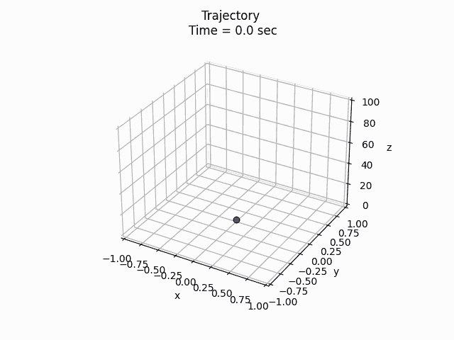

# 如何在 Python 中制作情节动画

> 原文：<https://towardsdatascience.com/how-to-animate-plots-in-python-2512327c8263>

## 了解制作数据动画以创建动态视觉效果的基础知识



动画情节[由作者创作]

当今世界对数据的需求越来越大。公司和个人通过机器学习使用它来预测股票价格，跟踪运动员的健康状况，研究特定城市的房价……可能性是无限的。虽然原始数据是基础，但它能讲述的故事更重要。讲述这个故事是工程师和数据科学家的工作。视觉可能是使用数据传达想法的最佳方式之一。想一想，你是愿意看一行行的数据，还是看几幅概括这些数据的图表？像大多数人一样，你可能认为剧情听起来更好。虽然并不总是必要的，但在情节中加入动画可以为你的故事提供额外的意义。

到本文结束时，您应该能够重现上述情节，并使用该框架创建自己的精美动画。


Emile Perron 在 [Unsplash](https://unsplash.com?utm_source=medium&utm_medium=referral) 上的照片

对于本文，我将假设您对 Python 以及如何执行基本的数据操作和绘图有一点了解。请记住，这不是使用 Python 动画功能的唯一方法，所以如果你有其他想法，请在下面分享你的方法！我们将使用三维线和散点来创建轨迹，但这些概念可以扩展到其他绘图类型，如二维线、条形图、饼图、等高线等。

## 导入包

Python 有大量用于数据分析的库，所以我们将使用其中的几个。让我们开始一个新的脚本，并导入这个项目所需的包:

```
# Importing Packages
import numpy as np
import matplotlib.pyplot as plt
from mpl_toolkits.mplot3d import Axes3D
from matplotlib import animation
```

*   *NumPy* 将用于创建数值数组和使用三角函数(为了方便调用，定义为 *np* )
*   来自 *Matplotlib* 的 *Pyplot* 将用于绘制图形(为便于调用，定义为 *plt*
*   *Axes3D* 将用于为我们的绘图创建三维轴
*   来自 *Matplotlib* 的*动画*将用于通过重复调用我们稍后将定义的函数来创建我们的动画

## **创建数据集**

在我们考虑绘制任何东西之前，我们需要创建要绘制的数据。对于这一部分，我使用正弦函数和一个从 *0* 到 *20* 运行的时间数组创建了一些位置数据(我在动画中任意标注为秒)。

```
# Time Array
t = np.linspace(0, 20, 100)

# Position Arrays
x = np.sin(np.pi/5 * t)
y = np.sin(np.pi/3 * t)
z = np.linspace(0, 100, 100)

# Setting up Data Set for Animation
dataSet = np.array([x, y, z])  # Combining our position coordinates
numDataPoints = len(t)
```

我认为这一部分非常简单明了。你可以改变时间和位置数组来创建新的轨迹。*数据集*和 *numDataPoints* 变量将在我们的动画函数中使用，我们将在接下来定义。

## **动画功能**

为了给我们的人物制作动画，我们将使用一个名为 *FuncAnimation* 的函数，来自导入的 *animation* 类。您可以在这里访问这两个[的文档。 *FuncAnimation* 要求我们创建自己的函数来更新线、点等。，我们将其定义为 *animate_func* 。](https://matplotlib.org/stable/api/animation_api.html)

```
def animate_func(num):
    ax.clear()  # Clears the figure to update the line, point,   
                # title, and axes # Updating Trajectory Line (num+1 due to Python indexing)
    ax.plot3D(dataSet[0, :num+1], dataSet[1, :num+1], 
              dataSet[2, :num+1], c='blue') # Updating Point Location 
    ax.scatter(dataSet[0, num], dataSet[1, num], dataSet[2, num], 
               c='blue', marker='o') # Adding Constant Origin
    ax.plot3D(dataSet[0, 0], dataSet[1, 0], dataSet[2, 0],     
               c='black', marker='o') # Setting Axes Limits
    ax.set_xlim3d([-1, 1])
    ax.set_ylim3d([-1, 1])
    ax.set_zlim3d([0, 100])

    # Adding Figure Labels
    ax.set_title('Trajectory \nTime = ' + str(np.round(t[num],    
                 decimals=2)) + ' sec')
    ax.set_xlabel('x')
    ax.set_ylabel('y')
    ax.set_zlabel('z')
```

我们首先注意到被传递到 *animate_func* 中的 *num* 变量。这是当前动画步骤的索引。当我们将 *animate_func* 传递给 *FuncAnimation* 时，它将迭代我们的 *num* 变量。我们可以使用该变量来遍历我们之前创建的数据集。

该功能从清除图形开始。这将删除线、点、原点、轴标签和标题。然后添加更新的轨迹线(从 *0* 到*号*)和点位置(在步骤*号*)。我们的原点在这个图中保持不变，所以你会注意到 *num* 没有出现，因为我们没有改变原点。接下来，该函数定义了我们不变的轴限制。如果希望轴随着数量的增加而变化(使轴成为动态的)，可以删除轴限制。

最后，该函数定义了我们的标题和轴标签。标签很简单，只是我们的 *x* 、 *y* 和 *z* 用于笛卡尔坐标。作为一点额外的功能，我们有一个显示轨迹时间数组的动态标题， *t.* 我们正在显示它(四舍五入到第二个小数位)并在每次迭代中更新它。注意，这些不是实时秒。

## 绘制我们的动画

最后一步实际上是使用 *FuncAnimation* 绘制我们的动画。我们首先用三维轴创建我们的图形对象。然后我们使用 *FuncAnimation* ，它将图形、我们之前创建的动画函数、一个*间隔*值和一个*帧*值作为输入。*间隔*是以毫秒为单位的帧之间的延迟，而*帧*仅仅是你希望显示的帧数。这最后两个是可选参数，但是如果我想调整动画的外观，我喜欢包含它们。

```
# Plotting the Animation
fig = plt.figure()
ax = plt.axes(projection='3d')
line_ani = animation.FuncAnimation(fig, animate_func, interval=100,   
                                   frames=numDataPoints)
plt.show()
```

您可以运行代码，如果操作正确，您的绘图应该如下所示(点的速度可能不同):


轨迹动画【作者创作】

## 保存我们的动画(可选)

如果你想把你的动画保存为*。gif* 文件，您可以使用下面的代码做到这一点。

```
# Saving the Animation
f = r"c://Users/(Insert User)/Desktop/animate_func.gif"
writergif = animation.PillowWriter(fps=numDataPoints/6)
line_ani.save(f, writer=writergif)
```

你需要选择一个位置来保存它，并将其存储为变量 *f* 。您可以在*枕套*中调整每秒帧数、 *fps* 、变量。我将 *numDataPoints* 变量(定义为 *FuncAnimation* 中的帧数)除以 *6* ，使动画长度为 *6* 秒。

本文到此为止。感谢您的阅读！如果您不想错过更多的 Python 和工程文章，请关注我并订阅我的电子邮件。我已经写了一些其他的文章，所以也来看看吧！