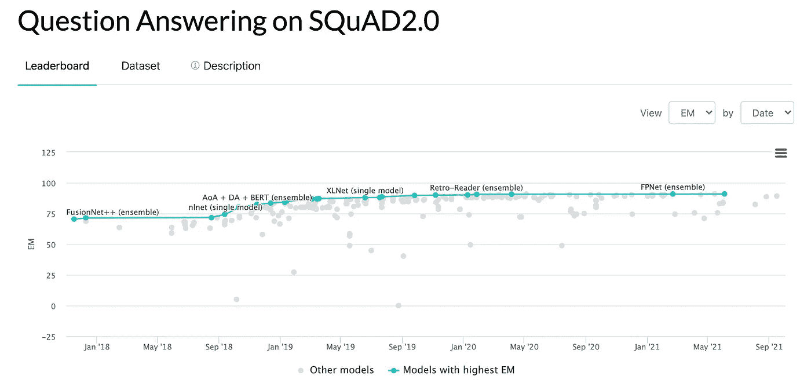
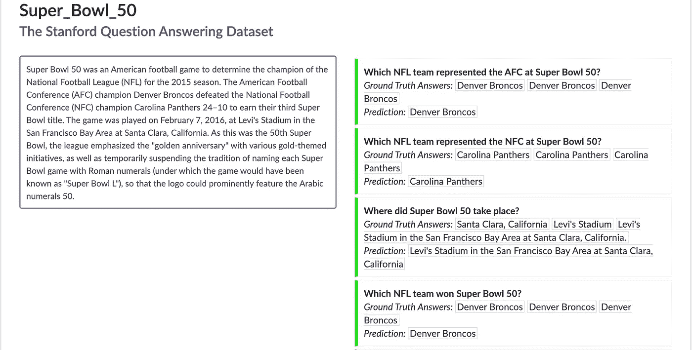
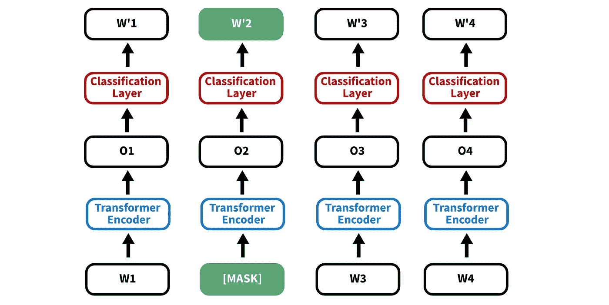
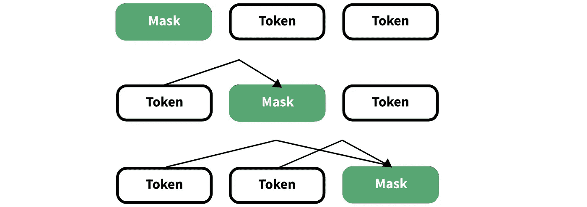
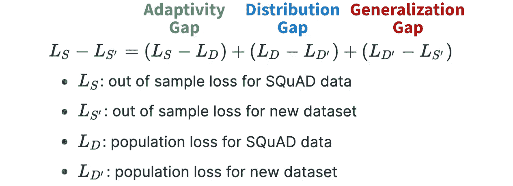

# 如何用机器学习回答问题

> 原文：<https://towardsdatascience.com/how-to-answer-questions-with-machine-learning-6c21357a44fc>

# 如何用机器学习回答问题

## 看看班数据集，它的顶级 NLP 模型，以及它们是否过度拟合。

你曾经想要建立一个算法来做你的功课吗？虽然技术还没到位，但我们已经接近了。



图 1:在 SQuAD 2.0 数据集上具有最高精确匹配(EM)分数的模型— [src](https://paperswithcode.com/sota/question-answering-on-squad20) 。图片作者。

2016 年，斯坦福大学的研究人员发布了一个问答数据集来训练 NLP 模型。从那时起，已经提交了数百个模型，每个模型都经过精心调整，与数据集相匹配。虽然它们拥有令人印象深刻的准确性，但我们预计在多次重用相同的数据集后会有一些过度拟合。

在这篇文章中，我们利用加州大学伯克利分校的一个团队的研究来确定这些模型是否 A)过度拟合数据集和 B)能够概括。我们将保持高水平。

事不宜迟，我们开始吧。

# 0 —技术 TLDR

问答(QA)模型是基于自然语言处理的模型，旨在基于文本段落回答问题。斯坦福问答数据集(SQuAD)于 2016 年推出，以方便 QA 模型的训练。该库还存储开源 NLP 模型提交，其中一些已经超过了人类基线。

与其他流行的数据集一样，我们预计会观察到自适应过度拟合，因此加州大学伯克利分校的研究人员开发了新的数据集来估计模型的可推广性和自适应过度拟合的影响。令人惊讶的是，模型没有很好地概括，但也没有表现出过度拟合。

# 1 —但是，实际上发生了什么呢？

好了，让我们稍微慢下来，理解一下 SQuAD 数据集，一些最好的 NLP 模型，以及用于估计自适应过拟合的方法。

## 1.1 —什么是班数据集？

斯坦福问答数据集 (SQuAD)的引入是希望进一步推进问答(QA)建模领域。这是一个阅读理解数据集，由段落、问题和答案组成。这些段落来自维基百科，问题/答案通过亚马逊的机械土耳其人众包。

注意有两个版本。班 1.1 版不包含无法回答的问题，但班 2.0 版包含。

## 1.2 —让我们看一个例子

在下面的图 2 中，我们可以看到一个小队的段落以及来自微软亚洲研究院的算法 *r-net+* 的预测。



图 2:小队数据源和建模示例— [src](https://rajpurkar.github.io/SQuAD-explorer/explore/1.1/dev/Super_Bowl_50.html?model=r-net+%20(ensemble)%20(Microsoft%20Research%20Asia)&version=1.1) 。图片作者。

左边紫色的文字是关于我们主题的信息，在这个例子中是超级碗 50，它是从维基百科(合法地)获取的。右边是关于文本的问题，接下来是*可接受的答案*和一些模型的预测。

这些算法怎么可能胜过人类？嗯，让我想想…

# 2 —哪种类型的模型表现最好？

大部分功劳归于两个模型:BERT 和 XLNet。

## 2.1 —伯特

[来自变压器的双向编码器表示(BERT)](/bert-explained-state-of-the-art-language-model-for-nlp-f8b21a9b6270) 于 2018 年推出，并在 NLP 世界掀起风暴。它普及了双向学习的概念，这是一个在我们感兴趣的事物的两边利用信息的概念。

在这个总体框架内，BERT 利用了两种培训策略。

在图 3 中，我们可以看到这些策略中的第一个，叫做**屏蔽 LM (MLM)** 。



图 3:第二个令牌被屏蔽的 BERT 示意图。图片作者。

在一句话中，MLM 屏蔽(删除)了训练数据中的一个已知标记，并试图使用丢失标记周围的上下文来预测其值。这种方法依赖于双向学习，可以产生很好的性能。

第二种被称为**下一个序列预测(NSP)** ，它只是试图确定两个句子是否顺序相关。训练数据在*真实序列*和*随机序列*之间平均分配，真实序列是观察到的一个接一个出现的两个句子，随机序列*是两个可能不相关的句子。*

有了这个基线结构，工程师可以添加额外的层，使模型适合他们的任务。一个例子是添加最终分类层来执行情感分析。

为了简洁起见，我们将继续，但是查看更多资源的评论。

## 2.2 — XLNet

2020 年 XLNet 发布，解决了 BERT 的一些缺点。根据该项目的首席研究员 Quoc Le 的一条推文，XLNet 在 20 多项任务中超过了 BERT。

让我们用一个简化的例子来看看 XLNet 是如何达到这种性能水平的。

```
import itertools
perms = itertools.permutations(['A','M','C'])print(list(perms))
# Output:
#  [('A', 'M', 'C'), ('A', 'C', 'M'), 
#   ('M', 'A', 'C'), ('M', 'C', 'A'), 
#   ('C', 'A', 'M'), ('C', 'M', 'A')]
```

在上面的代码中，我们使用 python 的 itertools 库来显示 3 个令牌的所有排列。 *A* 和 *C* 代表单词， *M* 代表我们试图预测的未知令牌。

伯特的一个缺点是，它的双向训练缓慢而复杂。另一方面，XLNet 是一个严格的自回归模型，它利用排列来收集上下文信息。



图 XLNet 训练结构的例子。在这里，令牌可以根据排列顺序而变化。图片作者。

XLNet 在文本生成任务中经常优于 BERT 的一个主要原因是 **BERT 假设屏蔽记号的独立性，以非屏蔽记号为条件。然而，英语可以表现出大量的顺序依赖性，所以这一假设通常是不成立的。XLNet 还实现了一些花哨的技术技巧，比如 Transformer-XL 的一个段递归机制和相对编码方案。但是(不幸的是)我们不会深入讨论这个问题。**

# 3-当前模型是否过度拟合数据集？

现在我们已经了解了数据集和一些顶级建模技术，让我们继续这篇文章的最后一个主题。

## 3.1 —评估方法

这篇论文的作者试图确定这些模型是否表现出自适应过度拟合，这是一种当许多模型在同一数据集上拟合和调整时发生的现象。

为了做到这一点，我们在下面的等式中列出了潜在的偏差…



图 5:损失分解方程— [src](https://arxiv.org/pdf/2004.14444.pdf) 。图片作者。

在图 5 中，我们已经定义了每个关键术语，但是让我们简要地讨论一下每个术语的含义…

1.  **适应性缺口**(绿色):训练和样本外(OOS)测试小队数据损失的差异。使用正确的方法选择我们的测试集，这个值应该非常小。
2.  **分布差距**(蓝色):小队与*新* (New York Times，Reddit，Amazon)数据训练损失之差。当自然分布发生变化时，例如数据源，我们期望模型表现不同。这个值可能很大。
3.  **一般化差距**(红色):训练和 OOS 测试损失小队数据之间的差异。与第一个项目符号一样，我们认为这个值很小。

所有这些加起来就是由于模型的概括能力造成的损失。

## 3.2 —结果

首先，在任何模型中几乎没有适应性过度拟合的证据。在 SQuAD 数据集上的 OOS 模型性能与在新数据集上测试的模型的 OOS 性能线性相关。从数学上来说，这意味着我们的适应性和泛化能力差距有相似的值。

这个结果相当令人惊讶，因为像 [MNIST](https://en.wikipedia.org/wiki/MNIST_database) 和 [ImageNet](https://www.image-net.org/) 这样的著名数据集都表现出自适应过拟合。随着越来越多的研究人员开发针对这些数据集优化的模型，这些模型往往会失去通用性。然而，我们没有看到同样的现象。

第二，在适应新数据集时，性能有了显著下降。换句话说，分配差距很大。更具体地说，NYT、亚马逊和 Reddit 数据集分别表现出 3.8、14.0 和 17.4 F1 点的平均性能下降。

虽然我们可能会直觉地认为这种性能下降是由于语法和句子结构的恶化，但作者研究了两组下降，无法找到结论性的解释。

# 4—总结和后续步骤

虽然缺乏结论性的解释可能不令人满意，但仍有一些采取下一步措施的机会。但是，在我们开始之前，让我们快速回顾一下…

问答模型基于文本来回答问题。SQuAD 是一个 QA 数据集，它促进了 QA 应用程序的 NLP 工作。顶级 QA 模型包括 BERT 和 XLNet，但是它们仍然不能很好地推广到其他数据集。最后，令人惊讶的是，在 SQuAD 数据集上几乎没有自适应过度拟合的证据。

既然我们对要点已经非常清楚了，那就让我们来看一些潜在的后续步骤…

1.  **构建可解释性能差异的数据集比较指标。**使用一些标准诊断，作者无法确定为什么模型在 Reddit 和亚马逊文本上的表现相对于维基百科文本如此糟糕。
2.  **看看偏倚-方差权衡和训练数据大小之间的关系。**对于高度特定的大型数据集，我们期望看到过度拟合，但数据大小和偏差之间的关系并不为人所知。
3.  **全面改进 QA 模式。**尽管一些模型在特定领域非常有效，但要像人类一样进行概括，它们还有很长的路要走。

*感谢阅读！我会再写 21 篇文章，把学术研究带到 DS 行业。查看我的评论，链接到这篇文章的主要来源和一些有用的资源。*