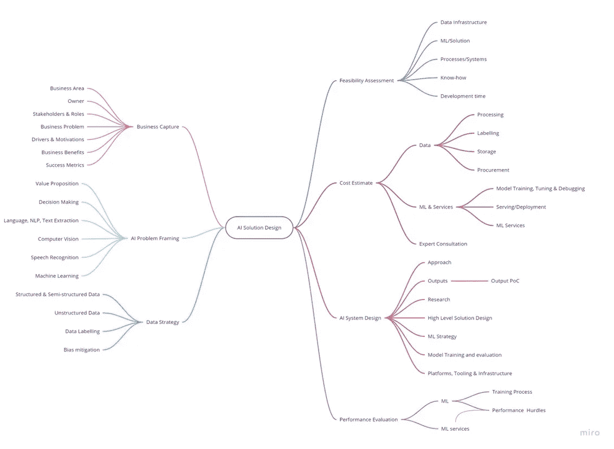
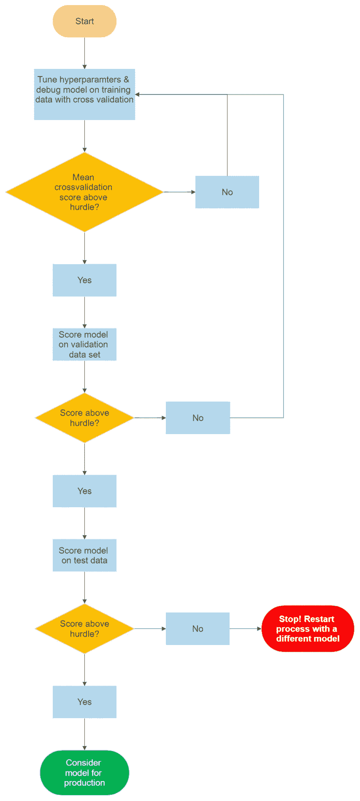
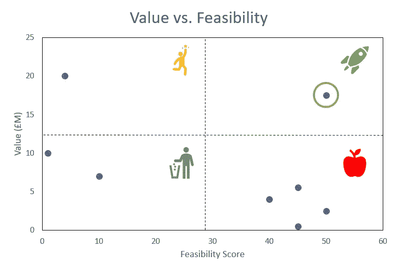

# 构建人工智能解决方案的框架

> 原文：<https://towardsdatascience.com/how-to-apply-artificial-intelligence-to-solve-business-problems-2b6fefd2683b>

## 商业人工智能

# 构建人工智能解决方案的框架

## 在实践中构建有影响力的人工智能解决方案的方法。

罗伯特·蒂曼在 [Unsplash](https://unsplash.com?utm_source=medium&utm_medium=referral) 上的照片

# 人工智能在实践中

如果你遵循一个坚实的框架，在实践中构建机器学习或人工智能解决方案可能会很简单。我使用这个框架在各种行业用例中交付人工智能解决方案，包括:高风险客户识别、文档分类、客户细分和流失预测。

该框架跨越六个核心领域:业务捕捉、人工智能问题框架、数据策略、人工智能系统设计、可行性评估和绩效评估。

最好从业务捕获开始，然后在构建原型解决方案时完成其余部分。

定义:我在这里将原型定义为你构建的解决方案，它可以在小范围内运行以证明这个概念。

**使用这种方法的优点:**

*   对推动商业价值的前期关注。
*   通过价值与可行性评估，识别人工智能/人工智能解决方案投资机会的能力。
*   数据源和解决方案设计的审计跟踪。
*   将商业问题转化为 ML/AI 解决方案的框架。
*   一份参考设计文档，方便您和工程师扩展您的解决方案。

作者图片

# 业务捕获

在业务捕获阶段，您与您的业务 SME 或分析师一起设计您的业务问题。以下是这方面的一些指南:

*   **业务领域&负责人**:把这些记下来作为参考，你会想知道如果你的实验室成功了，谁有可能资助全面部署。
*   **利益相关者及其角色**:你要记下 SME 联系人是谁，他们的角色或头衔是什么，分析师是谁，数据科学家，发起人等等。
*   **问题**:写出需要解决的业务问题，你应该通过与你的业务 SME 交谈来了解这个问题。如果问题看起来太复杂，把它分解成更简单的子问题，分别解决。考虑回答以下问题:是什么推动了变革？谁拥有流程？成功的解决方案是什么样的？
*   **业务收益:**如果实施您的解决方案，您将评估业务收益。最初，这将是基于最佳可能结果的“信封背面”计算。原型构建完成后，您将对其进行优化。您将希望从数量和质量上表达这种商业利益。

# **AI 问题取景**

一旦你抓住了你的业务问题，你可以尝试在一个高层次上用 AI&ML 的术语来框定它。

*   **价值主张**:尝试理解谁是最终用户，他们的目标是什么，以及他们将如何从机器学习或人工智能中受益。
*   **决策**:智能系统可以有效地做出决策。审视你的系统正在做出或补充的决策，规模和频率。在受监管的行业，如银行业，通常存在对“黑箱”模型的限制。因此，你也需要了解决策过程的可解释性。
*   **ML 服务**:您的智能解决方案可能需要您利用云平台或 ML PaaS 提供的 ML 或 AI 服务的组合。这是一个很有用的练习，可以在一个较高的层次上对这些进行分析，并决定它们可能是什么。广义地说，ML 服务分为以下几类:语言、NLP 和文本提取、计算机视觉和语音识别。
*   机器学习:并不是所有的解决方案都需要你建立一个定制的机器学习模型。你应该评估你是否需要这样做。你应该注意到，构建你自己的定制 ML 解决方案通常比利用 ML 服务更复杂。

# 数据策略

数据是你的机器学习引擎的汽油，所以详细地捕捉你的数据需求是很重要的。最初考虑你对训练和推理的要求。如果你正在训练一个机器学习模型，什么特征可能是预测性的？如果只是做推断，需要哪些数据？例如，如果您正在构建一个 ID 验证引擎，您可能需要一些照片 ID，您需要知道如何捕获这些数据。

## 数据管理和采购

在这里，您也应该考虑您的数据管理和采购方法。

您使用结构化/半结构化数据、非结构化数据，还是两者都使用？

处理结构化和半结构化数据与非结构化数据有不同的要求。您存储数据的方式、处理成本、可用容量是需要考虑的一些因素。

在 GDPR 体系下，工业界对数据及其使用有严格的规定。你会想要有一个遵守这些的策略。了解个人数据是否被使用、数据来源、数据的主要联系人以及您计划存储数据的时间，将有助于您通过不可避免的数据审核。

最后，您将希望获得您的采购成本，数据不是免费的，如果需要昂贵的数据，您的价值主张可能会大打折扣。

## 数据标记

在一个行业环境中，你可能想要采取一种受监督的机器学习方法，但你可能没有带标签的数据。您需要在这里指定您的数据标记策略。你是在使用像 AWS 的 Mechanical Turk 这样的服务，还是会使用无监督学习来创建你的标签？

## 偏差缓解

您需要了解数据集中的偏差，并制定管理它们的策略。偏见的例子有:

*   **赞助偏见** *:你的数据来源是来自赞助代理吗？赞助机构倾向于隐瞒可能损害声誉的数据。例如，一家烟草公司收集的关于烟草对健康影响的数据。
*   **自我选择偏差** *:一种选择偏差，你的数据来源于那些自愿提供数据的人。*这是大多数调查数据*。

*资料来源:机器学习工程，安德烈·布尔科夫(2020)，第。44–47

# 人工智能系统设计

查看您的智能应用程序的细节。你应该使用商业捕捉和人工智能问题框架练习来帮助你了解这里。需要考虑的事项有:

*   方法:以书面形式描述你打算采取什么方法来解决你的问题。你应该很清楚自己需要什么样的机器学习服务，是否需要训练一个模型。
*   **性能要求**:你期望的最低性能标准是什么？您应该从您在测试数据上构建或使用的任何模型的延迟需求和性能的角度来考虑这一点。您的绩效目标应该符合您的业务需求。
*   **输出**:你的输出是什么？您的智能系统会为另一个应用程序提供推理服务，还是会用于生成洞察仪表板？这将对您以后选择的设计模式产生影响。
*   **研究**:你需要了解已经存在的可能解决你的问题的应用的前景。寻求“开箱即用”的解决方案通常比试图重新发明轮子更有效。另一件要考虑的事情是你试图解决的问题是否是一个典型的 ML 用例。关于 ML 项目的成功有很多不确定性，这有助于了解这个问题在过去是否已经解决，从而给你一个成功机会的概念。
*   **高级解决方案设计**:规划您的端到端解决方案设计。如果您的解决方案是云原生的，请保持在服务级别，不要进入 ML 管道的细节(如果您正在训练模型)。这些图表对工程师很有用，他们可能会在某些时候帮助您进行生产规模调整。
*   **机器学习策略**:如果你正在训练你自己的模型，列出你将尝试的模型和基线模型。这里值得一提的是每个模型的局限性。你还应该在这里画出一个更详细的机器学习管道，包括数据分离、数据争论、特征工程、模型训练&评估循环等步骤。一旦你训练的任何 ML 模型投入使用，你可能需要粗略地定义你的监控策略。考虑您希望监控的属性，如何设置基准性能和监控计划。作为标准，您可能希望监控数据质量、模型质量/性能、模型偏差漂移和特征属性。
*   **模型训练&评估**:你对训练、验证和测试数据集的划分是怎样的？你将使用什么策略来调整你的超参数和测试你的模型？
*   **平台、工具和基础设施**:想想你需要的服务以及它们会花你多少钱。如果你使用像 AWS 这样的云平台，有无数的机器学习服务可以利用，你可以使用 [AWS 计算器工具](https://calculator.aws/#/addService)来估计成本。其他云平台也有类似的选择，包括 Azure 和 GCP。

# 性能赋值

无论你是在培训你自己的定制模型，还是在利用现有的 ML 服务，你都应该根据你规定的要求来跟踪他们的表现。

对于定制的机器学习解决方案，您应该有一个科学严谨的策略来评估模型性能，以防止过度拟合，并最大化您的模型在生产中正常工作的机会。

ML 培训和评估流程(图片由作者提供)

# 可行性的估计

您应该记住，您的最终目标是构建一个可以在生产中工作并为您的业务增加价值的模型。一旦您确定了所有的需求并构建了原型，您将对您的解决方案的可伸缩性有更好的理解。这里要考虑的事情有:

*   **数据基础设施**:数据访问、数量和质量。
*   **ML/解决方案**:可用技术资源、现有解决方案、解决方案知识。
*   **流程&系统**:实现您的解决方案需要任何业务流程变更、系统调整或组织变更吗？
*   **诀窍**:技术和领域知识对你有用吗？提高团队技能以满足需求需要多长时间？
*   **解活**:你的解活要多久？

应用人工智能倡议组织 *发布了一份白皮书，为你提供了一种评估你的智能解决方案可行性的方法。*

# 价值与可行性

您应该能够评估您的解决方案的价值和可行性。你想去寻找具有高价值和高可行性的解决方案，很少有你设计的解决方案一开始就符合这一类别。你应该重新审视最初的设计，看看你是否能找到一种可行性更高的方法。如果您所在的组织处于智能应用采用曲线的早期，您可以考察其中的几个解决方案，看看哪里有投资机会。

*注意:在业务捕获阶段，您已经估计了您的解决方案的价值。*

可行性分数和值只是为了说明概念，不应当真(图片由作者提供)

*   **左上**:目前很难做但商业价值很高的理想项目。
*   **左下**:垃圾，商业价值相对较低，可行性低。
*   **右下**:低垂的果实，商业价值低但可行性高。
*   **右上**:火箭，商业价值高，可行性高。

# 最后的想法

应用人工智能解决商业问题很难。因为所有的活动部件，尽可能标准化你的方法以使过程更有效是绝对值得的。在这里，你可以随意使用对你有用的东西，并在你需要的地方进行调整。

⭐️ *我喜欢通过分享我在野外的数据科学经验来帮助人们。如果你还不是会员，可以考虑订阅 Medium，从我这里获得更多有用的内容。*

<https://johnadeojo.medium.com/membership> 