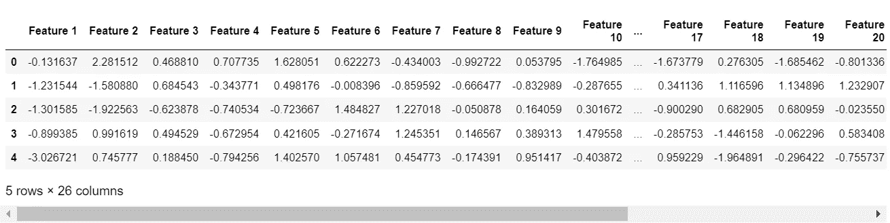

# 如何深入理解集成机器学习方法中的软投票和硬投票

> 原文：<https://towardsdatascience.com/how-to-attain-a-deep-understanding-of-soft-and-hard-voting-in-ensemble-machine-leaning-methods-32a057fc63fa>

## 如何通过从头开始构建执行投票的算法来完全理解软投票和硬投票的工作原理


由 [Unsplash](https://unsplash.com/s/photos/vote?utm_source=unsplash&utm_medium=referral&utm_content=creditCopyText) 上的 [Element5 数码](https://unsplash.com/@element5digital?utm_source=unsplash&utm_medium=referral&utm_content=creditCopyText)拍摄

## 背景

不久前，我在阅读一本名为《接近(几乎)任何机器学习问题》的书，作者是 Abhishek Thakur(参见[https://www . Amazon . co . uk/approximate-Almost-Machine-Learning-Problem-ebook/DP/b 089 p 13 qht](https://www.amazon.co.uk/Approaching-Almost-Machine-Learning-Problem-ebook/dp/B089P13QHT))，当时我看到了一些在集成学习中实现软投票和硬投票的代码。

我有三个问题-

1.  我不完全理解代码。
2.  它只适用于二进制类(恰好有两个类的分类问题)。
3.  我不明白为什么没有人使用 sckikit-learn 实现。

事实证明，第三点的答案是，你可以学到很多关于这些算法在做什么，从而通过从头开始构建它们来获得更全面的理解，因此我开始自己构建它们，并有一些次要目标-

1.  抓住机会尽可能多地学习 numpy 数组、数组切片和矢量化运算。
2.  挑战自己不断重构代码，直到我优化了算法，遵循“Pyhtonic 方式”,尽可能减少代码行。

本文的其余部分对我的发现提供了完整的解释。

## 快速回顾集合方法中的软投票和硬投票

集成方法将两个或多个独立的机器学习算法的结果集合在一起，试图产生比任何单个算法都更准确的集体结果。

在软投票中，每个类别的概率被平均以产生结果。例如，如果算法一以 40%的概率预测到一个物体是岩石，而算法二以 80%的概率预测到它是一个地雷，那么该集合将以(80 + 40) / 2 = 60%的概率预测到该物体是一个地雷。

在硬投票中，考虑每个算法的预测，集合选择具有最高票数的类别。例如，如果三种算法预测特定葡萄酒的颜色为“白色”、“白色”和“红色”，则整体将预测“红色”。

## 入门指南

我们将需要导入几个库，设置一些常量，并在输出中设置科学符号为“off ”,以提高结果的可读性..

我们还需要一些数据作为分类的输入。`make_classification_dataframe`助手函数将数据创建为结构良好的`DataFrame`,带有特性名称和命名目标。

注意，类的数量被设置为 3。这一点很重要，因为我们将为非二进制分类(即超过 2 个类别)求解软投票和硬投票算法。

为非二进制情况精心设计的解决方案适用于二进制，但我见过的其他代码示例只适用于二进制。

例如，在岩石和矿井的例子中，如果对象可以是“岩石”、“矿井”或“炸弹”，则有 3 个类需要可以处理非二进制情况的算法(只有“岩石”和“矿井”)。



作者图片

# 交叉折叠验证

交叉折叠验证被选为评估算法性能的方法，而不是更简单的`train_test_split`，因为它通常提供更准确的算法性能指标。

`scikit-learn`中实现的一个问题是，没有办法访问我们从头开始构建软投票和硬投票所需的潜在概率和折叠预测。

`cross_val_predict`助手函数提供了实现这一点的代码，完整的解释可以在我关于如何为交叉折叠验证绘制混淆矩阵的文章中找到

[](/how-to-plot-a-confusion-matrix-from-a-k-fold-cross-validation-b607317e9874) [## 如何从 K 倍交叉验证中绘制混淆矩阵

### 如何为分类机的 k 折叠交叉验证评估中的所有折叠绘制混淆矩阵…

towardsdatascience.com](/how-to-plot-a-confusion-matrix-from-a-k-fold-cross-validation-b607317e9874) 

请注意，我为本文添加了`predicted_proba`,并引入了对`try, except`块的需求，因为并非所有算法都支持概率，并且没有一致的警告或错误来显式捕获。

在我们开始之前，让我们快速看一下一个算法的`cross_val_predict`..

```
Wall time: 309 ms
Accuracy of Logistic Regression: 0.6821array([0, 0, 1, ..., 0, 2, 1])
```

一切都相当简单明了。`cross_val_predict`已返回概率和预测类，预测类已显示在单元格输出中。

第一组数据被预测为属于类 0、第二类 0、第三类 1 等。

## 为多个分类器进行预测

我们需要做的下一件事是为几个分类器生成一组预测和概率，这样投票就有了聚合的对象。选择的算法是一个随机森林，一个 XG boost 和一个额外的随机森林，使用下面的代码实现…

```
Wall time: 17.1 s
Accuracy of Random Forest: 0.8742
Wall time: 24.6 s
Accuracy of XG Boost: 0.8838
Wall time: 6.2 s
Accuracy of Extra Random Trees: 0.8754
```

`predictions`是一个简单的列表，包含每个算法的一个预测类数组...

```
[array([2, 0, 0, ..., 0, 2, 1]),
 array([2, 0, 2, ..., 0, 2, 1], dtype=int64),
 array([2, 0, 0, ..., 0, 2, 1])]
```

`predicted_probas`有点复杂。这是一个简单的列表，包含每个预测算法的数组。每个数组都有形状(10000，3)。对此解释如下-

*   10，000 是样本数据集中的数据点数。每个数组针对每组数据都有一行
*   3 是我们的非二元分类器中的类的数量

输出中的第一行可以解释如下-

对于第一种算法，第一组数据(即`DataFrame`中的第一行)有 17%的概率属于类别 0，2%的概率属于类别 1，81%的概率属于类别 2。

我记得我第一次看到来自`predcited_proba`方法的输出时，我感到非常困惑，所以希望这个解释能拯救我第一次感觉到的困惑！

```
[array([[0.17, 0.02, 0.81],
        [0.58, 0.07, 0.35],
        [0.54, 0.1 , 0.36],
        ...,
        [0.46, 0.08, 0.46],
        [0.15, 0\.  , 0.85],
        [0.01, 0.97, 0.02]]),
 array([[0.05611309, 0.00085733, 0.94302952],
        [0.95303732, 0.00187497, 0.04508775],
        [0.4653917 , 0.01353438, 0.52107394],
        ...,
        [0.75208634, 0.0398241 , 0.20808953],
        [0.02066649, 0.00156501, 0.97776848],
        [0.00079027, 0.99868006, 0.00052966]]),
 array([[0.33, 0.02, 0.65],
        [0.54, 0.14, 0.32],
        [0.51, 0.17, 0.32],
        ...,
        [0.52, 0.06, 0.42],
        [0.1 , 0.03, 0.87],
        [0.05, 0.93, 0.02]])]
```

## 从头开始实现软投票和硬投票

这里我们已经到了文章的主要部分。软投票和硬投票只需几行 Python 代码就可以实现，如下所示。

然而，这并不是我的第一次尝试。我的第一次尝试没有那么“Pythonic 化”，包含了更多的代码，但实际上它的可读性更好。

如果你想看我的第一次尝试，看看这个— …

如果你完全理解下面的代码，你可以跳过下一节，但我认为它非常复杂，很难阅读和理解，所以我在下面提供了完整的解释。

在我们继续之前，有必要指出，软投票的表现比表现最好的单个算法高出 0.3% (88.68%对 88.38%)。

```
Accuracy of Random Forrest: 0.8742
Accuracy of XG Boost: 0.8838
Accuracy of Extra Random Trees: 0.8754
Accuracy of Soft Voting: 0.8868
Accuracy of Hard Voting: 0.881
```

## 投票算法的解释

## 软投票的代码

```
array([[0.18537103, 0.01361911, 0.80100984],
       [0.69101244, 0.07062499, 0.23836258],
       [0.50513057, 0.09451146, 0.40035798],
       ...,
       [0.57736211, 0.05994137, 0.36269651],
       [0.09022216, 0.01052167, 0.89925616],
       [0.02026342, 0.96622669, 0.01350989]])
```

numpy `mean`函数沿 0 轴(列)取平均值。理论上，这应该是软投票的全部内容，因为这已经创建了 3 组输出的平均值，并且看起来是正确的。

但是，舍入误差行的值并不总是等于 1，这很麻烦，因为每个数据点都属于概率为 1 的三个类别之一…

```
0.9999999826153119array([0.18537103, 0.01361911, 0.80100984])
```

这是非常不幸的，但很容易补救。因为我们希望所有 3 个类的概率对于每个数据点加 1，所以我们需要做的就是将最后一列中的值设置为 1-其他列中值的总和…

```
1.0array([0.18537103, 0.01361911, 0.80100986])
```

现在一切看起来都很好，每一行的概率加起来是 1，就像它们应该的那样。

然而，我们仍然需要知道类别预测(即，对于每一行，软投票预测了类别 0、1 或 2)。幸运的是,`numpy`库中精彩的`argmax`函数能够在一行代码中实现这一点...

```
array([2, 0, 0, ..., 0, 2, 1], dtype=int64)
```

`argmax`函数只是沿着`axis`参数中指定的轴选取数组中最大值的索引，因此它为第一行选取 2，为第二行选取 0，为第三行选取 0，依此类推。

## 硬投票的代码

使用 Python 列表理解和`numpy`数组函数，可以在一行代码中实现硬投票算法...

`np.array(predictions).T`语法只是转置了数组的数组，因此它不是 3 行和 10，000 列，而是 10，000 行和 3 列...

```
(3, 10000)array([[2, 2, 2],
       [0, 0, 0],
       [0, 2, 0],
       ...,
       [0, 0, 0],
       [2, 2, 2],
       [1, 1, 1]], dtype=int64)
```

然后 list comprehension 有效地获取每个元素(行)并对其应用`statistics.mode`，从而选择从算法中获得最多投票的分类...

```
array([2, 0, 0, ..., 0, 2, 1], dtype=int64)
```

## 使用 Scikit-Learn

手工制作的软投票和硬投票算法确保了我们对正在发生的事情有一个全面的了解，所以是时候走捷径，使用`scikit-learn VotingClassifier`为我们做所有的工作了...

```
Wall time: 1min 4s
Wall time: 55.3 s
Accuracy of SciKit-Learn Soft Voting: 0.8868
Accuracy of SciKit-Learn Hard Voting: 0.881
```

令人欣慰的是，`scikit-learn`实现产生了与 scratch 构建算法完全相同的结果——软投票的准确率为 88.68%，硬投票的准确率为 88.1%。

## 好吧，让我们把厨房的水槽扔过去！

那么，通过在投票中包含广泛的分类算法，我们究竟可以在准确度测量方面实现多大的改进呢？

在这里，我们将把投票中使用的算法数量扩展到 6 个，看看我们能从整体中挤出多少性能…

## 方法 1:使用临时构建的投票

```
Wall time: 14.9 s
Accuracy of Random Forest: 0.8742
Wall time: 32.8 s
Accuracy of XG Boost: 0.8838
Wall time: 5.78 s
Accuracy of Extra Random Trees: 0.8754
Wall time: 3min 2s
Accuracy of Neural Network: 0.8612
Wall time: 36.2 s
Accuracy of Support Vector Machine: 0.8674
Wall time: 1.65 s
Accuracy of Light GMB: 0.8828
Accuracy of Soft Voting: 0.8914
Accuracy of Hard Voting: 0.8851
Wall time: 4min 34s
```

## 方法 2:使用 SciKit-Learn 和 cross_val_predict

```
Wall time: 4min 11s
Wall time: 4min 41s
Accuracy of SciKit-Learn Soft Voting: 0.8914
Accuracy of SciKit-Learn Hard Voting: 0.8859
Wall time: 8min 52s
```

## 方法 3:使用 SciKit-Learn 和 cross_val_score

```
Accuracy of SciKit-Learn Soft Voting using cross_val_score: 0.8914
Wall time: 4min 46s
```

# 结论

3 种不同的方法对软投票准确性的评分一致，这验证了研究并表明临时构建投票算法工作正常。

向混合中添加神经网络、支持向量机和光 GMB，使得软投票的准确度从 88.68%提高了 0.46%，达到 89.14%，并且新的软投票准确度比最佳个体算法(XG Boost 为 88.38%)好 0.76%。还需要注意的是，加入比 XG Boost 精度分数低的光照 GMB 将整体性能提高了 0.1%！

这些都是边际收益，所以选择使用软投票最终是增加复杂性与实现改进的影响和含义之间的平衡。

如果这是一场 Kaggle 竞争，那么 0.76%可能会很大，可能会让你在排行榜上一飞冲天。如果你对矿石进行分类，你会想要额外的准确性，而如果你对红葡萄酒和白葡萄酒进行分类，你可能会喜欢简单的分类。

总之，通过这项研究并从头开始构建软投票和硬投票算法，对理解它们有了很大的改善，这将帮助数据科学家在构建现实世界的预测机器学习算法时做出正确的选择。

## 最后一点:Scikit 的局限性——学习硬投票

在这篇文章的研究中，我遇到了一个完全的障碍，出现了一个我无法理解的错误消息，结果发现这是因为在某个地方的库中有一个 bug，这意味着下面的组合不起作用

1.  数据集中的目标是非二进制的(即分类有两个以上的类)。
2.  `scikit-learn`通过设置`voting="hard"`被用于硬表决。
3.  估计器包括一个`catboost.CatBoostClassifier`(其他一些分类器产生相同的结果)。

您可以使用下面的代码尝试这种组合，您将获得一个`ValueError: could not broadcast input array from shape (2000,1) into shape (2000)`。注意:我特意使用了`cross_val_score`来保证这个 bug 不是由`cross_val_predict`帮助函数中的任何东西引起的。

然而，本文中开发的从头实现硬投票的代码确实支持这种组合，所以如果您需要在非二进制分类的硬投票中包含一个`CatBoost`,本文提供了唯一的方法，直到错误被修复。

```
**ValueError**: could not broadcast input array from shape (2000,1) into shape (2000)
```

# 感谢您的阅读！

如果你喜欢读这篇文章，为什么不看看我在 https://grahamharrison-86487.medium.com/的其他文章呢？此外，我很乐意听到您对这篇文章、我的任何其他文章或任何与数据科学和数据分析相关的内容的看法。

如果你想联系我讨论这些话题，请在 LinkedIn 上找我—[https://www.linkedin.com/in/grahamharrison1](https://www.linkedin.com/in/grahamharrison1)或者发邮件给我[ghar rison @ Lincoln college . AC . uk](mailto:GHarrison@lincolncollege.ac.uk)。

如果你想通过订阅来支持作者和全世界 1000 个为文章写作做出贡献的人，请使用下面的链接(注意:如果你使用这个链接免费注册，作者将收到一定比例的费用)。

[](https://grahamharrison-86487.medium.com/membership) [## 通过我的推荐链接加入媒体-格雷厄姆哈里森

### 作为一个媒体会员，你的会员费的一部分会给你阅读的作家，你可以完全接触到每一个故事…

grahamharrison-86487.medium.com](https://grahamharrison-86487.medium.com/membership)