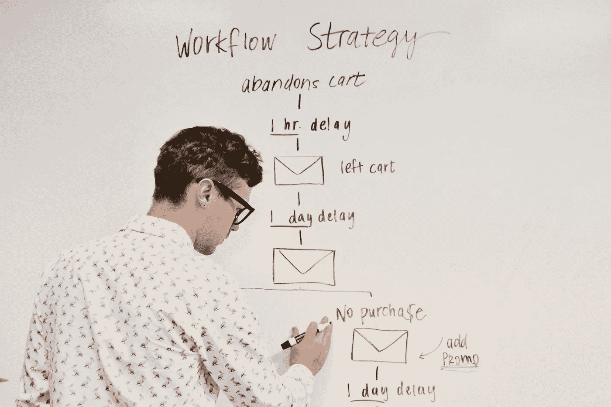

# 如何自动化和简化您的机器学习实验工作流程

> 原文：<https://towardsdatascience.com/how-to-automate-and-simplify-your-machine-learning-experiment-workflow-2be19f4aaa6>

## ArgParse 是一个有用的模块，我用它来执行多个 ML 实验，并在 web 应用程序中清晰地报告观察结果



[活动发起人](https://unsplash.com/@campaign_creators?utm_source=unsplash&utm_medium=referral&utm_content=creditCopyText)在 [Unsplash](https://unsplash.com/s/photos/workflow?utm_source=unsplash&utm_medium=referral&utm_content=creditCopyText) 上的照片

无论是为了确定最佳模型，还是为了了解模型对数据或超参数的不同变化的细微差别，您都需要进行大量的机器学习实验。结果可能是有趣的，使模型选择的过程。

作为我工作的一部分，我通常不得不执行一些 ML 实验，这些实验可以是——(比如)测试降维技术、文本预处理技术(在 NLP 模型的情况下)的有效性，或者像处理测试集大小这样的简单事情。无论哪种方式，您都可能不得不多次运行一个代码，并记录所有观察结果以便以后进行比较。这与超参数调整过程略有不同，我们的目的是确定最适合我们问题的技术。

因此，在过去的几年中，我从机器学习社区中获得了一些东西，并将其转化为一个整洁的工作流程。

# 问题

先建一个小问题。我们可以尝试使用 Sklearn 的 [make_classification](https://scikit-learn.org/stable/modules/generated/sklearn.datasets.make_classification.html) 方法，通过人工生成高维数据集来解决二元分类任务的情况。

我生成了一个包含 1000 个实例和 30 个特征(15 个信息性特征和 15 个冗余特征)的数据集，并测试了以下内容:

1.  两种降维技术——主成分分析(PCA)和局部线性嵌入(LLE)
2.  两种类型的期望输出维度(来自降维技术)— 5 维和 10 维(因为我们有 30 维数据)。
3.  三种机器学习分类器—逻辑回归、SVC 和随机森林分类器。

这样，我们有 12 个不同的实验(2 x 2 x 3)来得到所有不同组合的结果。手动运行所有的实验会令人疲惫不堪，所以我使用了一些 python 库和工具来简化它。

如您所见，运行 12 个不同实验的目的是为了选择更好地解决问题的适当技术。在训练 ML 分类器时，我们还需要包括超参数调整(为了解释简单，我将跳过这一步)。

# 该过程

首先，我将制作一个代码框架，包含所有必要的预处理步骤、模型训练和模型评估。

第二步是将以下集成/更改添加到代码框架中:

1.  将代码保存在`.py`文件中(以防 Jupyter 笔记本用于训练模型)。
2.  使用 [Argparse](https://docs.python.org/3/library/argparse.html) 模块包装代码，该模块帮助我们在命令行中使用用户定义的参数运行代码。
3.  在一个`.sh`文件中用所有用户定义的参数编写一个循环。这个 shell 脚本将用于多次运行`.py`文件，每次我们都使用`for loop`来更改参数。
4.  将结果和工件(如果有的话)发布到 web 应用程序。

# 代码

我列出了循环实验的所有步骤，现在让我们来看看我准备的代码框架。在`arguments`块上做一个记录。这些是用户定义的参数，或者是我们在实验过程中感兴趣的参数。

上面显示的是一个简单的降维和二进制分类代码。准确度分数被用作定义分类模型性能的度量。

代码的顶部提到了用户定义的参数。我们希望将 argparse 包装器集成到这些参数中。过程相当简单。

我们添加了`parse_args()`函数来包含所有用户定义的参数。整个代码封装在另一个名为`main(args)`的函数中，该函数接受参数。如您所见，argparse 的集成很容易。

# Shell 脚本

现在，我们已经准备好了带有代码的`argparse_automate.py`文件和所有用户定义参数的 argparse 包装器。下一步是创建如下所示的 shell 脚本:

`loop.sh`将 python 文件与所有参数循环在一起。我们只需要使用命令行来运行 shell 脚本，所有 12 个实验将一个接一个地运行。`echo`选项将打印用于特定运行的特定参数(如果需要，您可以删除它)。

注意:即使其中一个实验出现错误，循环仍会继续运行。

# 工件和 Web 应用程序

在这个例子中，我没有保存任何 ML 工件，比如可视化、模型保存文件或者结果。将对应于每组参数的工件保存起来，并将它们排序到它们自己的特定文件夹中，这将非常方便。

在 Python 中创建嵌套文件夹的一种简单方法是使用路径库:

```
path = f'output/{dim_red_type}/{n_comp}/{classifier}/'Path(path).mkdir(parents=True, exist_ok=True)
```

每个实验都有一个文件夹，所有的结果都可以方便地访问。

更进一步，所有这些结果和工件都可以在一个 Streamlit web 应用程序中显示。它看起来会像这样:


Streamlit Web 应用程序(图片由作者提供)

在上面 Streamlit web 应用程序的屏幕截图中，我包含了一个带有单选按钮(在左边)的过滤器选项，可以用来切换所需的参数。通过这种方式，不同实验和人工制品的结果可以在一个地方查看，不会太混乱。这对于以清晰的方式向不精通机器学习的客户展示结果非常有帮助。

> 与本文相关的代码可以在这个 [GitHub repo](https://github.com/rohithteja/automate-ml-workflow) 中找到。您可以根据您的项目进行修改。

可能存在比我在本文中使用的方法更好的方法。如果你知道有什么技术可以改进我建议的工作流程，请随时告诉我！

感谢阅读，干杯！

```
**Want to Connect?**Reach me at [LinkedIn](https://www.linkedin.com/in/rohithteja/), [Twitter](https://twitter.com/rohithtejam), [GitHub](https://github.com/rohithteja) or just [Buy Me A Coffee](https://www.buymeacoffee.com/rohithteja)!
```