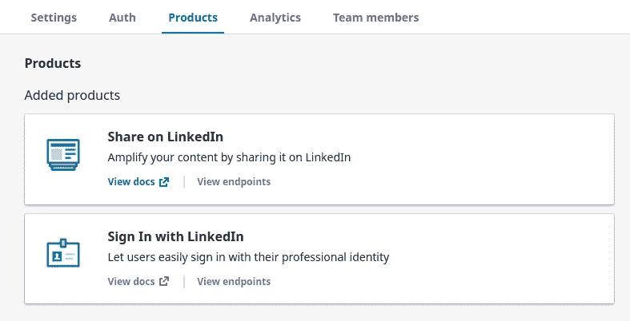
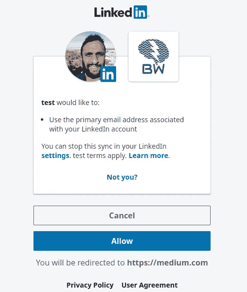
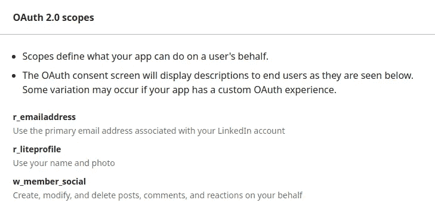

# 如何在 LinkedIn 上自动创建帖子

> 原文：<https://towardsdatascience.com/how-to-automate-creating-posts-on-linkedin-f87a5484be00>

## LinkedIn API 上的 Python 和 Postman 教程


照片由[格雷格·布拉](https://unsplash.com/@gregbulla?utm_source=unsplash&utm_medium=referral&utm_content=creditCopyText)在 [Unsplash](https://unsplash.com/s/photos/linkedin-automate?utm_source=unsplash&utm_medium=referral&utm_content=creditCopyText) 上拍摄

LinkedIn API 不是一个容易使用的 API。我花了几乎一整天的时间试图弄清楚如何设置访问令牌来在 LinkedIn 上创建文章。

但是…

我最后得出的结论是 LinkedIn API 写不了文章。而是*分享*一篇文章。它可以在经过身份验证的用户的个人资料上发布文本。

白白在这上面花费那么多时间真令人沮丧。但并不是因为这篇博文就没用了。

在这篇文章中，我将告诉你如何比我花更少的时间。您将能够设置访问令牌，以便您可以在下一个使用 LinkedIn API 的项目中使用它。

本教程重点介绍在 LinkedIn 个人资料上发布文本、媒体和/或 URL 链接所需的设置。

让我们做吧，这样你就能做了。

# 先决条件

创建一个[新的 LinkedIn 应用程序](https://www.linkedin.com/developers/apps/new)或从 LinkedIn 开发者门户选择一个现有应用程序。

注意，您需要为您的应用程序创建一个新的 LinkedIn 页面(如果您还没有的话)。

默认情况下，应用程序将被授予三脚 OAuth 权限。

# 配置应用程序

从门户中选择您的应用程序。然后，单击“Auth”选项卡查看您的申请凭证。

您将看到客户端 id 和客户端密码。您将需要它们作为环境变量，所以将它们复制并粘贴到 shell 文件中，如下所示:

```
**export** LINKEDIN_CLIENT_ID=<**your** client id>
**export** LINKEDIN_CLIENT_SECRET=<**your** client secret>
```

如果您使用的是 Linux，打开这个`~/.bashrc`文件并添加上面的行。类似地，对于 Mac，如果默认 shell 是 bash，将这两行添加到`~/.bash_profile`。如果 zsh，把他们加到`~/.zshrc`。

确保运行`source ~/.bashrc`、`source ~/.bash_profile`或`source ~/.zshrc`(取决于您的 shell 和机器)来使环境变量对您的 shell 可用。

最后，添加重定向链接。示例:`[https://dev.example.com/auth/linkedin/callback](https://dev.example.com/auth/linkedin/callback)`

我把它作为脑波媒介网址。所以做你想重定向到的任何页面。确保它是一个绝对的 URL(带有协议),就像例子一样。

# 请求授权码

在 LinkedIn 开发人员门户中，选择您的应用程序后，转到“产品”选项卡。

选择我们需要在本教程中访问的两个产品:

1.  在 LinkedIn 产品上分享
2.  使用 LinkedIn 产品登录



在 LinkedIn 上分享并使用 LinkedIn 产品登录。(作者截图)

让我们来看看下面的代码片段，以获得授权代码:

```
import requests
import os
import webbrowser**def** authorize():
    """Authorizes the user and opens a browser window to get the code."""url = "https://www.linkedin.com/oauth/v2/authorization"
    payload = {
        "response_type": "code",
        "client_id": os.getenv("LINKEDIN_CLIENT_ID"),
        "redirect_uri": "<your redirect link>",
        "state": "SADvGFt74M36bgwLoe753",
        'scope': 'r_liteprofile r_emailaddress w_member_social',
    }
    response = requests.Request("GET", url, params=payload)
    url = response.prepare().url
    webbrowser.**open**(url)**if** __name__ == "__main__":
    authorize()
```

如您所见，这里的`url`是要获得授权的端点，而`payload`是要发送给服务器的参数。

然后，你会得到一个通过`webbrowser.open()`功能在你的浏览器中打开的 URL，你将允许应用程序被授权。



授权应用程序“测试”。(作者截图)

最后看网址。您会发现链接了授权码的重定向 URL。

让我们了解一下有效载荷由哪些部分组成:

1.  `response_type`是我们希望从服务器得到的响应类型。在这种情况下，我们希望获得一个授权码。所以，我们将它设置为`code`。
2.  `client_id`是您在创建应用程序时生成的客户机 id。尽管您已经将它粘贴到了环境变量中。
3.  `redirect_uri`是您在上一节中设置的 URL。
4.  `state`参数用于防止 [CSRF](https://en.wikipedia.org/wiki/Cross-site_request_forgery) 攻击，可选但推荐使用。
5.  `scope`是你需要访问的权限。



本教程选择的 OAuth 2.0 范围。(作者截图)

例如，如果重定向 uri 是`https://medium.com/the-brainwave`而`state`是`SADvGFt74M36bgwLoe753`，那么浏览器上的 URL 将是这样的:`https://medium.com/the-brainwave?code=<YOUR_AUTHORIZATION_CODE>&state=SADvGFt74M36bgwLoe753`

其中`<YOUR_AUTHORIZATION_CODE>`是一个很长的字符串，您需要复制并粘贴到下一步的`code`参数中以获得访问令牌。

# 获取访问令牌

在下面的函数中，您将通过向 access token 端点发送 post 请求来获取访问令牌:

```
**def** get_access_token(code):
    """Returns an access token."""url = "https://www.linkedin.com/oauth/v2/accessToken"
    payload = {
        "grant_type": "authorization_code",
        "code": code,
        "redirect_uri": "<your redirect link>",
        "client_id": os.getenv("LINKEDIN_CLIENT_ID"),
        "client_secret": os.getenv("LINKEDIN_CLIENT_SECRET"),
    }
    response = requests.post(url, params=payload)
 **return** response.json()["access_token"]**if** __name__ == "__main__":
    # authorize()
    code = "<YOUR_AUTHORIZATION_CODE>"
    **print**(get_access_token(code))
```

其中`grant_type`的值为`authorization_code`,`code`是您从上一步中获得的授权码。我们讨论了除了`client_secret`之外的其余参数，T3 是您粘贴到环境变量中的凭证。

现在，您可以使用访问令牌向 LinkedIn API 发出请求。

# 使用 Postman 测试您的应用程序

现在使用访问令牌测试您的应用程序。邮递员是一个很好的工具。

打开 Postman，进入授权选项卡，选择授权类型为`OAuth2.0`。然后，选择`Access Token`选项并粘贴您在上一步中获得的访问令牌。

要在 LinkedIn 上发帖，你需要有一个授权用户的 ID。您可以通过向`me`端点发送请求来获取 ID:

```
GET [https://api.linkedin.com/v2/me](https://api.linkedin.com/v2/me)
```

简单到对这个`https://api.linkedin.com/v2/me`端点的 GET 请求。

在响应的最后，您将看到用户的 ID。复制并粘贴它，因为您将在下一步中需要它。

# 创建帖子

现在，您可以通过向用户生成内容(UGC) API 端点发送 post 请求来创建 POST。所以:

```
POST [https://api.linkedin.com/v2/ugcPosts](https://api.linkedin.com/v2/ugcPosts)
```

最后，转到 Postman 上的`body`选项卡，用以下参数填充请求体:

```
{
    "author": "urn:li:person:<YOUR ID FROM THE PREVIOUS STEP>",
    "lifecycleState": "PUBLISHED",
    "specificContent": {
        "com.linkedin.ugc.ShareContent": {
            "shareCommentary": {
                "text": "A text from LinkedIn API."
            },
            "shareMediaCategory": "ARTICLE",
            "media": [
                {
                    "status": "READY",
                    "description": {
                        "text": "The description field coming from LinkedIn API."
                    },
                    "originalUrl": "https://blog.linkedin.com/",
                    "title": {
                        "text": "Testing LinkedIn API"
                    }
                }
            ]
        }
    },
    "visibility": {
        "com.linkedin.ugc.MemberNetworkVisibility": "PUBLIC"
    }
}
```

并用上一步中的 ID 替换`<YOUR ID FROM THE PREVIOUS STEP>`。

这应该会创建一个包含以下文本的帖子:“来自 LinkedIn API 的文本。”分享本文链接:[https://blog.linkedin.com/](https://blog.linkedin.com/)

# 最后的想法

我们已经讨论了如何认证和授权您的 LinkedIn 帐户。这允许您访问 API 的一些功能，如创建帖子和共享媒体内容。

除非您想更改权限，否则您只需被授权一次。所以不用担心！您将能够使用该 API 而无需任何进一步授权来创建和自动化您的 LinkedIn 帖子。

现在就获得免费的 Python 电子书，学习为你的下一个项目编写高效 Python 代码的 5 种方法。

# 信用

*   [如何使用 Python 调用 LinkedIn API？](https://stackoverflow.com/a/64620824/4604121)
*   [登录 LinkedIn](https://docs.microsoft.com/en-us/linkedin/consumer/integrations/self-serve/sign-in-with-linkedin)
*   [在 LinkedIn 上分享](https://docs.microsoft.com/en-us/linkedin/consumer/integrations/self-serve/share-on-linkedin?context=linkedin/consumer/context)

<https://ezzeddinabdullah.medium.com/membership> 