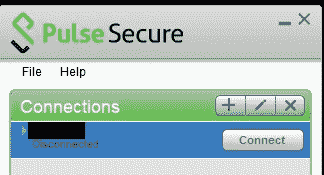
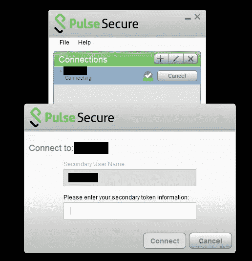
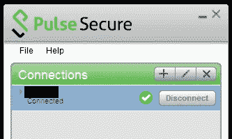
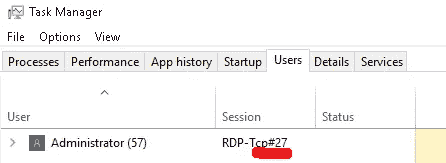
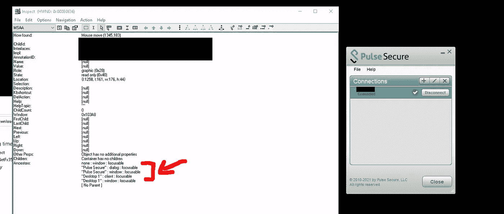

# 如何用 Python 自动化猴子的工作

> 原文：<https://towardsdatascience.com/how-to-automate-monkey-jobs-with-python-1910a3219fd2>

## 基于 Windows GUI 的双因素身份认证流程示例


照片由[杰米·霍顿](https://unsplash.com/es/@haughters)拍摄于[未拍摄的](https://unsplash.com/es/fotos/Z05GiksmqYU)

没有人喜欢所谓的“ [**”猴子工作**](https://www.urbandictionary.com/define.php?term=Monkey+job) ”，不需要任何创造力的重复性工作。但是我们总是(几乎)有一个选择，我们可以自动完成这些类型的任务，把我们的时间投入到更有成就感的事情上。

在这篇文章中，我们将看到如何通过将 GUI(图形用户界面)应用于一个特定的用例来自动化需要与 GUI(图形用户界面)交互的过程。

# 用例

数据提取过程需要自动化。只有当请求是从某个 VPN(虚拟专用网)执行时，执行数据提取的 API 才可用。为了能够连接到 VPN:

*   我们必须使用 Windows 虚拟机。
*   我们将使用 RDP(远程桌面协议)连接到它。
*   该虚拟机中安装了一个脉冲安全客户端。

糟糕的是，Pulse 安全客户端每 8 小时从 VPN 断开一次，并且需要双因素认证过程才能重新连接。

***(其他更推荐的选项，可能是向网络管理员请求 VPN 隧道)。*** `¯\_(ツ)_/¯`

## 连接到脉冲安全 VPN 的过程:

1 .必须按下连接按钮。



作者图片— Pulse 安全接口(断开连接)

2 .将需要一个双因素令牌



按作者分类的图像-双因素弹出窗口

3.必须复制(从小部件或其他来源)和粘贴(在上一个弹出窗口中)双因素令牌:


按作者分类的图像—双因素小部件

4.几秒钟后，连接将成功建立



作者图片— Pulse 安全接口(已连接)

**由于我们希望每天自动执行数据提取，因此我们必须找到一种无需人工干预即可自动执行重新连接过程的方法。**

# 解决办法

对于我们的解决方案，我们需要:

*   **Python** 作为编程语言。
*   [**Pywinauto**](https://pywinauto.readthedocs.io/en/latest/) 自动化 GUI 任务。
*   [**Pyperclip**](https://github.com/asweigart/pyperclip) 使用 Windows 回形针。

Le 看不出前面的流程是怎么实现的(**完整代码在最后**):

## 连接到脉冲安全 VPN 的过程:

1 .必须按下连接按钮。


作者图片— Pulse 安全接口(断开连接)

2 .将需要一个双因素令牌


按作者分类的图像-双因素弹出窗口

3.必须复制(从小部件或源)和粘贴(在上一个弹出窗口中)双因素令牌:


按作者分类的图像—双因素小部件

4.几秒钟后，连接将成功建立


作者图片— Pulse 安全接口(已连接)

## **在 RDP 会议中自动化基于 GUI 的流程的问题**

在设置了前面代码的执行并检查一切都正常工作后，您可能会遇到一个问题: **i *如果在我们查看 Windows VM 桌面时执行脚本，一切都将正常工作，而如果我们关闭或最小化该会话，该过程将失败。***

解决方案比将其归咎于量子物理学中的[观察者效应](https://en.wikipedia.org/wiki/Observer_effect_(physics)#Quantum_mechanics)更简单。

通过 [Ghipy](https://giphy.com/gifs/season-10-the-simpsons-10x4-3orieQhBBqK0sj6Wzu)

由于执行过程是基于图形用户界面的(我们使用图形用户界面来模拟用户和 Pulse Secure 之间的交互),并且使用 RDP 建立连接，因此必须考虑一些重要事项:

> [远程桌面(RDP)为运行 Windows 操作系统的远程计算机提供虚拟活动桌面。有两个潜在问题:](https://pywinauto.readthedocs.io/en/latest/remote_execution.html#remote-execution-guide)
> 
> [1。如果 RDP 窗口最小化，默认情况下，远程 PC 上没有活动桌面。](https://pywinauto.readthedocs.io/en/latest/remote_execution.html#remote-execution-guide)
> 
> [2。如果 RDP 断开连接，桌面将被锁定。](https://pywinauto.readthedocs.io/en/latest/remote_execution.html#remote-execution-guide)

[当使用远程桌面连接到远程计算机时，关闭远程桌面会锁定计算机并显示登录屏幕。在锁定模式下，计算机没有 GUI，因此任何当前运行或预定的 GUI 进程都将失败。](https://support.smartbear.com/testcomplete/docs/testing-with/running/via-rdp/keeping-computer-unlocked.html)

因此，不能像往常一样关闭或最小化 RDP 会话，每次注销都必须使用以下命令:

`tscon.exe RDP-Tcp#27 /dest:console`

其中，必须从 Windows 任务管理器中获取#27(会话 id 号),并且必须使用该号更新命令:



作者图片-任务经理 RDP 会议

> 在 CMD 中执行前面的命令后，RDP 会话将被关闭，但桌面仍将是活动的，因此我们的 GUI 相关代码不会失败。

**RDP 会话总是必须以先前的命令结束。如果有人登录到该虚拟机并以任何其他方式退出，该脚本将由于缺少活动桌面而失败。**

## 识别 GUI 中的对话框/窗口

在前面的代码中，我们已经看到了如何将 *Pywinauto* 与给定应用程序的接口连接起来:

```
app2 = pywinauto.Application().connect(path_to_EXE)
```

但是如果我们需要关注这个应用程序生成的弹出窗口，事情会变得更复杂，我们将不得不识别这个[对话框](https://pywinauto.readthedocs.io/en/latest/HowTo.html#how-to-specify-a-dialog-of-the-application)/弹出窗口的名称(在 GUI 本身中)。为此，我们有不同的选择:

*   在交互模式下使用 pywinauto 和 Python 可以实时看到我们在屏幕上看到的界面列表。

```
from pywinauto import Desktop

windows = Desktop(backend="uia").windows()
print([w.window_text() for w in windows])
```

*   [使用 UI 检查工具](https://github.com/blackrosezy/gui-inspect-tool)浏览屏幕上的不同界面。我们可以将鼠标悬停在某个对话框/弹出窗口上，以获取其名称:



作者提供的图片—ui inspect

```
app3 = pywinauto.Application(backend="uia").connect(title_re="Pulse Secure")
```

## 完整代码

# 结论

在本文中，我们看到了如何自动化一个显然总是需要人工干预的过程(双因素身份验证),并且我们已经将该解决方案应用于一个数据工程过程。

我们已经解释了如何使用 *Pywinauto* 来自动化基于 GUI 的任务，以及如何在其他用例中使用它。

最后，我们已经看到了自动化基于 GUI 的过程可能出现的问题，显然是 quantum cut(实际上更简单)的问题，以及它们可能的解决方案。

```
“The success formula: solve your own problems and freely share the solutions.”
― [**Naval Ravikant**](https://twitter.com/naval/status/1444741381579177984)
```