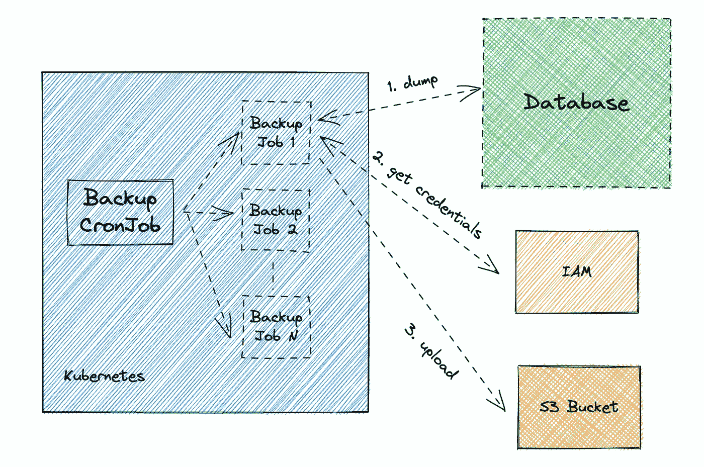
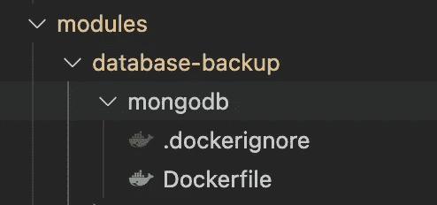
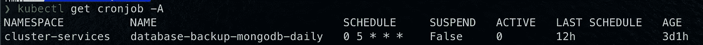
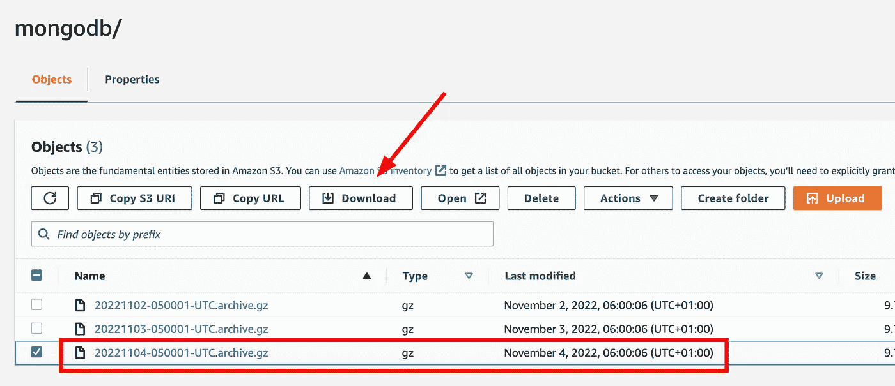
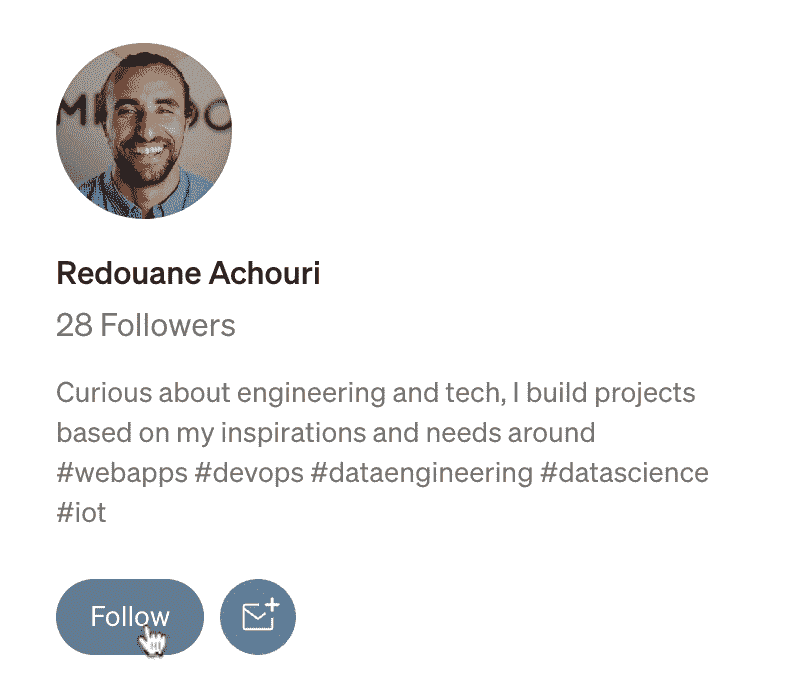

# 如何在 Kubernetes 和 S3 上自动化您的 Mongo 数据库备份

> 原文：<https://towardsdatascience.com/how-to-automate-your-mongo-database-backups-on-kubernetes-795bb9a6c9eb>

## 计划并自动执行从 Kubernetes 集群到 AWS S3 的数据库备份


由[艺术壁纸拍摄的照片](https://unsplash.com/@artwall_hd?utm_source=medium&utm_medium=referral)在 [Unsplash](https://unsplash.com?utm_source=medium&utm_medium=referral) 上

如果您运行的是 MongoDB 之类的自托管数据库，那么您很可能享受不到托管服务提供的自动备份的好处。

本文是关于如何使用 [Kubernetes CronJobs](https://kubernetes.io/docs/concepts/workloads/controllers/cron-jobs/) 在 Kubernetes 集群上为 MongoDB 安排自动备份作业，并将这些备份存储在 [AWS S3 桶](https://aws.amazon.com/s3/)中。



计划定期执行备份作业，从数据库中提取数据，承担 IAM 角色以获取凭据，然后上传到 S3—按作者排序的图像

我们将关注一个独立的 MongoDB 设置，同样的原则也适用于副本集和其他数据库。

由于许多组织使用 Terraform 来管理基础设施，我们将直接用 Terraform 格式编写 CronJob。

## 技术栈

*   MongoDB
*   库伯内特斯
*   AWS S3
*   将（行星）地球化（以适合人类居住）
*   码头工人

## 内容

*   创建地形模块(可选)
*   使用所需的工具创建 Docker 映像
*   定义变量和数据
*   创建一个 S3 存储桶来存储备份
*   创建 IAM 角色和 Kubernetes 服务帐户
*   将 MongoDB 的密码存储为 Kubernetes 的秘密
*   创建库伯内特克朗乔布
*   部署基础设施
*   说明

让我们开始吧！

> **需求:**
> 本项目使用 Terraform 与 [AWS 提供商](https://registry.terraform.io/providers/hashicorp/aws/4.38.0)和 [Kubernetes 提供商](https://registry.terraform.io/providers/hashicorp/kubernetes/2.15.0)。
> 请随意查看官方教程[配置 EKS 集群](https://developer.hashicorp.com/terraform/tutorials/kubernetes/eks)以启动并运行 Kubernetes 集群。

# 创建地形模块(可选)

为了在基础设施即代码存储库中保持结构化和整洁，我喜欢将逻辑任务划分为子模块。

请注意，这是可选的，您可以将下面创建的模板包含在基础设施源代码中的任何位置。

让我们在**模块**目录中创建一个目录**数据库备份**:



# 使用所需的工具创建 Docker 映像

为了执行备份，我们需要从数据库中转储数据，并将其上传到 S3。

我们将使用方便的[*mongodump*](https://www.mongodb.com/docs/database-tools/mongodump/)*来转储数据，并使用 [*AWS CLI*](https://aws.amazon.com/cli/) 将数据转储上传到 S3。*

*在上面创建的 Terraform 模块中，添加一个目录 **mongodb** ，并在这个新目录中创建一个 **Dockerfile** ，其内容如下:*

```
*# Dockerfile# Base on Amazon Linux 2 (will be running on AWS EKS)
FROM amazonlinux:2RUN yum install -y unzip# Install AWS CLI
RUN curl -sOL [https://awscli.amazonaws.com/awscli-exe-linux-x86_64.zip](https://awscli.amazonaws.com/awscli-exe-linux-x86_64.zip) \
 && unzip awscli-exe-linux-x86_64.zip \
 && ./aws/install# Install MongoDB CLI tools
RUN curl -sOL [https://fastdl.mongodb.org/tools/db/mongodb-database-tools-amazon2-x86_64-100.6.0.rpm](https://fastdl.mongodb.org/tools/db/mongodb-database-tools-amazon2-x86_64-100.6.0.rpm) \
 && yum install -y mongodb-database-tools-amazon2-x86_64-100.6.0.rpm*
```

## *构建该映像并将其推送到您的映像存储库*

*让我们构建这个映像，并确保以正确的平台为目标——如果您在运行集群的机器之外的其他机器上进行开发(比如带有 M1 芯片的 Macbook ),这一点尤其重要。*

```
*export REPOSITORY_URL=<your repository URL, e.g. on AWS ECR>
export TAG=<COMMIT_HASH> # Should be commit hash, but can be an arbitrary stringdocker build --tag="$REPOSITORY_URL:$TAG" --platform=linux/amd64 .*
```

*要推送映像，请确保您已登录到您的存储库(运行 *docker 登录*，然后运行:*

```
*docker push "$REPOSITORY_URL:$TAG"*
```

# *定义变量并获取数据*

*我们需要定义一些 Terraform 配置变量，并获取将在该项目的其余部分使用的数据。请随意调整这些以适应您当前的设置。*

*在文件名 **variables.tf** 中，添加以下内容:*

```
*# variables.tfvariable "kubernetes_namespace" {
  type = string
}variable "kubernetes_cluster_name" {
  description = "Kubernetes cluster where the backup job and permissions service account should be deployed"
  type        = string
}variable "container_image_repository" {
  description = "URL of the Docker image used in the CronJob container"
  type        = string
}variable "container_image_tag" {
  description = "Tag of the Docker image used in the CronJob container"
  type        = string
}variable "database_host" {
  description = "MongoDB host URL"
  type        = string
}variable "database_user" {
  description = "MongoDB user"
  type        = string
}variable "database_password" {
  description = "MongoDB password"
  type        = string
  sensitive   = true
}*
```

*在名为 **data.tf** 的文件中，添加以下内容:*

```
*# data.tfdata "aws_caller_identity" "current" {}data "aws_eks_cluster" "kubernetes_cluster" {
  name = var.kubernetes_cluster_name
}*
```

# *创建一个 S3 存储桶来存储备份*

*我们需要一个可靠的位置来存储我们的备份，AWS S3 公司提供了[良好的保证](https://aws.amazon.com/s3/faqs/#:~:text=Q%3A%20How%20reliable%20is%20Amazon%20S3%3F)，而且价格实惠，使用方便。*

*创建一个地形文件 **s3-bucket.tf** ，内容如下:*

```
*# s3-bucket.tfresource "aws_s3_bucket" "database_backup_storage" {
  lifecycle {
    # Prevent destroying the backups storage in case of accidental tear down
    prevent_destroy = true
  } bucket = "database-backup-storage"
}*
```

*或者，我们可以添加一个生命周期策略来自动删除超过 7 天的备份。在同一文件中，添加以下内容:*

```
*# s3-bucket.tf...resource "aws_s3_bucket_lifecycle_configuration" "database_backup_storage_lifecycle" {
  bucket = aws_s3_bucket.database_backup_storage.bucket
  rule {
    id     = "delete-old-backups-7d"
    status = "Enabled"

    filter {} expiration {
      days = 7
    }
  }
}*
```

# *创建 IAM 角色和 Kubernetes 服务帐户*

*我们的备份作业需要将备份上传到 S3 的权限。更具体地说，我们需要创建:*

*   *一个 [IAM 角色](https://docs.aws.amazon.com/IAM/latest/UserGuide/id_roles.html)，其策略允许 **S3:PutObject** 在备份 S3 桶中操作*
*   *一个 [Kubernetes 服务帐户](https://kubernetes.io/docs/tasks/configure-pod-container/configure-service-account/)提供一个 web 身份令牌，允许备份作业承担 IAM 角色上传到 S3*

*要了解更多信息，这里有关于 AWS EKS 上服务帐户的 [IAM 角色的文档。](https://docs.aws.amazon.com/eks/latest/userguide/iam-roles-for-service-accounts.html)*

*在名为 **access-control.tf** 的文件中，添加以下内容:*

```
*# access-control.tflocals {
  service_account_name = "database-backup" oidc_provider = replace(
    data.aws_eks_cluster.kubernetes_cluster.identity[0].oidc[0].issuer,
    "/^[https:///](https:///)",
    ""
  )
}resource "aws_iam_role" "role" {
  name = "database-backup-role" assume_role_policy = jsonencode({
    Version = "2012-10-17",
    Statement = [
      {
        Effect = "Allow",
        Principal = {
          Federated = "arn:aws:iam::${data.aws_caller_identity.current.account_id}:oidc-provider/${local.oidc_provider}"
        },
        Action = "sts:AssumeRoleWithWebIdentity",
        Condition = {
          StringEquals = {
            "${local.oidc_provider}:aud" = "sts.amazonaws.com",
            "${local.oidc_provider}:sub" = "system:serviceaccount:${var.kubernetes_namespace}:${local.service_account_name}"
          }
        }
      }
    ]
  }) inline_policy {
    name = "AllowS3PutObject"
    policy = jsonencode({
      Version = "2012-10-17"
      Statement = [
        {
          Action = [
            "S3:PutObject",
          ]
          Effect   = "Allow"
          Resource = "${aws_s3_bucket.database_backup_storage.arn}/*"
        }
      ]
    })
  }
}resource "kubernetes_service_account" "iam" {
  metadata {
    name      = local.service_account_name
    namespace = var.kubernetes_namespace annotations = {
      "eks.amazonaws.com/role-arn" = aws_iam_role.role.arn
      "eks.amazonaws.com/sts-regional-endpoints" = true
    }
  }
}*
```

# *创建库伯内特克朗乔布*

*我们可以使用 Terraform 以 HCL 格式定义我们的 CronJob(参见 [kubernetes_cron_job](https://registry.terraform.io/providers/hashicorp/kubernetes/latest/docs/resources/cron_job) )。注意，我们可以在 Kubernetes 清单格式(yaml/json)中应用相同的配置。*

*在名为 **backup-cronjob.tf** 的文件中，添加以下内容:*

```
*# backup-cronjob.tfresource "kubernetes_cron_job" "database_backup_cronjob" {
  metadata {
    name      = "database-backup-mongodb-daily"
    namespace = var.kubernetes_namespace
  } spec {
    schedule                      = "0 5 * * *" // At 05:00
    concurrency_policy            = "Replace"
    suspend                       = false
    successful_jobs_history_limit = 3
    failed_jobs_history_limit     = 3 job_template {
      metadata {}
      spec {
        template {
          metadata {}
          spec {
            restart_policy = "Never" service_account_name = kubernetes_service_account.iam.metadata[0].name container {
              name    = "database-backup"
              image   = "${var.container_image_repository}:${var.container_image_tag}"
              command = ["/bin/sh", "-c"]
              args = [
                "mongodump --host=\"$MONGODB_HOST\" --username=\"$MONGODB_USER\" --password=\"$MONGODB_PASSWORD\" --gzip --archive | aws s3 cp - s3://$S3_BUCKET/$S3_BUCKET_PREFIX/$(date +\"%Y%m%d-%H%M%S-%Z\").archive.gz"
              ] env {
                name  = "MONGODB_HOST"
                value = var.database_host
              }
              env {
                name  = "MONGODB_USER"
                value = var.database_user
              }
              env {
                name  = "MONGODB_PASSWORD"
                value = var.database_password
              } # Note that you can also set the DB password as a Kubernetes Secret then get it as
              # env {
              #   name = "MONGODB_PASSWORD"
              #   value_from {
              #     secret_key_ref {
              #       name = "mongodb"
              #       key  = "mongodb-password"
              #     }
              #   }
              # } env {
                name  = "S3_BUCKET"
                value = aws_s3_bucket.database_backup_storage.bucket
              }
              env {
                name  = "S3_BUCKET_PREFIX"
                value = "mongodb"
              }resources {
                limits = {
                  cpu    = "1000m"
                  memory = "1000Mi"
                }
                requests = {
                  cpu    = "100m"
                  memory = "256Mi"
                }
              }
            }
          }
        }
      }
    }
  }
}*
```

# *部署基础设施*

*既然我们的备份模块已经准备就绪，我们就可以将其与基础架构的其余部分一起部署了。*

*您可以在 Terraform 代码中放置以下代码片段，例如在 **main.tf** 中:*

```
*module "mongodb_backup" {
  source = "${path.root}/modules/database-backup" kubernetes_namespace       = "<your namespace>"
  kubernetes_cluster_name    = "<your cluster name>"
  container_image_repository = "<Value of REPOSITORY_URL>"
  container_image_tag        = "<Value of TAG>"
  database_host              = <MongoDB host>
  database_user              = <MongoDB user>
  database_password          = <MongoDB password> tags = {
    Name = "database-backup-mongodb"
  }
}*
```

*一旦应用了 terraform 基础设施( *terraform apply)* ，您应该会看到有一个 CronJob 启动并运行:*

**

# *说明*

## *它是如何工作的*

*A [Kubernetes CronJob](https://kubernetes.io/docs/concepts/workloads/controllers/cron-jobs/) 调度*作业*作为能够执行给定任务的 pod 运行。在这种数据库备份实施的情况下，每个计划的作业将执行以下步骤:*

1.  *连接到位于$MONGODB_HOST 的独立主机*
2.  *使用[*mongodump*](https://www.mongodb.com/docs/database-tools/mongodump/)*将数据转储为压缩(gzip)文件，并将结果打印到标准输出。这里有三件事:(1)我们压缩以减少上传负载的大小，(2)我们存档以将数据转储到单个文件中(这是可选的，但可以防止转储到不区分大小写的文件系统时出现问题——参见[警告这里的](https://www.mongodb.com/docs/database-tools/mongodump/#behavior))，(3)我们将转储打印到标准输出，以便能够通过管道将其传输到 AWS CLI。**
3.  **将压缩的归档文件通过管道传输到 AWS CLI**
4.  **通过以下方式从标准输入(管道)复制到 S3 时段:**

```
**aws s3 cp - s3://$S3_BUCKET**
```

## **如何恢复数据**

1.  **将最新的数据从 S3 下载到您的本地或目标 Mongo 主机(即您希望恢复数据的位置):**

****

**2.使用 [*mongorestore*](https://www.mongodb.com/docs/database-tools/mongorestore/) 实用程序:**

```
**mongorestore --gzip --archive=/path/to/backup [--host $HOST --username $USERNAME --password $PASSWORD]**
```

## **重要的**

*   **该时间表应该根据您的需要进行更改——上面的设置是相对于您的 Kubernetes 集群时区的 5:00。**
*   **MongoDB 备份被配置为使用单个实例。相应地更改副本集的配置(参见 [*操作日志*](https://www.mongodb.com/docs/database-tools/mongodump/#std-option-mongodump.--oplog) 的用法)。**
*   **MongoDB 服务器的版本必须与备份转储所源自的数据库的版本相匹配。**

# **最终注释**

**当运行自托管数据库时，需要采取额外的步骤来设置防止数据丢失的措施—以防灾难、意外删除、硬件故障等。**

**令人欣慰的是，最常见的数据库提供了生成和恢复备份的工具，像 AWS S3 这样的云存储解决方案是可靠的，经济的，并且使用方便。**

**利用像 Kubernetes CronJob 这样的作业调度程序，我们可以创建一个自动解决方案，在专注于构建令人惊叹的应用程序的同时，负责备份数据🎉！**

**如果你觉得这个教程有用，并且你想支持高质量文章的制作，考虑[给我买杯咖啡](https://www.buymeacoffee.com/redouaneachouri)！**

**你可以点击“关注”按钮来获取我的最新文章和帖子！**

****