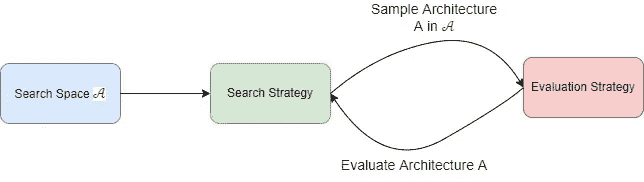
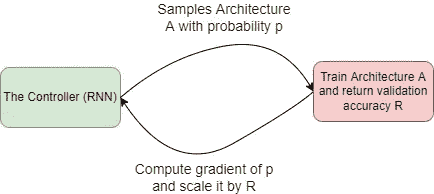
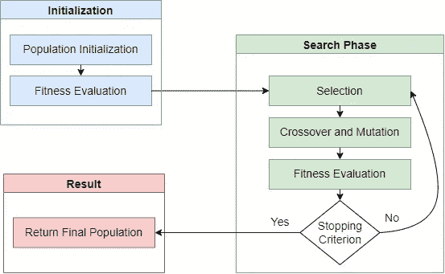
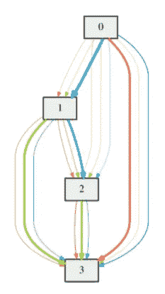

# 如何自动设计高效的神经网络

> 原文：<https://towardsdatascience.com/how-to-automatically-design-an-efficient-neural-network-ee842a631885>

# 如何自动设计高效的神经网络

## 神经结构搜索的简明介绍

Ethan Sykes 在 [Unsplash](https://unsplash.com?utm_source=medium&utm_medium=referral) 上拍摄的照片

如果你曾经使用过深度学习方法，你可能已经知道，每当你考虑一个新的数据集，你的模型的性能就非常依赖于网络的架构。

这就是为什么 ***虽然*** 微调预训练网络可以在你的旅程中帮助你，但你可能必须尝试多种模式才能找到你的最佳选择。在某些情况下，您甚至可能需要调整所选网络的某些层，以获得更好的预测能力。

这个过程可能会很快变得乏味和重复，尤其是当您需要在多个数据集上执行相同的任务时。这就是为什么知道不总是手动设计或选择您的网络架构，而是在一定条件下自动完成是可能的。这被称为 ***神经架构搜索(NAS)*** ，是 ***AutoML*** 的一个子领域，旨在自动设计神经网络。

## 为什么以及何时应该使用 NAS

NAS 非常方便，特别是当你想通过自动化过去手动完成的工作(设计神经网络)将基于深度学习的解决方案扩展到数十甚至数百个数据集时。

最重要的是，生成的架构不仅在预测能力方面，而且在内存大小和推理时间方面都是高效的。例如，谷歌的模型***NAS-FPN***【1】实现了比 SOTA 物体检测模型更好的准确性/延迟权衡。

## 执行 NAS 需要什么

寻找一个好的网络架构可能就像大海捞针。只要想想可能的神经操作类型(全连接、卷积、LSTMs 等)的数量。)，以及它们参数的可能组合(例如卷积层的内核大小)和网络的可能深度。所有这些变量导致了无限多的候选架构。

因此，为了明智地找到最佳候选，您需要为 NAS 算法提供如下所示的 3 个元素:

NAS 的一般框架[8]

*   ***搜索空间*** 𝒜 ***:*** 包含可以采样的候选架构集合。为了定义一个搜索空间，你需要定义可能的神经操作和网络的转换动力学(即网络的节点是如何连接的)。后者要求事先知道最终网络应该是什么样子，但这并不总是强制性的。例如，一种常见的做法是将最终的网络视为层的堆叠，其中每一层都表示为一个有向无环图，就像 DARTS [2]中那样。
*   ***评估策略:*** 用于评估每个采样网络的性能。标准做法是使用模型的预测能力(例如，交叉熵用于分类任务)。一些工作引入了正则化项，以便通过限制网络的大小来实现准确性/等待时间的折衷。例如，在 AdaBERT[3]中，重模型通过在损失函数中整合推理触发器(浮点运算)的数量来进行惩罚。
*   ***搜索策略*** :一旦从搜索空间中对架构进行了采样，并且使用评估策略对其性能进行了评估，搜索策略就会告诉 NAS 算法接下来要对什么架构进行采样和评估。搜索策略通常定义了大多数 NAS 方法之间的根本区别。

在接下来的部分中，我将介绍三种常用的 NAS 方法以及它们的一些优缺点。

## 具有强化学习的 NAS

使用强化学习来寻找方便的体系结构是 NAS 中的标准做法。例如在[4]中，作者观察到网络的节点和连接可以通过字符串来表示。

因此，他们设计了一个名为“ ***控制器*** ”的递归单元，生成网络架构字符串。相应的网络在任务数据集上被训练，并且验证准确性被转换成用于通过策略梯度方法更新控制器权重的回报信号。

具有强化学习的 NAS 的一般框架[4]

与许多其他方法相比，基于 RL 的架构搜索更彻底地探索搜索空间，并且对每个采样的架构具有更准确的性能估计。因此，RL-NAS [4]在流行的数据集上取得了最先进的结果也就不足为奇了。然而，它主要受到时间和硬件资源效率问题的困扰。例如，为 CIFAR-10 分类任务找到一个最佳架构需要 3 000 个 GPU 小时，而不是所有的公司和机构都能够负担得起这样的费用。

许多策略可以用来显著提高普通 RL-NAS 的效率，例如跨层共享参数权重(也称为参数共享)，以减少可学习权重的数量和搜索空间的大小，这基本上是在[5]中完成的。

## 具有进化算法的 NAS

进化算法是基于启发式搜索的算法，主要受达尔文进化和自然选择过程的启发。在深度学习中，这些算法最初用于优化神经网络的权重，最近它们被推广到架构搜索。

进化方法的独创性在于在优化过程中使用随机抽样而不是梯度下降。这种随机抽样使用三次:

*   在 ***初始化步骤*** 中，生成候选架构的随机初始群体。该群体是全局搜索空间𝒜的子集，并且可以是任意大小。每一个人(建筑)都被评估，并选出最合适的。
*   在 ***交叉步骤*** 中，利用初始种群中最适合的个体(即最高性能的架构)的特征，随机产生新的个体。
*   在 ***变异步骤*** 中，对新种群的个体进行随机的细微修改，生成新的个体。

最后两步与 ***适应性评估和选择步骤*** 一起进行，直到满足收敛标准。

进化 NAS 的一般框架(图表改编自[6])

NAS 中的进化算法主要区别在于如何进行交叉和变异。为了探索 NAS 中流行的进化方法，我推荐你阅读这篇出色的[调查](https://arxiv.org/abs/2008.10937)【6】。

## **可区分 NAS**

RL 和进化算法的时间和资源效率问题导致了基于微分梯度的方法的出现，例如 DARTS [2]和 GDAS [7]。

在这些算法中，所寻求的架构是相同单元(或层)的堆叠。每个单元被表示为由 ***N 个节点*** (表示中间数据状态)和 ***K 条边*** 组成的有向无环图(DAG ),其中每一个都表示从 ***E 个可能的候选神经操作*** (密集层、卷积层等)中采样的转换操作。).

*下图中:N = 4 个节点，K = 6 条边，E = 3 个候选操作。*

网络单元的 DAG 表示。在每条边上有三种不同采样概率的候选操作。([来源](https://arxiv.org/abs/1806.09055) [2])

该算法的目标是为 DAG 中的每条边选择最佳的神经操作。为此，为每个边缘内的每个候选操作分配随机采样概率，这给出了一个 ***E * K* 概率矩阵**。在每个学习步骤中，使用这些概率对架构进行采样。在评估了网络的性能之后，我们使用反向传播来更新参数权重和采样概率。

假设采样过程是不可微的，我们使用一个重新参数化的技巧将分类样本放松为连续可微的样本。

GDAS 和 DARTS 的主要优势在于，我们同时在寻找最佳架构和学习网络的权重，这使得训练比基于 RL 的方法快得多。这个叫做 ***一次性 NAS*** 。

然而，如果你没有应用一个合适的训练开始时间和学习率时间表，这种并行优化可能会变得不稳定。事实上，为权重和架构优化选择一个方便的学习速率对于获得满意的结果绝对至关重要。

# ***外卖信息***

神经结构搜索是一种强大的自动化方法，允许自动设计神经网络。如果部署正确，所选架构在预测能力、内存需求和推理时间方面产生令人满意的结果。

例如，当在单个数据集上工作或用于有限的用途时，使用现成的预先训练的网络最初可能工作得很好。但请记住，这些网络通常有数千万个参数(ResNet-50 有 24M 个参数，BERT-base 有 110M 个参数)。因此，每当您考虑扩展您的解决方案时，您迟早会意识到您必须考虑轻型模型，NAS 是一个值得认真考虑的真正选择。

然而，即使 NAS 旨在通过自动化架构设计过程来使深度学习更容易为科学界所接受，我相信大多数当前的方法都需要专家干预来确保它们的效率和稳定性。

# **参考文献**

[1]吉亚西，高尔纳茨&林，宗毅&乐，郭。 [NAS-FPN:学习用于对象检测的可扩展特征金字塔架构](https://arxiv.org/abs/1904.07392) (2019)。

[2]刘，&西蒙扬，卡伦&杨，。[飞镖:差异化架构搜索](https://arxiv.org/abs/1806.09055) (2018)。

[3]陈、李道元、、邱、王明辉、李、、丁、林、黄、林、周、。 [AdaBERT:具有可区分神经架构搜索的任务自适应 BERT 压缩](https://arxiv.org/abs/2001.04246) (2020)。

[4] Zoph，Barret & Le，Quoc。[具有强化学习的神经架构搜索](https://arxiv.org/abs/1611.01578) (2016)。

[5] Pham，Hieu & Guan，Melody & Zoph，Barret & Le，Quoc & Dean，Jeff。[通过参数共享进行高效的神经架构搜索](https://arxiv.org/abs/1802.03268) (2018)。

[6]刘、余巧和孙、延安和薛、张和冰、和晏、盖瑞和谭、凯。[进化神经结构搜索综述](https://arxiv.org/abs/2008.10937) (2021)。

[7]董，宣仪&杨，易。[在四个 GPU 小时内搜索健壮的神经架构](https://arxiv.org/abs/1910.04465) (2019)。

[8]埃尔斯肯，托马斯&梅岑，简&哈特，弗兰克。[神经架构搜索:一项调查](https://arxiv.org/pdf/1808.05377.pdf) (2019)。