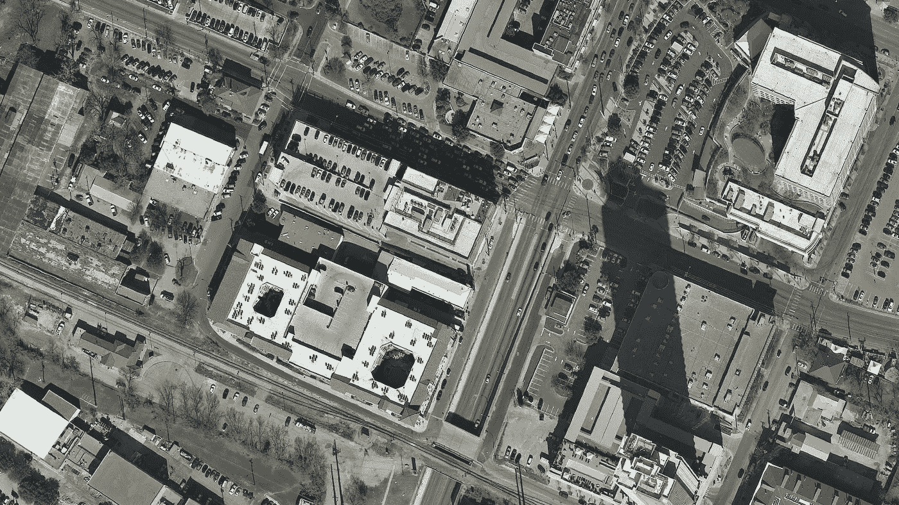
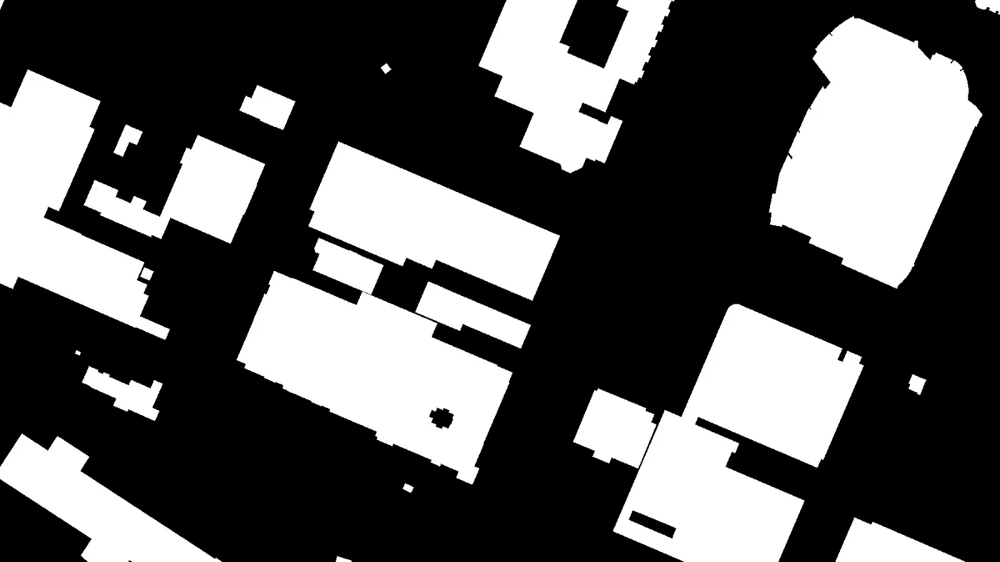
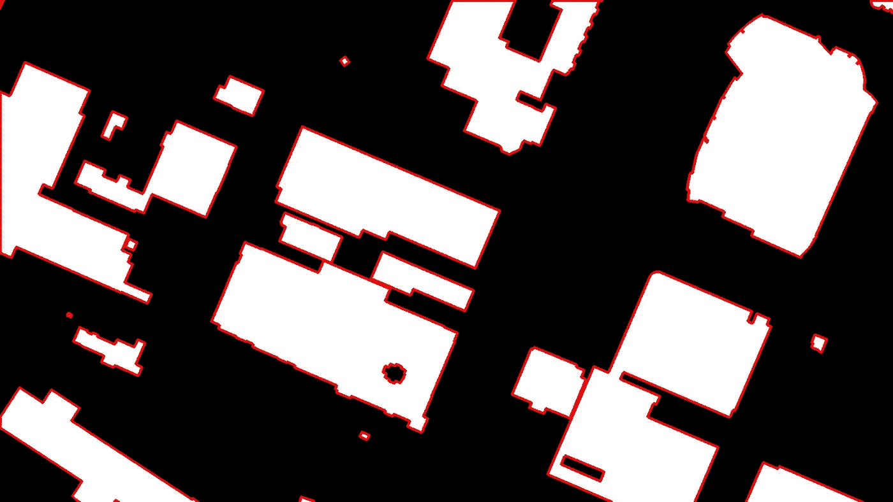
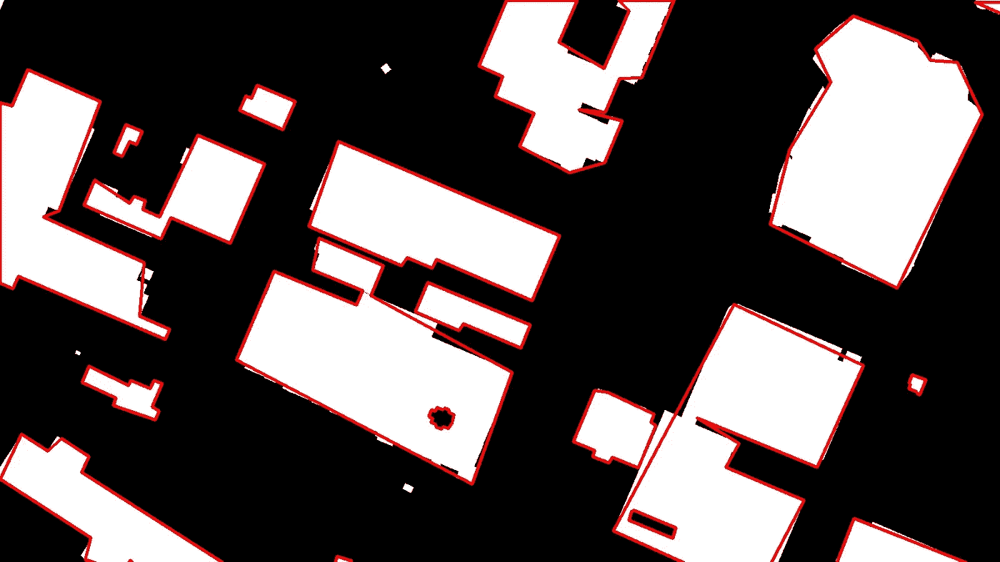
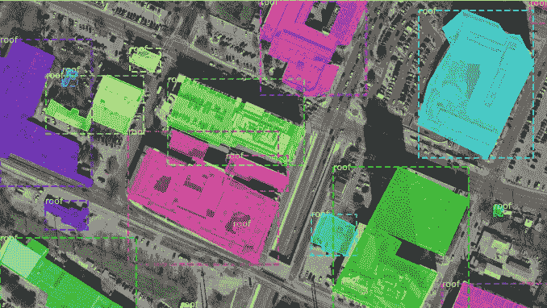

# 如何自动生成 VGG 图像标注文件

> 原文：<https://towardsdatascience.com/how-to-automatically-generate-vgg-image-annotation-files-41d226e6d85>

## 使用语义数据集更快地训练实例分割

克里斯蒂安·威迪格在 [Unsplash](https://unsplash.com?utm_source=medium&utm_medium=referral) 上拍摄的照片

在计算机视觉领域，实例分割是目前最热门的话题之一。它包括图像中对象的检测/分割，即特定对象的定位及其所属像素的关联。像任何一种机器学习系统一样，需要大量的图像来训练主干架构。更具体地说，需要大量的注释来训练神经网络的定位功能。注释是一项耗时的活动，并且可以决定项目是否会成功。因此，必须小心处理它以提高生产率。

在卫星图像领域，可以利用免费数据集来利用研究人员或注释人员以前所做的工作。这些数据集通常由研究人员在从开源图像中构建它们，对它们进行前后处理，并使用它们来训练和测试他们自己的人工智能研究系统之后发布。语义分段和实例分段略有不同，但是在建筑物的情况下，一个分段可以帮助另一个分段。事实上，建筑往往是独特的，可以在任何图像上进行视觉分离。利用这种考虑，可以从二进制标签图像为每个建筑物生成单独的掩模，然后用于更快地训练实例分割算法，如掩模 RCNN。注释不必手动执行，这是该技术的主要优点。这里有一些如何做的提示！

# JSON 文件格式

Mask RCNN [Matterport](https://github.com/matterport/Mask_RCNN/blob/3deaec5d902d16e1daf56b62d5971d428dc920bc/samples/balloon/balloon.py#L97) 实现以及[FAIR detector 2](https://colab.research.google.com/drive/16jcaJoc6bCFAQ96jDe2HwtXj7BMD_-m5#scrollTo=PIbAM2pv-urF&line=4&uniqifier=1)平台正在使用 JSON 文件为训练图像数据集加载注释。这种文件格式在许多计算机科学应用程序中使用，因为它允许以一对属性-值格式轻松存储和共享字母数字信息。它是为 JavaScript 语言构建的，但现在，它被用于许多其他编程语言，如 Python。已经构建了专用库，能够在 Python 代码中生成和解析 JSON 格式的数据作为文本文件。在 [VGG 注释工具](https://annotate.officialstatistics.org/)格式中，Mask RCNN 使用的典型 JSON 文件将具有以下形状:

对于子集，一个 JSON 注释文件收集所有的注释数据。每个图像注释都堆积在一个大的 JSON 文件中。

*   一个图像由它的名称和它在磁盘上的大小来标识。这个标识符由四个属性描述:图像的名称(*文件名*)、它在磁盘上的大小(*大小*)、带注释的形状(*区域*)以及图像上的一些元数据(*文件属性*)。这个*区域*属性本身由一个元素列表描述，该列表表示可以在图像上绘制的不同注释。
*   每个注释可以由一对两个元素描述:形状描述( *shapes_attributes* )和注释数据( *region_attributes* )。 *shapes_attributes* 描述由注释的形状( *name* )和两个整数有序列表( *all_points_x* 和 *all_points_y* )组成，它们代表形成掩膜注释的点的 x 和 y 坐标。注释数据 *region_attributes* 可以被调整，并且注释类可以被保存用于多类分割目的。
*   第四个标识符属性被命名为 *file_attributes* ，可以用来存储关于带注释图像的任何信息。

在语法方面，让我们注意花括号{}通常用于分隔相同类型的元素，以及引用描述一个元素的属性。方括号[]也用于表示参数列表。关于对，属性通常由包含其名称的字符串描述，并由:字符分隔值/数组。

幸运的是，Python 有一个库供我们读写 JSON 文件。使用 *import json* 代码片段可以很容易地加载它，用通用语法读写一个文本文件。让我们在下一章推导如何将二进制标签图像转换成 VGG 注释，特别是如何用 JSON 语法编写注释文件。

# 正在生成注释 JSON 文件

本文提出的主要思想是将二进制标签图像转换成 VGG 注释格式的 mask JSON 文件。二进制标签图像的每个形状被个性化，以将它变成用于例如分割的掩模元素。转换主要通过 Python 中易于使用的著名 OpenCV 图形库来执行。

*   第一行是构建正确的文件夹路径到地面真相标签和光学图像文件夹，并创建将被写入注释的 JSON 文件。
*   首先，使用 cv2.findContours 函数将二值蒙版裁剪成轮廓。大多数转换(阈值、灰度转换)实际上并不需要，因为数据已经是二进制图像。cv2.findContours 函数提供了一个轮廓列表，作为点的列表，这些点的坐标以图像的参考表示。
*   在我的[屋顶项目](/my-rooftop-project-a-satellite-imagery-computer-vision-example-e45a296129a0?gi=b58691812f1c)的背景下，我只对大型建筑屋顶感兴趣，因此可以使用自定义 OpenCV 函数来导出屋顶的表面，然后将它们转换为平方米，并只选择有足够面积的屋顶。在这种情况下，可以使用 Ramer–Douglas–peu cker(RDP)算法来简化和近似检测到的轮廓，以便更紧凑地存储注释数据。此时，您应该有一个表示在二进制图像上检测到的轮廓的点列表。
*   现在，你需要将整个轮廓点列表转换成一个大的 *via_region_data.json* 文件，用于掩膜 RCNN 算法。对于 JSON 注释，数据需要具有第一段中指定的格式。在将数据推送到 JSON 文件之前，将主要使用字典。
*   根据轮廓周围[]的数量，您将需要特定数量的[:，0]来获取适当的数据。描述轮廓的整数数组必须用。tolist()参数，然后将其放入 JSON 属性。制作 VGG 注释 JSON 文件非常类似于俄罗斯娃娃。您可以创建一个空字典，指定它的一个(或多个)属性的值，然后将其作为更高级别的属性的值进行传递，以将其封装到更大的字典中。让我们注意，对于多类分割或对象检测， *region_attributes* 可以包含一个属性类，其中对象的实际类在 *shape_attributes* 参数中指定。
*   最后，每个图像数据都存储在一个大的“jsonf”元素中，用它的名称+大小字符串作为标识符，然后将所有数据放入一个 JSON 文件中。这样做非常重要，因为如果每次运行新图像时都在 JSON 文件中写入，JSON 文件的 Mask RCNN 导入将会失败。这是由于 *json.load()* 只读取第一组花括号{}的内容，将无法解释下一组。

就是这样！让我们看看这个过程的结果是什么！

# 检查注释显示

这个小章节将展示上述过程的图形使用。我主要使用美国地质调查局通过国家地图服务公开发布的美国城市图片(芝加哥、奥斯汀、旧金山)。美国地质调查局、国家地理空间计划提供的地图服务和数据。这项服务是[开源的](https://www.usgs.gov/faqs/what-are-terms-uselicensing-map-services-and-data-national-map?qt-news_science_products=0#qt-news_science_products)，所以你可以对数据做任何你想做的事情！在本文中，我处理了德克萨斯州奥斯汀附近的非常高分辨率的影像(空间分辨率= 0.3 米/像素)。

*   第一幅图像是视觉彩色图像，通常以 GeoTiff 格式与*一起提供。tif* 扩展也包含嵌入的地理空间数据。它以美国城市环境的城市场景为特色。渲染是用三个光谱视觉图像构建的:常见的蓝色、绿色和红色。但是在更复杂的影像背景下，影像供应商可以提供近红外影像，以便能够生成 CNIR(彩色+近红外影像)来分析光谱影像的不同方面。

德克萨斯州奥斯丁的卫星图像来自[美国地质调查局国家地图项目](https://www.usgs.gov/programs/national-geospatial-program/national-map)

*   第二个图像显示二进制标签图像。可以看出，地面真实包含了与建筑物相关联的每一个像素，甚至是具有弯曲形状的最小像素。每个建筑都可以单独识别，因为建筑不能重叠，这证明了这一点。

来自 [USGS 国家地图计划](https://www.usgs.gov/programs/national-geospatial-program/national-map)的德克萨斯州奥斯汀的建筑地面真相

*   第三个图像由二进制标签 one 和 cv2.findContours()函数检测到的轮廓组成，在它上面用红色突出显示。显示的轮廓是来自 OpenCV 函数的原始数据，并且没有被过滤掉，因此即使最小的建筑物也被表示出来。需要注意的是，cv2.findContours 函数是逐像素的变换:由一个像素连接的两个建筑物将被分割在一起，而仅一行暗像素就足以将两个靠近的建筑物分开。

图片由作者提供，基于[美国地质调查局国家地图](https://www.usgs.gov/programs/national-geospatial-program/national-map)数据

*   第四幅图像显示了带有过滤后的近似轮廓的二进制标签图像。正如第二章所说，在我的屋顶项目中，我对面积小于一百平方米的建筑不感兴趣。还执行轮廓近似以减小注释文件的大小。因此，仅在大型建筑物周围绘制轮廓，并且在某些情况下，轮廓与建筑物形状不完全匹配，从而影响轮廓近似。

图片由作者根据[美国地质调查局国家地图](https://www.usgs.gov/programs/national-geospatial-program/national-map)数据制作

*   第五个也是最后一个图像显示了通常的实例分割可视化，可以使用 [inspect_roof_data.ipynb](https://github.com/matterport/Mask_RCNN/blob/master/samples/balloon/inspect_balloon_data.ipynb) 等工具绘制。大型建筑的屋顶被单独分割，属于这些屋顶的像素被单独关联。此处使用的笔记本将从 via_region_data.json 文件加载注记，因此，如果您可以像这样显示带注记的卫星影像，您的数据集就可以训练实例分割掩膜 RCNN 算法了！

图片由作者提供，基于[美国地质调查局国家地图](https://www.usgs.gov/programs/national-geospatial-program/national-map)数据

# 结论

本文展示的过程展示了如何将语义数据集转化为实例分割训练数据集。然后，它可以用来有效地训练掩模 RCNN 算法。该流程还可以重复使用和修改，以适应具有不同输入标签形状的数据集，如 ka ggle[Sartorius Cell Instance Segmentation](https://www.kaggle.com/c/sartorius-cell-instance-segmentation)competition 等

希望你觉得这几行有趣且有用😀如果你喜欢我的内容，你可以关注我的帐户来获得更多的 deeptech 主题！C u😉🚀