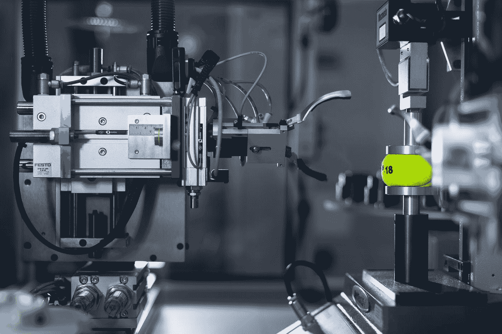

# 如何避免数据科学中的错误

> 原文：<https://towardsdatascience.com/how-to-avoid-mistakes-in-data-science-20d6f9c4274b>

## 意见

## 了解数据科学中各种错误的发生，尤其是在构建机器学习代码时，对于数据科学和人工智能的从业者来说是有用的。在本文中，我们将探索避免这些错误并提高生产率的步骤。

简·安东宁·科拉尔在 [Unsplash](https://unsplash.com?utm_source=medium&utm_medium=referral) 上拍摄的照片

机器学习和数据科学正被广泛应用。机器学习的一些很酷的应用是在自动驾驶汽车和银行业，根据一系列特征判断一个人是否会拖欠贷款。**机器学习**也被用于从制药、零售、制造和农业行业开始的大量其他行业。

许多数据科学家和机器学习工程师被雇用来利用**海量**数据，并分别基于业务用例生成有价值的预测。

然而，当实践者试图在人工智能领域构建这些应用程序时，经常会遇到**问题**。现在，我们将讨论一系列数据科学中可能发生错误的方式，这些错误发生在使用人工智能完成业务需求的任务时，以及采取措施在很大程度上避免这些错误时。我们探索了数据科学失败的一些简单方式，并采取正确的实际步骤来确保在构建应用程序时避免这些失败。

## 数据科学和机器学习中的错误

由 [Sarah Kilian](https://unsplash.com/@rojekilian?utm_source=medium&utm_medium=referral) 在 [Unsplash](https://unsplash.com?utm_source=medium&utm_medium=referral) 上拍摄的照片

当构建有趣的机器学习应用程序时，有时从业者有可能在该领域犯错误。结果，为了给团队留下深刻印象而做的工作的质量被降到了最低。因此，看看数据科学中的各种错误并寻找减少它们的方法在很大程度上提高了生产力。以下是一些主要发生在数据科学领域的错误。

## 未能理解 ML 模型中的偏差

威尔·梅尔斯在 [Unsplash](https://unsplash.com?utm_source=medium&utm_medium=referral) 上拍照

有时，模型可能有很好的能力来很好地执行测试集。**当我们发现我们没有充分训练模型来利用它们在进行机器学习预测时的全部潜力时，模型中的偏差**就会发生。这可能主要是由于没有调整超参数，没有给出足够的数据，以及没有添加会对模型产生重大影响的特征。

为了避免这种情况，必须用可用数据适当地训练模型，同时确保模型在产生的误差方面达到全局最小值。这将确保我们获得最好的机器学习模型。

考虑到根据年龄、互联网服务类型和其他因素等一系列特征来预测客户是否会**离开**(离开服务)互联网服务的任务，可以看出，在这种情况下，我们必须使用复杂的机器学习模型来进行预测。使用不太复杂的模型，如逻辑回归，可能并不总能捕捉到**趋势**和来自该数据的洞察力，因为存在大量复杂的关系。如果我们使用逻辑回归模型，它很可能会有很大的偏差，因为它不能捕捉趋势。解决这个问题的最好方法之一是添加更复杂的模型，并改进机器学习预测。

## **不了解业务需求**

照片由 [Timon Studler](https://unsplash.com/@derstudi?utm_source=medium&utm_medium=referral) 在 [Unsplash](https://unsplash.com?utm_source=medium&utm_medium=referral) 上拍摄

机器学习和数据科学中经常使用的技术令人印象深刻，令人着迷。有机会看看这些模型如何提取数据，并从中理解和获得有用的见解，这似乎是一个令人印象深刻的壮举。您组织中的许多团队可能正在努力实现机器学习:他们希望像其他人一样加入到生产高质量工作的行列中。然而，在数据科学之旅中询问质量问题以及机器学习是否是手头特定业务问题的可行解决方案总是一个好的步骤。

考虑使用数据科学来预测一个人是否会买房子的例子。在这种情况下，数据科学可能是最有用的，因为准确预测数据将为公司节省数百万美元和收入。他们可以根据预测更好地规划预算，并确保数据科学在整个过程中获得良好的价值。因此，在尝试将机器学习应用于大量问题之前，理解业务需求是重要的一步。

## 未能消除数据中的异常值

由[鲁伯特·布里顿](https://unsplash.com/es/@rupert_britton?utm_source=medium&utm_medium=referral)在 [Unsplash](https://unsplash.com?utm_source=medium&utm_medium=referral) 上拍摄的照片

有时候，你已经和你的团队很好地讨论了业务和应用机器学习的需求，并产生了结果和良好的预测。然而，用于训练 ML 模型的数据可能有大量的**异常值**。在这种情况下，大量值位于某个值范围内，而其他值明显高于或低于数据的平均值。在这种情况下，模型在训练集上表现良好，但在以前没有见过的数据上不能很好地概括。

这些异常值的存在会影响大量机器学习模型的性能。因此，应努力消除它们，并确保这些模型实时正常运行。可以采取措施很好地识别它们。其中一些步骤包括找到标准偏差，并查看距离平均值 2 个**偏差**之间的值。这将确保我们获得手头数据的最佳预测。

数据集中异常值的例子包括用一组其他变量预测汽车价格。当我们试图预测各种汽车的价格时，考虑到诸如里程、马力和其他因素，由于**人为错误**会遇到异常值的情况。在这些情况下，当使用包含异常值的数据集训练模型时，模型的表现会比不包含异常值的数据集差得多。因此，从各种要素中移除这些异常值可能是构建有效解决方案的一个进步。

## 未能使用正确的特征工程技术

在 [Unsplash](https://unsplash.com?utm_source=medium&utm_medium=referral) 上拍摄的 [ThisisEngineering RAEng](https://unsplash.com/@thisisengineering?utm_source=medium&utm_medium=referral)

ML 模型预测中使用的特征决定了它们在**未知**数据上的表现。因此，赋予我们的模型对各种特性的正确访问权，并实现创建新特性的策略，可以提高这些模型的性能。此外，使用特征化和创建新要素有助于通过使用各种图来更好地探索数据。这些图通常可以帮助获得有价值的见解，并可以交给业务部门，以便他们做出数据驱动的决策。

在机器学习中，我们要输入到 ML 模型的数据中经常会有大量缺失值。缺少数据的现实问题的一些例子包括贷款违约预测、心脏病预测和癌症诊断预测。所有这些例子都包含含有**缺失**值的特征。这导致模型在该数据上表现不佳。对于数据可能包含丢失的工资信息的信用欺诈检测等问题，执行特征工程非常方便。用整个工资的平均值或众数来计算这些值就可以了。

如果您有兴趣了解更多关于各种特征化技术的知识，您可以看看我之前的文章，我在文章中非常详细地提到了它们，并给出了实际的例子。下面是链接。

[哪些特征工程技术可以提高机器学习预测？|作者 Suhas Maddali | 2022 年 11 月|迈向数据科学(medium.com)](https://medium.com/towards-data-science/which-feature-engineering-techniques-improve-machine-learning-predictions-227d732068f5)

## 假设深度学习可以解决任何问题

照片由 [Sai Kiran Anagani](https://unsplash.com/@anagani_saikiran?utm_source=medium&utm_medium=referral) 在 [Unsplash](https://unsplash.com?utm_source=medium&utm_medium=referral) 上拍摄

随着各种公司实施的技术创新和更新战略的兴起，获取**大量**数据变得越来越容易，这些数据可以被提取出来，并可供大量团队用来执行机器学习相关任务。后来还发现，随着数据量的增加，使用深度学习变得更加合适。

虽然使用深度神经网络(深度学习)确实可以提高数据的性能，但团队经常期望**解释**为什么模型首先给出预测。正是在这段时间内，深度学习的方法可能会失败，特别是当可解释性是特定 ML 应用程序的最重要要求之一时。

考虑这样一种情况，即根据体重、血压和身体质量指数等一系列因素来诊断患者是否患有癌症。由于我们有大量来自癌症患者的数据，使用**深度学习**来预测几率会更容易得出结论。然而，在癌症诊断的情况下，解释深度学习模型的预测同样重要。由于深度学习模型的本质更加复杂，它们能够提取错综复杂的关系，因此它们变得更难解释为什么它们首先给出预测。因此，在这种情况下，使用简单的机器学习模型将是一种很好的方法，这些模型分别对从业者、医生和患者来说是高度可解释的。

## 结论

看完这篇文章后，希望你已经理解了使用机器学习和深度学习为产品构建有趣的 AI 应用程序时可能出现的一些错误。采取文章中提到的步骤可以在很大程度上帮助应对这些挑战，同时提高效率。感谢您花时间阅读这篇文章。

如果你想获得更多关于我的最新文章的更新，并且每月只需 **5 美元**就可以无限制地访问中型文章，请随时使用下面的**链接**来添加你对我工作的支持。谢了。

[https://suhas-maddali007.medium.com/membership](https://suhas-maddali007.medium.com/membership)

以下是您联系我或查看我作品的方式。

**GitHub:** [苏哈斯马达利(苏哈斯马达利)(github.com)](https://github.com/suhasmaddali)

**YouTube:**[https://www.youtube.com/channel/UCymdyoyJBC_i7QVfbrIs-4Q](https://www.youtube.com/channel/UCymdyoyJBC_i7QVfbrIs-4Q)

**LinkedIn:** [(1)苏哈斯·马达利，东北大学，数据科学| LinkedIn](https://www.linkedin.com/in/suhas-maddali/)

**培养基:** [苏哈斯·马达利—培养基](https://suhas-maddali007.medium.com/)