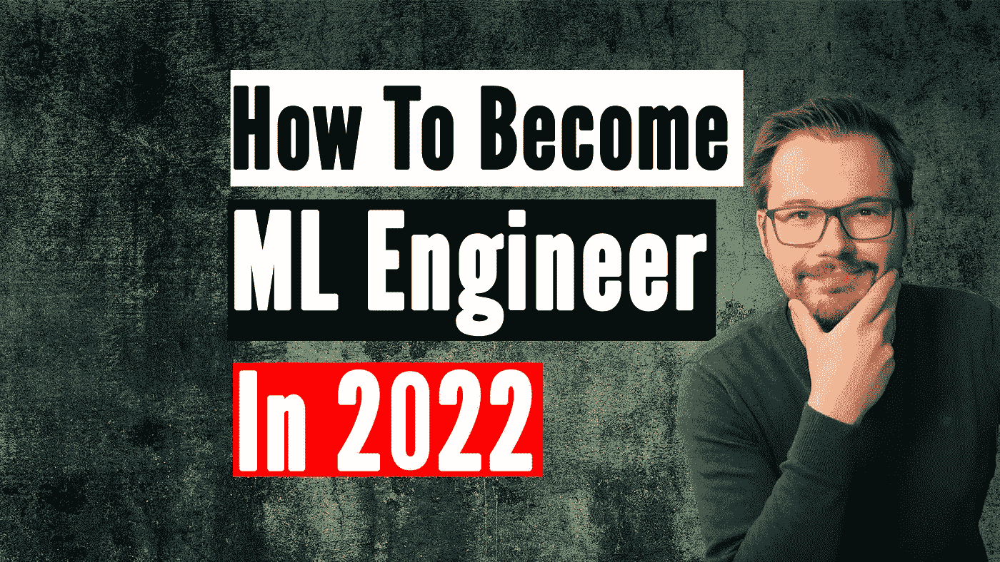
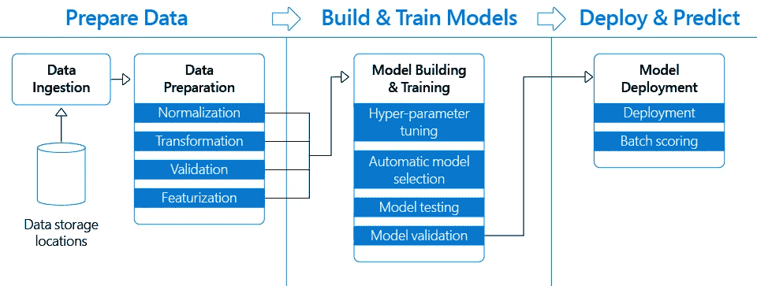
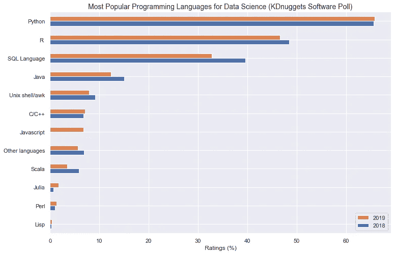
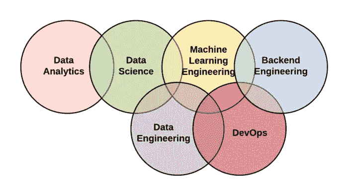

# 如何成为一名机器学习工程师

> 原文：<https://towardsdatascience.com/how-to-become-a-machine-learning-engineer-66bd55f17c67>

## 如何在今年成为 ML 工程师的一步一步的指导

作者创造的形象，人就是作者

人工智能工程的世界在召唤你，这正是我们今天要讨论的，如何在 2022 年成为一名机器学习工程师。我是桑德罗，我作为一名 ML 工程师已经工作了大约一年，同时也从事其他数据工作。如果你像我一样曾经计划从你的大学生活过渡到 ML 工程世界，或者从一份不同的工作进入这个令人兴奋的领域并得到你的第一份工作，这篇文章是给你的。

我将向您介绍如果我今天重新开始我会采取的步骤，以及我将关注的具体内容，然后给你一个大概的时间估计，告诉你应该在每个领域关注多长时间，这样你就可以在一年中逐步提高自己的技能。最后，我们会给出很多具体的建议，告诉你如何将这些技能转化为工作机会，以及在哪里可以学到这些技能。

# 硬技能

我把这篇文章分成 7 部分，第一部分是学习正确的技能。老实说，要成为一名 ML 工程师，你需要知道很多不同的东西，但实际的硬技能，即你将需要转换数据、训练模型以及最重要的将其投入生产的实际技能是必不可少的，其他的大多是很好知道的。这些硬技能定义了你，没有它们你真的找不到一份 ML 工程师的工作。

我认为你的技能集是一个机器学习管道，你必须在日常生活中建立、维护并不断改进。

ML 管道的简化[源文章](https://medium.com/microsoftazure/how-to-accelerate-devops-with-machine-learning-lifecycle-management-2ca4c86387a0)

现在，什么是机器学习管道，它是一个计算机软件，首先从数据源中提取数据，然后将其转换为预测或训练模型，最后部署这个模型，以便其他人可以通过各种数据输入全天候使用它。现在，如果我们后退一步，开始识别所有这些框所共有的最重要的技能，这是第一个技能，即成为一名优秀的软件工程师，这实际上是 ML 工程师的一半。如果你是计算机科学出身，那么恭喜你已经有 50%的成功了。如果不是，我们会马上研究如何建立那套技能。编程、数据结构、算法和计算机体系结构将影响你所做的一切。能够用 80%的 Python 写干净的结构良好的代码，

KDnuggets 软件杆[来源](https://www.datacamp.com/blog/top-programming-languages-for-data-scientists-in-2022)

从文件中读取、记录日志、构建 API、编写转换函数，对于您所做的一切都是非常有用的技能。当然，在这个领域中还有很多其他的编程语言，比如 Java 和 C++，但是 Python 显然是大多数 ML 和数据工作的主导语言。因此，软件工程显然是你应该关注的第一技能，因为它影响你将要从事的一切工作。现在从上到下，我认为 R 更多的是数据科学和分析语言，但 SQL 是必须的。如果我们回到我们的管道类比，数据准备的整个左边部分是你需要知道的事情，以使任何项目进行下去。

我想说你至少可以了解 Pandas 和 SQL，SQL 无处不在，大部分企业数据仍然在关系数据库中。此外，SQL 语法在许多较新的数据工具中非常常见，您可以在 pandas 和 spark 中使用它，仅举两个例子。确保至少学习 SQL 的基础知识和如何编写查询，花几周时间专注于它已经足够了。

现在，一旦您从数据源提取了我们的数据，您可能会有一个 CSV 或 Parquet 文件，您将需要一些方法来转换您的数据。行业标准是 Pandas，它将真正帮助你将数据转化为对机器学习有用的东西。这意味着标准化，去除异常值，潜在地验证数据没有问题，以及大量的功能工程。虽然同样的工作有很酷的大数据工具，但我会主要关注 Pandas 和一些 Numpy，直到你有了第一份工作，因为它的语法和功能是黄金标准，我绝对会专注于这一点。从这里开始，类似的技术变得更加新奇，比如说，你可以在工作中学习它们。我认为 Numpy 非常有用，是熊猫的基础，但是纯熊猫 90%的时候会带你去那里。

现在您已经提取、转换和加载了数据，也称为 ETL 管道。让我们来看看你们都已经知道的极其重要的东西，那就是机械学习，ML 工程师中的 ML。也就是说，理解机器学习以及使其工作和推广的基础数学和统计学是非常重要的，也是工作的另一半。在这方面，我至少会关注 Sklearn、XGBoost 以及 Tensorflow 或 Pytorch。

虽然现在每个人都知道深度学习，但不要忘记至少也要学习随机森林、XGBoost 和一些线性回归，你肯定会发现它们在生产中比你现在可能预期的要多得多。有了 ML 知识，也就知道如何选择模型，这意味着能够在测试集上测试您的作品，并使用常见的度量标准(如准确性、召回率、F1 等)对它们进行评估，以确定适合您用例的最佳超参数集和模型类型。

正如许多人所说，机器学习是一种艺术形式，你永远无法充分了解你工作的这一方面，但因为我知道你们中的一些人会过于专注于它，所以我只想说，不要只专注于它，因为这份工作真的不仅仅是擅长 ML。我知道我们都被这些可爱的算法迷住了，但请记住，这只是工作的 50%，甚至更少。到目前为止，我们提到的硬技能组合已经非常强大了，如果你非常了解这些基本技能，你可能只需要知道这些技能就可以申请大多数工作，所以我强烈建议你把最初的大部分时间花在这些方面。

这个过程中的最后一部分，可能也是最容易被忽视的部分，我知道我刚才说了没有它你也能找到工作，但是当你知道这个难题的最后一个关键部分时，你找到工作的机会就会大大增加。这就是如何部署模型以及我们刚刚描述的整个管道。我将其总结为 MLOps，代表机器学习操作，它是一套旨在可靠有效地在生产中部署和维护 ML 模型的实践。

MLOps 的定义[来源维基百科](https://en.wikipedia.org/wiki/MLOps)

它基本上位于 ML、数据工程(这是我在数据准备中总结的)和 DevOps 的交叉点上。换句话说，你如何在每月的第一天从你的 SQL 数据库中导出数据，用 Pandas 转换它，用 Tensorflow 训练一个模型，最后用 API 在云中部署它。

**免责声明:**我现在会提到很多可能会让你不知所措的流行词汇和复杂技术，但不要害怕，因为每个公司都会使用不同的术语，我会在最后告诉你你真正应该关注哪些术语。就背景而言，大多数公司每年至少一次不断改进和更换部件或扩展他们的技术堆栈，你不可能跟踪所有这些。

说到这里，让我们考虑一下我们的工作流，假设我们编写代码并将其推送到 GitHub，一旦完成，我们就有一个像 Jenkins 或 Airflow 这样的工具，它使用触发器下载代码，然后继续构建所谓的 docker 映像，并使用 Ansible 这样的技术将它们部署到几个集群，Kubernetes 将管理这些 pod 或容器，并向用户公开一些 API。

我们之所以有这样的管道，是因为它们是循环的，所以如果我将新代码推送到我的 GitHub 仓库，整个管道将再次运行，并自动部署新代码，希望不会被黑客攻击，用户可以立即使用，或者等到每月的第一天，Jenkins 再次触发最新的代码进行培训。

迷茫？没关系，这非常复杂，有时在这个过程中会涉及 100 种技术和多种云。对于你的第一份工作，我会说只关注最重要的，并在你工作的时候从那里开始迭代。

如果你有一些空闲时间，一定要关注 Docker，它是大多数这些技术的核心，我认为几乎每个人都在使用它，简而言之，它是一种构建简单的小程序包的技术，该程序包包含在云中或集群上运行应用程序所需的所有代码。另一个非常受欢迎的技术类别是编排工具，如 Airflow 或 Jenkins，简单地说就是确保您的代码运行，例如，每周二早上 5 点或者当您的一个队友将代码推送到特定的 git 存储库时。虽然还有许许多多的事情需要了解，但我确信，如果你知道软件工程、机器学习和 MLOps 这四类技能，你一定会找到一份机器学习工程师的工作。

# 从哪里学习这些技能

我把它放在自己的部分，这样它就不会让技能部分太混乱。显然，一个很好的起点是大学世界里的任何东西，你在数据和计算机科学中选择的每一门学科都将是你找工作的一个有价值的盟友。如果你还在那里，尝试选择数据科学或计算机科学作为辅修专业，如果你有学士论文或硕士论文等项目，请确保只是运行一个需要你建立一个机器学习算法的问题，你可以将它作为文件夹部分的一个项目。

如果你已经不在大学了，不要担心，外面有那么多好的资源，真的不再需要了。如果我因为某种原因忘记了我已经学过的所有东西，从零开始，我会从学习课程开始，最好最后能拿到证书。首先，从 Coursera 上的一个非正式课程开始，或者只是在 Python 上观看 youtube 视频，直到你能够创建能够正常工作的脚本。现在从这里开始，你可以在数据世界中处理实际的证书，因为我不想为一家公司做太强的广告，让我只说大型科技公司谷歌、IBM 和微软拥有数据世界中几乎所有东西的证书和课程。

他们会很有挑战性，这就是他们真正存在的目的，让你在就业市场上更有价值。所以我给你的建议是，选择一家公司，获得数据科学、数据工程或最好的 ML 工程证书。这也将教会你非常有价值的云技能，这是我没有提到的，因为有些人有谷歌，有些人有 AWS，有些人有 Azure，你需要哪一个取决于你申请的公司。

仅举一个具体的例子，谷歌云机器学习工程师证书是我个人推荐的，它将教会你我刚才提到的一切，但要知道，你应该知道基础知识，并在开始学习之前真正专注于软件工程和机器学习，因为它不是初学者教程。把这些证书想象成你拥有的相关证书越多，公司就会越喜欢你。但是同样要确保不要过度关注一个领域。

# 获得工作经验

现在，虽然靠自己学习所有这些技能肯定是可能的，但我强烈建议你在工作中学习。如果你还在上大学，许多公司会提供实习的机会，这是你能得到工作的最好方式。如果你正试图进入这一领域，这也适用于你，但我会在实习结束后给你一些可能更好的建议。对于实习来说，进入门槛要低得多，有许多非常有用的途径可以让你获得初级工程职位。我知道，目前作为机器学习工程师的实习机会非常少，这肯定会在未来几年发生变化。然而，如果我们想一想什么是真正的 ML 工程师，我们会发现它是许多其他领域的交汇点，这些领域提供实习或工作机会，如数据科学，数据工程和软件工程。你能在这些领域得到的任何工作或实习都应该是有价值的，也许你不能一直做 ML，但肯定有一些机会在你工作的时候做一点。

ML 工程师从采购[的概述](https://medium.com/@lchandratejareddy/a-data-analyst-vs-a-data-scientist-vs-a-data-engineer-91b1f46d5995)

我个人在学习期间开始了软件工程实习，然后在我的学士学位在一家公司进行了数据科学/数据工程/软件工程实习之后，我在攻读硕士学位期间继续在这些领域获得工作经验。

如果你已经工作了，并且不打算再学习，我会试着说服我的雇主再找一些在这些领域的副业。只要记住，你对数据或软件所做的一切都会让你离成为机器学习工程师更近一步。我知道向你的老板推销包括机器学习在内的内部项目可能令人害怕，但如果你向他展示你的解决方案可以节省时间，而且你真的有动力，他们肯定会喜欢。一个非常常见的例子是，对收到的电子邮件进行分类，并需要路由到正确的人，通常公司有太多的方法，一些简单的机器学习真的可以节省你的公司很多时间，所以真的坐下来想想 easy ML 可以帮助你当前的公司，也许你最终会为你的投资组合提供一个很好的项目，并且你可以获得报酬。

# 创建一个 ML 组合或应用程序

学了这么多之后，你需要能够向招聘经理或招聘人员展示你确实知道这些技能，你将如何做到这一点？无论是如上所述的工作经验，还是你需要创建一个文件夹，或者如果你在大学里，写论文并进行项目，向他们展示你可以做到这一点。

你现在可以创建一个网站、Linkedin 个人资料或博客，人们可以去那里看看你的资历和你做过的项目，然后说哇，这家伙真的知道如何建立机器学习模型并将其投入生产。我个人经历了获得计算机科学硕士学位的经典之路，并与人合著了一些小论文，但如果你能够构建一个功能正常的机器学习应用程序，并将其部署给其他人使用，这真的是你能做的最大的事情之一，可以帮助你获得注意，获得工作，并向雇主展示你知道这些技能。

# 创建机器学习工程师简历

合乎逻辑的下一步是为机器学习工程师创建一份简历，正如你已经知道的那样，你将需要一份简历或简历来申请你潜在想要申请的任何工作。所以，把你所有的技能、证书和项目都写在一张纸上。所有这些技能和项目实际上会为你创造这份简历，我不打算撒谎，但拥有一些 STEM 领域的学位也是许多工作的一个要求，但正如计算机科学中的一切表明你可以交付质量一样，项目也将发挥作用。如果你正在寻找更多的指导，我确实有一个完整的视频，带你完成为机器学习工程师创建简历的过程，真的可以通过这个视频从头开始创建你的个人简历。

# Linkedin 是你的朋友

自从我制作了这个简历视频后，Linkedin 在招聘过程中的重要性急剧增加，我每周都会收到招聘人员和其他求职者的信息。因此，如果你想在这个领域找份工作，我真的会把我们到目前为止讨论过的所有信息放在你的个人资料上，这些证书和项目会确保人们注意到你，让你出现在他们的搜索中。很多时候，招聘人员会注意到你，并希望能够帮助把你“推销”给潜在的雇主。

此外，如果你正在申请，许多人会查看你的 LinkedIn 个人资料，查看你迄今为止做了什么，你在哪里工作，你在数据社区从事什么工作。这确实是人们倾向于跟踪你的第一个地方，让它成为一次对他们来说很好的经历真的可以走很长的路。

# 如何分配你的时间？

正如我在开始时承诺的，我将把我们在这个视频中讨论的所有内容放到一个更大的画面中，这样你就可以找出你的弱点，并利用所有这些技能打下良好的基础。我之前已经提到过，但是在我们处理其他方面之前，你应该至少有 1 年编程、数据科学家、数据工程师的经验，或者 STEM 领域的学士学位。

我知道很多人会在网上告诉你，你可以在几个月内做到，但即使是最积极的个人，我也要说这是不现实的。也就是说，我强烈建议你至少花一年时间在编程上，当然，这可以是在你攻读学位、数据科学或机器学习项目的时候。

现在，在你了解编程的基本方法之后，我会把我的时间分成 30%编程，20%机器学习，20%数据科学，15%数据工程和 15% MLOps。这些数字都是我编的吗？是的，我做了，但我绝对可以支持他们，而且也很难拿出更明智的东西，因为最终所有这些方面都包括编程和版本管理 pip 包或任何东西。我想说，只要你牢记自己的目标，从头到尾把所有的时间都花在建设项目上，你就会得到正确的时间分配，而不用想太多。

那我为什么要提呢？嗯，我觉得很多人最终只做了机器学习和调整花哨的深度学习模型，而忘记了其他的，只是要确保也将它们投入生产，这是数据科学家或人工智能研究员与机器学习工程师之间的主要区别。

# 结论

这是一个很大的挑战，不要害怕，我的朋友们，每天迈出一步，你很快就会到达你想去的地方。

如果你想知道他们在工作面试中可能会问你什么具体的问题，我制作了一个关于机器学习工程师面试问题的完整视频，它会给你一些提示，告诉你可能需要在哪些方面投入更多时间。

通常机器学习会在最意想不到的领域发展。虽然大趋势仍然是越大越好，越来越多的倡导者告诉我们，我们也可以用更少的钱做到这一点。我坚信这种发展不仅会让机器学习变得更容易，还会教会我们更有效地使用更大的模型

如果你喜欢这篇文章，我会很高兴在 Twitter 或 LinkedIn 上联系你。

一定要看看我的 [YouTube](https://www.youtube.com/channel/UCHD5o0P16usdF00-ZQVcFog?view_as=subscriber) 频道，我每周都会在那里发布新视频。