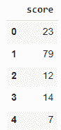
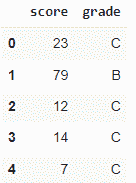
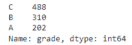
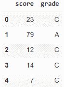
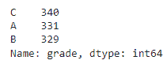
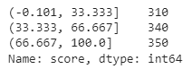
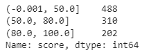

# 如何将数字数据与熊猫绑定

> 原文：<https://towardsdatascience.com/how-to-bin-numerical-data-with-pandas-fe5146c9dc55>

## 用熊猫离散化数值变量，介于，cut，qcut 和值计数之间

# 介绍

宁滨也称为分桶或离散化，是一种常见的数据预处理技术，用于将连续数据的间隔分组到“箱”或“桶”中。在本文中，我们将讨论使用 python 熊猫库计算宁滨数值的 4 种方法。


Pawel Czerwinski 在 [Unsplash](https://unsplash.com?utm_source=medium&utm_medium=referral) 上拍摄的照片

# 方法

为了便于说明，我们创建了以下合成数据。

```
import pandas as pd # version 1.3.5
import numpy as npdef create_df(): df = pd.DataFrame({'score': np.random.randint(0,101,1000)}) return dfdf = create_df()df.head()
```

这些数据包括 1000 名学生从 0 到 100 的学习成绩。任务是将数值分数分为“A”、“B”和“C”三个等级，其中“A”是最好的等级，“C”是最差的等级。



作者图片

# 1.& loc 之间

> *Pandas* `*.between*` *方法返回一个包含 True 的布尔向量，无论相应的 Series 元素在边界值 left 和 right[1]之间。*

**参数**

*   `left`:左边界
*   `right`:右边界
*   `inclusive`:包含哪个边界。可接受的值是 *{“两者”、“两者都不是”、“左”、“右”}。*

让我们根据以下间隔将学生的分数分成几个等级:

*   答:(80，100)
*   乙:(50，80)
*   丙:[0，50]

其中方括号`[`和圆括号`)`分别表示边界值包含和不包含。

我们识别哪些`score`位于感兴趣的区间之间，并为其分配相应的`grade`值。对于等级“A”和“B ”,只有右边界包含在内，因此我们将`right`传递给`inclusive`参数。对于等级“C ”,两个边界都包含在内，因此我们将`both`传递给`inclusive`参数。

```
df.loc[df['score'].between(0, 50, 'both'), 'grade'] = 'C'
df.loc[df['score'].between(50, 80, 'right'), 'grade'] = 'B'
df.loc[df['score'].between(80, 100, 'right'), 'grade'] = 'A'
```



作者图片

这是每个箱子里的学生人数

```
df.grade.value_counts()
```



作者图片

这种方法需要为每一个 bin 添加一行新的代码，因此它只适用于 bin 很少的情况。

# 2.切口

> *将值装入离散区间。当您需要将数据值分段和排序到箱中时，请使用 cut。这个函数对于从连续变量到分类变量也很有用[2]。*

基于与上述示例相同的间隔对学生进行分组。这些是所使用的参数:

*   `x`:要入库的输入数组。必须是一维的。
*   `bins`:标量序列:定义允许非均匀宽度的 bin 边缘。
*   `labels`:指定退回箱子的标签。必须与生成的条柱长度相同。
*   `include_lowest` : (bool)第一个区间是否应该左包含。

```
bins = [0, 50, 80, 100]
labels = ['C', 'B', 'A']
df['grade'] = pd.cut(x = df['score'], bins = bins, labels = labels, include_lowest = True)
```

我们创建一个包含面元边界值的`bins`列表和一个包含相应面元标签的`labels`列表。


作者图片

这是每个箱子里的学生人数

```
df.grade.value_counts()
```


作者图片

结果与第一个示例相同。

# 3.qcut

> *基于分位数的离散化函数。根据等级或样本分位数将变量离散化为大小相等的桶[3]。*

在前面的例子中，我们已经为每个年级定义了分数区间，这导致每个年级箱中的学生数量不均匀。在下面的例子中，我们尝试将学生分成 3 个年级组，每个组有相同(大约)数量的学生。我们有 1000 名学生，因此每个库应该有大约 333 名学生。首先根据分数对学生进行排名，前三分之一、中三分之一和后三分之一的学生分别被分配到“A”、“B”和“C”等级。

以下是以下示例中使用的参数:

*   `x`:要入库的输入数组。必须是一维的。
*   `q`:分位数的个数。十分位数为 10，四分位数为 4，等等。分位数的交替排列，例如[0，. 25，. 5，. 75，1。]对于四分位数。
*   `labels`:指定退回箱子的标签。必须与生成的条柱长度相同。
*   `retbins` : (bool)是否退回(箱子，标签)。如果条块以标量形式给出，则非常有用。

```
df['grade'], cut_bin = pd.qcut(df['score'], q = 3, labels = ['C', 'B', 'A'], retbins = True)
df.head()
```



作者图片

将`retbins`作为`True`传递会返回容器边界。

```
print (cut_bin)
>> [  0\.  36\.  68\. 100.]
```

箱子的间隔如下:

*   丙:[0，36]
*   乙:(36，68)
*   答:(68，100)

我们可以使用`.value_counts()`检查每个年级组中有多少学生。理想情况下，每个箱子应该有大约 333 名学生。

```
df.grade.value_counts()
```



作者图片

# 4.值计数

虽然 pandas `.value_counts`通常用于计算一个系列中唯一值的数量，但它也可用于使用`bins`参数[4]将值分组到半开的箱中。

```
df['score'].value_counts(bins = 3, sort = False)
```

默认情况下，`.value_counts`按值的降序对返回的序列进行排序。将`sort`设置为`False`,按照索引的升序对系列进行排序。



作者图片

序列索引是指每个 bin 的区间范围，其中方括号`[`和圆括号`)`分别表示边界值包含和不包含。返回系列的值指示每个箱中有多少条记录。

与`.qcut`示例不同，每个箱中的记录数量不一定相同(大约)。`.value_counts`不会将相同数量的记录分配到每个等级箱中，而是根据最高和最低分数将分数范围分成三个相等的部分。分数的最小值为 0，最大值为 100，因此 3 个部分的范围约为 33.33。这也解释了为什么除了最低的左边界之外，仓的边界是 33.33 的倍数。

我们还可以通过传入一个边界列表来定义 bin 的边界。

```
df['score'].value_counts(bins = [0,50,80,100], sort = False)
```



作者图片

这给出了与实施例 1 和 2 相同的结果。

# 摘要

在本文中，我们研究了如何使用`.between`、`.cut`、`.qcut`和`.value_counts`对连续值进行装箱。上面例子的 Colab 笔记本可以在[这里](https://colab.research.google.com/drive/1yWTl2OzOnxG0jCdmeIN8nV1MoX3KQQ_1?usp=sharing)找到。

# 参考

[1] [熊猫之间](https://pandas.pydata.org/docs/reference/api/pandas.Series.between.html)

【2】[熊猫切](https://pandas.pydata.org/docs/reference/api/pandas.cut.html)

熊猫 qcut

[4] [熊猫价值统计](https://pandas.pydata.org/docs/reference/api/pandas.Series.value_counts.html)