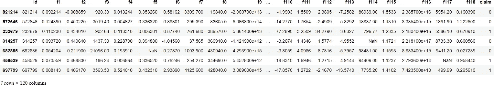

# 如何提高熊猫的速度，在几毫秒内处理 1000 万行数据集

> 原文：<https://towardsdatascience.com/how-to-boost-pandas-speed-and-process-10m-row-datasets-in-milliseconds-48d5468e269>

## 按照预期的方式使用熊猫


照片由[supreme](https://www.pexels.com/photo/a-fast-supercar-on-the-road-7702307/)拍摄

# 介绍

"太好了…另一篇关于如何让熊猫速度提高 n 倍的文章."

我想我已经说过无数次了，在过去的两年里我一直在用熊猫。最近看到的一条说“让熊猫快 71803 倍”。

但我不会给你这种承诺。我将向你展示如何以最快的方式使用熊猫。因为你不能加快已经很快的东西。没道理？

让我问你这个问题。当我说“摸摸你的右耳”时，你用哪只手当然，右手。把你的左手放在头上，你不会碰到你的右耳。那会很奇怪。

嗯，使用这些函数，熊猫文档清楚地说明了慢而不是最快的方法，也会很奇怪。

这就是为什么本文将向您展示 Pandas 中一些最常见的数据操作的最佳实践。你甚至可以将这些最佳实践视为“常识”，因为这就是熊猫的创造者打算如何使用他的图书馆。

获得由强大的 AI-Alpha 信号选择和总结的最佳和最新的 ML 和 AI 论文:

[](https://alphasignal.ai/?referrer=Bex)  

# 高效索引

先说最基础的操作。具体来说，我们将看到选择行和列的最快方法。如你所知，熊猫有两个索引操作符——`loc`和`iloc`。尽管它们的差异对于小数据集来说关系不大，但随着数据量的增加，它们会变得非常明显。

首先，对于选择一行或多行，`iloc`更快。

相比之下，`loc`最适合选择带有标签的列:

```
>>> tps.loc[:, ["f1", "f2", "f3"]]
```

对于采样列或行，内置的`sample`函数是最快的。您可能认为通过 NumPy 使用随机索引进行采样会更快，但事实并非如此:

```
# Sampling rows
>>> tps.sample(7, axis=0)
```



```
# Sampling 5 columns and 7 rows
>>> tps.sample(5, axis=1).sample(7, axis=0)
```


# 有效替换值

大多数时候，我看到人们使用`loc`或`iloc`来替换数据帧中的特定值:

的确，这种方法似乎是最快的，因为我们指定了要替换的值的确切位置，而不是让 Pandas 来搜索它。但是，这种方法很笨拙，而且没有`replace`快:

速度是`replace`的第一个好处，其次是它的灵活性。上面，我们用`NaN`替换了所有的问号——这是一个基于索引替换的多次调用操作。

另外，`replace`允许使用列表或字典同时改变多个值:

当用一个值列表替换另一个值列表时，它们将具有一对一的索引到索引的映射。你可以更具体地使用字典，比如:

使用嵌套字典可以更细化:

当您只想影响特定列的值时，嵌套替换会有所帮助。这里，我们只替换`education`和`income`列中的值。

`replace`还有其他好处，包括基于正则表达式的替换，这可以在[文档](https://pandas.pydata.org/docs/reference/api/pandas.DataFrame.replace.html)中读到。

[](https://ibexorigin.medium.com/membership)  

# 高效迭代

对整列或数据帧应用操作的黄金法则是*永远不要使用循环*。这是行之有效的陈词滥调。但是，我明白了——如何在不循环的情况下操作整个数组？

诀窍是开始将数组视为向量，将整个数据帧视为矩阵。毕竟 ML 模型就是这么接受数据的——说白了都是多变量[向量值函数](https://en.wikipedia.org/wiki/Vector-valued_function)。

从线性代数中，我们知道对向量的运算是对整个向量进行的，不管是乘法、加法等等。幸运的是，这种对数学向量进行操作的思想在 Pandas 和 NumPy 中实现为矢量化。

因此，如果您想在一个或多个列上执行任何数学运算，很有可能该运算在 Pandas 中是矢量化的。例如，像+、-、*、/、**这样的内置 Python 操作符就像对向量一样工作。

为了体验一下矢量化，让我们对大规模数据集执行一些操作。我们将选择 [Kaggle TPS 九月竞赛](https://www.kaggle.com/c/tabular-playground-series-sep-2021/data)的约 1M 行数据集:

让我们用熊猫`apply`函数对几列进行一些数学运算。那是熊猫最快的内置迭代器。

我们将用`apply`在三列上运行这个函数，并检查运行时间:

1M 行数据集为 19.3 秒。还不错。现在，看看当我们将列作为向量而不是标量传递时会发生什么。无需修改功能:

37 毫秒！这比最快的迭代器快了大约 600 倍。但是我们可以做得更好—在 NumPy 阵列上使用时，矢量化甚至更快:

只需添加`.values`即可获得熊猫系列的底层 NumPy ndarray。NumPy 数组速度更快，因为它们不像 Pandas 系列那样执行额外的索引调用和数据类型检查。

# 让我们快速疯狂吧

我们应该到此为止吗？熊猫还有一些锦囊妙计。不过，公平的警告是，除非你有超过 100 万行，否则这些不会给你带来太多好处。

好了，我们开始吧。首先，我们将把数据集的大小增加十倍，给自己一个挑战:

大约 9gb，这应该足够了。哦，顺便说一下，如果这种规模的数据集对你来说是一个问题，请查看我关于驯服这些野兽的文章:

[](/how-to-work-with-million-row-datasets-like-a-pro-76fb5c381cdd)  

现在，我们将继续使用我们的`crazy_function`，从 NumPy 矢量化作为基线开始:

对于 10M 行的数据集，大约 0.3 秒。当我用`apply`试着这样做的时候，它甚至在一个小时内都没有完成。

现在，让我们进一步改进运行时。第一个候选人是农巴。我们通过 pip ( `pip install numba`)安装并导入它。然后，我们将用`jit`功能来装饰我们的`crazy_function`。JIT 代表 *just in time，*它将纯 Python 和 NumPy 代码翻译成本机指令，从而大大提高了速度。

现在，我们像运行任何其他函数一样运行它:

我们实现了大约 1.5 倍的速度提升。请注意，Numba 最适用于包含许多原生 Python 循环、大量数学运算的函数，甚至更好的是 NumPy 函数和数组。

> Numba 可以做得更多，包括并行计算和基于 GPU 的编译。查看[文档](https://numba.pydata.org/)。

如果你不在乎额外的依赖，我给你介绍一下熊猫的`eval`功能。有两个版本- `pd.eval`(更高级)和`df.eval`(在数据帧的上下文中)。像 Numba 一样，您应该在数据帧中至少有+10，000 个样本才能看到改进。但是一旦你这样做了，你将会看到速度上的巨大好处。

让我们在`df.eval`的上下文中运行我们的`crazy_function`:

没有矢量化或 Numba 快，但它有几个好处。首先，通过避免引用 DataFrame 名称，您编写的代码要少得多。接下来，它显著加快了对数据帧的非数学运算，如布尔索引、比较等等。

当你不做数学运算时，评估你在`pd.eval`中的陈述。我建议从[文档](https://pandas.pydata.org/pandas-docs/stable/user_guide/enhancingperf.html#expression-evaluation-via-eval)中查看使用`eval`的注意事项。

> 注意，即使对于 10M 行的数据集，我们也是在**毫秒**的范围内讨论。

# 包装

我们讨论的大部分内容摘自 Pandas 文档中信息丰富的 [*提高速度*](https://pandas.pydata.org/pandas-docs/stable/user_guide/enhancingperf.html) 部分。我们已经涵盖了最重要和最有效的方法，忽略了小细节。我强烈建议你通过它来获得更多的速度提示。

[](https://ibexorigin.medium.com/membership)  [](https://ibexorigin.medium.com/subscribe)  [](/a-complete-shap-tutorial-how-to-explain-any-black-box-ml-model-in-python-7538d11fae94)  [](/3-step-feature-selection-guide-in-sklearn-to-superchage-your-models-e994aa50c6d2)  [](/how-to-use-umap-for-much-faster-and-effective-outlier-detection-e4608f336915) 