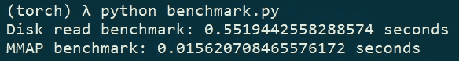

# 如何使用内存映射文件提升 PyTorch 数据集

> 原文：<https://towardsdatascience.com/how-to-boost-pytorch-dataset-using-memory-mapped-files-6893bff27b99>

## 本文将讨论实现使用内存映射文件的 PyTorch 数据集的原因和步骤

埃尔奥诺雷·凯梅尔在 [Unsplash](https://unsplash.com?utm_source=medium&utm_medium=referral) 上的照片

## 介绍

W 在训练神经网络时，最常见的速度瓶颈之一就是数据加载模块。如果我们通过网络传输数据，除了预取和缓存之外，没有其他简单的优化方法可以应用。

但是，如果数据在本地存储中，我们可以通过将整个数据集合并到一个文件中来优化文件读取操作，然后我们可以将该文件映射到主内存中，这样我们就不需要为每个文件读取进行昂贵的系统调用，而是让虚拟内存管理器来处理内存访问。

这段短暂旅程中的几站:

*   **什么是内存映射文件**
*   **什么是 PyTorch 数据集**
*   **实现我们的定制数据集**
*   **基准**
*   **结论**

## **什么是内存映射文件？**

我们称一个**内存映射文件**，这个文件的内容直接分配给 [**虚拟内存**](https://en.wikipedia.org/wiki/Virtual_memory) 的一个段，这样我们可以在那个段上执行任何操作，就像在当前进程中我们可以访问的主存的任何其他部分一样。

由于虚拟内存所代表的额外抽象层，我们可以映射到比我们机器的物理容量大得多的内存文件中。运行进程所需的内存段(称为 [**页**](https://en.wikipedia.org/wiki/Page_(computer_memory)) )由虚拟内存管理器从外部存储器中取出并自动复制到主内存中。

使用内存映射文件的好处:

*   **提高 I/O 性能**，通过系统调用的正常读/写操作比本地内存中的更改要慢得多
*   该文件以一种“懒惰”的方式加载，通常一次只加载一页，因此即使对于较大的文件，实际的 RAM 利用率也是最小的。

## **什么是 PyTorch 数据集**

Pytorch 提供了两个主要模块，用于在训练模型时处理数据管道:**数据集**和**数据加载器。**

**DataLoader** 主要用作数据集的包装器，它提供了许多可配置的选项，如批处理、采样、预取、混排等。，并抽象出大量的复杂性。

**数据集**是我们拥有大部分控制权的实际部分，我们实际上必须编写为训练过程提供数据的方式，这包括将样本加载到内存中并应用任何必要的转换。

从高层来看，我们要实现树函数:***【_ _ init _ _】、__len__，以及 _ _ getitem _ _***；我们将在下一节看到一个具体的例子。

## **实施我们的定制数据集**

接下来，我们将看到上述三个函数的实现。

最重要的部分在 *__init__，*中，我们将使用 **numpy** 库中的[***NP . memmap***](https://numpy.org/doc/stable/reference/generated/numpy.memmap.html)***()***函数来创建一个 **ndarray** ，它由映射到文件的内存缓冲区支持。

ndarray 将从一个 iterable(最好是一个**生成器**来填充，以将内存利用率保持在最低水平)，这样我们就可以保持对数据集支持的数据的形式和类型的高度适应性。我们还可以提供一个转换函数，当从数据集中检索时，该函数将应用于输入数据。

关于更全面的视图和其他示例，实际项目也在 Github 上[这里](https://github.com/DACUS1995/pytorch-mmap-dataset)。

还有两个*实用程序*类型的函数，我们在上面给出的代码中使用过。

## **基准**

为了展示一个性能提升的真实例子，我将内存映射数据集实现与以经典惰性方式读取文件的普通数据集实现进行了比较。这里使用的数据集由 350 个 jpg 图像组成。基准测试的代码可以在[这里](https://github.com/DACUS1995/pytorch-mmap-dataset/blob/main/benchmark.py)看到。

从下面的结果中，我们可以看到我们的数据集比普通的数据集快 30 倍以上:

数据集比较

## **结论**

本文中给出的实现决不是产品级的，但是其背后的思想是非常有效的，在使用中型到大型文件时，内存映射文件方法还有更多的用途。

感谢你的阅读，我希望你会发现这篇文章很有帮助，如果你想了解最新的编程和机器学习新闻以及一些优质的模因:)，你可以在 Twitter 上关注我[这里](https://twitter.com/SurdoiuT)或者在 LinkedIn 上联系[这里](https://www.linkedin.com/in/tudor-marian-surdoiu/)。

## 参考

*   【https://en.wikipedia.org/wiki/Memory-mapped_file 
*   [https://man7.org/linux/man-pages/man2/mmap.2.html](https://man7.org/linux/man-pages/man2/mmap.2.html)