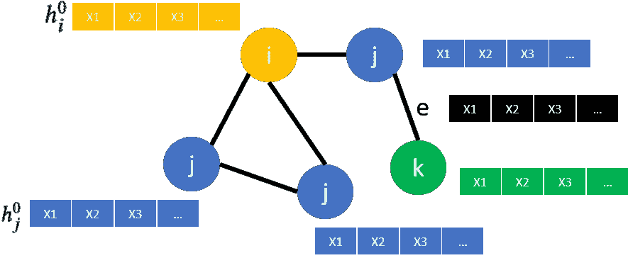
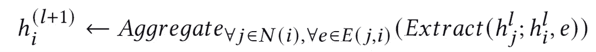
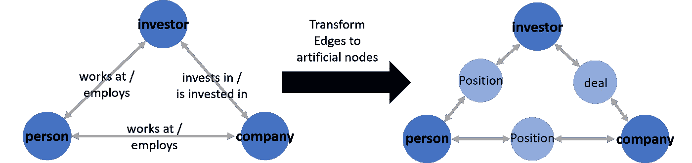
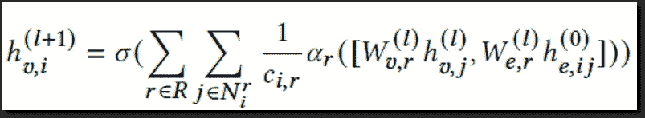
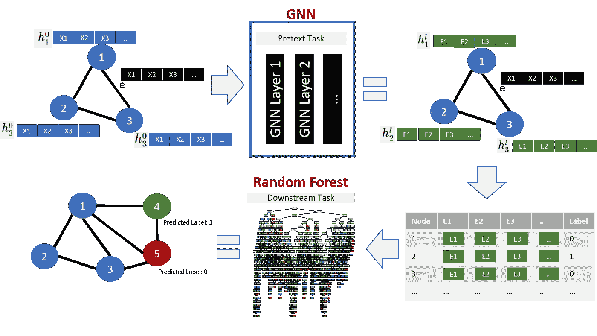

# 如何提升你的 GNN

> 原文：<https://towardsdatascience.com/how-to-boost-your-gnn-356f70086991>

## *改善图形神经网络的技巧和诀窍*

由[彼得罗·郑](https://unsplash.com/@pietrozj?utm_source=medium&utm_medium=referral)在 [Unsplash](https://unsplash.com?utm_source=medium&utm_medium=referral) 上拍摄的照片

图形神经网络(GNN)是新的酷小子。它的名字听起来很花哨，数学很先进，GNNs 在各种任务上表现出最先进的性能。

GNNs 提供了一种在图结构数据上使用深度学习技术的方法。图结构数据无处不在:从化学(如分子图)，到社交媒体(如社交网络)，还有金融投资(如风险投资网络)。

在我的硕士论文期间，我在一个由投资者、创业公司和个人组成的投资网络上，使用 GNNs 预测了创业公司的未来融资轮次。当我实现 GNN 模型(R-GCN 和 HGT)时，基线随机森林模型已经相当强大(AUC = 0.69)。

我很高兴看到先进的 GNN 将如何提高我的成绩。令我惊讶的是，GNN 模型总是落后于基线模型的表现。增加层数和隐藏尺寸没有帮助。所以我开始研究，发现我并不是唯一一个有 GNN 关系问题的人。

如果这听起来对你来说很熟悉(很可能是这样，否则你为什么要费心阅读这篇枯燥的博客文章)，我可能有一些提高你的 GNN 模型性能的技巧。

# 什么是 GNNs 来着？

在我们讨论如何改进 gnn 之前，让我们快速回顾一下它们是如何工作的。关于图形神经网络的伟大而深入的介绍，请查看来自 [DeepFindr](https://www.youtube.com/channel/UCScjF2g0_ZNy0Yv3KbsbR7Q) (或一些 literature⁴)的 Youtube 频道

假设我们有一个简单的图表，如下所示:

包含节点特征的图(图片由作者提供，改编自 DeepFindr)

**图**
图包含节点(I，j，k)和连接这些节点的边(e)。此外，该图还包括每个节点(X1，…)的节点特征，可能还包括每条边(黑色)。目标节点用黄色表示，它的 1 跳邻居用蓝色表示，2 跳邻居用绿色表示。包括不同类型节点的图被称为“异构”图，就像我们的例子一样。

**消息传递**
节点在步骤 0 的嵌入只是它的特征向量(由特征 X1，X2……组成)。为了获得我们的目标节点 I(黄色)的新的(l + 1)节点嵌入 h，我们从它的相邻节点 j(蓝色)、它自己的表示以及潜在的边特征 e(黑色)中提取所有嵌入，并且聚集这些信息。这显示在下面的公式中。但是，请记住，目前大多数著名的 GNN 架构都没有利用边缘 features⁵.之后，我们可以将这些新的节点嵌入用于各种任务，例如节点分类、链路预测或图形分类。

通用 GNN 层公式

# GNNs 的问题

**在实践中** 最近在各个领域的许多研究发现，GNN 模型并没有提供预期的 performance⁵ ⁶ ⁷.当研究人员将它们与更简单的基于树的基线模型进行比较时，GNNs 无法超越甚至匹配基线。

其他研究人员对 GNNs⁸.有时表现不佳提供了理论上的解释根据他们的实验，GNNs 仅执行特征去噪，而不能学习非线性流形。因此，他们主张将 GNNs 视为图学习模型的一种机制(例如，用于特征去噪),而不是一个完整的端到端模型。

# 修理

为了弥补这些缺点，提高你的 GNN，我找到了 3 个主要的技巧/想法:

1.  *利用 GNN 中的边缘特征*
2.  *GNNs 自我监督预培训*
3.  *单独托辞&下游任务*

让我们来详细了解一下。

# 利用边缘特征

利用边要素的想法在很大程度上取决于您正在处理的数据类型。如果您的数据包含(多维)边要素，利用边要素可以提高模型的性能。

然而，很少建立的 GNN 模型架构支持多维边缘 features⁵.我使用的一个简单的工作方法是创建人工节点:

**人工节点** 通过使用人工节点，你可以继续使用你之前使用的相同模型。我们唯一要改变的是图表本身，它会变得更复杂一点。不是边保存边特征，而是每条边将成为自身的一个节点(浅蓝色)连接到原始的深蓝色节点。

添加人工节点前后的投资网络元图(图片由作者提供)

这样，您可以通过将边要素作为人造节点的节点要素传递给模型来间接利用边要素。如果边要素与任务相关，这可以提高模型的性能，但也会增加复杂性。您可能需要考虑向模型中添加更多的 GNN 图层(以允许更多的邻居跃点)。人工结节导致 AUC 增加约 2%。

**你自己的 Edge 特性架构** 你也可以创建自己的 GNN 层实现。这听起来很难；但是，如果你使用一个图形学习库，比如 [DGL](https://www.dgl.ai/) ，这肯定是可行的。我建议您使用现有的 GNN 实现(见[这里](https://docs.dgl.ai/en/0.6.x/api/python/nn.pytorch.html))并根据您的需要进行调整。

作为一个例子，我基于 GAT ⁰和 R-GCN 的现有思想制定了自己的实现，我称之为 Edge-GCN:

我自己的边缘-GCN 公式(v 代表节点，e 代表边缘，sigma 是非线性激活函数[在这种情况下是 RELU]，alpha 是每个关系类型的学习注意力分数，c 是归一化常数)

边 GCN 使用注意机制来学习所有不同关系类型的边相对于节点特征的重要性。如果您对 DGL 的实施感兴趣，请联系我。E-GCN 架构将 GNN 模型的 AUC 结果提高了约 2%(人造节点也是如此)。

# 自我监督的预培训

这可能是提高你的 GNN 性能的最重要的技巧。尽管预训练 GNNs 已经在理论上进行了探索，但在实践中的应用仍然是 rare⁶ ⁷ ⁸.

这个想法与计算机视觉和自然语言处理领域的概念非常相似。以语言模型 BERT 为例，它被训练来预测句子中的屏蔽词(这是自我监督的，因为它不依赖于标记的数据)。我们通常不太关心预测屏蔽词的具体任务。然而，由于模型了解特定单词如何相互关联，因此得到的单词嵌入对于许多不同的任务非常有用。

**自我监督**
我们想要使用自我监督任务来预训练 GNN 模型节点嵌入。在有噪声的标签的情况下，这可能是特别有益的，因为自我监督过程提供了更多的“有标签的”例子(因为我们不需要为预训练提供标签)，并且可能也不容易有噪声。

如果我们的最终目标是对节点进行分类，我们可以在整个图上使用链接预测作为自我监督的预训练任务。在链接预测中，我们试图预测两个节点之间是否存在边(=链接)。因此，我们训练 GNN 来区分图中的真实边和人工引入的假边(“用于链接预测的负采样”)。由于我们只是简单地添加伪边并移除图中现有节点之间的真实边，因此我们不依赖任何标记的数据。接下来，我们可以使用从链路预测 GNN 模型得到的节点嵌入作为另一个节点分类模型的输入。

将自我监督的预训练管道添加到模型中，其 AUC 分数惊人地增加了 14%，使这成为最有影响力的技巧。

# 单独的借口和下游任务

到目前为止，我们只讨论了在自我监督的任务(“借口”)上对 GNN 进行预训练，以及在最终(“下游”)任务上使用相同的 GNN 架构。然而，我们不必为这两个任务使用相同的模型架构。您还可以组合不同的 GNN 架构。或者更有希望的是:

**两全其美** 如前所述，GNN 层可能无法在各种情况下高效学习。因此，我们可以使用 GNN 模型，通过自我监督的预训练来创建节点嵌入，并将这些嵌入传递给经典的机器学习算法或完全连接的神经网络层，以用于最终的下游任务。这种架构可以用于许多不同的下游任务，从图形分类到节点分类和回归。

该模型将受益于将访问图中包含的所有信息的能力与非线性流形学习属性相结合。此外，该模型继承了更简单的机器学习算法的一些好处，如减少训练时间和更好的可解释性。在我们的实验中，基于树的模型(例如随机森林)对于节点分类的下游任务显示出特别强的性能，因此可以从那里开始。

接下来，您可以看到包含所有三个提出的想法的最终管道的图形概述:

最终管道使用边缘特征、自我监督预训练和下游随机森林模型对图中的节点进行分类(X 表示特征，E 表示学习嵌入，h 表示隐藏节点表示)(图片由作者提供)

这种架构代表了我们的最终模型，AUC 得分为 78.1(另一个+ 1.5%)，或以 AUC 衡量的总性能增加 17%(基础 R-GCN 模型:AUC = 66.6)。

# 结论

在这篇博文中，我们讨论了图形神经网络模型的缺点以及提高模型性能的三个主要技巧。结合这些技巧，我能够将我的最终 GNN 模型的 AUC 提高 17%(其他指标甚至更高)。

首先，如果您的数据包含边特征，并且您认为它们对最终的预测任务很有帮助，那么您可以尝试利用边特征。第二，使用自我监督的目标预先训练 GNN 模型通常有益于最终模型的性能。它可以增加训练样本的数量，有时还可以减少固有噪声。第三，测试前文本和最终预测任务的不同架构可以提高模型的预测能力。

这些技巧对你有用吗？如果你有任何补充或反馈，请在评论区告诉我！GNN 调音快乐！

# 参考

[1] Michael Schlichtkrull、Thomas N. Kipf、Peter Bloem、Rianne van den Berg、Ivan Titov 和 Max Welling。用图卷积网络对关系数据建模，2017。

[2]胡，董，王宽三，。异构图形转换器，2020。

[3][https://deepfindr.com](https://deepfindr.com/understanding-graph-neural-networks-part-2-3/)，2020 年。

[4]达维德·巴丘、费德里科·埃里卡、阿莱西奥·米凯利亚、马尔科·波德达。图形深度学习的温和介绍，2020

[5]杨。NENN:在图形神经网络中结合节点和边特征，2020

[6]费德里科·埃里卡、马尔科·波德达、达维德·巴丘和阿莱西奥·米凯利。用于图形分类的图形神经网络的公平比较，2020。

[7]克莱门特·加斯托、西奥菲勒·卡尼尔和让-米歇尔·达勒。创业融资成功的外部因素的不同重要性:早期阶段的竞争和成长期的网络，2019。

[8]蒋德军，吴振兴，谢长玉，，陈，廖奔，王哲，，曹东升，，侯廷军.图形神经网络可以为药物发现学习更好的分子表示吗？2021.

[9]黄 NT 和前原诚司。重温图形神经网络:我们所拥有的只是低通滤波器，2019。

[10]Petar veli kovi、Guillem Cucurull、Arantxa Casanova、Adriana Romero、Pietro Liò和 Yoshua Bengio。图注意力网络，2018。

11 卡罗·哈普雷希特。使用图形神经网络预测未来融资轮次，2021

[12]华伟·胡、、约瑟夫·戈麦斯、马林卡·兹特尼克、珀西·梁、维贾伊·潘德和朱尔·莱斯科维奇。预训练图神经网络的策略，2019。

[13] Jacob Devlin，Chang Ming-Wei，Kenton Lee 和 Kristina Toutanova。BERT:面向语言理解的深度双向转换器预训练，2018。