# 如何建立全超参数整合的贝叶斯岭回归模型

> 原文：<https://towardsdatascience.com/how-to-build-a-bayesian-ridge-regression-model-with-full-hyperparameter-integration-f4ac2bdaf329>

## 我们如何处理控制正则化强度的超参数？

在这篇博文中，我们将描述一种贝叶斯岭回归算法，其中代表正则化强度的超参数被完全积分。在[*【github.com/rnburn/bbai】*](https://github.com/rnburn/bbai)*有一个实现。*

设 **θ** = (σ， **w** )表示具有权重 **w** 和方差σ的正态分布误差的线性回归模型的参数。

如果 **X** 表示具有 p 个回归量
和 n 行的满秩 n×p 矩阵，则 **θ** 指定可能的
目标值 **y** 的概率分布

假设我们观察到 **y** 并假设 **y** 是由未知参数的线性模型产生的。贝叶斯推理方法寻求量化我们对给定观测值的未知参数 **θ** 的信念。

应用贝叶斯定理，我们可以将概率改写为

我们指的是

*   P( **θ** | **y** )作为后验分布
*   P( **y** | **θ** )作为似然函数
*   P( **θ** )先验分布

先验分布描述了我们在观察到 **y** 之前对 **θ** 的信念，后验分布描述了我们在观察到 **y** 之后更新的信念。

假设先验分布可以表示为

其中 h(⋅，η) 表示由我们称之为超参数η参数化的概率分布族
。

传统的贝叶斯线性回归方法使用了所谓的*共轭先验*。一族先验 h(⋅，η)是共轭的，如果后验也属于该族

共轭先验在数学上是方便的，因为连续观测可以被视为对分布族的参数进行连续更新，但是要求 h(⋅η是共轭的是一个强假设。

注意:关于与其他贝叶斯算法的更详细的比较，请参见附录 A。

我们将描述一种算法，其中

1.  先验被选择为收缩 **w** ，反映了先前的假设，即 **w** 不是
    预测性的，并且对于其他参数近似为*非信息性的*。
2.  我们在超参数上完全积分，因此不需要任意选择η。

让我们首先考虑一下，先验无信息意味着什么。

# 如何挑选无信息的前科？

注意:这里对非信息先验的介绍紧跟 Box & Tiao 的书[统计分析中的贝叶斯推断](https://onlinelibrary.wiley.com/doi/book/10.1002/9781118033197)的第 2 章。

假设 **y** 是均值为 0 但方差未知的正态分布产生的数据。设σ表示标准差，ℓ表示似然函数

假设我们在σ上施加统一的先验，使得后验概率为

累积分布函数是

其中 N 是某个归一化常数。

但是现在让我们假设我们用方差来代替标准差。将 u=σ代入累积分布函数，我们得到

因此，我们看到选择σ上的一致先验等价于选择不适当的先验

超方差。一般来说，如果 u=φ(θ **)** 是参数化似然函数的另一种方式，其中φ是某种单调的一对一函数。那么 u 上的一致先验等价于选择一个先验

超过θ。

那么，如果选择对参数化敏感，什么时候使用统一的先验有意义呢？

让我们考虑观察值 **y** ^⊤ **y** 的变化是如何影响可能性的。

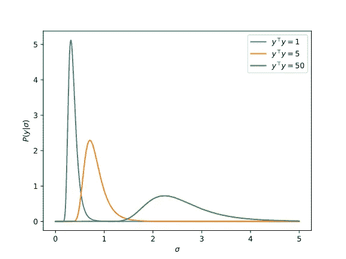

具有零均值、
n=10 和不同的 **y** ^⊤ **y** 值的正态分布数据的标准差的似然函数。

正如我们从图中看到的，随着 **y** ^⊤ **y** 的增加，似然函数的形状发生了变化:它变得不那么尖锐并且更加分散。

注意，我们可以将似然函数改写为

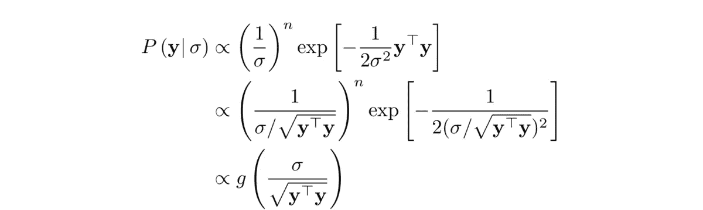

在哪里

因此，在参数 log σ中，可能性具有以下形式

在哪里

我们说似然函数是对数σ中的*数据转换*,因为除了位置和观察值仅用于移动曲线之外，关于似然曲线的一切都是已知的。

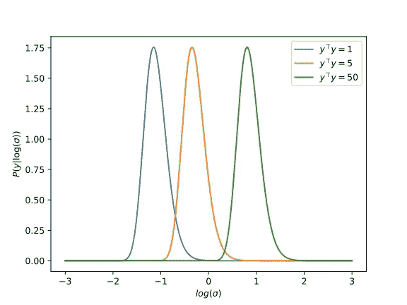

均值为零、
n=10、 **y** ^⊤ **y** 不同值的正态分布数据的对数标准差的似然函数。

当似然函数是参数中的转换数据时，对非信息先验使用统一函数是有意义的。在观察数据之前，我们没有理由选择一个参数范围[a，b]而不是另一个相同宽度的范围[t + a，t + b],因为如果观察到的数据平移 t，它们相对于似然曲线的位置是相等的。

现在，让我们回到挑选我们的前科。

# 挑选正则化贝叶斯线性回归先验

对于参数σ，我们使用无信息先验

这相当于在参数 log σ上使用统一的先验。对于 **w** ，我们想要一个收缩权重的信息先验，反映权重不可预测的先验信念。让η表示控制
收缩程度的超参数。然后我们使用协方差矩阵为(σ/λ_η) **I** 的球形正态分布

请注意，我们还没有描述η如何参数化λ，我们还将对η进行积分，因此我们另外有一个η的先验(称为超先验),因此

我们的目标是先验 P(η)是无信息的。所以我们想知道:在什么参数化中，P( **y** |η)会被数据翻译吗？

# 收缩先验如何参数化？

在考虑如何参数化λ之前，我们先来刻画一下λ的似然函数。

展开被积函数，我们有

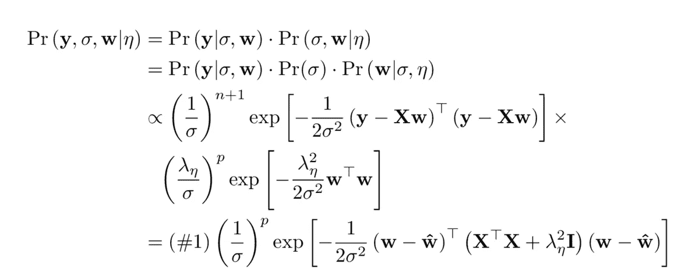

在哪里

和

注意#1 与 **w** 无关，因此关于 **w** 的积分等同于在非标准化高斯上的积分。

注意:回想一下归一化高斯积分的公式

因此，

接下来让我们考虑σ上的积分。

放

然后我们可以重写

在改变变量之后，我们可以把关于σ的积分表示为伽马函数的一种形式。

考虑一个积分

放

然后

和

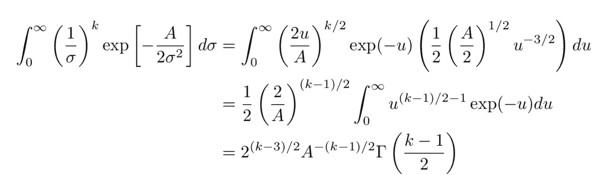

其中γ表示伽马函数

因此，我们可以写

设 **U** 、**σ**和 **V** 表示 **X**
的奇异值分解，从而

让ξ₁，ξ₂，…表示**σ**的非零对角线元素。放**λ**=**σ**^⊤**σ**。那么**λ**是一个对角矩阵，有ξ₁，ξ₂，…和

注意:为了实现我们的算法，我们将只需要矩阵 **V** 和**σ**的非零对角元素，这可以通过部分奇异值分解来有效地计算。参见 LAPACK 函数 [gesdd](http://www.netlib.org/lapack/explore-html/d1/d7e/group__double_g_esing_gad8e0f1c83a78d3d4858eaaa88a1c5ab1.html) 。

放

那么我们可以把 h 和 g 改写成

和

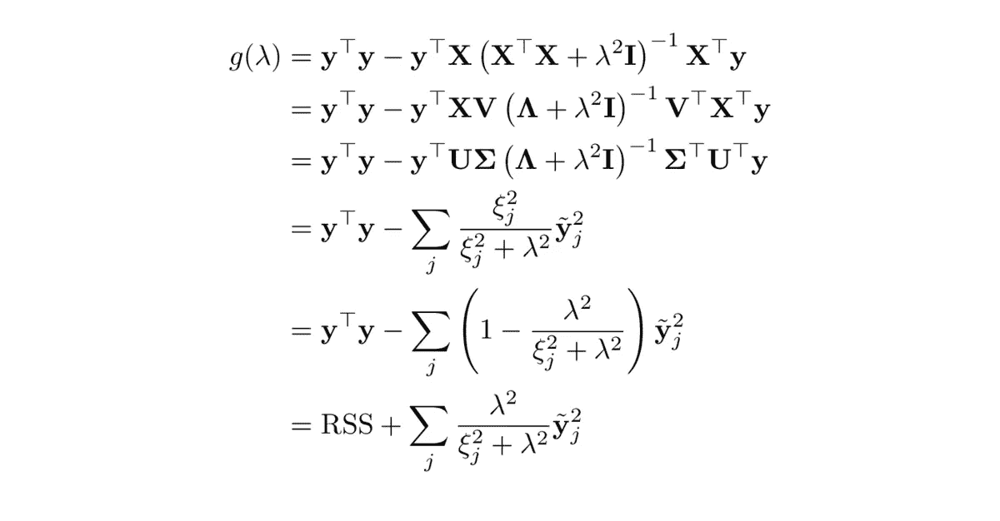

这里我们采用术语

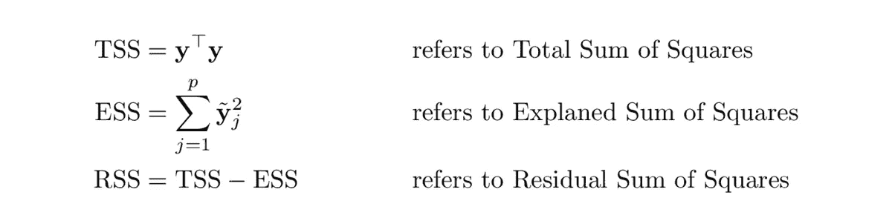

放

那么 r 是范围从 0 到 1 的单调递增函数，
我们可以认为 r 是特征向量的平均收缩因子。

现在，让我们通过用平均值替换单个特征向量收缩来进行近似:

将近似值代入似然性，我们就得到

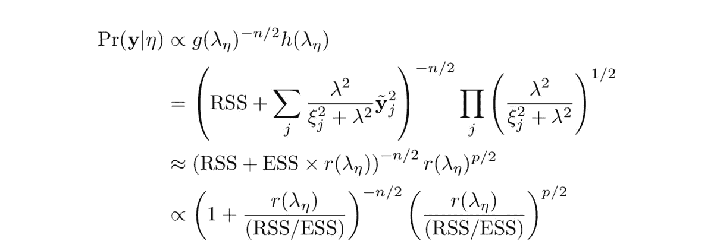

我们看到近似的可能性可以表示为

因此，这种可能性大约是对数 r(λ)中的数据转换。

因此，如果我们
让η代表平均收缩率，我们可以获得近似无信息先验

并使用超级优先级

注意:为了求 r 的倒数，我们可以使用一个标准的求根算法。

对 r(λ)求导得到

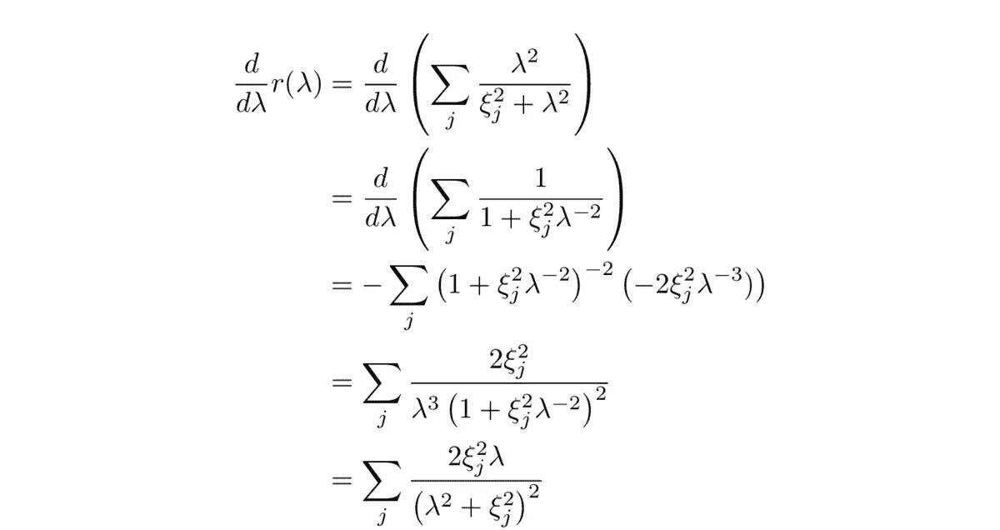

利用导数和牛顿算法的变体，我们可以快速迭代得到 r⁻ (η)的解。

# 做预测

拟合贝叶斯模型的结果就是后验分布 P( **θ** | **y** )。让我们考虑在给定一个新的数据点 **x** 的情况下，如何使用该分布进行预测。

我们将从计算预期目标值开始

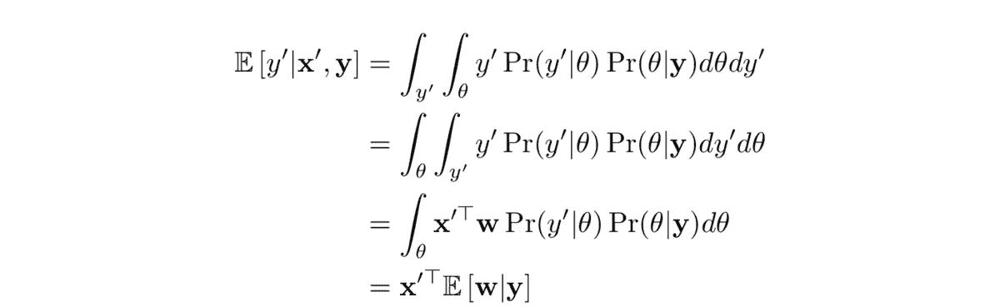

和

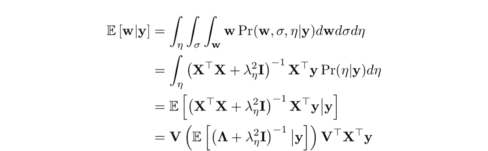

注意:为了计算包含η的表达式的期望值，我们需要对后验分布 P(η| **y** )进行积分。我们没有积分的解析形式，但是我们可以用一个[自适应积分](https://en.wikipedia.org/wiki/Adaptive_quadrature)来高效精确地积分。

为了计算方差，我们有

和

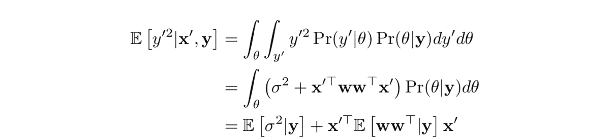

从 E[σ | **y** ]开始，回想一下

和

因此，

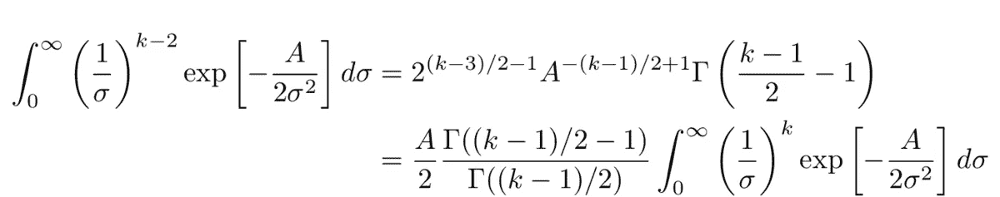

注意:伽玛函数具有属性

所以，

和

因此

对于 e[**w**w**^t|**y]，我们有

# 算法概述

我们已经看到，计算关于预测的统计数据涉及对后验分布 P(η| **y** )的积分。我们将简要地勾画出计算这种积分的算法。我们描述它只是为了计算 **w** 的期望值。其他期望值可以通过简单的修改来计算。

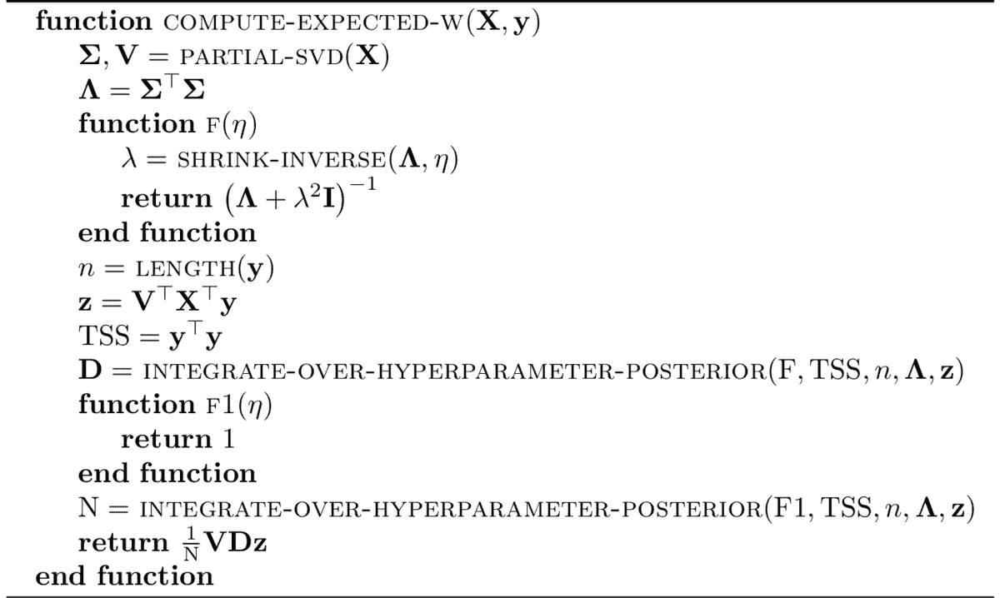

过程 SHRINK-INVERSE 应用牛顿算法用 r 和 r '求根来计算 r⁻。

为了计算超参数后验积分，我们利用自适应求积算法。在不同的求值点上，用加权和来近似积分。

一般来说，使用的评估点数越多，近似值就越精确。自适应求积算法比较不同细化级别的积分近似值，以逼近误差，并增加评估点数，直到达到所需的容差。

注意:我们省略了所使用的求积算法的细节，仅在较高层次上进行描述。有关具体求积算法的更多信息，请参考[高斯-埃尔米特求积法](https://en.wikipedia.org/wiki/Gauss%E2%80%93Hermite_quadrature)和[双曲正切法](https://en.wikipedia.org/wiki/Tanh-sinh_quadrature)。

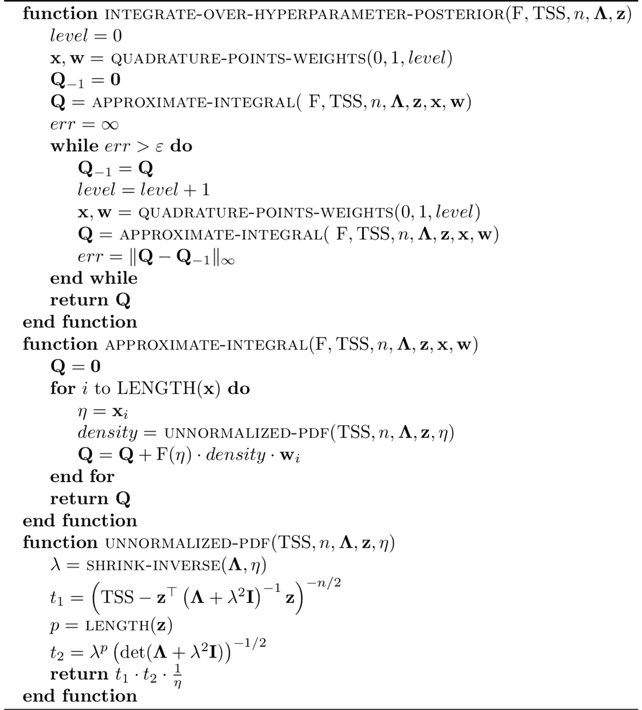

# 实验结果

为了更好地理解算法在实践中是如何工作的，我们将设置一个小的
实验数据集，并将贝叶斯算法的模型拟合与普通最小二乘法(OLS)和岭回归模型拟合进行比较，以便最小化数据集的留一交叉验证(LOOCV)的误差。

实验的全部源代码可以在 github.com/rnburn/bbai/example/03-bayesian.py 的 T2 获得。

## 生成数据集

我们将从设置数据集开始。对于设计矩阵，我们将使用均值为零的高斯和协方差矩阵 **K** 随机生成一个 20 乘 10 的矩阵 **X** ，其中

我们将从具有单位方差的球形高斯中生成具有 10 个元素的权重向量，并且我们将重新调整权重，使得信号方差等于 1。

那我们就开始吧

其中 **ε** 是从具有单位方差的高斯分布中提取的 20 个元素的向量。

下面是设置数据集的 Python 代码。

## 拟合模型

现在，我们将拟合贝叶斯岭回归模型、OLS 模型和具有正则化强度设置的岭回归模型，以便最小化 LOOCV 的均方误差。

我们可以使用以下等式来测量每个模型的样本外误差方差

这样做给了我们

模型的样本外性能

我们看到贝叶斯和岭回归模型都能够防止过度拟合，并获得更好的样本外结果。

最后，我们将比较贝叶斯模型和 OLS 模型的估计噪声方差。

这给了我们

σ的模型估计

# 结论

当将贝叶斯方法应用于岭回归时，我们需要解决:我们如何处理控制正则化强度的超参数？

一种选择是使用点估计，其中超参数的值被选择来优化一些度量(例如，可能性或交叉验证)。但是这种方法违背了使用概率分布表示参数可信度的贝叶斯方法，特别是如果可能性在超参数的特定值附近不是很强的峰值。

通常使用的另一种选择是应用超参数先验的已知分布(例如半柯西分布)。这种方法给出了超参数的后验分布，并且在实践中可以很好地工作，但是先验分布的选择有些武断。

在这篇博客文章中，我们展示了一种不同的方法，我们选择了一个超参数先验分布，以便近似无信息。我们开发了在给定非信息先验的情况下计算标准预测统计的算法，并且我们通过一个小例子证明了它比使用选择的超参数的点估计来优化留一交叉验证更有利。

# 附录 A:与其他贝叶斯算法的比较

这里，我们将对 scikit-learn 的[贝叶斯岭回归](https://scikit-learn.org/stable/modules/linear_model.html#bayesian-ridge-regression)算法做一个简单的比较。

Scikit-learn 的算法利用共轭先验，因此仅限于使用伽马先验，这需要四个任意选择的小值超参数。此外，它需要参数α和λ的初始值，然后根据数据进行更新。

算法的性能可能对这些参数值的选择很敏感，scikit-learn 的文档提供了一个曲线拟合[示例](https://scikit-learn.org/stable/auto_examples/linear_model/plot_bayesian_ridge_curvefit.html)，其中默认值表现不佳。

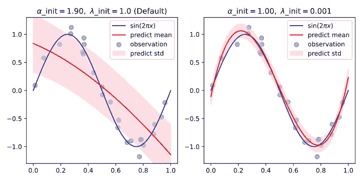

相比之下，我们提出的算法不需要初始参数；并且因为超参数被积分，表现差的值对后验概率质量贡献很小。

我们可以看到，我们的方法处理曲线拟合的例子，不需要任何调整。

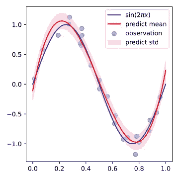

完整的曲线拟合对比示例可在 github.com/rnburn/bbai/blob/master/example/04-curve-fitting 的[获得。](https://github.com/rnburn/bbai/blob/master/example/04-curve-fitting.ipynb)

*本帖最初发表于*[*buildingblock.ai/bayesian-ridge-regression*](https://buildingblock.ai/bayesian-ridge-regression)*。*