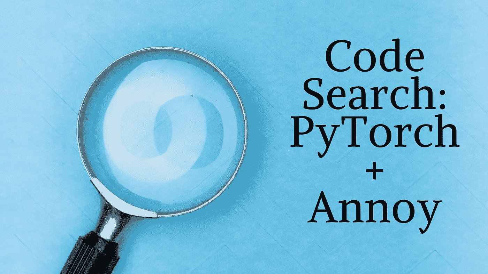
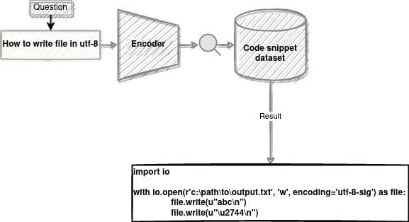
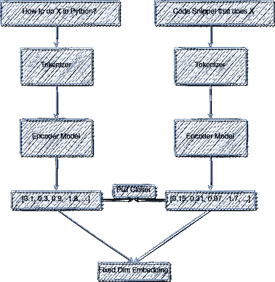
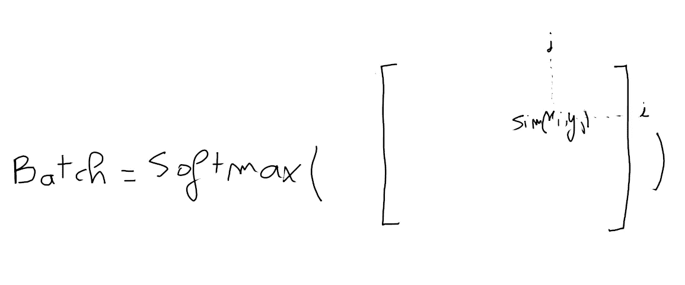

# 如何建立一个代码搜索工具使用 PyTorch 变压器和骚扰

> 原文：<https://towardsdatascience.com/how-to-build-a-code-search-tool-using-pytorch-transformers-and-annoy-29bc3920e6c7>

## 利用联合文本和代码嵌入进行搜索。



根据 [Unsplash](https://unsplash.com/s/photos/search?utm_source=unsplash&utm_medium=referral&utm_content=creditCopyText) 上[马库斯·温克勒](https://unsplash.com/@markuswinkler?utm_source=unsplash&utm_medium=referral&utm_content=creditCopyText)的照片修改

你有没有因为懒得自己写而在 google 上找一段代码片段？我们大多数人都是！那么从头开始构建自己的**代码**搜索工具怎么样？这就是我们将在这个项目中努力做的事情。我们将使用 StackOverflow 问题和相应代码样本的并行数据集来构建一个系统，该系统能够根据现有代码片段与自然语言表达的搜索查询的“匹配”程度来对它们进行排序。

如果你想尝试这种方法，在博客的末尾有一个 Colab 笔记本链接。

# 系统描述:



系统图:作者照片

我们试图建立一个系统，它能够接受用自然语言表达的问题，然后从成千上万的 Python 代码片段中返回与这个问题最匹配的代码片段。

# 它是如何工作的？

该系统将基于代码片段的学习嵌入和“如何做”问题的嵌入。搜索部分将使用 Annoy，这是 Python/C++中的近似最近邻实现。

## 数据:

我们将使用[stat QC](https://github.com/LittleYUYU/StackOverflow-Question-Code-Dataset/)数据集，其中有从堆栈溢出中自动挖掘的(问题，代码片段)对。

数据集的样本如下所示:

问题:**如何使用 python 从 MongoDB 中的 10 亿个文档中获取随机的单个文档？**

代码:

```
import randomcollection = mongodb[""collection_name""]rand = random.random()  # rand will be a floating point between 0 to 1.
random_record = collection.find_one({ 'random' => { '$gte' => rand } })
```

数据集有 85，294 个单代码片段答案和 60，083 个多代码片段答案。

## 预处理:

代码和问题都是字符串，所以我们需要在将它们输入模型之前对它们进行标记化。因为我们是在处理代码，所以我们不能使用常规的预先训练好的记号赋予器，因此必须自己构建。

首先，我们需要我们的标记器来拆分特殊字符，如“_”或“=”，并正确地拆分 camelCase 变量名。

我们分两步走:

*   在 camelCase 中，在特殊字符周围添加空格，在单词周围添加空格。
*   用空格预标记训练一个拥抱脸标记器。

这将产生以下结果:

**问题- >**

如何使用 python 从 MongoDB 中的 10 亿个文档中获取一个随机的单个文档？

**标记化问题- >**

['[CLS]'，'如何'，'到'，'得到'，' a '，'随机'，'单个'，'文档'，'从'，' 1 '，'比尔'，' # #离子'，'文档'，'在'，'蒙戈'，' db '，'使用'，' python '，'？'，'[SEP]']

**代码片段- >**

```
class MyLabel(Label): pass    
class AwesomeApp(App):
    def build(self):
        return MyLabel()
```

**令牌化代码->**

['[CLS]'，' class '，' my '，' label '，'('，' label '，')'，':'，' pass '，' class '，' awesome '，' app '，'('，' app '，')'，':'，' def '，' build '，'('，' self '，')'，':'，' return '，' my '，' label '，'('，')'，'，'，'[SEP]']

## ML 部分:



系统的 ML 部分。作者图解。

在这一部分中，我们将训练一个模型，它能够将一个字符串(代码片段或问题)映射到一个大小为 256 的固定维度向量。我们将应用于该输出向量的约束是，我们希望问题的向量与其对应的代码片段的向量之间的相似性高，而在所有其他情况下具有低的相似性。

我们使用双线性相似性度量:


其中 W 是可学习的参数。详见“[通用音频表征对比学习](https://arxiv.org/abs/2010.10915)”。

为了学习有用的嵌入，我们需要正面的例子，它们是成对的“如何做”问题和它们相应的代码片段。我们还需要一个反例，它将是该批中的所有其他向量。这意味着正对的表示将被推到更高的相似性得分，而我们将样本向量和批中所有不相关向量之间的相似性引导到更低的值。



x_i 和 y_j 是该批的嵌入向量。

我们希望批次矩阵尽可能接近恒等式。

这种进行对比学习的方法摘自上面提到的论文。它允许在某种程度上获得“自由”的反例，因为它们已经被计算为批处理的一部分。与其他方法(如三元组丢失)相比，它还有一个很大的优势，因为我们可以获得 batch_size -1 个负样本，而不是每个正样本只有一个负样本，这迫使编码器学习更多有区别的嵌入。

将文本输入映射到固定的 dim 向量的全部意义在于，它通过使用近似最近邻算法使搜索部分更加有效。

## 搜索部分:

一旦我们将所有的代码片段编码成向量，并建立一个模型以同样的方式编码一个新问题，我们就可以开始系统的搜索部分了。我们将使用一个名为[的库来骚扰](https://github.com/spotify/annoy)。

使用 Annoy 将允许我们在 O(log(n))时间内查询 n 个代码片段的数据集。

```
# We define the Annoy Indext = AnnoyIndex(len(samples[0]["vector"]), "angular")# We add all the vectors to the indexfor i, sample in enumerate(samples):
    t.add_item(i, sample["vector"])# We then build the trees for the approximate searcht.build(100)# We can use it to query the NN of a question vectorindexes = t.get_nns_by_vector(search_vector, n=3, search_k=-1)
```

# 搜索查询的示例结果:

**如何转义 HTML 特殊字符？**

```
# Search Result 1 -->
raw_html2 = raw_html.replace('\\n', '')

# Search Result 2 -->
def escape(htmlstring):
    escapes = {'\"': '&quot;',
               '\'': '&#39;',
               '<': '&lt;',
               '>': '&gt;'}
    # This is done first to prevent escaping other escapes.
    htmlstring = htmlstring.replace('&', '&amp;')
    for seq, esc in escapes.iteritems():
        htmlstring = htmlstring.replace(seq, esc)
    return htmlstring

# Search Result 3 -->
mytext.replace(r"\r\n", r"\n")

# Query encoded in 0.010133743286132812 seconds
# Search results found in in 0.00034046173095703125 seconds
```

**如何唯一化列表？**

```
# Search Result 1 -->
seen = set()
L = []
if 'some_item' not in seen:
                L.append('some_item')
                seen.add('some_item')

# Search Result 2 -->
def is_duplicate(a,b):
        if a['name'] == b['name'] and a['cost'] == b['cost'] and abs(int(a['cost']-b['cost'])) < 2:
                return True
        return False

newlist = []
for a in oldlist:
        isdupe = False
        for b in newlist:
                if is_duplicate(a,b):
                        isdupe = True
                        break
        if not isdupe:
                newlist.append(a)

# Search Result 3 -->
>>> L = [2, 1, 4, 3, 5, 1, 2, 1, 1, 6, 5]
>>> S = set()
>>> M = []
>>> for e in L:
...     if e in S:
...         continue
...     S.add(e)
...     M.append(e)
... 
>>> M
[2, 1, 4, 3, 5, 6]

M = list(set(L))

# Query encoded in 0.006329536437988281 seconds
# Search results found in in 0.0003654956817626953 seconds 
```

我们可以看到，这个系统可以在几毫秒内，从 145，000 个可能的答案中找到相关的代码片段。

# 结论

在这个小项目中，我们训练了一个 transformer 模型来预测文本和代码的嵌入。这些嵌入然后被用来建立一个 KNN 搜索索引使用近似最近邻在苦恼。通过使用更大的问题/代码数据集或通过对不同的对比学习策略进行基准测试，这种方法还可以进一步改进。

您可以通过克隆存储库来运行自己的查询:

*   [https://github.com/CVxTz/code_search](https://github.com/CVxTz/code_search)

或者通过运行这个 colab 笔记本:

*   [https://colab . research . Google . com/drive/1 gagzoxivutyagxqol-7ny v2-AV _ ol VFD？usp =分享](https://colab.research.google.com/drive/1GagzOxiVuTYaGxqOL-7nYv2-AV_OlVfd?usp=sharing)

参考资料:

*   [通用音频表征的对比学习](https://arxiv.org/abs/2010.10915)
*   [https://github.com/spotify/annoy](https://github.com/spotify/annoy)