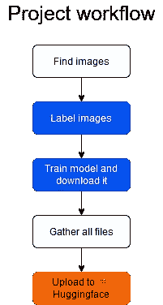
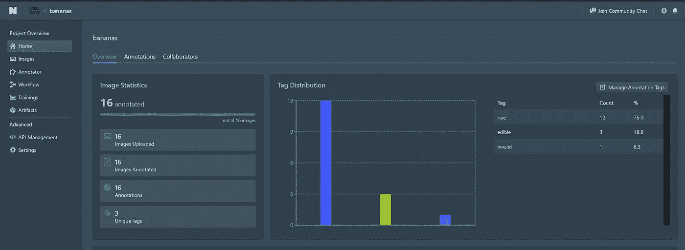
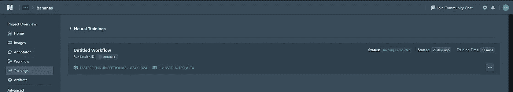
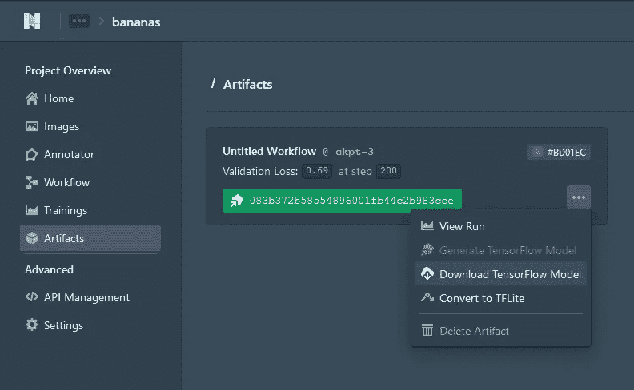
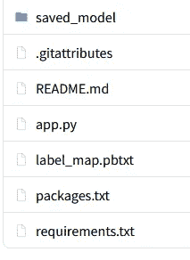
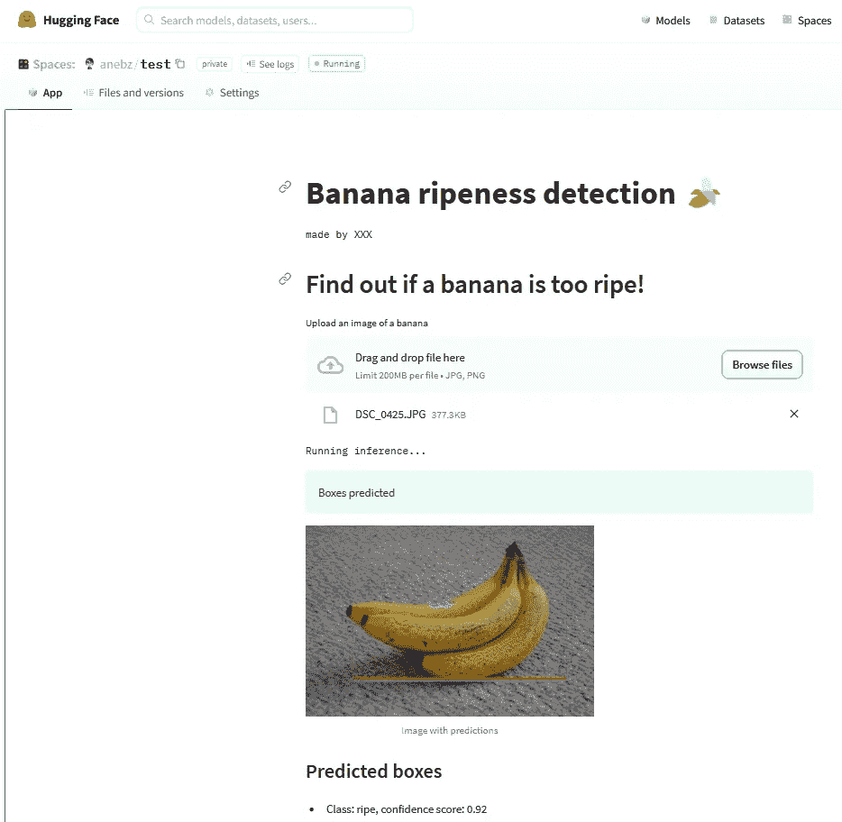

# 如何不用代码轻松构建一个计算机视觉项目

> 原文：<https://towardsdatascience.com/how-to-build-a-computer-vision-project-easy-and-without-code-d6fb0462f41>

## 一个初学者友好的，无代码的水果探测器解决方案。还有，把模型上传到网上给大家看看！

凯文·克罗斯比在 [Unsplash](https://unsplash.com?utm_source=medium&utm_medium=referral) 上拍摄的照片

## ⚠️读了我在⚠️博客中的[原帖](https://anebz.eu/nocode-computer-vision-project)

要不要建个 app 检测什么东西？猫对狗，检测一个水果有多熟，在图像中寻找品牌？

你想仅仅标记一些图像，制作一个模型并测试它而不需要做很多工作吗？

如果你的答案是肯定的，那么这篇文章是给你的！

> 我将向您展示如何为您的探测器构建一个应用程序，并将其放入互联网供所有人查看。

最后，你会有这样的东西给你的同事和朋友看:🤗[https://huggingface.co/spaces/Kili/plastic_in_river](https://huggingface.co/spaces/Kili/plastic_in_river)

您将能够上传一个测试图像，模型将返回盒子和标签。太神奇了！⚡️

> 免责声明:你需要在你的电脑上安装 **git** 来上传文件到 HuggingFace Spaces。如果没有，也不用担心！它非常容易安装。跟着这个:[https://git-scm.com/downloads](https://git-scm.com/downloads)

这将是该项目的工作流程:

项目的工作流程

1.  首先，你必须为你的项目收集图像。要不要从长颈鹿身上检测出斑马？获取两只动物的图像。无论你想探测什么，你都需要图像。这个点在工作流程中是白色的，意味着你必须在你的电脑上完成工作。
2.  标签图像在工作流程中显示为蓝色，这是因为您将使用 Datature 的标签工具。 [Datature](https://datature.io/) 是一家专门为数据标注和模型训练构建用户友好工具的公司。
3.  您还将使用 Datature 的工具来训练一个模型，以一种无代码且非常简单的方式。
4.  一旦模型被训练，你将把它下载到你的电脑，把所有的文件放在一起(这些文件我会提供给你)
5.  当所有文件放在一起时，您将把它们上传到🤗HuggingFace Spaces 和您的模型就可以使用了！🚀

# 1.查找图像

在计算机视觉项目中，我们需要做的第一件事是收集图像。如果我们想训练一个深度神经网络，我们需要成千上万的图像。

幸运的是， [Datature](https://datature.io/) 使用非常先进的模型，并且可能经过预先训练，这意味着我们只需要从头开始训练模型时所需图像的一小部分。

每个类大约有 100 张图片就足够了。例如，如果你想检测 t 恤和裤子，你需要 100 张 t 恤和 100 张裤子的图像。这个例子当然也适用于其他情况。例如，你可以有 100 张有猫和狗的图片，所以你得到 100 个猫的例子和 100 个狗的例子。

如果存在类别不平衡也没关系，例如，如果您的项目是检测晴天和多云，您可以有 120 张晴天图像和 100 张多云图像。但重要的是，模型有最少数量的图像，100 左右应该足够了。

收集所有图像，并将它们存储在电脑的一个文件夹中。

# 2.标签图像

在[数据](https://datature.io/)中创建一个账户，并为您的用例创建一个项目。来自 Datature 团队的这个教程解释了如何创建一个项目和标记图像。

[https://data ture . io/blog/train-and-visualize-face-mask-detection-model](https://datature.io/blog/train-and-visualize-face-mask-detection-model)

这篇博文详细介绍了如何:

*   创建 Datature Nexus 帐户(免费试用)
*   创建项目
*   上传图像
*   创建类
*   注释图像
*   在图像中创建矩形框
*   给每个盒子分配一个类别

对于每个图像，您将注释一个框(对象在哪里？)和一个类(这个对象是什么？).

只读标签部分，之后，在项目概述中，你应该看到你的图像统计，标签分布等。例如，项目概述应该是这样的:

标注后的项目概述示例

在这个例子中，我有一个名为*香蕉*的项目，我标记了 16 个图像，我有 3 个类别:成熟、可食用和无效。**这只是一个例子，所以要确保每门课至少有 100 个例子！**

# 3.火车模型

一旦我们有了图像，我们就可以训练我们的模型了！我们必须在 Nexus 中创建一个“工作流”。尝试使用上一节的文档和博客文章:[https://data ture . io/blog/train-and-visualize-face-mask-detection-model](https://datature.io/blog/train-and-visualize-face-mask-detection-model)来执行以下步骤:

*   建立训练工作流程:选择训练-测试分流比，选择增强，选择模型设置
*   火车模型
*   监控模型:丢失、精度和召回
*   导出模型

该模型将需要大约 1 小时的训练，之后你应该会看到这一点

完成培训示例

转到工件并下载张量流模型

工件下载示例

当在计算机中导出一个. zip 文件并带有训练好的模型参数时，本节就完成了。

# 4.创建一个🤗HuggingFace 帐户

模型已经训练好了，我们已经把它作为. zip 文件下载到我们的计算机上。但是我们如何与之互动呢？

我们可以通过上传到 [Huggingface Spaces](https://huggingface.co/spaces/) 与它互动。我们还需要一些网站前端的代码，这些代码你可以在本教程中找到。

[Huggingface Spaces](https://huggingface.co/spaces/) 是 Huggingface 的一个网站，人们可以在这里展示自己的模特并与她们互动。按“最喜欢”对空间进行排序，并浏览一些空间:)

这些是步骤

1.  创建 Huggingface 帐户
2.  创建一个空间
3.  为空间写一个名称。请记住，该网站将是公开的，因此请选择一个与该应用程序的功能相匹配的名称！例如:香蕉分析或类似的东西
4.  选择 Streamlit 作为 Space SDK
5.  选择公共
6.  完成空间分配后，将存储库克隆到本地计算机上的一个文件夹中
7.  或者，使用文本编辑器打开 README.md 并更改项目的表情符号

# 5.收集所有文件并上传到🤗拥抱面部空间

现在我们有了属于🤗我们电脑里的空间。我们必须将所有文件复制到那里，并将所有内容上传到🤗使用 git 的空间。

首先，将模型文件(saved_model/ folder，label_map.pbtxt 文件)复制到该文件夹中

然后，在文件夹中创建这个 Gist 中的 3 个文件:[https://Gist . github . com/anebz/2 f 62 caea B1 f 24 AABB 9 F5 D1 a 60 a4 C2 d 25](https://gist.github.com/anebz/2f62caeab1f24aabb9f5d1a60a4c2d25)

## app.py

该文件包含上传图像、加载模型、进行预处理以及从模型中获取预测的代码。

请注意带有#TODO 的行，您必须更改这些行！

尤其是第 112–115 行中的 color_map，这些是每个类的方框的颜色。打开 label_map.pbtxt 文件，查看为每个类分配了什么 label_id，并使用此 label_id 为颜色分配 RGB 值。在这个例子中，我只有两个类，因此只有两种颜色。如果有更多的类，请按照示例的格式添加更多的行:

1: [255, 0, 0],

记住，除了最后一行，每一行的末尾都要有一个逗号！

**packages.txt** 和 **requirements.txt** 是将要安装在🤗空间。这些文件非常重要，没有它们代码将无法运行。

最终，文件夹应该是这样的

文件夹概述

*   **saved_model/** 是位于。你之前从 Datature 下载的 zip 文件
*   **label_map.pbtxt** 在。你之前从 Datature 下载的 zip 文件
*   **。gitattributes** 已经在文件夹中了🤗空间
*   **README.md** 在您从🤗空间
*   **app.py** 是你用我在文章前面写的代码创建的文件
*   requirements.txt 是您用我在本文前面写的代码行创建的文件
*   **packages.txt** 是您用我在本文前面写的代码行创建的文件

一旦我们需要的所有文件都在文件夹中，我们就可以把它推到🤗空间。打开 Git Bash 并逐个粘贴这些命令:

*   git 添加。
*   git commit -m“添加的文件”
*   git 推送

该应用程序将需要一些时间来上传文件，尤其是模型文件。git 推送完成后🤗Space 需要几分钟来构建应用程序，并在中显示我们的应用程序🤗空间。

如果 git 显示关于模型文件太大的错误，请查看这些帖子:[https://discuse . hugging face . co/t/uploading-large-files-5gb-to-HF-spaces/12001/4](https://discuss.huggingface.co/t/uploading-large-files-5gb-to-hf-spaces/12001/4)和[https://discuse . hugging face . co/t/uploading-files-big-than-5gb-to-model-hub/4081/6](https://discuss.huggingface.co/t/uploading-files-larger-than-5gb-to-model-hub/4081/6)

最后你的 app 会出现类似这样的:[https://huggingface.co/spaces/anebz/test](https://huggingface.co/spaces/anebz/test)

你可以上传一张图片，模型需要几秒钟加载，然后你会看到预测。项目完成！🏋️

# 结论

你的项目完成了，恭喜你！！你能够从零开始快速创建一个应用程序，只使用几百张图片。你只需要在你的电脑上安装 Git，不需要 Python 或者不需要编写任何代码。

⚠️‼️如果你试图做这个项目，遇到错误或困难，不要犹豫，与我联系！我将非常乐意帮助你。

*   https://twitter.com/anebzt
*   github:[https://github.com/anebz/](https://github.com/anebz/)

感谢您的阅读！