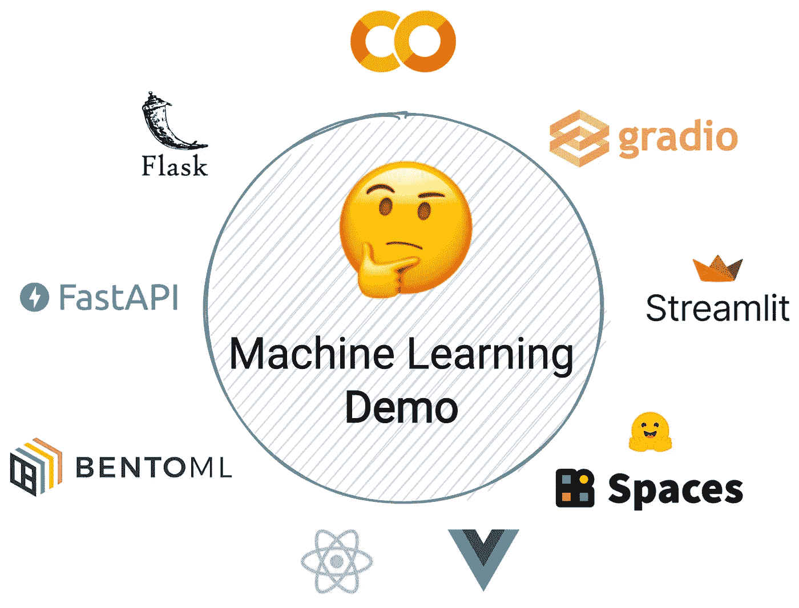
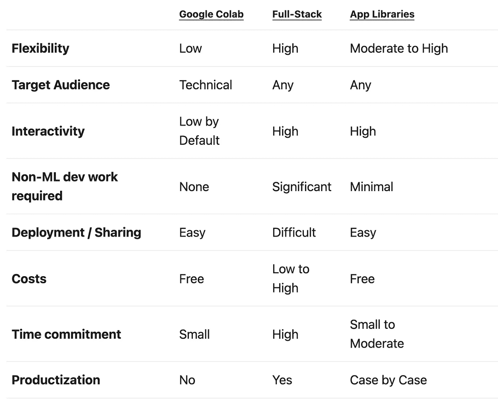
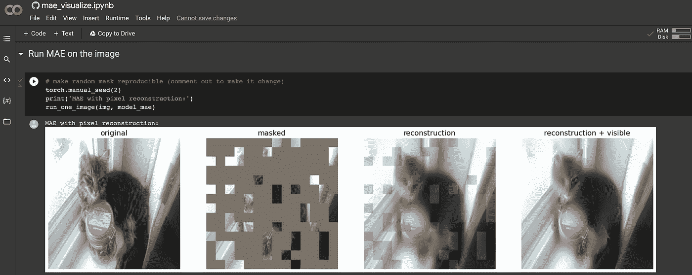
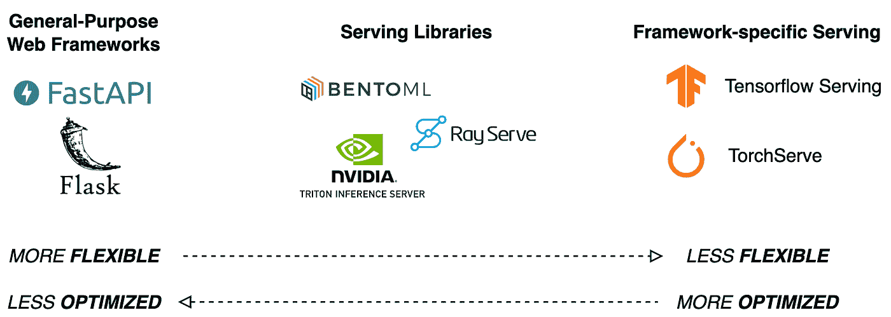
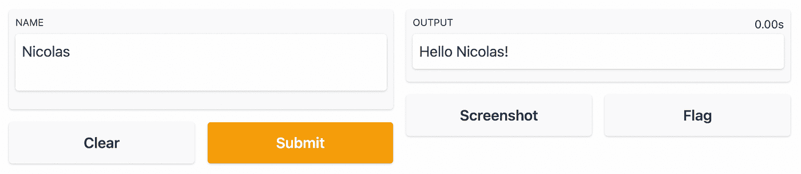

# 如何在 2022 年建立一个机器学习演示

> 原文：<https://towardsdatascience.com/how-to-build-a-machine-learning-demo-in-2022-5bda6cd99743>

## 了解**为什么**你应该在 2022 年为你的机器学习模型制作演示，以及**如何**以适合你的需求、技能和受众的方式来做这件事。


Artturi Jalli 在 [Unsplash](https://unsplash.com?utm_source=medium&utm_medium=referral) 上拍摄的照片

# 为什么演示现在至关重要

机器学习模型的交互式演示越来越受欢迎。毕竟，就像一幅画胜过千言万语一样，没有什么比让别人直接与你的模型互动来产生兴趣更好的了。如果你有兴趣跟上最近的趋势，或者正在为你自己的演示寻找灵感，我强烈推荐关注 [@ak92501 twitter 账户](https://twitter.com/ak92501)。

其中的一个例子是一个模特将肖像照片转换成网飞神秘秀所用风格的插图的演示。演示的易用性和用不同的输入照片快速测试模型的能力是这个项目如此迅速地变得如此受欢迎的部分原因。

您可能希望构建交互式演示的原因有很多:

*   在开发过程中让同事测试模型
*   原型，以寻求对新想法的投资
*   传播研究成果，可能作为研究论文的附录
*   建立一个作品集

无论你的理由是什么，这篇文章都将提供一些提示和建议来充分利用这个机会。

# 如何在 2022 年建立一个互动演示

在 2022 年，有多种方法可以为你的机器学习模型构建一个交互式演示。你选择哪一个取决于:

*   你的目标受众
*   你的软件工程技能
*   你的货币预算
*   你的时间预算
*   您的需求(交互性、灵活性)



作者提供的图像(徽标是其各自所有者的财产)

本文将介绍三种方法:公共笔记本共享、全栈和应用程序库。

# TLDR —我应该使用哪种方法？

本文的其余部分将详细介绍关于这三种方法您需要了解的内容。如果你想快速回答，下面的表格应该会有帮助！



2022 年机器学习演示构建不同方法的比较。作者图片

**经验法则**:

*   在代码可见性有用而交互性不重要的情况下，与技术受众分享？使用 Google Colab(或同等工具)
*   演示成为成熟产品的可能性大吗？从长远来看，采用全栈方法可能会节省您的时间
*   如果以上都不是，那就用应用程序库和拥抱脸空间托管吧

# 公共笔记本共享(Google Colab)

Jupyter notebooks(以及之前的 iPython)在巩固 Python 作为机器学习的领先编程语言方面发挥了重要作用。虽然不是没有缺点，但通过支持交互式数据探索和迭代开发，笔记本迅速成为机器学习爱好者的重要工具。但是，如果远程访问需要托管，设置 Jupyter 环境可能会很困难，而且可能会很昂贵。

[Google Colab](https://nicjac.dev/posts/show-dont-tell-era/colab.research.google.com) 是这一领域的重要颠覆者——它通过提供完全托管的笔记本体验，无需任何设置或维护，实现了机器学习的大众化，并提供了对昂贵计算资源的免费访问。

Colab 使得共享笔记本并让其他人与之交互变得轻而易举，即使这需要 GPU 加速。例如， [fastai 文档](https://colab.research.google.com/github/fastai/fastai/blob/master/nbs/quick_start.ipynb)甚至最近的 [fastai 书籍](https://colab.research.google.com/github/fastai/fastbook/blob/master/01_intro.ipynb)都可以作为 Colab 笔记本使用，允许人们在浏览材料时运行和修改代码。

大多数笔记本都可以在 Colab 上运行，不需要太多的工作，一些小部件可以让用户输入他们自己的数据。如果笔记本是在公共 Github repo 上进行版本控制的，那么只需共享一个如下格式的链接:

```
[https://colab.research.google.com/github/$ACCOUNT/$REPO/blob/$BRANCH/$PATH_TO_NOTEBOOK](https://colab.research.google.com/github/$ACCOUNT/$REPO/blob/$BRANCH/$PATH_TO_NOTEBOOK)
```

其中`$ACCOUNT`是 Github 账户，`$REPO`是存储库，`$BRANCH`是分支，`$PATH_TO_NOTEBOOK`是`ipynb`文件的完整路径。

如果你有兴趣与大众分享你的作品，Colab 笔记本不是最好的选择。然而，它们是非常强大的工具，可以轻松地将想法传达给技术同行。以至于几乎所有机器学习的新发展都倾向于将配套的 Colab 笔记本作为标准。作为一个例子，我探索了一种全新的基于补丁的自我监督方法，使用由我自己提供的输入数据(在这种情况下，是我的猫 Jasmine 的照片)。它让我对这项新的研究有了更好的理解，而且对我来说是免费的。



我的猫 Jasmine 的新自我监督方法的 Google Colab 截图，笔记本位于[https://Colab . research . Google . com/github/Facebook research/Mae/blob/main/demo/Mae _ visualize . ipynb](https://colab.research.google.com/github/facebookresearch/mae/blob/main/demo/mae_visualize.ipynb)

总的来说，交互性非常有限。解决这个问题的一个可能方法是使用一个库，比如 [Gradio](https://gradio.app/) ，它允许直接在笔记本上创建基本的用户界面。Gradio 将在[应用程序库](https://nicjac.dev/posts/show-dont-tell-era/#app-libraries)部分详细介绍。

为了完整起见，我应该提到亚马逊网络服务宣布 [SageMaker Studio Lab](https://aws.amazon.com/sagemaker/studio-lab/) ，它类似于 Google Colab，具有一些优势，如持久存储。我还没有机会探索它，但理论上它可以以类似于 Google Colab 的方式使用。

*Colab 笔记本的优点*:

*   免费使用 GPU 计算
*   与 Git 紧密集成以促进共享
*   完全受管，无需设置或维护

*Colab 笔记本的缺点*:

*   仅限于技术观众，不适合外行观众
*   默认情况下交互性有限，可以使用 Gradio 等库来改进
*   GPU 可用性时好时坏
*   需要一些外部存储(例如存储模型人工制品)

# 全栈

这种创建交互式演示的方法要求最高，但从长远来看，这种方法可能会有回报。它是全栈式的，因为它涉及两个组件:

*   一个**后端**负责将模型作为 REST API 进行加载和服务
*   一个**前端**提供 UI 元素与后端交互

显而易见的缺点是，它需要对这两个组件都感到舒适，或者至少愿意学习。**然而，这种方法是最灵活的，可以用作部署成熟生产环境的垫脚石，而无需从头开始**。

在深入下面的后端和前端组件之前，我们先来看看全栈方法的优缺点。

*全栈模式的优势*:

*   根据需要灵活调整
*   可以包括其他功能，如身份验证
*   可用作生产部署的基础，无需从头开始
*   可以针对性能进行优化

*全栈方法的缺点*:

*   需要后端和前端开发知识
*   耗时的开发和部署
*   需要基础设施进行部署

## 后端

对后端开发的不同技术栈的详尽讨论超出了本文的范围。然而，鉴于大多数从事机器学习应用的机器学习工程师至少熟悉 Python，我们将重点关注基于 Python 的后端解决方案。



后端开发的不同工具:通用 web 框架、服务库和特定于框架的服务库。图片由作者提供。

后端的目标是充当模型的包装器，以便可以通过来自前端的`HTTP`请求来查询它，这被称为服务于的*模型。为了做到这一点，人们通常会使用 web 框架。很长一段时间以来， [Flask](https://flask.palletsprojects.com/) 是基于 Python 的 web 框架的标准，并且确实仍然非常流行。然而， [FastaAPI](https://fastapi.tiangolo.com/) 正迅速成为新宠，这要归功于令人印象深刻的性能和对异步操作的本机支持。[本文](/how-you-can-quickly-deploy-your-ml-models-with-fastapi-9428085a87bf)是理解如何使用 FastAPI 部署简单模型的一个很好的起点，而本[教程](https://medium.com/@mingc.me/deploying-pytorch-model-to-production-with-fastapi-in-cuda-supported-docker-c161cca68bb8)提供了一个完整的概述，介绍了使用 GPU 支持服务 PyTorch 模型所需的所有步骤。*

使用 FastAPI 这样的通用框架需要编写大量样板代码，只是为了让您的 API 端点启动并运行。如果为一个演示部署一个模型是您唯一感兴趣的事情，并且您不介意失去一些灵活性，那么您可能想要使用一个专门的服务框架。一个例子是 [BentoML](https://github.com/bentoml/BentoML) ，它将允许您为您的模型获得一个优化的服务端点，并且比一般的 web 框架运行得更快，开销更少。特定于框架的服务解决方案，如 [Tensorflow Serving](https://www.tensorflow.org/tfx/guide/serving) 和 [TorchServe](https://pytorch.org/serve/) 通常提供优化的性能，但只能分别用于服务使用 Tensorflow 或 PyTorch 训练的模型。

## 前端

前端负责提供一个用户界面，与服务于模型的后端进行交互。在大多数情况下，它将是一种输入数据(如用于自然语言处理的文本，或用于计算机视觉的图像)和显示模型输出的手段。将这个用户界面放在 web 浏览器中可以让您的演示不需要额外的依赖就可以访问。

前端开发是您可能不得不放弃 Python 的地方。虽然像 [Skulpt](https://skulpt.org/) 和 [Brython](https://brython.info/) 这样的库支持在浏览器中使用 Python，但我强烈推荐使用 Javascript，因为非常大的社区意味着教程很多，如果需要，寻求帮助会容易得多。用 Javascript 构建用户界面的两个最流行的库是[React](https://reactjs.org/)(ML 演示的[教程](https://hackernoon.com/frontend-dev-how-to-build-a-predictive-machine-learning-site-with-react-and-python-part-3))和[vue . js](https://vuejs.org/)(ML 演示的[教程](https://royleekiat.com/2020/11/05/how-to-build-a-vuejs-frontend-for-your-machine-learning-prediction-input-and-output/))。使用一个通用的框架将会给你定制用户界面的灵活性。

## 部署

一旦您的后端和前端组件准备就绪，就必须将它们部署到公共可访问的地方。再说一遍，灵活性是这个游戏的名字。像 [Heroku](https://www.heroku.com/) 这样的服务为应用程序的部署提供了托管(和免费，取决于使用)体验。Amazon Web Services、Azure 或 Google Cloud 等公共云提供商可能是一个选择，一个小的演示可能很适合他们的免费层产品。

无论您决定走哪条路，我建议您考虑使用 Docker 将您的演示容器化。通过这种方式，相同的容器映像被用于开发期间的本地测试和在您的托管提供商上的部署，有助于避免由于环境变化而带来的不良后果。

# 应用程序库

那么，如果您想要的东西*几乎*和全栈方法一样灵活，但是没有开发需求，该怎么办呢？你很幸运，因为在过去的几年里，Python 库的出现使得只用几行代码就可以创建令人印象深刻的交互式演示。在本文中，我们将关注两个最有前途的库: [Gradio](https://gradio.app/) 和 [Streamlit](https://streamlit.io/) 。下面将探讨这两者之间的显著差异，但高层次的想法是相同的:消除[全栈](https://nicjac.dev/posts/show-dont-tell-era/#full-stack)部分中概述的大部分痛苦的后端和前端工作，尽管代价是一些灵活性。

## 格拉迪欧

Gradio 已经在 Google Colab 部分提到过，因为它可以用来为笔记本添加交互元素。如[库的入门页面](https://gradio.app/getting_started/)所示，构建一个接口只需要几行 Python 代码。

```
import gradio as grdef greet(name):
  return "Hello " + name + "!!"iface = gr.Interface(fn=greet, inputs="text", outputs="text")
iface.launch()
```

如果您在笔记本电脑上工作，用户界面会立即显示出来。如果从脚本运行，浏览器窗口将打开并指向`http://localhost:7860`。之所以这样做，是因为 Gradio 本质上是在后台为您运行一个 API 服务器，从而负责全栈一节中讨论的大部分工作。它曾经利用 Flask 来创建本地 API 服务器，但是最近[转向使用 FastAPI](https://twitter.com/abidlabs/status/1479895680219029516) 。

在上面的代码片段中，`greet`函数将被替换为您的模型的推理代码。注意，`inputs`和`outputs`都被设置为文本，所以 UI 将自动默认为处理基于文本的任务所必需的小部件。类似的小部件存在于最常见的用例中，包括计算机视觉和音频处理。此外，Gradio 还提供了非常方便的功能，例如，如果显示的输出是意外的(例如，如果处理失败)，可以截图或让用户进行标记。

如果你想与世界分享你的用户界面，在`launch`方法中使用`share=True`参数将为你提供一个指向你的演示的`gradio.app` URL。请注意，这只是将请求转发到您的机器，因此只有当您的脚本或笔记本正在运行时，它才会起作用，并且链接会在 72 小时后自动过期。请参阅下面关于拥抱面部空间托管的部分，以解决这些限制。



由几行代码生成的文本输入和输出的默认 Gradio UI。作者截图。

Gradio 专注于为机器学习模型构建用户界面，这意味着它将为您处理几乎所有事情，并且开箱即用，只需很少的配置。

*格拉迪欧*的优点:

*   开箱即可快速轻松设置
*   直接在笔记本上运行
*   绝对不需要网络开发知识
*   应用程序易于共享
*   内置 UI 元素的良好选择
*   截图或输出标记等功能对于演示来说非常方便

*梯度的缺点*:

*   对用户界面布局的有限控制
*   不适合复杂的应用程序(例如状态管理、缓存)

## 细流

Streamlit 是一个构建和共享数据应用的库。他们的[策展画廊](https://streamlit.io/gallery)展示了数据可视化应用、仪表盘、互动教程，当然还有机器学习演示的例子。

Streamlit 可用于构建复杂的应用程序，与 Gradio 相比，其代价是进入门槛更高。例如，它不能直接在笔记本上运行—命令行工具用于从脚本启动应用程序。采用实时重新加载方法，对代码所做的更改会自动反映在浏览器中运行的应用程序中，从而允许快速迭代。

Streamlit 附带了一些高级功能，如缓存，这有助于防止长时间运行的任务(例如下载和准备用于推理的模型)不必要地运行多次，以及构建有状态应用程序的能力(在用户会话期间保留信息)。这些功能使用例超越了简单的机器学习演示。在 UI 方面，该库有大量内置的小部件，并可以通过第三方组件的支持进一步扩展。

Streamlit 提供名为 [Streamlit Cloud](https://docs.streamlit.io/streamlit-cloud/get-started/deploy-an-app) 的应用共享托管服务。[在撰写本文时](https://blog.streamlit.io/deploy-a-private-app-for-free/)，可以使用 Streamlit Cloud 和免费计划部署一个私有(需要认证)和无限的公共应用。或者，Streamlit 应用程序很容易容器化，并使用 Docker 进行[部署。](/create-an-awesome-streamlit-app-deploy-it-with-docker-a3d202a636e8)

如果你对部署 Gradio 和 Streamlit 应用程序都感兴趣，拥抱面部空间可能是一个不错的选择。

*细流的优点*:

*   快速设置
*   缓存和状态管理等高级功能允许构建复杂的应用程序
*   大量内置 UI 小部件可供选择
*   高度可定制的 UI 布局
*   通过支持自定义第三方组件进行扩展

*Streamlit 的缺点*:

*   共享应用程序不像使用 Gradio 那么简单
*   复杂的应用程序需要对高级 web 开发概念有所了解
*   与笔记本不兼容
*   缺少 ML 演示的一些基本的内置特性(例如，意外输入/输出的标记)

## 拥抱脸空间革命

当[拥抱脸](https://huggingface.co/)将[空间](https://huggingface.co/spaces)添加到他们的 ML 产品和工具生态系统中时，部署使用 Gradio 或 Streamlit 开发的应用变得更加容易。空间类似于 Github 页面——代码被提交给存储库，应用程序被自动构建和服务。创建空间时，您可以在 Streamlit、Gradio 和 Static(或多或少复制 Github Pages 的静态网站托管功能)之间进行选择。然后，空间会自动设置为容纳您选择的库。版本控制和用户喜欢空间的能力等有用功能使其成为部署公共机器学习演示的绝佳体验。

类似于谷歌 Colab 如何使训练最先进的机器学习模型所需的计算资源的访问民主化，拥抱面部空间允许任何人主持演示供世界检验。这意味着整个机器学习工作流，从模型训练到交互式演示的部署，现在都可以免费进行，而且几乎完全是用 Python 编写的。

✨如果你喜欢这个内容，请花时间到 [**在媒体**](https://medium.com/@nicjac)上关注我，并查看我在平台上的其他帖子。我的大部分内容，包括这个故事，也发表在我的个人网站( [nicjac.dev](https://nicjac.dev) ) ✨上