# 如何为面板数据建立混合 OLS 回归模型

> 原文：<https://towardsdatascience.com/how-to-build-a-pooled-ols-regression-model-for-panel-data-sets-a78358f9c2a>

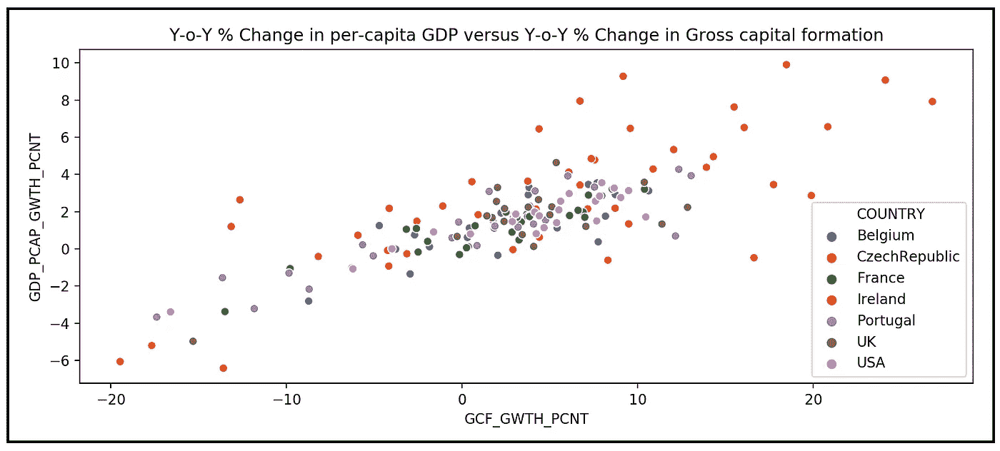

a 面板数据集(来源:[世界发展指标](https://databank.worldbank.org/metadataglossary/world-development-indicators/series)数据在 [CC BY 4.0 license](https://www.worldbank.org/en/about/legal/terms-of-use-for-datasets) )(图片由作者提供)

## 以及使用 Python 和 statsmodels 对其拟合优度的详细分析

在本文中，我们将了解**面板数据数据集**，我们将学习如何使用 statsmodels 和 Python 为真实世界的面板数据集构建和训练一个**池化 OLS 回归模型**。

训练池化 OLSR 模型后，我们将学习如何使用调整后的 R 平方、对数似然、AIC 和回归的 f 检验来分析训练模型的拟合优度。我们将通过对其残差的详细分析，更深入地了解模型的拟合优度。

与**固定效应**、**随机效应**和**随机系数模型**一起，**混合 OLS 回归模型**恰好是面板数据集的一个普遍考虑的模型。事实上，在许多面板数据集中，混合 OLSR 模型经常被用作比较其他模型性能的参考或基线模型。

本文是面板数据分析系列文章的第 1 部分:

1.  **如何为面板数据集建立混合 OLS 回归模型**
2.  [了解固定效应回归模型](/understanding-the-fixed-effects-regression-model-d2fccc2cc27e)
3.  随机效应回归模型的实用指南

# 什么是面板数据？

面板数据集包含在一段时间内为一个或多个唯一可识别的个人或“事物”收集的数据。在面板数据术语中，为其收集数据的每个个体或“事物”被称为一个**单元**。

以下是面板数据集的三个真实例子:

弗雷明汉心脏研究:弗雷明汉心脏研究是一项长期的实验，于 1948 年在马萨诸塞州的弗雷明汉市开始。每年，来自 5000 多个个体的健康数据被捕获，目标是识别心血管疾病的风险因素。在这个数据集中，**单元**是一个人。

[**格伦菲尔德投资数据**](https://rdrr.io/cran/AER/man/Grunfeld.html) :这是一个流行的研究数据集，包含 10 家美国公司 20 年来积累的公司业绩数据。在这个数据集中，**单位**是一家公司。

[**英国家庭小组调查**](https://www.iser.essex.ac.uk/bhps) :这是对英国家庭样本的调查。自 1991 年以来，每个抽样家庭的成员都被问到一系列问题，他们的回答被记录下来。随后的每一年都要对相同的家庭样本进行一次访问。这项调查的目的是分析英国发生的社会经济变化对英国家庭的影响。在这个数据集中，**单元**是一个家庭。

在建立面板数据集时，研究人员为每个**单元**测量一个或多个称为**变量**的参数，并以表格形式记录它们的值。变量的例子有个人的性别、种族、体重和血脂水平，或公司的员工人数、流通股和 EBITDA。请注意，一些变量可能会随着时间的推移而变化，而另一些则保持不变。

该数据收集练习的结果是一个**三维数据集**，其中每行代表一个独特的单元，每列包含该单元的一个测量变量的数据，z 轴包含该单元被跟踪的时间周期序列。

面板数据集来自**纵向研究**，其中研究人员希望研究测量变量对一个或多个**响应变量**的影响，如一家公司的年度投资或一个国家的 GDP 增长。

# 真实世界面板数据集

以下面板数据包含了七个国家从 1992 年到 2014 年的人均 GDP 年增长率。除了 GDP 增长数据，该面板还包含每个国家总资本形成的同比增长:

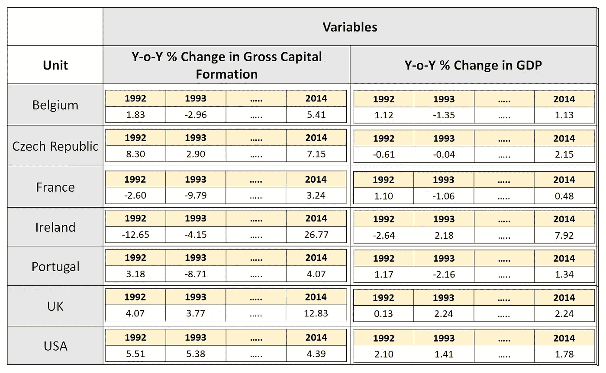

a 小组数据集(来源:[世界发展指标](https://databank.worldbank.org/metadataglossary/world-development-indicators/series)数据 [CC BY 4.0 license](https://www.worldbank.org/en/about/legal/terms-of-use-for-datasets) )(图片由作者提供)

在上面的数据集中，每个国家(“单位”)在相同数量的时间段内被跟踪，产生了所谓的**平衡面板**。**不平衡或不均衡面板**是指在不同的时间段跟踪不同的单元。

上面的数据集也是一个**固定面板**(相对于**旋转面板)**的例子，因为我们在每个时间段都在跟踪同一组国家。

在本文的其余部分，我们将看看数据面板是**固定的**和**平衡的**。

在面板数据集中，属于一个单元的数据点集称为**组**。通常，单位和组这两个词在关于面板数据集的讨论中可以互换使用。

回到世界银行的数据集，假设我们希望研究总资本形成的增长和一个国家的 GDP 增长之间的关系。为此，我们形成以下回归目标:

# 回归目标

我们的目标是精确定义一个国家总资本形成的增长与该国每年经历的 GDP 增长之间的关系。

# 回归策略

我们的策略将是选择和拟合一个适合面板数据集，特别是 WB 面板数据的回归模型。我们的回归模型应该允许我们将国家 *i* 在时间段(年份) *t* 经历的年 GDP 增长表示为某个函数 *f(.)*在 *t* 时间段内 *i* 国家总资本形成的年增长率。

以符号形式:

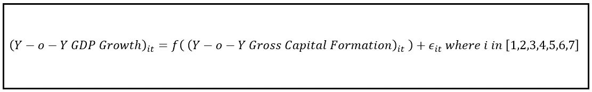

在时间周期 t，国家 I 的 GDP 增长是国家 I 在时间周期 t 的总资本形成增长的函数

在上面的回归方程中， *ε_it* 是回归的残差，它捕捉了 *i* 国家在 *t* 年期间的同比增长的方差，这是模型*无法*能够“解释”的。

# 混合 OLS 回归模型

如前所述，混合 OLS 回归模型通常是一个很好的起点，也是几个面板数据集的参考模型。我们将研究它对世界银行数据集的适用性。

为此，我们将通过将国家和年份视为两列来“展平”面板数据，如下所示:

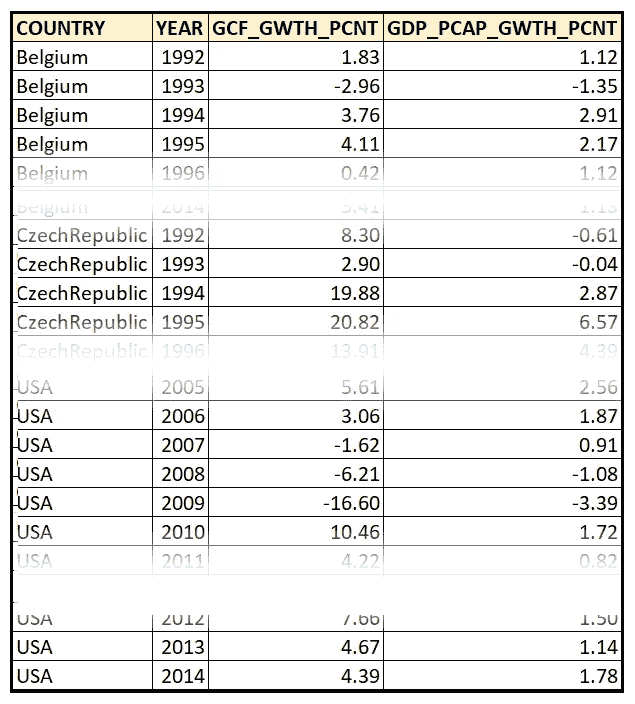

展平版本的面板数据集(图片由作者提供)

我们的因变量(内生变量)和解释变量(外生变量)如下:

因变量***y***= GDP _ PCAP _ 长城 _PCNT
解释变量***X***= GCF _ 长城 _PCNT

数据集可以在 这里下载 [**。**](https://gist.github.com/sachinsdate/c40651e9e4bc13a696780462209f1992)

使用 [Pandas](https://pandas.pydata.org/) ，我们将把这个展平的面板数据集加载到内存中，使用 [Seaborn](https://seaborn.pydata.org/) ，我们将绘制 plot ***y*** 对 ***X.***

我们将从导入所有必需的包开始，包括我们将在本文后面使用的包:

```
**import** pandas **as** pd
**import** scipy.stats **as** st
**import** statsmodels.api **as** sm
**import** statsmodels.graphics.tsaplots **as** tsap
**from** statsmodels.compat **import** lzip
**from** statsmodels.stats.diagnostic **import** het_white
**from** matplotlib **import** pyplot **as** plt
**import** seaborn **as** sns
```

将展平的数据集加载到 Pandas 数据框中:

```
df_panel = pd.**read_csv**('wb_data_panel_2ind_7units_1992_2014.csv', **header**=0)
```

使用 [Seaborn](https://seaborn.pydata.org/) 绘制所有国家所有时间段的 GDP 增长与总资本形成增长的关系图:

```
sns.**scatterplot**(**x**=df_panel[**'GCF_GWTH_PCNT'**],  
                **y**=df_panel[**'GDP_PCAP_GWTH_PCNT'**],
                **hue**=df_panel[**'COUNTRY'**]).**set**(**title**=                 
                'Y-o-Y % Change in per-capita GDP versus Y-o-Y % Change in Gross capital formation')plt.**show**()
```

我们看到下面的情节:

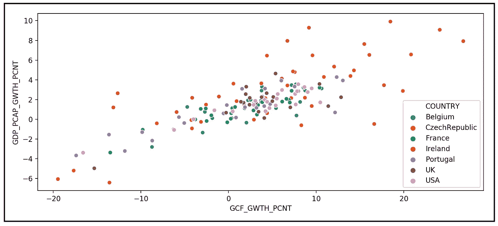

国内生产总值同比增长%与总资本形成同比增长%的国家散点图(图片由作者提供)

在数据面板中，所有国家的 GDP 年同比增长率与总资本形成年同比增长率之间似乎存在线性关系。这对使用 OLS 技术拟合线性模型来说是个好兆头。

但是，我们也在响应变量 GDP_PCAP_GWTH_PCNT 中观察到了 [**异方差**](/heteroscedasticity-is-nothing-to-be-afraid-of-730dd3f7ca1f) 的迹象。具体地，对于不同的 GCF_GWTH_PCNT 值，GDP_PCAP_GWTH_PCNT 的方差不是常数。对于使用 OLS 估计技术来说，这不是一个好兆头。

无论如何，让我们继续用 OLS 回归模型来拟合这个扁平的数据面板。在本文的后面，我们将看到如何使用一组拟合优度测试来度量模型的适用性。

混合 OLS 回归模型方程如下:

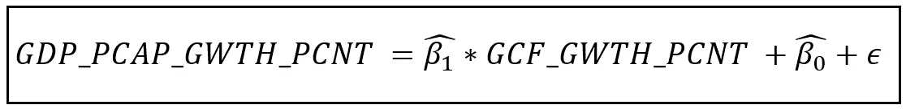

汇集的 OLS 回归模型方程(图片由作者提供)

在面板数据集上训练模型的目的是找到拟合系数 *β_cap_1* 和 *β_cap_0* 。 *β_cap* 中的“cap”表示它是模型估计的系数的值，而不是总是未知的真实(群体水平)值 *β* 。

*ε* 是拟合模型的残差，是具有一定均值和方差的随机变量。如果 OLS 估计技术正确地完成了它的工作，ε将具有为零的平均值，并且ε将具有以 GCF_GWTH_PCNT 为条件的恒定方差(即 *ε* 将不是异方差的)，并且 *ε* 将不是自相关的。

我们将使用 statsmodels 的`OLS`类来构建和拟合 OLS 回归模型，如下所示:

定义 ***y*** 和 ***X*** 变量:

```
y_var_name = **'GDP_PCAP_GWTH_PCNT'** X_var_names = [**'GCF_GWTH_PCNT'**]
```

从数据面板中切出 ***y*** 矢量:

```
pooled_y=df_panel[y_var_name]
```

从数据面板中切出 ***X*** 矩阵:

```
pooled_X=df_panel[X_var_names]
```

添加回归截距的占位符。模型拟合时，这个变量的系数就是回归模型的截距 *β_0* 。

```
pooled_X = sm.**add_constant**(pooled_X)
```

构建 OLS 回归模型:

```
pooled_olsr_model = sm.**OLS**(**endog**=pooled_y, **exog**=pooled_X)
```

在*(****)y****，****X****)*数据集上训练模型并获取训练结果:

```
pooled_olsr_model_results = pooled_olsr_model.**fit**()
```

打印培训总结:

```
**print**(pooled_olsr_model_results.**summary**())
```

我们得到以下输出:

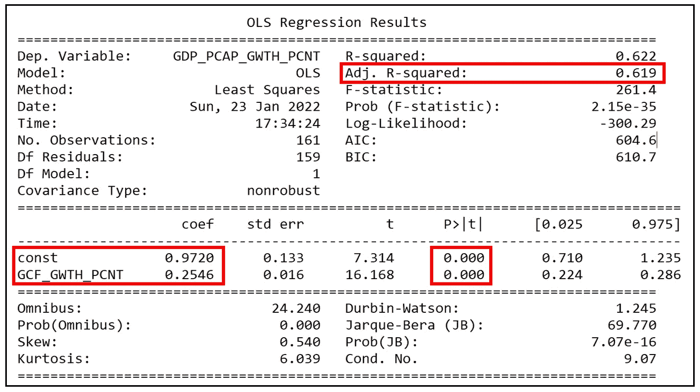

WB 数据集上混合 OLS 回归模型的训练输出(图片由作者提供)

# 如何解释混合 OLSR 模型的训练输出

首先要注意的是拟合系数的值: *β_cap_1* 和 *β_cap_0*

*β_cap_0 = 0.9720，β_cap_1=0.2546*

这两个系数都被估计为在 p

The trained Pooled OLS model’s equation is as follows:

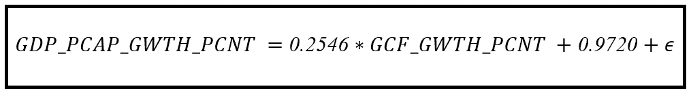

The trained Pooled OLS regression model (Image by Author)

# How to interpret the Pooled OLSR model’s performance

We will analyze whether Pooled OLS model is the adequate model for our regression problem. We will analyze the model’s goodness-of-fit using direct measures and tests such as [**R 平方**](/the-complete-guide-to-r-squared-adjusted-r-squared-and-pseudo-r-squared-4136650fc06c) 和 [**F 检验**](/fisher-test-for-regression-analysis-1e1687867259) 以及对数似然和 **AIC** 分数处显著不同于 0，并且也通过残差分析间接不同。

## 通过 R 平方、f 检验、对数似然和 AIC 分析拟合优度

[**调整后的 R 平方**](/the-complete-guide-to-r-squared-adjusted-r-squared-and-pseudo-r-squared-4136650fc06c) 测量的是**中由 ***X*** *解释的总方差的分数，在考虑了由于包含回归变量*而损失的自由度之后，为 0.619 或约 62%。这当然不是一个糟糕的数字，但仍然没有什么值得欣喜若狂的。**

**测量模型参数联合显著性的回归的 [**F 检验**](/fisher-test-for-regression-analysis-1e1687867259) 产生了 261.4 的检验统计量，p 值为 2.15e-35，从而使我们得出结论，模型的系数估计在 p 值为<001 时联合显著。**

**该模型的对数似然为-300.29， [**AIC**](/the-akaike-information-criterion-c20c8fd832f2) 得分为 604.6。这些拟合优度值本身是没有意义的，除非我们将它们与竞争模型进行比较。在我下周的文章中，我们将在相同的数据面板上建立一个固定效应模型，并使用这两种方法来比较有限元模型和混合 OLSR 模型的拟合质量。**

## **残差分析**

**让我们分析拟合模型的**残差**为 [**正态性**](/testing-for-normality-using-skewness-and-kurtosis-afd61be860) 、 [**异方差性**](/heteroscedasticity-is-nothing-to-be-afraid-of-730dd3f7ca1f) 和 [**相关性**](/the-intuition-behind-correlation-62ca11a3c4a)**——影响线性模型拟合优度的三个属性。****

****回想每个原始残差*ε_ it = y _ OBS _ it—y _ pred _ it*，即 GDP_PCAP_GWTH_PCNT 的观测值和预测值之间的差值。让我们打印出包含训练模型的原始残差的 Pandas `Series`对象:****

******打印**(pooled _ olsr _ model _ results . resid)****

****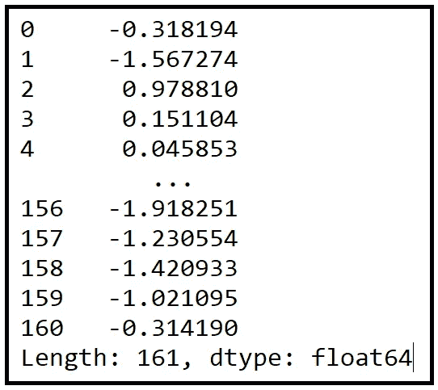****

****模型的原始残差****

****以下是残差的平均值:****

```
******print**(**'Mean value of residual errors='**+**str**(pooled_olsr_model_results.resid.**mean**()))****
```

****`Mean value of residual errors=**3.682354628259836e-16**`****

****平均值实际上为零，这是使用 OLS 估计技术的预期结果。****

## ****残差是正态分布的吗？****

****让我们绘制残差的 Q-Q 图:****

```
****sm.**qqplot**(data=pooled_olsr_model_results.**resid**, **line**=**'**45**'**)plt.**show**()****
```

****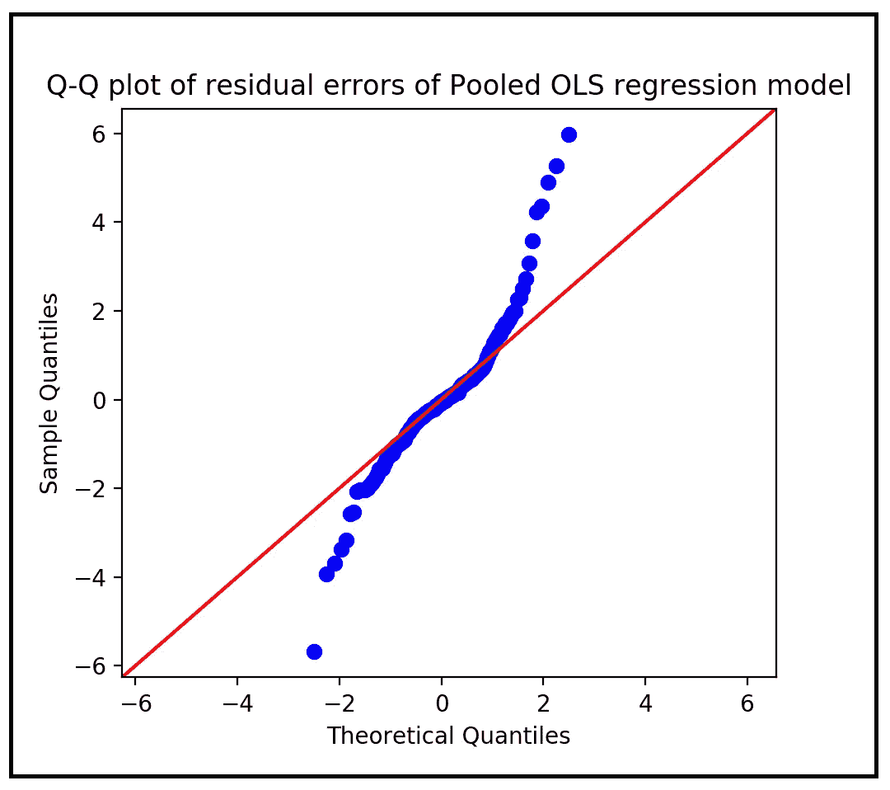****

****混合 OLS 模型的残差 Q-Q 图(图片由作者提供)****

****这是我们观察问题的第一个迹象。残差的 Q-Q 图是对正态性的直观检验，它清楚地表明拟合模型的残差不是正态分布的。Q-Q 测试的结果由 [**Jarque-Bera 和综合测试**](/testing-for-normality-using-skewness-and-kurtosis-afd61be860) 的输出支持，用于显示在训练总结的底部面板中的常态。两个测试都表明残差在 p < .001 处不是正态分布的。****

****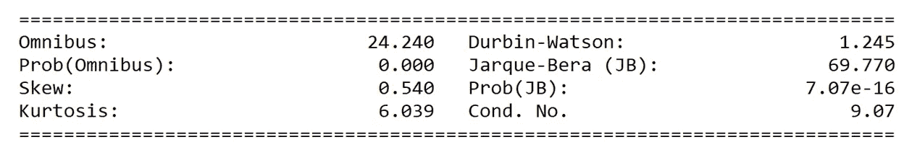****

****正态性的 JB 检验和综合检验的结果(图片由作者提供)****

****即使残差不是正态分布的，混合 OLS 估计仍然是面板数据回归问题的最佳线性无偏估计。残差的非正态性不影响 OLS 回归模型的蓝色性。****

****具有非正态分布的残差的一个缺点是，人们不能 [**为模型的预测建立可靠的置信区间**](/interval-estimation-an-overview-and-a-how-to-guide-for-practitioners-e2a0c4bcf108) 。我们可以容忍小的偏离正态分布，但是大的偏离会使正态分布或学生的 t 分布失效。因此，可靠的置信区间不能(也不应该)计算。****

## ****残差是齐次的吗？****

****如果 OLSR 模型的残差是异方差的，即残差的方差在 ***X*** 的所有值上不是常数，则 OLS 估计器不是 [**有效的**](/a-guide-to-estimator-efficiency-bae31a06e570) (尽管它仍然是 [**无偏的**](/understanding-estimation-bias-and-the-bias-variance-tradeoff-79ba42ab79c) )。****

****让我们目视检查残差，看看残差相对于 ***X*** 的曲线中是否存在任何趋势:****

```
****fig, ax = plt.**subplots**()fig.**suptitle**('Raw residuals of Pooled OLS versus X')plt.**ylabel**('Residual (y - mu)')plt.**xlabel**(**'X='**+**str**(X_var_names[0]))ax.**scatter**(pooled_X[X_var_names[0]], pooled_olsr_model_results.**resid**, **s**=4, **c**=**'**black**'**, **label**=**'**Residual Error**'**)plt.**show**()****
```

****我们看到下面的情节。对于 ***X*** 的不同值，残差似乎没有恒定的方差。我用红色箭头标出了差异趋势:****

****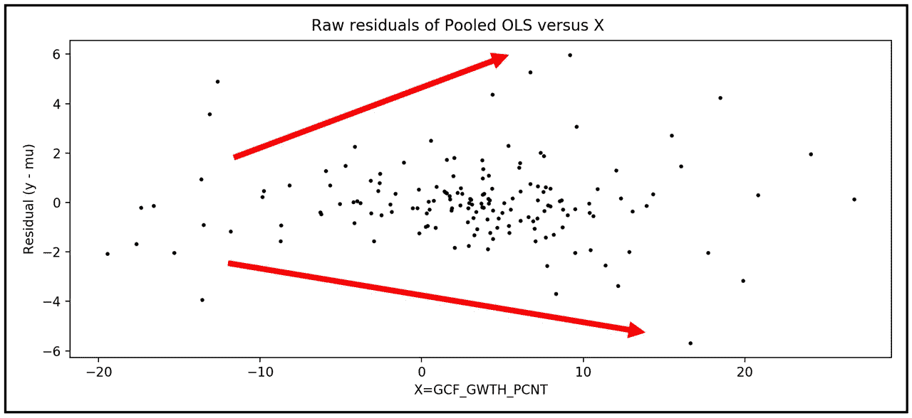****

****混合 OLS 模型的残差与 x 的关系图。该图显示异方差残差(图片由作者提供)****

****可以通过运行[白色测试](https://en.wikipedia.org/wiki/White_test)来确认异方差，其中我们将回归 ***X*** 上的残差平方，并测试所得回归模型系数的显著性，如下所示:****

```
****keys = [**'Lagrange Multiplier statistic:'**, **'LM test\'s p-value:'**,
        **'F-statistic:'**, **'F-test\'s ' 'p-value:'**]results = **het_white**(**resid**=pooled_olsr_model_results.**resid**, **exog**=pooled_X)print(**'Results of the White test for heteroskedasticity of residual errors ===> '**)
print(**lzip**(keys,results))****
```

****我们看到以下输出:****

```
******Results of the White test for heteroskedasticity of residual errors ===>
[(‘Lagrange Multiplier statistic:’,** 9.918681580385458**), (“LM test’s p-value:”,** 0.007017552347485667**), (‘F-statistic:’,** 5.186450932829045**), (“F-test’s p-value:”,** 0.006582734100668208**)]******
```

****LM 检验的 p 值是< .001 indicating a **对残差是同伦齐次的 White 检验的零假设**的拒绝。****

****如前所述，混合 OLS 回归模型将产生总体值的无偏估计，即使拟合模型的残差是异方差的。但是残差中的异方差将违反[高斯-马尔可夫假设](https://en.wikipedia.org/wiki/Gauss%E2%80%93Markov_theorem)中的一个，该假设使 OLS 估计量成为手头问题的最佳线性无偏估计量。具体而言，当残差是异方差的时，OLS 估计器变得 [**低效**](/a-guide-to-estimator-efficiency-bae31a06e570) ，即，它失去了在所有可能的线性无偏估计器中生成具有最低可能方差的预测的能力。当残差是异方差的时，OLS 估计量会低估或高估参数估计中的方差，导致参数估计的标准误差被遗漏指定。由于标准误差用于计算置信区间，参数估计的置信区间也变得不正确。对于与模型预测相关的标准误差和置信区间，也可以看到相同类型的不规范。****

## ****残差与响应变量 y 相关吗？****

****让我们绘制相对于 y=GDP_PCAP_GWTH_PCNT 的残差:****

```
****fig, ax = plt.**subplots**()fig.**suptitle**('Raw residuals of Pooled OLS versus y')plt.**ylabel**('Residual (y - mu)')plt.**xlabel**('y')ax.**scatter**(pooled_y, pooled_olsr_model_results.**resid**, **s**=4, **c**=**'**black**'**, **label**=**'**Residual Error**'**)plt.**show**()****
```

****我们得到如下的情节:****

********

****混合 OLS 模型相对于 y=GDP_PCAP_GWTH_PCNT 的残差图(图片由作者提供)****

****在残差和 ***y*** 之间似乎有一个线性趋势。使用 [**皮尔逊 r**](/the-intuition-behind-correlation-62ca11a3c4a) 的相关性测试证实了这一视觉判断:****

```
****keys = [**'Pearson\'s r:'**, **'p-value:'**]results = st.**pearsonr**(**x**=pooled_y, **y**=pooled_olsr_model_results.**resid**)print(**'Results of the Pearson\'s r test of correlation between the residual errors and the response variable y ===>'**)**print**(**lzip**(keys,results))****
```

****我们看到以下输出:****

```
******Results of the Pearson's r test of correlation between the residual errors and the response variable y ===>**
[("**Pearson's r:**", 0.6149931069935411), ('**p-value:**', 3.996454333518694e-18)]****
```

****第一个值 0.61499 是残差和*之间的相关量(~ 61%)，第二个值 3.99645e-18 是结果的 p 值。我们将忽略报告的 p 值，因为我们知道残差远非正态分布。无论如何，报道的相关性(61%)本身明显大于零，因此是显著的。*****

*****回归残差和响应变量之间的高度相关性表明，我们的混合 OLSR 模型缺少重要的解释变量，否则这些变量将能够“解释”这种相关性。无论该国的人均 GDP 增长率( ***y*** )如何变化，总资本形成率( ***X*** )都无法解释已经以与 ***y*** 相关和异方差的形式泄漏到残差中。*****

## ****残差是自相关的吗？****

****让我们绘制残差的自相关函数(ACF)图:****

```
****tsap.**plot_acf**(**x**=pooled_olsr_model_results.**resid**)**plt**.show()****
```

****我们看到下面的情节:****

****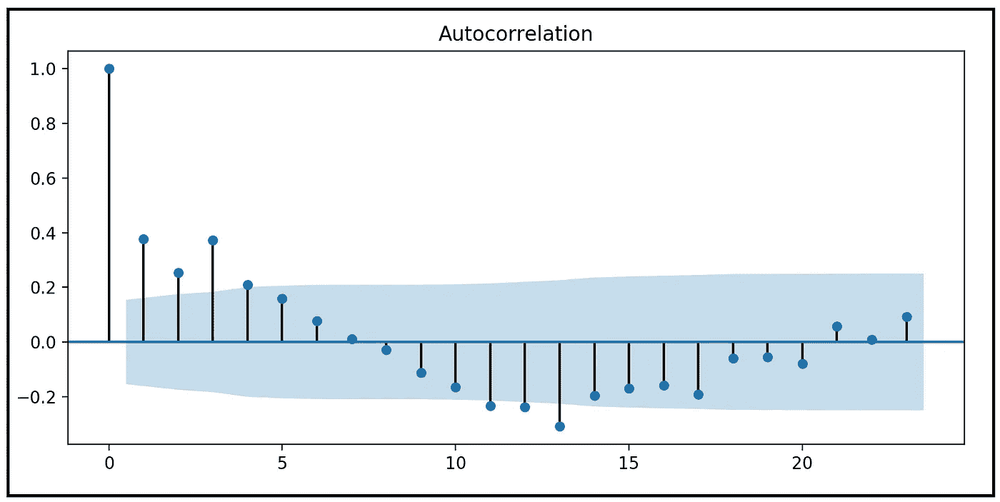****

****混合 OLSR 模型残差的自相关图(图片由作者提供)****

****滞后 0 时 1.0 的完美相关性将被忽略，因为一个数总是与其自身完美相关。但我们看到滞后 1、2 和 3 处的残差之间存在显著的自相关。****

****正如残差中的异方差一样，残差中的自相关违反了高斯-马尔可夫假设中的一个假设，该假设使 OLS 估计量变蓝。具体来说，自相关残差会导致标准误差被遗漏指定(低估)，从而导致 t 值(或 z 值)被高估，并且参数估计的置信区间被遗漏指定。实际上为零(即无关紧要)的系数可能被错误地报告为非零(重要)。****

# ****调查结果摘要****

****总之，我们发现我们为世界银行数据集构建的混合 OLS 回归模型具有以下特性:****

*   ****其**调整后的 R 平方约为 62%** 对于真实世界的数据集来说，这并不坏。****
*   ****发现**模型的参数系数在 p<0.001 处**显著。****
*   ****f 检验表明**参数系数在 p<0.001 处**联合显著。****
*   ****模型的**残差不是正态分布的**，这意味着与模型预测相关的标准误差和置信区间可能不完全可靠。****
*   ******残差是异方差的**，这意味着模型参数的参数显著性 t 检验结果、参数估计的相应置信区间以及 f 检验结果并不完全可靠。该结论适用于与模型预测相关的标准误差和置信区间。****
*   ******残差与响应变量*y*相关，这意味着模型遗漏了重要的回归变量，否则这些变量将与**y相关，它们的缺失导致相关性的余额泄漏到残差中。********
*   ******残差在滞后 1、2 和 3** 处是自相关的，这意味着模型参数估计的标准误差可能被低估，而报告的 z 值(或 t 值)相应地被高估。从功能上讲，残差中的自相关意味着回归模型的一般不规范。****

****总的来说，混合 OLSR 模型的残差分析指向了手头问题的回归模型的错误规范。我们也许可以用面板数据集的另外两种回归模型中的一种做得更好，即**固定效应**和**随机效应**回归模型。****

****在我下周的文章中，我们将深入探讨固定效应回归模型，并研究如何在世界银行数据集上构建和拟合 FE 模型。我们将比较它与集合 OLSR 模型的拟合优度。****

****这里是本文使用的世界银行数据集的 [**下载链接**](https://gist.github.com/sachinsdate/c40651e9e4bc13a696780462209f1992) 。****

****下面是本文中使用的完整源代码:****

# ****参考文献、引文和版权****

## ****数据集****

****[世界发展指标](https://databank.worldbank.org/metadataglossary/world-development-indicators/series)世界银行数据 [CC BY 4.0 license](https://www.worldbank.org/en/about/legal/terms-of-use-for-datasets) 。 [**下载链接**](https://gist.github.com/sachinsdate/c40651e9e4bc13a696780462209f1992)****

## ****纸质和图书链接****

****巴蒂·h·巴尔塔吉， [*面板数据的计量经济分析*](https://link.springer.com/book/10.1007/978-3-030-53953-5) ，第 6 版，*施普林格*****

****威廉·h·格林， [*计量经济分析*](https://www.pearson.com/us/higher-education/program/Greene-Econometric-Analysis-8th-Edition/PGM334862.html) ，第 8 版*，* 2018，*培生*****

## ****形象****

****本文中所有图片的版权归 [CC-BY-NC-SA](https://creativecommons.org/licenses/by-nc-sa/4.0/) 所有，除非图片下面提到了不同的来源和版权。****