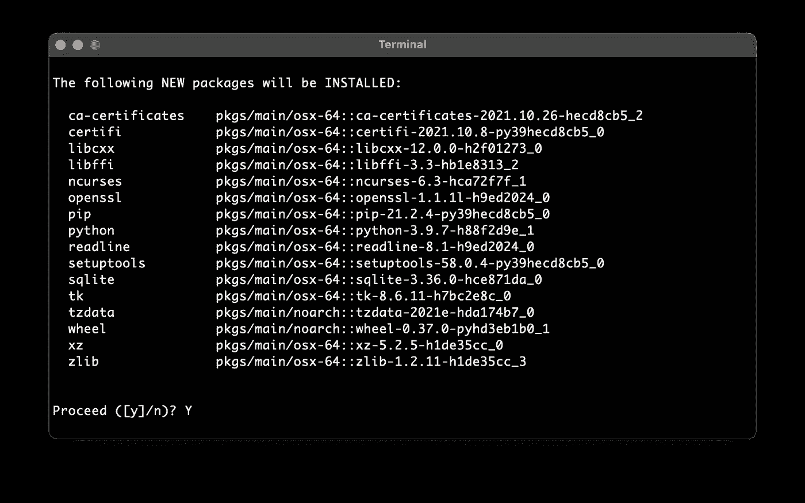
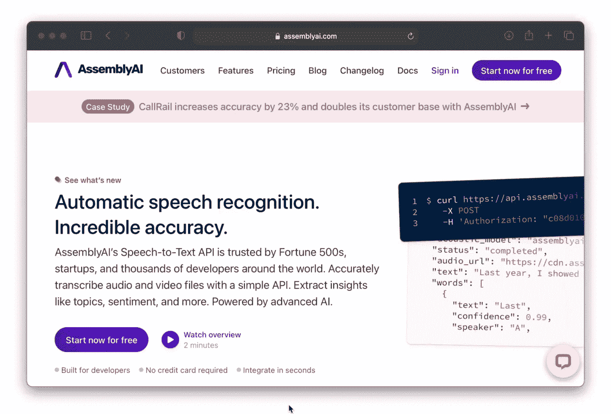
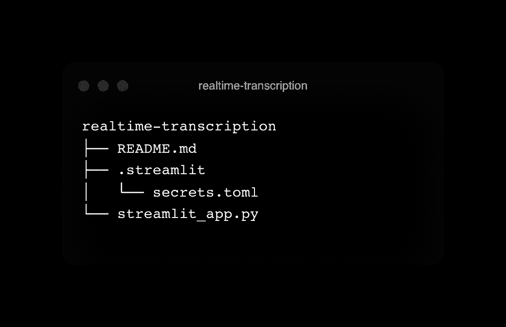
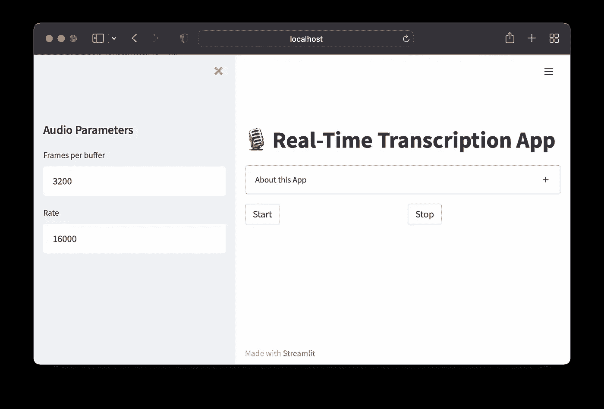
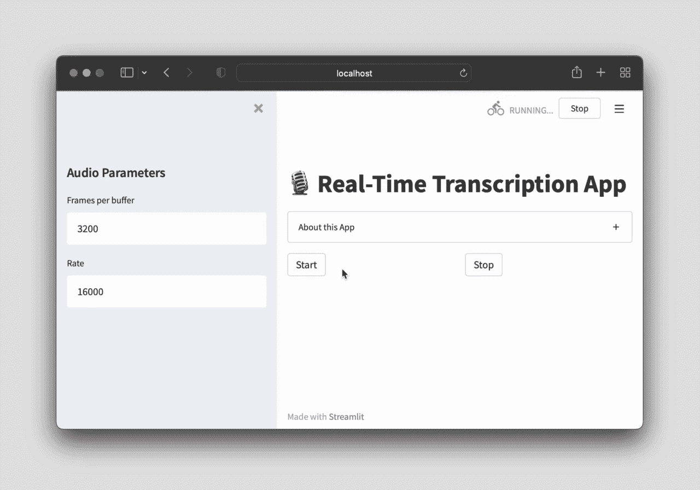

# 如何用 Python 构建实时转录 App

> 原文：<https://towardsdatascience.com/how-to-build-a-real-time-transcription-app-in-python-7939c7b02614>


## 使用 AssemblyAI 和 Streamlit 的分步教程

# 介绍

实时转录应用程序是一种实时提供语音实时转录的应用程序。这种应用程序使用语音识别引擎将口语转化为文本，然后实时显示在屏幕上。该应用程序可以用于各种目的，包括转录讲座，会议和会议。

使用实时转录应用程序有几个好处。首先，它可以帮助你捕捉发生的想法和对话。这对于在快节奏环境下工作或者有很多想法的人来说特别有用。其次，可以帮助你提高沟通能力。这是因为你可以看到自己怎么说话，别人怎么说话。这有助于你找出可以改善沟通的地方。第三，该应用程序也可能被听力有困难的人或学习英语的人使用，因为该应用程序可以帮助实时转录音频，以便用户可以在说话时看到屏幕上的文本。然后，可以对转录的文本应用自然语言处理，以供进一步分析。

在本文中，我们将探索如何使用 AssemblyAI API 作为后端，Streamlit 作为前端，用 Python 构建一个实时转录应用程序。

为了补充本文，您还可以观看视频版本:

[如何使用 AssemblyAI 和 Streamlit 在 Python 中构建实时转录 Web 应用](https://youtu.be/Kj0JtjAxxKA)

# 实时转录应用程序的高级概述

在本文中，我们将用 Python 构建一个实时转录 web 应用程序，它将允许我们实时执行语音到文本的转录。

为此，我们将利用 Python 中的几个库，如下所示:

*   我们将用来存放所有输入和输出小部件的 web 框架。
*   `websocket` —允许应用程序与 AssemblyAI API 交互。
*   `asyncio` —允许应用程序以并行方式执行所有各种音频输入和输出。
*   `base64` —允许应用程序在音频信号发送到 AssemblyAI API 之前对其进行编码和解码。
*   `json` —读入由 AssemblyAI API 生成的音频输出(*即*转录文本)。
*   `pyaudio` —对通过端口音频库输入的音频进行处理。
*   `os`和`pathlib` —用于浏览项目的各个文件夹，并执行文件处理和操作。

# 设置工作环境

要在您自己的电脑上重新创建实时转录应用程序，我们可以从创建名为`transcription`的 conda 环境开始:

```
conda create -n transcription python=3.9
```

您可能会看到安装 Python 库依赖项的提示，当您这样做时，点击键盘上的`Y`按钮进行确认并继续。



一旦我们创建了 conda 环境，您就可以按如下方式激活它(您需要在每个编码会话中执行此操作):

```
conda activate transcription
```

在您的编码会话之后，您可以退出 conda 环境，如下所示:

```
conda deactivate
```

# 下载 GitHub repo

现在，我们通过 GitHub 下载实时转录 app 的完整回购如下:

```
git clone [https://github.com/dataprofessor/realtime-transcription](https://github.com/dataprofessor/realtime-transcription)
```

进入`realtime-transcription`文件夹，如下所示:

```
cd realtime-transcription
```

接下来，我们可以安装应用程序使用的必备库:

```
pip install -r requirements.txt
```

# 获取 AssemblyAI API 密钥

访问 AssemblyAI API 非常简单，从向 AssemblyAI 免费注册[开始。](https://www.assemblyai.com/?utm_source=youtube&utm_medium=social&utm_campaign=dataprofessor)

接下来，登录到您的帐户后，您将在右侧面板中找到 API 密钥，如以下截屏所示。



如何获取 AssemblyAI API 的截屏？

现在您已经将 API 密匙复制到内存中，您将希望将其粘贴到位于名为`.streamlit`的文件夹中的`secrets.toml`文件中(即文件路径为`.streamlit/secrets.toml`)，该文件应该包含以下内容:

```
api_key = ‘xxxxx’
```

其中`xxxxx`应该由 API 键替换。

在下一步中，我们可以通过`st.secrets[‘api_key’]`命令检索这个 API 密钥。

# 运行实时转录应用程序

在运行实时转录应用程序之前，我们先来看看工作目录的内容(如 Bash 中的`tree`命令所示):



实时转录文件夹的内容。

我们现在准备推出实时转录应用程序:

```
streamlit run streamlit_app.py
```

这将在新的互联网浏览器窗口中打开应用程序:



实时转录 app 截图。

现在，让我们在下面的截屏中看看应用程序的运行情况。



应用程序运行的截屏。

# 代码的解释

在这里，我们将解释应用程序的底层代码。

*   **第 1–8 行** —导入 web 应用程序使用的必备库。
*   **第 10–13 行** —启动应用程序使用的会话状态。
*   **第 15–22 行** —通过`text_input`小部件提供用于接受用户音频参数输入的输入小部件。
*   **第 24–31 行** —上述代码块提供的输入音频参数用于通过`pyaudio`打开音频流。
*   **第 33–46 行** —定义了 3 个自定义函数(如`start_listening`、`stop_listening`和`download_transcription`)，这些函数将在代码的后面被调用，我们稍后会谈到。
*   **第 49 行** —通过`st.title`命令显示应用的标题。
*   **第 51–62 行** —使用`st.expander`命令显示该应用的关于信息。
*   **第 64–67 行** —创建 2 列(*即*通过`st.columns`命令)用于放置开始和停止按钮(即通过按钮部件中的`on_click`选项使用`start_listening`和`stop_listening`)。
*   **第 69–139 行** —音频输入和输出的处理在这里执行，音频信号被发送到 AssemblyAI API，在那里转录的文本以 JSON 格式获得。这段代码是由 [Misra Turp](https://github.com/misraturp/Real-time-transcription-from-microphone) 和 [Giorgios Myrianthous](/real-time-speech-recognition-python-assemblyai-13d35eeed226) 开发的代码修改而来。
*   **第 141–144 行** —显示转录下载按钮，然后删除文件。

# 结论

恭喜你，你已经使用 AssemblyAI API 用 Python 构建了一个实时转录 app。正如本文前面提到的，该应用程序有几个使用案例(*例如*听写文章或电子邮件，用于提高沟通技巧，为重听人抄写等。).诸如自然语言处理的进一步顶层分析然后可以应用于转录的文本。

# 接下来读这些

*   [**数据科学如何掌握 Python**](/how-to-master-python-for-data-science-1fb8353718bf)
    *下面是数据科学需要的必备 Python*
*   [**如何掌握数据科学的熊猫**](/how-to-master-pandas-for-data-science-b8ab0a9b1042)
    *下面是数据科学需要的必备熊猫*
*   [**如何用 Python 构建 AutoML App**](/how-to-build-an-automl-app-in-python-e216763d10cd)
    *使用 Streamlit 库的分步教程*
*   [**学习数据科学的策略**](/strategies-for-learning-data-science-47053b58c19f)
    *打入数据科学的实用建议*
*   [**如何免费搭建一个简单的作品集网站**](/how-to-build-a-simple-portfolio-website-for-free-f49327675fd9)
    *不到 10 分钟从头开始的分步教程*

## ✉️ [订阅我的邮件列表，获取我在数据科学方面的最佳更新(偶尔还有免费赠品)!](http://newsletter.dataprofessor.org/)

# 关于我

目前，我是 Streamlit 的全职开发人员。此前，我是泰国一所研究型大学的生物信息学副教授，数据挖掘和生物医学信息学负责人。在我下班后的时间里，我是一名 YouTuber(又名[数据教授](http://bit.ly/dataprofessor/))制作关于数据科学的在线视频。在我做的所有教程视频中，我也在 GitHub 上分享 Jupyter 笔记本([数据教授 GitHub page](https://github.com/dataprofessor/) )。

[](https://data-professor.medium.com/membership)  

# 在社交网络上与我联系

YouTube: [http://youtube.com/dataprofessor/](http://youtube.com/dataprofessor/)
[网站:](https://www.youtube.com/redirect?redir_token=w4MajL6v6Oi_kOAZNbMprRRJrvJ8MTU5MjI5NjQzN0AxNTkyMjEwMDM3&q=http%3A%2F%2Fdataprofessor.org%2F&event=video_description&v=ZZ4B0QUHuNc) [http://dataprofessor.org/](https://www.youtube.com/redirect?redir_token=w4MajL6v6Oi_kOAZNbMprRRJrvJ8MTU5MjI5NjQzN0AxNTkyMjEwMDM3&q=http%3A%2F%2Fdataprofessor.org%2F&event=video_description&v=ZZ4B0QUHuNc)
[LinkedIn:](https://www.linkedin.com/company/dataprofessor/) [https://www.linkedin.com/company/dataprofessor/](https://www.linkedin.com/company/dataprofessor/)

推特: [https://www.twitter.com/thedataprof](https://twitter.com/thedataprof)
脸书: [http://facebook.com/dataprofessor/](https://www.youtube.com/redirect?redir_token=w4MajL6v6Oi_kOAZNbMprRRJrvJ8MTU5MjI5NjQzN0AxNTkyMjEwMDM3&q=http%3A%2F%2Ffacebook.com%2Fdataprofessor%2F&event=video_description&v=ZZ4B0QUHuNc)
GitHub: [https://github.com/dataprofessor/](https://github.com/dataprofessor/)
Instagram: