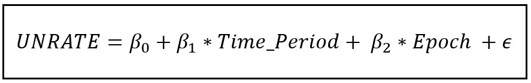
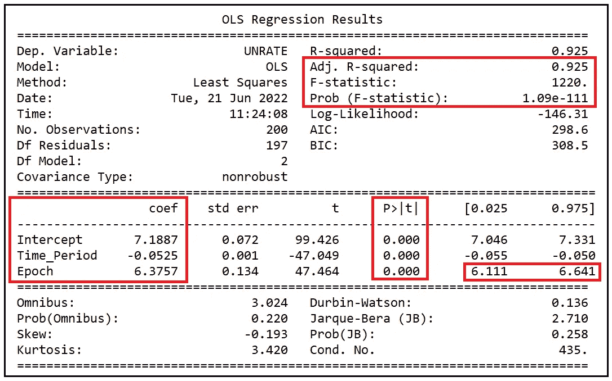
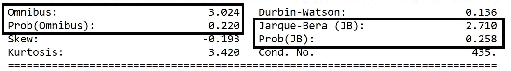
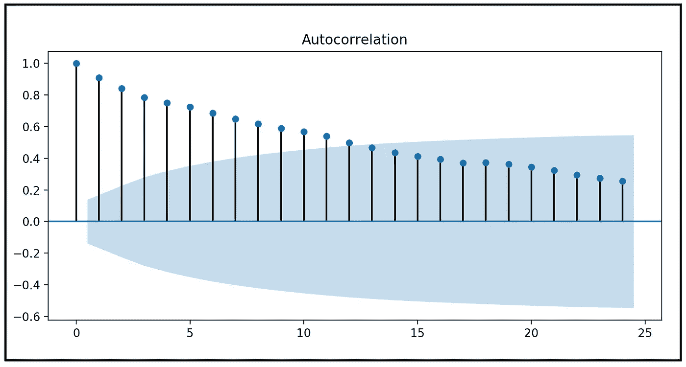

# 如何建立不连续数据的回归模型

> 原文：<https://towardsdatascience.com/how-to-build-a-regression-model-for-discontinuous-data-bf4b493a491f>

## 我们将研究如何对不连续数据的一种常见情况进行建模

大多数现实世界中生成数据的过程都受现实世界事件的支配。随着季度业绩的公布和天灾人祸的消息，股票价格会暴跌和飙升。随着金融危机、衰退和供应冲击的爆发，失业和油价等宏观经济指标会经历突然的趋势逆转。

以在足够长的时间内收集的任何真实世界的时间序列数据为例，你很难不发现至少一个趋势的急剧上升或下降，其严重程度足以将序列分为“之前”和“之后”部分。

在这种情况下，分析师的工作不仅是建立一个对这种不连续性*稳健的统计模型，而且还要估计导致这些不连续性的事件的影响。*

研究人员开发了许多技术来实现这双重目标。我们将在不连续(或几乎不连续)数据的常见情况下研究这样一种技术。

我们来看看下面这张图表，显示了美国从 2002 年 1 月 1 日到 2020 年 1 月 1 日的每周失业率。该数据包含了一次大衰退，即从 2007 年 12 月延续到 2009 年 6 月的“T2 大衰退”。


美国劳工统计局，失业率[UNRATE]，检索自弗雷德，[圣路易斯美联储银行](https://fred.stlouisfed.org/series/UNRATE)；2022 年 6 月 18 日([公共领域数据](https://fred.stlouisfed.org/searchresults/?st=unemployment&t=public%20domain%3A%20citation%20requested&ob=sr&od=desc))

如果我们希望为这些数据构建一个回归模型，我们至少有以下几种不同的方法:

1.  我们可以构建一个分段回归模型，对上述数据集的三个不同部分进行建模，即衰退之前、期间和之后的部分。
2.  我们可以使用一种称为[回归扭结设计](https://blogs.worldbank.org/impactevaluations/tools-trade-regression-kink-design)的回归技术。
3.  我们可以用一个[隐马尔可夫模型](/a-math-lovers-guide-to-hidden-markov-models-ad718df9fde8)进行实验。具体来说，一个 2 状态马尔可夫转换自回归(MSAR)模型。这两种状态将表示衰退和非衰退阶段。MSAR 模型也应该能够代表在这样的时间序列数据集中必然存在的[自相关](/the-intuition-behind-correlation-62ca11a3c4a)。
4.  最后，我们可以简单地选择在衰退期不对数据建模，从而将衰退期压缩到零宽度区域。因此，与前三种方法相反，我们不会对衰退期间时间序列的行为感兴趣。因此，我们也需要准备好丢失包含在经济衰退期数据集中的信息。

但是，如果我们简化这一点，有些人可能会说，这是一个不正确的决定，在时间序列的衰退阶段丢弃数据点，这就为以下有趣的线性模型打开了大门:



失业率的回归不连续模型(图片由作者提供)

在上面的模型中:

*   *β_0* 为截距。
*   *β_1* 是*时间周期*变量的系数。 *Time_Period* 为正整数，取 1、2、3 等。我们引入这一变量是为了捕捉经济衰退之前和之后这两个数据部分的月环比趋势。
*   *β_2* 是 [**虚拟变量**](/what-are-dummy-variables-and-how-to-use-them-in-a-regression-model-ee43640d573e) *历元*的系数。我们将位于衰退开始之前的数据集部分的*纪元*设置为 0，将位于衰退阶段结束之后的数据集部分的*纪元*设置为 1。
*   *ϵ* 是一个误差项，它捕捉了我们的模型无法解释的未评级方差。

[这里有一个到数据集](https://gist.github.com/sachinsdate/76eaeda29fab2668cd0bb637c1a14e25)的链接，该数据集包含就业率、*时间段*和*纪元*变量。它不包含衰退阶段包含的数据点。

# 建立和训练回归模型

让我们使用 Python、Pandas 和 statsmodels 来构建和训练这个模型。

我们首先将数据集加载到 Pandas 数据框架中:

```
**import** pandas **as** pd
**import** statsmodels.formula.api **as** smf
**import** statsmodels.graphics.tsaplots **as** tsa
**from** matplotlib **import** pyplot **as** pltdf = pd.read_csv(**'unemployment_rate_us_fred.csv'**, header=0)
```

接下来，让我们用 [Patsy](https://patsy.readthedocs.io/en/latest/quickstart.html) 语法构造回归表达式。

```
reg_exp = **'UNRATE ~ Time_Period + Epoch'**
```

在上面的表达式中，请注意，回归截距并未明确提及，但是当我们使用它来构建模型时，statsmodels 会自动包含它。

让我们使用 statsmodel 构建 OLS 模型。我们将回归表达式和数据集作为参数传递:

```
regdis_model = smf.**ols**(**formula**=reg_exp, **data**=df)
```

接下来，让我们训练模型并打印训练总结:

```
regdis_model_results = regdis_model.**fit**()
**print**(regdis_model_results.**summary**())
```

我们看到以下输出。我在输出中突出了几个有趣的区域:



回归模型的训练输出(图片由作者提供)

# 分析模型性能

在右上角，我们观察到[调整后的 R 平方](/the-complete-guide-to-r-squared-adjusted-r-squared-and-pseudo-r-squared-4136650fc06c)为. 925。该模型能够解释 92.5%的失业率差异。

在调整后的 R 平方的正下方，我们看到 Statsmodels 报告了用于回归分析的 [F 检验的输出](/fisher-test-for-regression-analysis-1e1687867259)。已经为我们计算了 F 统计量，其值为 1220，p 值为 1.09E-111。f 检验的输出表明，在 p 为< .001 时，模型的系数是*共同显著的*，这意味着，该模型在解释未评级的方差方面比均值模型做得更好(在这种情况下，做得好得多)。

让我们将注意力转向输出的中心部分，在这里我们可以看到系数估计值、它们的标准误差、p 值和估计值周围的置信区间。我们看到，所有三个系数的估计值在< .001.

The coefficient of *时间段*的 p 值处是显著的(— 0.0525)，这表明在衰退阶段*的任一侧，在*时间段*中，失业率估计会以 0.0525(约 5%)的*平均*率下降。*回想一下，在我们的数据集中，单位时间段是一个月。

最后，*纪元的系数*提供了一个有趣的见解。其值为 6.3757。我们的模型估计，2008 年至 2009 年的大衰退已经导致美国失业率平均增加了 6.3757%，95%的置信区间相当窄，从 6.111%到 6.641%。

## 残差分析

让我们看看 statsmodels 报告的残差正态性的 [**Jarque-Bera 和综合测试**](/testing-for-normality-using-skewness-and-kurtosis-afd61be860) 的结果:



两个测试的 p 值都在 0.05 以上，从而验证了测试的默认假设，即残差呈正态分布。这意味着，我们可以依赖模型报告的置信区间估计。这是好消息。

然而，德宾-沃森检验的统计数据在< 2.0 indicating a positive auto-correlation among the residual errors. The test’s finding is vindicated by the following auto-correlation plot:



Auto-correlation plot of the residual errors (Image by Author)

The above plot can be produced by executing the following two lines of code:

```
tsa.**plot_acf**(regdis_model_results.**resid**)
plt.**show**()
```

The plot shows a strong auto-correlation at LAG-1, which means that each value in the time series of residual errors is correlated with the value that immediately precedes it in the time series. Since values at LAG 1 and LAG 2 are correlated, and LAG 2 and LAG 3 are similarly correlated, LAG 1 and LAG 3 are also correlated but to a lesser extent. Thus we see a gently sloping curve of correlations at the other lags also.

A strong auto-correlation of this type in the residuals implies that our model is missing one of more key explanatory variables. Or, the entire functional form of our model may need to be revisited. Perhaps, one of the other three kinds of models suggested at the beginning of the article would prove to be more effective in explaining the variance in UNRATE.

Nevertheless, our plucky little linear model seems to have held up well to the scrutiny. It has allowed us to model the discontinuity that *出来，我们将*引入失业数据集中。它不仅估计了大衰退双方的失业趋势，还为我们提供了一种科学估计大衰退对失业率影响的方法。

# 参考文献、引文和版权

## 数据集

美国劳工统计局，失业率[UNRATE]，从圣路易斯美联储银行检索；https://fred.stlouisfed.org/series/UNRATE[。(在](https://fred.stlouisfed.org/series/UNRATE)[公共领域](https://fred.stlouisfed.org/searchresults/?st=unemployment&t=public%20domain%3A%20citation%20requested&ob=sr&od=desc)可用)。本文中使用的数据集的精选版本 [**可以从这里**](https://gist.github.com/sachinsdate/76eaeda29fab2668cd0bb637c1a14e25) 下载。

## 形象

本文中的所有图片版权归 [Sachin Date](https://www.linkedin.com/in/sachindate/) 所有，版权归 [CC-BY-NC-SA](https://creativecommons.org/licenses/by-nc-sa/4.0/) 所有，除非图片下面提到了不同的来源和版权。

*如果您喜欢这篇文章，请关注我的*[***Sachin Date***](https://timeseriesreasoning.medium.com)*以获得关于回归、时间序列分析和预测主题的提示、操作方法和编程建议。*