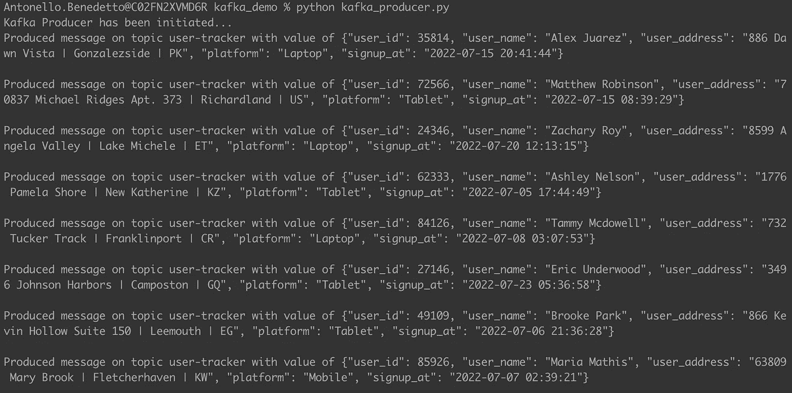
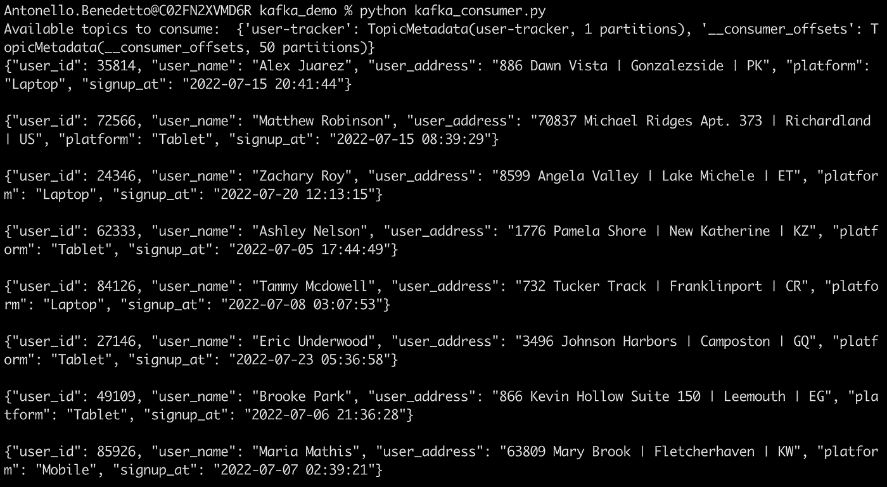

# 如何用 Python 构建一个简单的 Kafka 生产者和消费者

> 原文：<https://towardsdatascience.com/how-to-build-a-simple-kafka-producer-and-consumer-with-python-a967769c4742>

## 阿帕奇卡夫卡建筑简介。


Johannes Plenio 在 Pexels.com 拍摄的照片

## 建议的点播课程

*我的一些读者联系我，要求提供点播课程，以了解更多关于* ***阿帕奇卡夫卡*** *的知识。这是我推荐的 3 个很好的资源:*

*   [**阿帕奇卡夫卡数据流&阿帕奇火花纳米级****【uda city】**](https://imp.i115008.net/zaX10r)**→**[*通过此链接获得高达 70%的优惠*](https://imp.i115008.net/jWWEGv)
*   [**数据工程纳米学位(UDACITY)**](https://imp.i115008.net/zaX10r)
*   [**使用 Python 的数据工程—职业轨迹(DATACAMP)**](https://datacamp.pxf.io/0JVkoM)

***>>>****还不是中等成员？考虑与我的* [***推荐链接***](https://anbento4.medium.com/membership) *签约，以获得 Medium 必须提供的一切，费用低至每月 5 美元***！**

# *介绍*

*在您作为数据工程师的职业生涯中，您会自然而然地超越批处理(*这意味着查询有界数据集*)，并熟悉流处理中使用的工具。在流处理中，数据是无限的，并且在查询时可能是不完整的。*

*业界领先的流数据框架之一是 **Apache Kafka** 。Kafka 是一个工具，它允许工程师根据主题实时生成数据。消费者可以读取和处理存储在这些主题中的数据。*

*从概念上讲，主题类似于数据库中的表，但是主要的区别在于，在数据库中记录可以被覆盖，而 Kafka 将主题作为日志来维护，这些日志是**只附加事件**的有序集合。主题可以存储为单个日志，也可以水平扩展为分区。*

*在本教程中，您将学习如何构建一个本地 Apache Kafka 集群。你还将学习如何使用 Python 在卡夫卡中创建**生产者**和**消费者**。尽管有许多 Kafka Python 库，但在这里你会熟悉由 [Confluent](https://www.confluent.io/en-gb/) 提供的一个。*

*要安装这个库，使用下面的`pip`命令:*

```
***pip3 install confluent-kafka***
```

*一旦安装了库，您将能够在您的应用程序中导入它。*

*在讨论生产者和消费者之前，下一节将带您通过 Docker 设置一个本地 Kafka 集群。*

# ***用 Docker 运行一个本地 Kafka 集群***

*为了在本地运行 Kafka 集群，你需要两样东西:Kafka **经纪人**和**动物园管理员**。*

*代理是一台机器- *托管一个或多个分区* -负责处理向这些分区写入新事件或从中读取事件的请求。根据具体的用例，Kafka 集群可以由一台机器或一个机器网络组成*

*相反，Zookeeper 被定义为一种集中式服务，它在分布式系统中提供灵活和健壮的同步，并跟踪 Kafka brokers 的状态以及主题和分区。*

*设置它们最方便的方法是使用 Docker compose 文件来运行多个容器，并使用一个配置脚本启动所有的东西。*

*在本教程中，您将使用存储在 [this](https://github.com/anbento0490/code_tutorials/tree/master/kafka_demo) GitHub repo 中的`docker-compose.yaml`文件(*记得保存在与 Kafka 生产者和消费者 Python 文件*相同的目录中)。通过打开`docker-compose.yaml`，你会看到下面的代码:*

*上面的配置文件和 confuent '[**Apache Kafka 快速入门**](https://developer.confluent.io/quickstart/kafka-docker/) 页面上共享的模板几乎一模一样。*

*如您所见，它利用了 [**融合图像**](https://hub.docker.com/u/confluentinc/) 的优势，因此运行它将确实创建两个容器，一个用于代理，一个用于 Zookeeper。要通过 CLI 构建这两个容器，请使用以下命令:*

```
***docker-compose up -d***
```

*这将引导您看到提示:*

```
*Status: Downloaded newer image for confluentinc/cp-zookeeper:7.0.1
Status: Downloaded newer image for confluentinc/cp-kafka:7.0.1
Creating zookeeper ... done
Creating broker    ... done*
```

*恭喜你！您已经通过 Docker 在本地成功建立了一个 Kaka 集群。*

# ***打造一个卡夫卡制作人***

*既然您的 Kafka 集群正在后台运行，那么有趣的部分来了:*用 Python* 构建一个生成器。*

*要编写一个生产者，您应该创建一个生产者实例，发送数据并监听确认。在下面的例子中，您将使用 [Faker](https://faker.readthedocs.io/en/master/) 模拟关于用户的虚假数据的生成，并将它们写入到`user-tracker`主题中。要执行的步骤如下:*

*   *导入所需的库并创建一个 faker 对象:*

```
*from confluent_kafka import Producer
from faker import Faker
import json
import time
import logging
import random fake=Faker()*
```

*   *配置日志的格式。每当有新事件可用时，日志将被附加到主目录中的一个`producer.log`文件中:*

*   *通过指定 Kafka 集群的端口来创建生成器:*

*   *定义一个负责确认新消息或错误的*回调*函数。当一个有效的信息变得可用时，它被解码成`utf-8`并以首选格式打印出来。相同的消息也会附加到日志文件中:*

*   *编写一个生产者循环，模拟当前月份中十个**用户注册事件的创建。每条消息都从字典转换成 json 格式发送给 Kafka:***

*如您所见，在向 Kafka 发送数据之前，`main()`函数正在调用`poll()`向生产者请求任何以前的事件。如果找到，事件被发送到回调函数(*回执*)。在这种情况下，`p.poll(1)`意味着允许 1 秒的超时。*

*最后，生产者也被刷新(`p.flush()`)，这意味着阻塞它，直到先前的消息被有效地传递，使它同步。*

*构建 Kafka 生成器的完整代码可从这里获得。如果您现在尝试使用以下命令通过 CLI 运行它:*

```
***python kafka_producer.py***
```

*输出将是发送到 Kafka 集群上的`user-tracker`主题的消息(以及写入`producer.log`文件的消息),终端将显示确认，如下所示:*

**

*通过 CLI 运行 Kafka 生成器的结果*

# *建立一个卡夫卡式的消费者*

*在卡夫卡的作品中，消费者生来就是为了阅读并经常*清理、转换*或*丰富来自主题的信息。在其核心，消费者作为一个无限循环运行，等待消息被传递到他们正在收听的主题。**

*可以从头开始阅读消息(主题中的第一条消息*)或从主题中的特定位置开始阅读，称为*偏移，由 Zookeeper 跟踪*。**

*下面的代码将向您展示如何构建 Python 消费者:*

*   *导入`Consumer`库并创建消费者实例。您需要传递 Kafka 集群正在运行的端口、一个消费者组名称，以及偏移重置(*，在这里消费者应该开始读取*):*

*   *确定应该消费的主题的名称并订阅它。如果有不止一个主题可用，您可以使用`list_topics().topics`命令列出它们的名称:*

*   *为了开始接收事件，您创建了一个无限循环来轮询主题，寻找任何可用的消息。用户始终可以调整到从特定偏移开始和停止:*

*特别是，以下代码的行为方式如下:*

*   **如果没有消息，它就一直等待，**
*   **如有错误，将显示**
*   **当消息为资金时，将被解码为* `*utf-8*` *:**

*构建 Kafka 消费程序的完整代码可在[这里](https://gist.github.com/anbento0490/3784bd7e061351624c8f76cb2c369409)获得。如果您现在在终端中打开两个窗口并再次运行生成器:*

```
***python kafka_producer.py***
```

*其次是消费者:*

```
***python kafka_consumer.py***
```

*您会注意到，由生成的生成的消息将在短暂延迟后开始显示在使用者窗口中:*

**

*通过 CLI 运行 Kafka 消费程序的结果*

*这意味着您的消费者正在按预期工作…*成功了！**

# *结论*

*在本文中，您开始了解 Kafka，特别是如何使用 Python `confluent_kafka`包创建一个简单的 Kafka 生产者和消费者。*

*《T4》是一个很基本的例子，说明了如何利用卡夫卡作为一种技术(*只是触及了表面！但是应该给你一个架构的概念，以及如何开始构建更高级的逻辑。**

# *来源*

*   *[**用 Python 进行数据工程(电子书—第 12–13 章)**](https://www.oreilly.com/library/view/data-engineering-with/9781839214189/)*
*   *[**阿帕奇卡夫卡经纪人基础知识**](https://developer.confluent.io/learn-kafka/apache-kafka/brokers/)*
*   *[**什么是 Zookeeper，为什么阿帕奇卡夫卡需要它？**](https://www.cloudkarafka.com/blog/cloudkarafka-what-is-zookeeper.html#:~:text=Zookeeper%20keeps%20track%20of%20status,configuration%20service%20within%20the%20system)*
*   *[**卡夫卡《同花顺》与《民意测验》的区别**](https://stackoverflow.com/questions/52589772/kafka-producer-difference-between-flush-and-poll)*

# ***你可能也会喜欢***

*[](/3-nanodegrees-you-should-consider-to-advance-your-data-engineering-career-in-2021-baf597debc72)  [](/pyflink-how-to-create-a-table-from-a-csv-source-ca4851a71d0c)  [](/3-ways-to-create-tables-with-apache-spark-32aed0f355ab) *