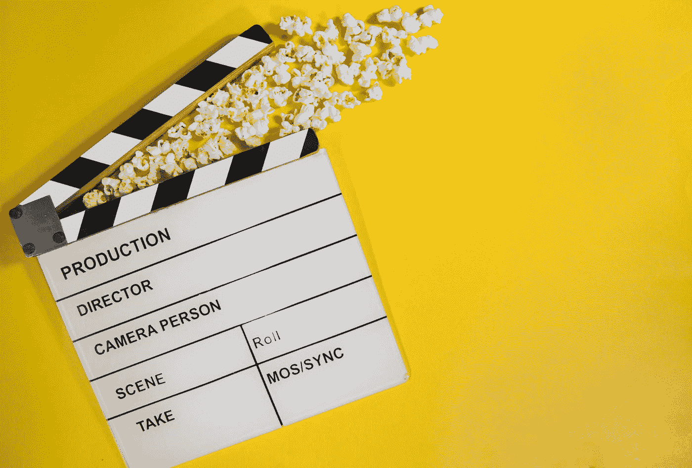
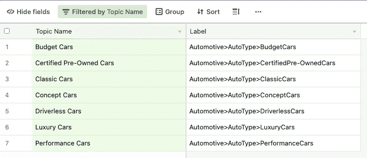
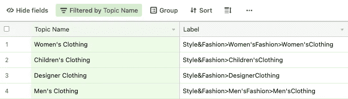
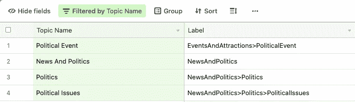
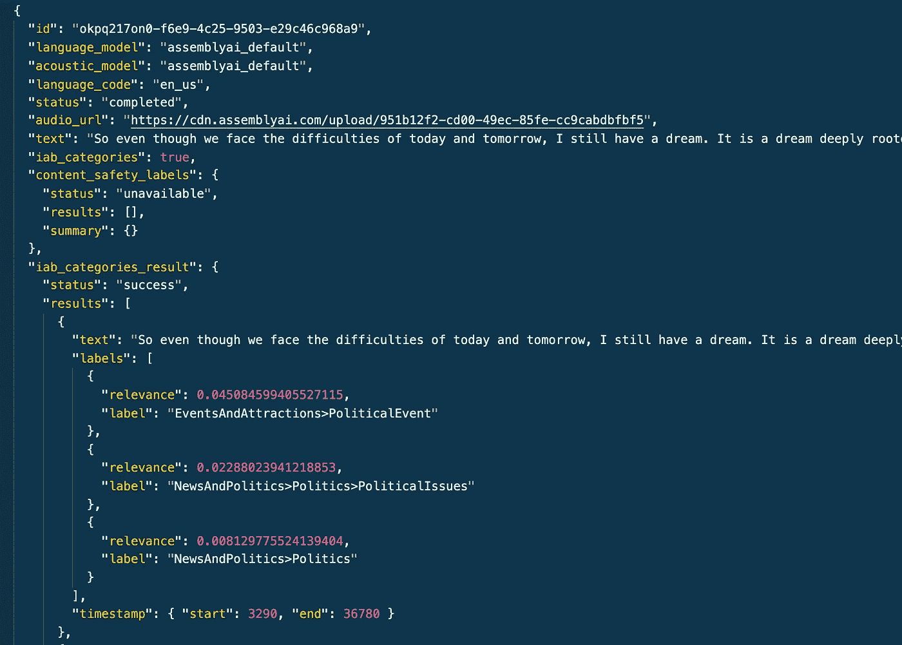
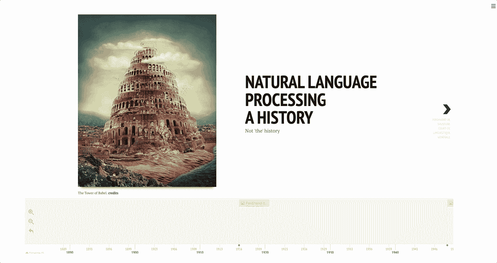

# 如何构建一个 Streamlit 应用程序来从 YouTube 视频中提取主题

> 原文：<https://towardsdatascience.com/how-to-build-a-streamlit-app-to-extract-topics-from-youtube-videos-9c7aebbfab8e>

## AssemblyAI 的主题检测功能概述



[GR Stocks](https://unsplash.com/@grstocks?utm_source=medium&utm_medium=referral) 在 [Unsplash](https://unsplash.com?utm_source=medium&utm_medium=referral) 上拍照

想象一下，运行一个平台，用户定期上传自己的视频。你将如何对这些不断增长的内容进行分类，并在相关类别中进行标记，以便将来的访问者可以轻松找到它们？

第一种方法是分析用户补充的元数据。这通常是文本格式。它可以是一个标题或描述，有时是一系列标签——(这就是 Youtubers 所做的)

但是如果这些元数据丢失了呢？你还能对视频内容进行分类吗？

> ***本帖将尝试通过使用***[***assembly ai***](https://www.assemblyai.com/)***语音转文本 API 及其话题检测*** [***特性***](https://docs.assemblyai.com/audio-intelligence#topic-detection-iab-classification) ***来回答这个问题。我们将了解这项功能是如何工作的，以及如何将它嵌入到从 Youtube 视频中提取主题的 Streamlit 应用程序中。***
> 
> ***最后将提供演示和代码*** *💻*。

事不宜迟，让我们来看看🔍。

👉如果你想了解更多关于 AssemblyAI API 的知识，我建议你阅读我之前的两篇文章:

[](/how-to-transcribe-and-analyze-audio-files-with-python-and-assemblyai-22660dbf8e66)  [](/how-to-moderate-audio-data-using-python-and-assemblyai-a5eab9910730)  

# 一种新颖的话题检测方法

AssemblyAI 提供了一个人工智能支持的功能，可以提取音频或视频文件中的主题。

我发现这个功能有趣的地方是 AssemblyAI 如何处理主题检测问题。

令人惊讶的是，它似乎没有使用经典的无监督 NLP 技术，如潜在狄利克雷分配(LDA)或潜在语义索引(LSI)。

相反，AssemblyAI 应用的是一个包含 689 个类别的标准化分类法上的多标签分类。

乍一看，这似乎有点牵强，但是在多个例子上运行 API 之后，结果证明是相当令人信服的。我们将在演示中看到更多相关内容。

AssemblyAI 使用的分类法被称为 [IAB 分类法](https://www.iab.com/guidelines/content-taxonomy/)。它由互动广告局维护，这是一个为在线广告制定行业标准的美国组织。因此，它被出版商用来轻松地组织他们的网站内容。这也使得提取的主题适合于**上下文定位**场景。

这是一个详细描述 IAB 分类的表格。

我仔细看了一下，发现它确实涵盖了广泛的主题。以下是一些例子:

*   **关于汽车的话题**



作者截图

*   **关于服装的话题**



作者截图

*   **关于政治的话题**



作者截图

现在你可以争辩说，你的音频文件可能集中在一些不属于这个分类的非常具体的主题上。在这种情况下，您可以使用 AssemblyAI 首先获取脚本，然后使用定制方法自己执行提取。

# 如何激活话题检测功能？

就像激活内容审核特性一样，激活主题检测就是在请求体中添加一个参数。该参数是`iab_categories`键，必须设置为真。

要执行转录和主题检测，您可以使用以下 shell 命令从终端调用 API:

使用 Python，这可以转化为:

当您发送 POST 请求时，会向处理队列提交一个转录作业。此任务是异步的，可能需要一些时间才能完成。

为了等待处理队列完成并在之后获取输出，您可以很容易地想象一个 **while-loop** ，它会休眠一段时间并继续运行，直到处理完成。

一旦转录完成，您应该得到以下输出。



作者截图—带话题检测的转录

有一些常见的东西:你可以查看 API [文档](https://docs.assemblyai.com/walkthroughs#getting-the-transcription-result)来了解更多关于这些字段的信息。

新增的是返回话题检测结果的`**iab_categories_result**`键。

每个结果对应于音频文件的一部分(该部分由`start`和`end`时间戳界定),并且具有提取的主题列表(也称为标签),这些主题按照相关性的降序排序。

例如，马丁·路德·金演讲的第一部分分为:

*   **事件和选举>政治事件**
*   新闻和政治政治政治政治问题 T21
*   **新闻与政治>政治**

# 从 YouTube 视频中提取主题🎥

这个周末我有一些空闲时间，所以我构建了一个从 Youtube 视频中提取主题的 Streamlit 应用程序。

在寻找可视化结果的直观方式时，我首先遇到了[**streamlit-timeline**](https://pypi.org/project/streamlit-timeline/)，这是一个 Streamlit 组件，允许您可视化带有时间编码事件的交互式时间线。



作者 GIF

我考虑显示视频中同时开始的部分，而不是事件。然而，我很快就面临着在每张幻灯片中嵌入相应视频的问题。

这时候我转到了 [**streamlit-player**](https://github.com/okld/streamlit-player) 。

该组件允许您在 Streamlit 中嵌入 Youtube 视频，通过正确的参数设置，它甚至可以使视频在特定的时间戳开始和结束:这对于用例来说是完美的。

# *试玩！🚀*

在分享代码之前，这里有一个一分钟的视频演示。

作者的视频——使用 AssemblyAI 从 Youtube 视频中提取主题的 Streamlit 应用程序演示

这款应用非常简单:它首先要求你提供一个视频网址，一旦你点击了转录按钮，它就会执行一系列任务:

1.  它从 YouTube 视频中提取音频
2.  它把音频上传到 AssemblyAI 服务器
3.  它提交一个带有主题提取的转录作业
4.  它获取结果并保存它们
5.  它显示输出:对于每个结果，它嵌入相应的视频部分、转录的文本以及提取的主题列表。

**该应用已上线。你可以在这里试用一下**[](https://share.streamlit.io/ahmedbesbes/assemblyai/main/app.py)****:**注意，它使用的是我的 API 密匙，链接到一个自由计划账户。如果每月使用量超过其限制，您将无法转录视频。**

**但是，您仍然可以可视化一些预先计算的示例。**

**如果你想在本地运行应用程序，代码可以在 [**Github**](https://github.com/ahmedbesbes/assemblyai) 上找到。您可以通过简单地安装需求并启动 Streamlit 命令来运行它。**

```
**git clone** [**git@github.com**](mailto:git@github.com)**:ahmedbesbes/assemblyai.git
cd assemblyai/
pip install requirements.txt
streamlit run app.py**
```

**如果您对代码有任何疑问，请随时联系我们。**

# **深入挖掘参考资料**

*   **[https://docs . assembly ai . com/audio-intelligence # topic-detection-iab-classification](https://docs.assemblyai.com/audio-intelligence#topic-detection-iab-classification)**
*   **[https://github.com/okld/streamlit-player](https://github.com/okld/streamlit-player)**
*   **[https://towards data science . com/how-to-transcripte-and-analyze-audio-files-with-python-and-assembly ai-22660 dbf8e 66](/how-to-transcribe-and-analyze-audio-files-with-python-and-assemblyai-22660dbf8e66)**
*   **[https://towards data science . com/how-to-moderate-audio-data-using-python-and-assembly ai-a5eab 9910730](/how-to-moderate-audio-data-using-python-and-assemblyai-a5eab9910730)**

# **感谢阅读🙏**

**这是我在 AssemblyAI 系列的第三篇文章。我希望您能从这个软件和我们构建的 Streamlit 应用程序中学到一些有用的东西。**

**不要犹豫克隆代码或运行它。如果你有问题，你可以联系我。**

**下一个帖子将是关于 AssemblyAI 的最后一个帖子:它将涵盖实时转录，敬请关注。**

**今天就这些了。下次见！👋**

# **新到中？你可以每月订阅 5 美元，并解锁各种主题的无限文章(技术、设计、创业……)你可以通过点击我的推荐链接[来支持我](https://ahmedbesbes.medium.com/membership)**

**[](https://ahmedbesbes.medium.com/membership)  

由[路易斯·史密斯](https://unsplash.com/@louisesmithma?utm_source=medium&utm_medium=referral)在 [Unsplash](https://unsplash.com?utm_source=medium&utm_medium=referral) 上拍摄的照片**