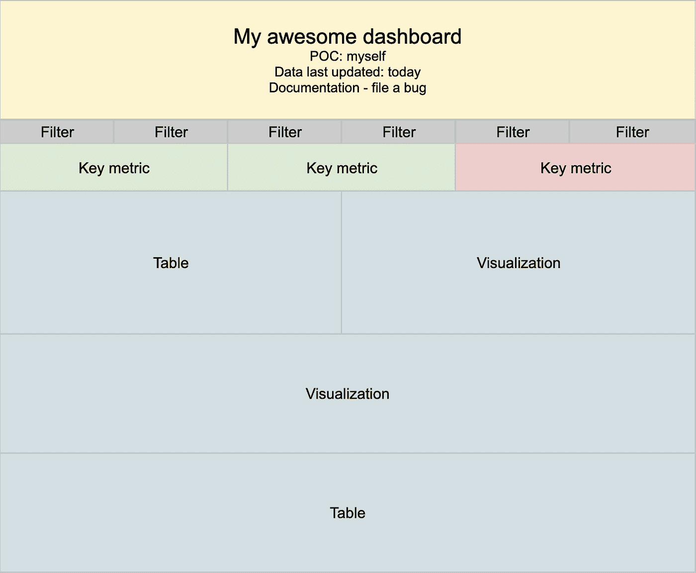

# 如何构建成功的仪表板

> 原文：<https://towardsdatascience.com/how-to-build-a-successful-dashboard-359c8cb0f610>

## 一份清单，来自某个制造了几个不成功产品的人

在我人生的这个阶段，我想我已经设计了一百多个不同的仪表盘。随着我越来越资深并开始管理一个团队，我对这些任务变得越来越谨慎——质疑每个仪表板请求的实际需求和期望值。构建一个有效的仪表板实际上需要时间——当需求没有被正确定义时，它会很快变成一个数月的噩梦(最终没有人使用它)。

人们通常会很快要求一个新的仪表板。构建仪表板是做一些实际上有形的事情，也就是说，你正在构建一个可以在“真实世界”中发布的产品(与研究相反，研究更抽象)。但是最终，如果没有一个明确的问题可以由仪表板解决，或者如果构建仪表板的成本比它将创造的价值更重要，那么接受这个项目可能是浪费时间。

由于您的时间很宝贵，下面是一个清单，遵循它可以增加您的仪表板项目的成功机会。

在 [Unsplash](https://unsplash.com?utm_source=medium&utm_medium=referral) 上由 [Carlos Muza](https://unsplash.com/@kmuza?utm_source=medium&utm_medium=referral) 拍摄的照片

## 步骤#1:定义用例及受众

在开始实际工作之前，您应该清楚一些事情，特别是:您为什么要构建这个仪表板，以及为谁构建。

> “艰难的选择，轻松的生活。容易的选择，艰难的生活。”——杰西·格雷戈雷克

根据我的经验，在这个阶段，重要的是要明确什么是用例，**不是用例，以及谁是目标受众。如果你在一开始就做出这些“艰难”的选择，这会让你的生活变得更容易——所以请确保正确回答以下问题:**

*   **这个仪表盘试图解决什么问题？这将是需要回答的第一个问题。如果你的仪表板不能解决任何问题，人们就不会使用它。通过清楚地定义问题，您可以更好地了解仪表板将产生什么价值，这可以帮助您估计您在这个项目中的个人投资应该是多少(参见我的文章“如何选择要处理的数据项目”以获得更多信息！)**
*   **对什么不会有用？**清楚仪表盘的用处和用处，可以让你确保自己没有使用仪表盘，也就是说，过多的信息淹没了界面，使其难以使用。它对内部品牌也非常有用——如果很明显你的仪表板只对做 X 有用，你的仪表板在内部会被称为做 X 的仪表板。
*   谁将是该仪表板的受众？为您的受众量身定制体验。例如，如果你的读者不熟悉你所报道的业务，你应该在数据中加入更多的内容。如果他们不知道如何使用过滤器，你就不应该添加过滤器。如果他们主要使用他们的移动设备，确保它是移动友好的。招募一些能够代表你的受众的测试人员——他们可以给你关于任何模型和最终产品的反馈。
*   **你如何知道你的仪表板是否成功？**这是一个棘手的问题，经常被忽视。在这个项目结束时，你会希望有一个简单的标准来决定这是成功还是失败。它可以是基于使用的(例如，“每月有超过 X 人连接到仪表板”)，也可以是基于项目的(例如，“大多数项目 Y 的决策都是基于仪表板提供的数据”)。

## 第二步:基准//寻找灵感

既然你对成功的样子和你应该建立的东西有了一个清晰的想法，现在是时候更好地了解你的受众以及他们与数据的关系了。他们在数据之旅中处于什么位置？他们目前在使用哪些数据？他们的数据梦想是什么？理解它们是让您的仪表板成功的关键:

*   **我们的组织过去是否尝试过解决这个问题？如果你不了解过去，你如何建设未来？如果一个解决方案在过去已经被尝试过，学习什么可行，什么不可行可能是非常强大的。**
*   **哪些仪表板受您的受众欢迎？**你的受众已经在内部消费数据，他们可能已经习惯于看到以某种方式呈现的数据。他们是否习惯于看到它被特定维度分割？他们会喜欢你遵循特定的命名惯例吗？研究这些仪表板可以给你一个项目该做和不该做的清单。
*   **没有这个仪表板，您的受众目前过得怎么样？**了解你的受众目前在没有仪表盘的情况下做了什么，有助于理解他们需要仪表盘的最低价值是什么，换句话说，你的仪表盘最少应该做什么，并相应地优先考虑功能

## 步骤#3:原型和构建

仪表板的用户体验在仪表板的成功中起着重要的作用，而分析师们常常忽略了它的重要性。请不要忘记，仪表板是一种有形的产品，应该定期使用，确保这一点的最佳方式是与您的潜在用户一起开发它:

*   首先制作模型。建立模型(尤其是简单的，在电子表格上)并让你的潜在用户运行它，可以让你确保你覆盖了他们所有的用例，并且 UX 是理想的。保持简单专注于它试图解决的问题。想一想[【倒金字塔原理】](https://www.nngroup.com/articles/inverted-pyramid/#:~:text=In%20journalism%2C%20the%20inverted%20pyramid,supporting%20details%20and%20background%20information.)如何呈现数据。对正确类型的数据使用正确的可视化。
*   **让你的潜在高级用户运行这些模型。用一些实际数据填充模型，并展示给你的 beta 测试人员(你在步骤 1 中确定的)。观察他们如何使用模型(即他们的用户旅程)，以及他们是否能够自己找到所需的信息。如果他们没有，或者他们的用户之旅很痛苦——重复并再试一次。**

你令人敬畏的嘲笑(作者图片)

*   **构建仪表板！现在一切都已经通过了验证，你的 beta 测试人员也欣喜若狂，继续构建仪表板吧。确保数据加载足够快，不同部分之间保持一致，并且数字使用正确的格式。**

## 第四步:测试，测试，测试

在发布之前确保仪表板工作似乎是显而易见的。但是“作品”是什么意思呢？这意味着“你的观众能够找到他们正在寻找的信息”,它有多个组成部分:

*   **数字是否正确/它们是否匹配不同的数据源？没有什么比一个报告“错误”数字的仪表盘更具破坏性的了——你的听众可能会立刻失去信任。查看报告相同指标的其他仪表板和数据源，并验证您是否报告了相同的内容。**
*   **主要用户旅程是否按预期运行？**在步骤 3 中，您确定了一系列关键用户旅程(CUJs)。试着按照这些建议去做，看看你是否能够完成关键任务——如果你不能，你应该解决这个问题。
*   **不同的测试人员对最终产品满意吗？**最后一次向你的 beta 测试人员寻求帮助，让他们在仪表盘上尽情驰骋。特别注意他们的问题——这些问题通常是缺少了什么或没有足够的上下文，以及仪表板可能没有按预期工作的信号。

## 第五步:记录一切

还记得在步骤 2 中，当你发现有人已经试图解决这个问题并记录了他们的努力时，你有多开心吗？现在是你回报的时候了！

*   **数据来自哪里，如何转换？**确保开始一个产品需求文档(PRD ),以记录数据来自哪里以及您正在应用哪种潜在的转换(以及为什么)。
*   **你实际构建这个仪表盘的所有步骤是什么？**将它添加到 PRD 中——这对你开始另一个项目后接手的同事很有用。
*   **还有其他一些潜在的考虑吗？**使用 beta 测试人员提出的问题(来自步骤 4)建立一个 FAQ，并直接从仪表板链接(可能在 PRD 旁边)。

## 第六步:发布杰作

你完了！现在是时候走向市场，向世界展示您的非凡作品，并接受祝贺信息了:

*   **向所有相关利益方发送发布电子邮件。确保你写好了发布邮件，你只有一次机会留下第一印象。**
*   考虑组织一次培训。如果仪表盘有点复杂，或者只面向少量用户，那么组织一次培训来确保他们知道如何使用它，并从中获得最大价值可能会很有意思。这也是为将来的迭代收集反馈和/或特性请求的好方法。
*   **确定您的仪表板可被发现。**如果您有一个集中的知识管理系统，请确保您的仪表板是该系统的一部分，并且您已经尽可能地对其进行了优化，以便能够找到它。

## 步骤 7:验证你的仪表板是成功的

还记得您在步骤 1 中为该仪表板定义的成功标准吗？现在是时候使用它，并了解你是否成功了。您是否获得了预期的用户数量？您的仪表板是否帮助正确的人做正确的事情？如果没有——调查哪里出了问题，要么修复它，要么从中吸取教训。如果是的话——庆祝吧，因为生命太短暂了。

## 你完了！嗯……暂时的。

因为仪表板是一种有形的产品，应该定期使用，而且一旦发布了仪表板，很多事情都可能出错(例如，目标受众可能会随着时间的推移而改变，一般需求也可能会发生变化，上游数据源可能会更新，等等。)—您应该确保您有适当的流程来维护它并相应地更新它。启动是一回事，确保它长期成功是另一回事(我将在另一篇文章中谈到这一点)..我想请继续关注。)

希望你觉得这篇文章很有见地，我的这篇长文没有让你厌烦。你会在这个清单上添加什么吗？请在评论区告诉我！

# 感谢阅读！

如果你觉得“有趣”,可以看看我的其他文章:

</one-simple-methodology-to-turn-a-subjective-concept-into-an-objective-metric-14943cf6fb95>  </7-tips-to-avoid-public-embarrassment-as-a-data-analyst-caec8f701e42>  </how-to-choose-which-data-projects-to-work-on-c6b8310ac04e> 