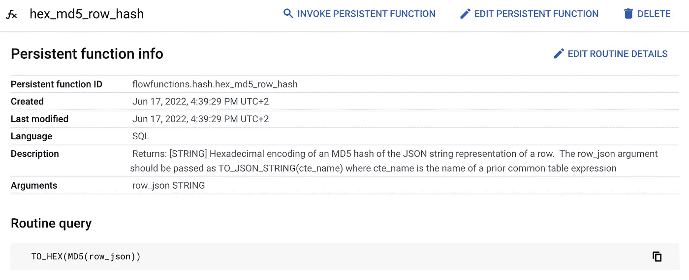
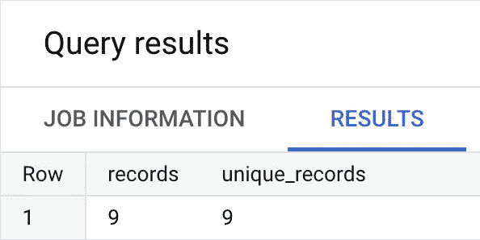
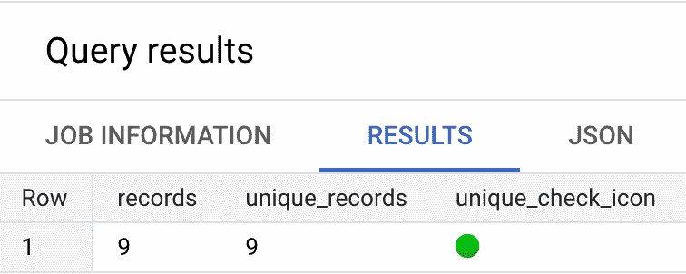

# 如何在 BigQuery 中使用 SQL 构建唯一的 MD5 行散列(加上一些相关的东西)

> 原文：<https://towardsdatascience.com/how-to-build-a-unique-md5-row-hash-using-sql-in-bigquery-plus-a-few-related-things-e6f71820f38b>

## 使用原生 BigQuery 功能在 SQL 中生成动态的、唯一的行标识符


不是那种杂碎。在 [Unsplash](https://unsplash.com?utm_source=medium&utm_medium=referral) 上由 [Richard T](https://unsplash.com/@newhighmediagroup?utm_source=medium&utm_medium=referral) 拍摄的照片

# 动机

您可能有许多不同的原因想要为 BigQuery 数据集中的每一行数据构建散列，但它们主要与 BigQuery 中没有强制主键这一事实有关。

这意味着您的数据可能包含重复的行，无论是来自上游数据收集或传输错误、错误配置的数据摄取工具，还是仅仅因为意外加载了某个内容两次。

或者别的什么。谁知道呢？

无论重复的来源是什么，你都应该试着理解*它们是什么*，并可能把它们过滤掉(如果你关心这类事情，也要找出根本原因……仅供参考，你可能应该这样做)。

如果*的数据中确实有*的重复行，那么一旦你开始应用更复杂的转换(如连接),你就有放大错误并使下游流程、模型和决策无效的风险，这会耗费来之不易的信任，并可能导致其他不可预测的、不想要的结果。

或者也许没人会注意到。那会更好还是更坏？

无论您的数据来自何处，在任何数据质量保证流程(以及数据转换流程)中，确认源数据的每一行都是独一无二的，这始终是一个有价值的步骤，既能让您安心，又能让下游数据消费者和系统放心。

[散列函数](https://en.wikipedia.org/wiki/Hash_function)的一个简化定义是，它是一个从任意字符串输入中输出唯一的固定长度字符串的函数。它实际上比这更专业一点，因为它是一个字节数组，但它的行为像一个字符串，所以这是一个很好的看待它的方式。

需要理解的最重要的几点是:

*   *对输入的任何*更改都会导致不同的散列
*   它只有一种工作方式——您*不能*从散列中反算输入，但是您*可以*验证输入是否相同
*   散列使您能够检查输入是否完全相同，这对于有效的验证非常有用，尤其是在不同的系统之间，因为这样您就可以使用相同算法的特定语言实现

# 情况

我们将部署一些不同的本地函数和技术，以优雅、简洁和动态的方式解决这个问题。

对于这些例子，我们将使用`zoo_elephants`表，它包含一些虚构的大象的西瓜年消费量的完全虚构的数据，并且是公共的，因此任何经过身份验证的 BigQuery 用户都可以查询。数据中没有重复项(但我们希望/需要证明这一点)。要检查 BigQuery 控制台中的数据，请执行以下查询:

```
SELECT *
FROM flowfunctions.examples.zoo_elephants
```

您将在结果面板中看到数据，带有简单的模式:

```
animal STRING,
name STRING,
year INT64,
watermelons INT64
```

# 解决办法

1.  [**TO _ JSON _ STRING()**](https://cloud.google.com/bigquery/docs/reference/standard-sql/json_functions#to_json_string)

这是一个极其健壮和强大的函数，它(在许多用例中)使您能够向一个公共表表达式添加一列，该表达式是每行的 JSON 表示。要了解其工作原理，请尝试以下查询:

```
WITH
inbound_zoo_elephants AS (
SELECT *
FROM flowfunctions.examples.zoo_elephants
) SELECT *, 
TO_JSON_STRING(inbound_zoo_elephants) AS row_json
FROM inbound_zoo_elephants
```

您将看到输出数据现在有一个额外的列，包含数据的 JSON 表示，例如第一行的`row_json`列包含值:

```
{"animal":"Elephant","name":"Beepbeep","year":2018,"watermelons":1032}
```

如果在函数中添加一个`true`可选`pretty_print`参数:

```
TO_JSON_STRING(inbound_zoo_elephants, true) AS row_json
```

然后你可以把它打印得很漂亮，用换行符来表示行中的数据:

```
{
"animal": "Elephant",
"name": "Beepbeep",
"year": 2018,
"watermelons": 1032
}
```

这个输出较长，但更容易阅读，这可能是有用的。然而，在我们的用例中，额外的空白是不必要的。

**2。** [**MD5()**](https://cloud.google.com/bigquery/docs/reference/standard-sql/hash_functions#md5)

现在对于散列函数…有几个不同的选项，给出不同长度和类型的输出。我们将使用一个简单的 [MD5](https://cloud.google.com/bigquery/docs/reference/standard-sql/hash_functions#md5) ，尽管它显然被[加密破解](https://en.wikipedia.org/wiki/MD5)，返回 16 个字符，足以满足我们的用例。其他选项有 [FARM_FINGERPRINT](https://cloud.google.com/bigquery/docs/reference/standard-sql/hash_functions#farm_fingerprint) (返回一个可变长度的有符号整数) [SHA1](https://cloud.google.com/bigquery/docs/reference/standard-sql/hash_functions#sha1) 、 [SHA256](https://cloud.google.com/bigquery/docs/reference/standard-sql/hash_functions#sha256) 和 [SHA512](https://cloud.google.com/bigquery/docs/reference/standard-sql/hash_functions#sha512) ，分别返回 20、32 和 64 字节，对于密码用例更安全。然而，MD5 显然是最短的一个，因此它占用较少的屏幕空间(加上这不是一个加密用例)，所以我们要用它:

```
WITH
inbound_zoo_elephants AS (
SELECT *
FROM flowfunctions.examples.zoo_elephants
),add_row_json AS (
SELECT *,
TO_JSON_STRING(inbound_zoo_elephants) AS row_json
FROM inbound_zoo_elephants
) SELECT *,
MD5(row_json) AS row_hash
FROM add_row_json
```

您将看到第一行的`row_hash_column`值类似于:

```
xFkt7kQAks91FtJTt5d5lA==
```

这包含字母数字以及特殊字符，这将有助于我们的目标，但*可能会导致其他问题。*

例如，您需要三次单击它来选择它，如果您双击它，那么您只会得到第一个特殊字符(在本例中:=)之前的字符串。如果你像我一样，是一个容易犯人为错误的人，这可能是个问题。

继续，试着选择它。然后取消选择它。然后再次选择它。挺烦的吧？

**3。** [**到 _ 十六进制**](https://cloud.google.com/bigquery/docs/reference/standard-sql/string_functions#to_hex)

我们将用来整理这个输出的最后一个函数将把上一步的杂乱的输出转换成一个整洁的十六进制字符串，它本质上是一个包含数字和字母组合的字符串。

```
WITH
inbound_zoo_elephants AS (
SELECT *
FROM flowfunctions.examples.zoo_elephants
),add_row_json AS (
SELECT *,
TO_JSON_STRING(inbound_zoo_elephants) AS row_json
FROM inbound_zoo_elephants
),add_row_hash AS (
SELECT *,
MD5(row_json) AS row_hash
FROM add_row_json
) SELECT *,
TO_HEX(row_hash) AS hex_row_hash
FROM add_row_hash
```

执行这段代码，您会看到`hex_row_hash`列的值类似于:

```
c4592dee440092cf7516d253b7977994
```

现在是 32 个可爱的小写十六进制字符。

试着双击它，你会意识到选择它的体验是一种更加人性化的交互。在一生中，这将为您节省大约`33%`点击选择该选项所需的次数，这相当于更低的错误率和更低的重复性劳损几率。

注意，输出将只包含小写字母，所以如果您特别喜欢大写字母(我没有)，那么您可以合理地将`TO_HEX`行改为:

```
UPPER(TO_HEX(row_hash)) AS hex_row_hash
```

这给出了输出:

```
DCBADCD29D37091C34BAFE4EE114DBA0
```

然而，这是一个多余的步骤，所以我们不会这样做。另外，我只喜欢对 SQL 关键字使用大写字母，因为我发现用我人类的(也有些蹩脚的)眼睛扫描和理解代码结构更快更容易。

因此，现在公共表表达式结构的查询已经很清楚了，每个 CTE 名称都清楚地描述了它所采取的特定操作:

```
WITH
inbound_zoo_elephants AS (
SELECT *
FROM flowfunctions.examples.zoo_elephants
),add_row_json AS (
SELECT *,
TO_JSON_STRING(inbound_zoo_elephants) AS row_json
FROM inbound_zoo_elephants
),add_row_hash AS (
SELECT *,
MD5(row_json) AS row_hash
FROM add_row_json
),add_row_hash_hex AS (
SELECT *,
TO_HEX(row_hash) AS hex_row_hash
FROM add_row_hash
)SELECT *
FROM add_row_hash_hex
```

对于开发和调试来说，这是一个非常有用的结构，但是非常冗长，不太有用。作为第一步，现在我们知道所有的步骤都起作用了，我们可以重构代码，使其更加简洁:

```
WITH
inbound_zoo_elephants AS (
SELECT *
FROM flowfunctions.examples.zoo_elephants
)SELECT *,
TO_HEX(MD5(TO_JSON_STRING(inbound_zoo_elephants))) AS hex_row_hash
FROM inbound_zoo_elephants
```

这是较短的，但仍然不可重复使用。让我们把它打包成一个简单的函数，以便在需要的时候快速简单地重用它。

```
CREATE OR REPLACE FUNCTION `flowfunctions.hash.hex_md5_row_hash`(row_json STRING) 
AS (
TO_HEX(MD5(row_json)) 
);
```

您可以通过更改`project_id`(上面代码中的`flowfunctions`)和`dataset_name`(代码中的`hash`)在您自己的项目和数据集中重新创建它。

实际上，我喜欢添加一行描述，以便用户可以就地查看文档，这样可以最大限度地减少任务切换，并添加有价值的本机可用元数据。此外，知道将`row_json`参数作为`TO_JSON_STRING (cte_name)`传入也很重要，所以我在描述选项中解释了这一点:

```
CREATE OR REPLACE FUNCTION `flowfunctions.hash.hex_md5_row_hash`(row_json STRING)
OPTIONS (
description="Returns: [STRING] Hexadecimal encoding of an MD5 hash of the JSON string representation of a row.  The row_json argument should be passed as TO_JSON_STRING(cte_name) where cte_name is the name of a prior common table expression"
)
AS (
TO_HEX(MD5(row_json))
);
```

太好了！现在在[控制台](https://console.cloud.google.com/bigquery?ws=!1m5!1m4!6m3!1sflowfunctions!2shash!3shex_md5_row_hash)中看起来是这样的:



漂亮整洁。

# 执行

现在我们可以这样调用函数:

```
SELECT flowfunctions.hash.hex_md5_row_hash(row_json STRING)
```

或者镜像前一个查询的语法:

```
WITH
inbound_zoo_elephants AS (
SELECT *
FROM flowfunctions.examples.zoo_elephants
)SELECT *,
flowfunctions.hash.hex_md5_row_hash(inbound_zoo_elephants) AS hex_row_hash
FROM inbound_zoo_elephants
```

这可能比前一个版本更冗长，所以您可能实际上只想使用前一个版本，消除不必要的(在本例中)函数依赖:

```
TO_HEX(MD5(TO_JSON_STRING(inbound_zoo_elephants))) AS hex_row_hash
```

无论哪种方式，为了实现最终证明数据集中没有重复项的目标，我们需要在查询中再执行一个步骤来比较总行数和唯一行数:

```
WITH
inbound_zoo_elephants AS (
SELECT *
FROM flowfunctions.examples.zoo_elephants
),add_row_hash AS (
SELECT *,
TO_HEX(MD5(TO_JSON_STRING(inbound_zoo_elephants))) AS hex_row_hash
FROM inbound_zoo_elephants
)SELECT
COUNT(*) AS records,
COUNT(DISTINCT hex_row_hash) AS unique_records
FROM add_row_hash
```

它返回:



太棒了。

由于`records`的值与`unique_records`匹配，我们可以得出结论，每一行都是唯一的。太好了，我们可以继续我们的分析，而不用担心重复及其影响。

实际上，考虑到前面提到的我糟糕的视力，我将添加一个红色/绿色图标，这样我就不需要做任何复杂的心算了:

```
WITH
inbound_zoo_elephants AS (
SELECT *
FROM flowfunctions.examples.zoo_elephants
),add_row_hash AS (
SELECT *,
TO_HEX(MD5(TO_JSON_STRING(inbound_zoo_elephants))) AS hex_row_hash
FROM inbound_zoo_elephants
)SELECT
COUNT(*) AS records,
COUNT(DISTINCT hex_row_hash) AS unique_records,
CASE 
WHEN COUNT(*) = COUNT(DISTINCT hex_row_hash) 
THEN '🟢' ELSE '🔴' 
END AS unique_check_icon
FROM add_row_hash
```

唷，现在我不需要在脑子里比较任何数字，绿灯让我知道一切都好:



很好看。

虽然在这样一个简单的例子中使用这种技术显然有点不必要，但实际上它确实有助于在更复杂的查询中快速识别潜在的差异和问题。

以快速可靠的方式检查更多行的列匹配或相似性，而不必离开 BigQuery 控制台工作流，这是一个强大的小生产力提升。小幅度的生产力提升积少成多…

# 结论

你可能会想:

1.  这篇文章不应该是关于简单的行散列，而不是行复制测试、固执己见的 SQL 结构断言、无意义的函数开发或让 BigQuery 显示愚蠢的交通灯吗？
2.  难道你不能用更少的代码，使用不同的 and 联合和子查询之类的东西来实现同样的事情吗？

对此我会回答:

1.  是啊，我知道。然而，这种看待问题的方式引出了一些相邻的有用的技术，这些技术值得研究，因为它们可以在许多其他方面得到应用。另外，我问你一个问题:你更喜欢哪种类型的旅行……a)直接到达目的地而不分心的旅行，还是 b)到达目的地但沿途发现许多新奇有趣的地方的旅行？
2.  是啊，管它呢。在生活和代码中，总是有很多方法可以实现任何事情。有些人有缺点，有些人有机会，但大多数人两者都有。实际上，您可能想知道*哪些*行实际上是重复的，这样您就可以标记和/或过滤和/或用于数据质量保证，这种技术为您提供了这种能力。现在，您还将拥有一个可靠的惟一连接键，它可以充当(非强制)主键。此外，复杂的嵌套子查询和怪异的自连接扭曲可能很快变得无法阅读或直觉，根据[SQL 的禅](https://transformationflow.github.io/the-zen-of-sql/):

> TFSQL10.1:可读性计数

写干净的、模块化的、顺序的代码是一个好主意，目标是使它不仅功能性强、效率高，而且易于阅读和理解。不过，我跑题了:

**在 BigQuery 中构建唯一行散列的简单方法:**

```
TO_HEX(MD5(TO_JSON_STRING(input_data)))
```

如果你需要一个如何定义`input_data`的解释，那么检查上面的`TO_JSON_STRING()`部分。

如果您觉得这(以及其他相关材料)有用和/或有趣，请跟我来，并查看我的开源项目[转换流程](https://transformationflow.io)以获得更多工具和技术来扩展您的 BigQuery 超能力。

如果你还不是会员，[加入 Medium](https://jim-barlow.medium.com/membership) 这个活跃、充满活力和激情的数据人社区，每月只需 5 美元就能获得无限的故事。也有很多其他人，但是如果你对数据感兴趣，那么这里就是你要去的地方…