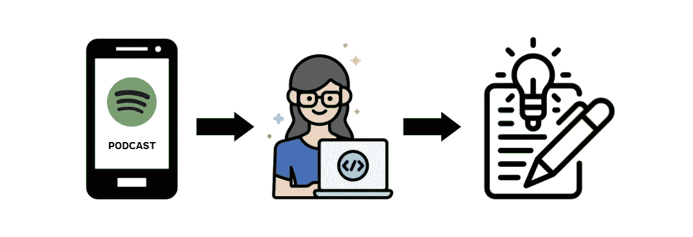
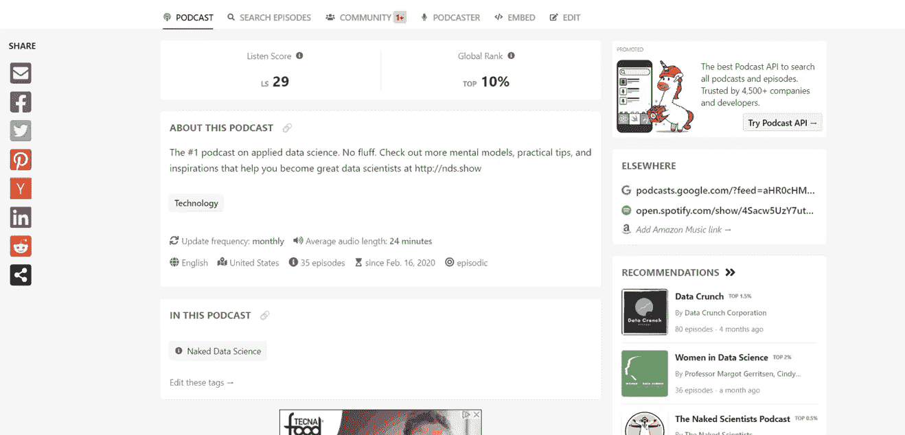
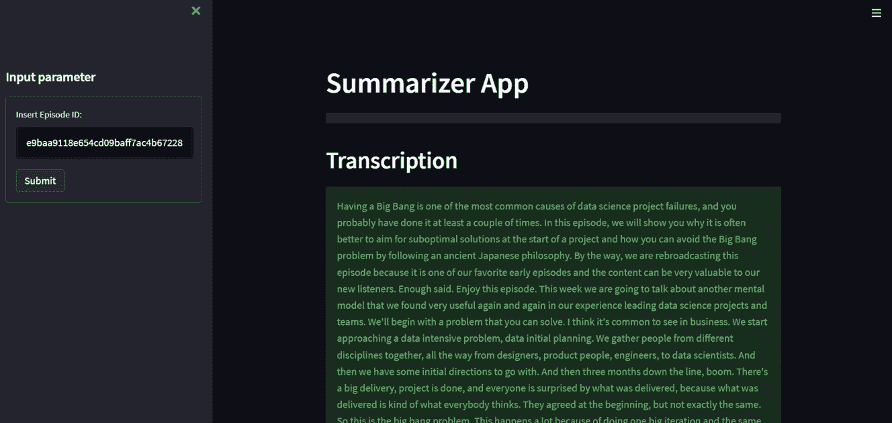

# 如何使用 Python 构建一个 Web 应用程序来转录和总结音频

> 原文：<https://towardsdatascience.com/how-to-build-a-web-app-to-transcribe-and-summarize-audio-with-python-dc719cb9e1f5>

## 一本实用指南，总结您最喜爱的数据科学 Spotify 播客，并简化它以创建 web 应用程序



来源: [flaticon](https://www.flaticon.com/premium-icon/programmer_3270999?related_id=3270999&origin=search)

Spotify 的播客剧集的特点是非常长，这很容易让你沮丧或分散你的注意力。你有没有想过把播客里看起来很吸引人，但你在那一刻的心情总结一下？获取播客的要点并最终说服你听完它可能是个好主意。

在本教程中，我们将构建一个 web 应用程序来转录和总结《裸数据科学》中的一集，该集探讨了不同的数据科学主题，并提供了成为数据科学家的实用技巧。

该应用程序将使用 Streamlit 构建，而 AssemblyAI API 将允许我们转录和总结 Spotify 播客的剧集。首先，这个 API 使用自动语音识别将音频转换成文本，然后生成文本摘要。让我们开始新的冒险吧！

## 目录

*   [**第一部分:转录并总结音频**](#dc83)
*   [**第二部分:创建 Web 应用**](#59c1)

# 第 1 部分:转录和总结音频

本教程将分为两个部分。第一部分主要展示如何应用 AssemblyAI API 来总结我们播客的内容。在第二部分中，我们将使用 Streamlit 来开发 web 应用程序。这些是以下步骤:

*   从收听笔记中提取剧集的 URL
*   发送转录请求
*   检索转录和摘要

## 1.从收听笔记中提取剧集的 URL



[Listen Notes](https://www.listennotes.com/) 是一个强大的播客搜索引擎和在线数据库，提供访问播客数据的 API，并允许基于它构建新的服务和应用。在本教程中，我们将使用 Listen Notes API 从我们的目标播客中检索该集的 url。

*   首先，您需要创建一个帐户来检索数据，并订阅[免费计划](https://www.listennotes.com/podcast-api/pricing/)来利用 Listen Notes API。有了这个计划，你每个月最多可以有 300 个请求，这足够你处理个人项目了。
*   然后，在 Listen Notes 中进入播客的[页面](https://www.listennotes.com/podcasts/naked-data-science-naked-data-science-_uJhei-AXdy/)，点击你感兴趣的剧集，选择“使用 API 获取该剧集”。
*   之后，您可以将语言代码更改为 Python，并从选项列表中单击 requests，以便以后使用库请求。
*   复制代码并将其粘贴到您的笔记本/脚本中。

我们正在向 Listen Notes Podcast API 的端点发送一个 **GET 请求**，这是一个从 Listen Notes API 检索数据的策略操作。最后，我们将最终输出保存为一个 JSON 对象，其中还包括以后需要的剧集的 URL。

我们还导入了一个 JSON 文件，名为 **secrets.json** ，它非常类似于一个字典，因为它由一组键值对组成。它需要包含分别用于 AssemblyAI 和 Listen Notes 的 API 键。您需要在您的帐户中访问它们。

```
{
"api_key":"<your-api-key-assemblyai>",
"api_key_listennotes":"<your-api-key-listennotes>"
}
```

## 2.发送转录请求

我们现在向 AssemblyAI 的转录端点发送一个 **POST 请求**，而不是发出一个 GET 请求。post 方法用于将音频 URL 上传到程序集 AI。

这一步对于获取转录和摘要是很重要的，如果我们设置 auto_chapter 等于 True，那么就包含了转录和摘要。如果我们将 auto_chapter 设置为 False，我们将只获得转录。之后，我们保存转录反应的 id。

## 3.检索转录和摘要

最后，我们可以通过向 Assembly AI 发送 GET 请求来获得转录和摘要。在响应状态完成之前，我们需要发出一些请求。稍后，我们将结果保存到两个不同的文件中，一个 txt 文件用于转录，一个 JSON 文件用于摘要。

最重要的步骤已经完成。我们可以查看摘要:

```
[
    {
        "summary": "Having a big bang is one of the most common causes of data science project failures. This episode explains why it's better to aim for suboptimal solutions at the start of a project and how you can avoid the big bang problem by following an ancient Japanese philosophy.",
        "headline": "Having a big bang is one of the most common causes of Data science project failures.",
        "gist": "Avoid the big bang problem.",
        "start": 2110,
        "end": 37530
    },
    {
        "summary": "This week we are going to talk about another mental model that we found very useful in our experience leading data science projects and teams. It's common to see in business when you start approaching a data intensive problem data initial planning, and then you have some initial directions to go with the root cause. Could be that when you ask a good problem solver or people who are interested in problem solving to find a solution for something, we often want to go for the best solution that there is.",
        "headline": "This week we are going to talk about another mental model that we found useful in our experience leading data science projects and teams.",
        "gist": "The problem model model.",
        "start": 41790,
        "end": 200986
    },...}]
```

# 第 2 部分:创建 Web 应用程序



现在你已经能够理解转录和总结播客的主要部分，我们可以切换到第二部分。目标是用 **Streamlit** 创建一个应用，这是一个免费的开源框架，允许使用 Python 用几行代码构建应用。

在第一行代码中，我们只是导入 python 库并定义函数，这些函数重现了前面显示的步骤。此外，我们还创建了一个 zip 文件，其中包含带有转录的文件和带有摘要的文件。

现在，我们可以定义应用程序的主要部分。首先，我们使用`st.markdown`显示应用程序的主标题。在我们创建了一个左侧面板工具条之后，使用`st.sidebar`来输入我们发布的剧集 id。插入 id 后，我们点击“提交”按钮。

在我们按下按钮后，应用程序将执行所有步骤来转录和总结该集的音频。几分钟后，结果将显示在网页上。如果您想下载输出，可以使用 download 按钮，将转录和摘要保存到 zip 文件中。

编写完所有代码后，可以将其保存到文件 summ_app.py 中，并在终端上使用以下命令行运行代码:

```
streamlit run summ_app.py
```

自动返回本地 URL 和网络 URL。你可以点击其中一个链接，瞧！现在，你有一个了不起的应用程序，转录和总结你最喜欢的播客！

# 应用程序的完整代码

为了更好地理解，最好显示 web 应用程序使用的所有代码。

## 最终想法:

我希望这篇教程对开始使用 AssemblyAI 和 Streamlit 有用。在这个案例研究中，它被应用于转录播客的音频。这里的 GitHub 代码是。还有很多其他可能的应用，比如 zoom 通话，youtube 视频。更多信息，请查看 AssemblyAI 官方网站的[文档](https://www.assemblyai.com/docs)及其 [youtube 频道](https://www.youtube.com/c/AssemblyAI)。感谢阅读。祝您愉快！

## 其他相关文章:

[](/creating-a-web-application-to-extract-topics-from-audio-with-python-21c3f541f3ca)  

你喜欢我的文章吗？ [*成为会员*](https://eugenia-anello.medium.com/membership) *每天无限获取数据科学新帖！这是一种间接的支持我的方式，不会给你带来任何额外的费用。如果您已经是会员，* [*订阅*](https://eugenia-anello.medium.com/subscribe) *每当我发布新的数据科学和 python 指南时，您都会收到电子邮件！*