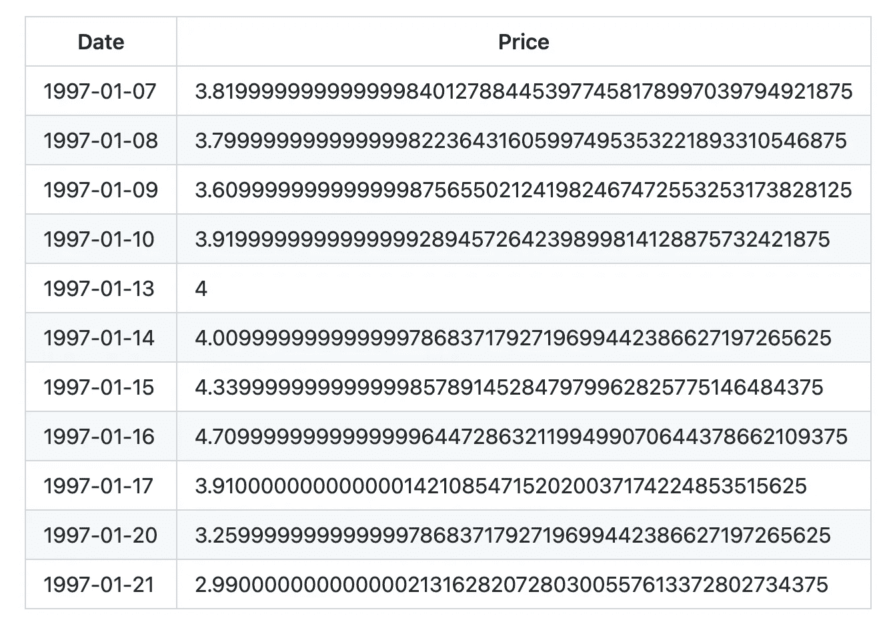
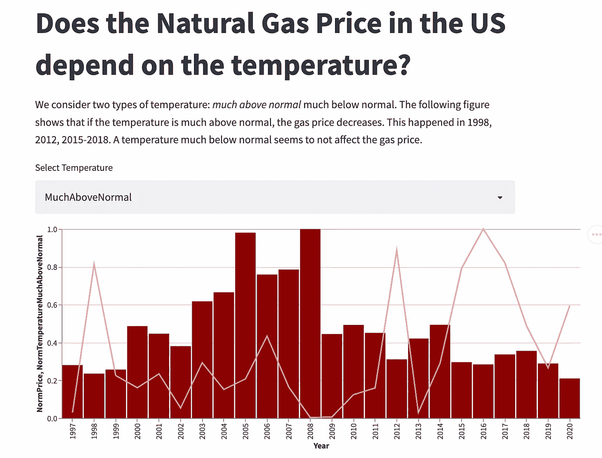

# 如何使用通过多功能数据工具包获取的数据构建 Web 应用程序

> 原文：<https://towardsdatascience.com/how-to-build-a-web-app-with-data-ingested-through-versatile-data-kit-ddae43b5f62d>

## 数据库，网络应用

## 关于如何构建 Web 应用程序的分步教程，结合了 Streamlit Python 库和多功能数据工具包。


图片由 [Unsplash](https://unsplash.com?utm_source=medium&utm_medium=referral) 上的 [Taras Shypka](https://unsplash.com/@bugsster?utm_source=medium&utm_medium=referral) 拍摄

在过去的几个月里，我参与了一个非常有趣的项目，叫做多功能数据工具包(VDK)。VDK 是一个非常强大的框架，用于在数据库中接收不同格式的数据，包括 CSV 文件、JSON 对象，甚至 REST API 服务提供的数据。

VDK 兼容几种类型的数据库，包括但不限于 sqlite、Trino DB、Impala、Postgres 和 Snowflake。

VDK 由 VMware 实施，是一款开源软件。更多信息可以参考官方 [VDK Github 库](https://github.com/vmware/versatile-data-kit)。

在我以前的文章中，我描述了 VDK 的不同方面，包括:

*   [如何开始使用 VDK](/an-overview-of-versatile-data-kit-a812cfb26de7)
*   [VDK 和 Trino DB 如何组合](/from-raw-data-to-a-cleaned-database-a-deep-dive-into-versatile-data-kit-ab5fd992a02e)
*   [如何从 REST API 摄取数据](/using-versatile-data-kit-to-ingest-and-process-data-from-rest-api-6e3e0660b791)。

在本文中，我将描述如何使用通过 VDK 存储的数据来构建一个基于 Streamlit 的 web 应用程序，Streamlit 是一个流行的 Python 库，用于快速轻松地构建网站。

您可以在页面底部找到与本文中描述的示例相关的完整代码。

要配置环境以使用 VDK，您可以参考以前的文章。

文章组织如下:

*   VDK 概况
*   场景的定义
*   VDK 的数据接收
*   VDK 的数据处理
*   构建 Streamlit 应用程序。

# 1 VDK 概述

通用数据工具包(VDK)是一个框架，允许您开发，部署，运行和管理数据作业。**数据作业是一种数据处理工作量。**您可以定义两种类型的数据作业:

*   **摄取作业**，将不同来源的数据推送到数据湖。通常，通过接收作业，您接收由数据提供者提供的原始数据。
*   **处理已经包含在数据湖中的作业**，您可以在其中操作您的数据。这个想法是建立精选的数据集，你可以用它来做进一步的分析。

关于 VDK 的更多细节，你可以阅读我以前的一篇文章，题为[多功能数据工具包概述](/an-overview-of-versatile-data-kit-a812cfb26de7)。

# 2 场景的定义

此场景的目标是构建一个显示美国天然气价格和温度之间关系的应用程序。

该应用程序使用 VDK 来摄取和处理以下两个 CSV 数据集:

*   [1997-2020 年天然气价格](https://datahub.io/core/natural-gas)
*   【1910 年至 2020 年美国气候极端指数

天然气价格数据集包含 5，953 条记录，由美国能源信息管理局(EIA)提供。每个记录包含天然气的每日价格。对于每条记录，以下信息可用:

*   日期(每天提供)
*   价格(美元)

下表显示了数据集的摘录:



作者图片

美国极端气候指数数据集包含 112 条记录。对于每条记录，可以下载许多参数。数据分析师选择以下信息:

*   日期(每年提供一次)
*   远高于正常的最低温度百分比
*   远低于正常的最低温度百分比。

下表显示了数据集的摘录:


作者图片

要运行此示例，您需要:

*   多功能数据工具包
*   Trino DB
*   Trino 的多功能数据工具包插件
*   细流

有关如何为 Trino 安装多功能数据套件、Trino DB、Streamlit 和多功能数据套件插件的更多详细信息，请参考[此链接](https://github.com/vmware/versatile-data-kit/tree/main/examples/life-expectancy)。

# 3 VDK 的数据接收

数据摄取上传到 CSV 文件的数据库输出中，如前一节所述。对于每个数据集，通过以下步骤执行数据接收:

*   删除现有的表(如果有)
*   创建新表格
*   直接从 CSV 获取表格值。

前面的所有步骤构成了一个数据摄取作业。

要访问 CSV 文件，此示例需要有效的互联网连接才能正常工作。例如，我只考虑第一个数据集(天然气价格)，但对于其他数据集，过程是相同的。

## 3.1 删除现有表格

我将这一步写成一个 SQL 命令，如果表存在的话，就删除它:

```
DROP TABLE IF EXISTS natural_gas_prices
```

## 3.2 创建新表

现在，我定义了一个新步骤，该步骤创建了一个新表，其中将包含 CSV 文件:

```
CREATE TABLE natural_gas_prices (
   Date varchar,
   Price double
)
```

## 3.3 摄取值

为了从 CSV 获取值，我定义了一个 Python 脚本，它将 CSV 文件作为熊猫数据帧读取，然后通过 VDK 提供的`send_tabular_data_for_ingestion()`方法获取它:

```
def run(job_input: IJobInput): url = "https://datahub.io/core/natural-gas/r/daily.csv"
   df = pd.read_csv(url) job_input.send_tabular_data_for_ingestion(
       df.itertuples(index=False),
       destination_table="natural_gas_prices",
       column_names=df.columns.tolist(),
   )
```

# 4 VDK 的数据处理

数据处理包括两个步骤:

*   用天然气价格的平均值构建年度视图`natural_gas_prices`
*   合并两个表，前一个和`climate_extremes_index`。

## 4.1 建筑年景

要构建年度视图，只需操作`natural_gas_prices`表，如下所示:

```
CREATE TABLE average_gas_price_by_year AS(SELECT extract(YEAR from CAST(Date AS date)) AS Year,
   avg(Price) AS Price
   FROM natural_gas_prices.  
   GROUP BY extract(YEAR from CAST(Date AS date))
)
```

因此，我创建了一个新表，名为`average_gas_price_by_year`。

下表显示了生成的表的示例:


作者图片

## 4.2 合并两个表

最后一步，我合并了两个表`climate_extremes_index`(从第二个 CSV 文件中提取的表)和`average_gas_price_by_year`。值在区间[0，1]中被归一化，从而使它们之间的比较成为可能。

```
CREATE TABLE merged_tables AS(SELECT Year,(Price / (SELECT max(Price) FROM average_gas_price_by_year)) AS NormPrice,(MuchAboveNormal / (SELECT max(MuchAboveNormal) FROM climate_extremes_index WHERE CAST(climate_extremes_index.Date AS integer) IN (SELECT Year from average_gas_price_by_year))) AS NormTemperatureMuchAboveNormal,(MuchBelowNormal / (SELECT max(MuchBelowNormal) FROM climate_extremes_index WHERE CAST(climate_extremes_index.Date AS integer) IN (SELECT Year from average_gas_price_by_year))) AS NormTemperatureMuchBelowNormalFROM average_gas_price_by_year INNER JOIN climate_extremes_indexON average_gas_price_by_year.Year = CAST(climate_extremes_index.Date AS integer))
```

在前面的查询中，对于 select 中的每个字段，除了`Year`，我按照最大值对字段进行规范化。为了获得字段的最大值，我构建了另一个内部查询。

# 5 构建 Streamlit 应用

现在我已经准备好构建最终的应用程序了。首先，我导入所有需要的库:

```
import altair as alt
import numpy as np
import pandas as pd
import streamlit as st
import trino
```

我将使用`altair`构建一些图表，并使用`trino`连接到 Trino 服务器。

现在，我连接到服务器:

```
conn = trino.dbapi.connect(
   host="localhost",
   port=8080,
   user="root",
   catalog="mysql",
   http_scheme="HTTP",
   verify=True,
   schema="energy",)
```

我写了一篇减价文，题目是:

```
st.markdown("# Does the Natural Gas Price in the US depend on the temparature?")
```

现在，我从数据库中读取数据:

```
df = pd.read_sql_query(f"SELECT Year, NormPrice, NormTemperatureMuchAboveNormal, NormTemperatureMuchBelowNormal FROM merged_tables",conn,)
```

我制作了这张图表:

```
palette = ["#ff9494", "#ff5252", "#8B0000"]indicators = ["NormPrice", 
"NormTemperatureMuchAboveNormal",
"NormTemperatureMuchBelowNormal",
]price_bar = (alt.Chart(df)
   .mark_bar(size=30)
   .encode(x="Year:O", y="NormPrice:Q", color=alt.value("#8B0000"))
)temp_list = ["MuchAboveNormal", "MuchBelowNormal"]
temp_type = st.selectbox("Select Temperature", temp_list, key="temp_type")temp_line = (
   alt.Chart(df)
   .mark_line()
   .encode(x="Year:O", y=f"NormTemperature{temp_type}:Q", color=alt.value("#ff9494")))c = (price_bar + temp_line).properties(height=350, width=800)
st.altair_chart(c)
```

最后，我从终端运行应用程序:

```
streamlit run dashboard.py
```

下图显示了最终输出:



作者图片

# 摘要

在本文中，我描述了如何将 VDK 与 Streamlit 集成来构建一个 Web 应用程序。首先，我在 VDK 下载、消化和处理数据，然后我在 Streamlit 中构建了 Web 应用程序。

你可以在 [VDK 官方 Github 库](https://github.com/vmware/versatile-data-kit/tree/main/examples/energy)中的 examples 一节下找到这个例子的完整代码。

对于多功能数据工具包的问题或疑问，您可以直接加入他们的[公共 slack workspace](https://join.slack.com/t/versatiledata-rgg2437/shared_invite/zt-tvnl62c3-qP0EUYJZJxb6Ws_eQWyDtQ) 或[他们的邮件列表](mailto:join-versatiledatakit@groups.vmware.com?subject=Invite%20me%20to%20the%20VDK%20mailing%20list)或[在 Twitter 上关注他们](https://twitter.com/intent/follow?screen_name=VDKProject)。

# 相关文章

[](/an-overview-of-versatile-data-kit-a812cfb26de7)  [](/using-versatile-data-kit-to-ingest-and-process-data-from-rest-api-6e3e0660b791)  [](/from-raw-data-to-a-cleaned-database-a-deep-dive-into-versatile-data-kit-ab5fd992a02e) 