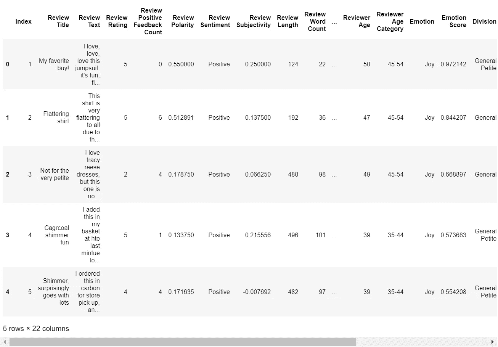
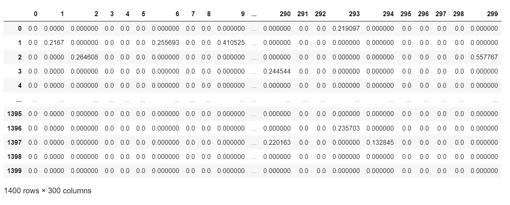
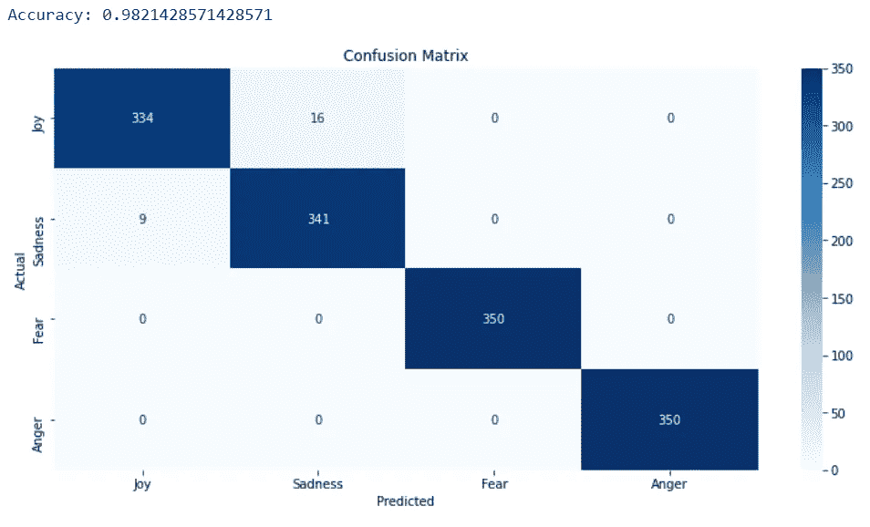
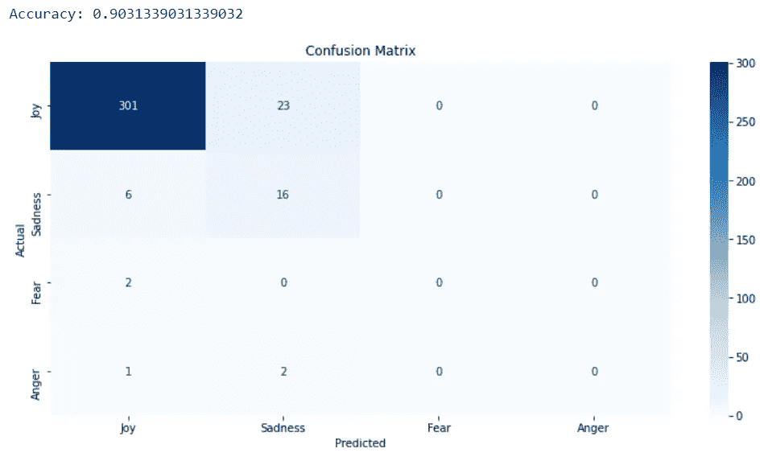
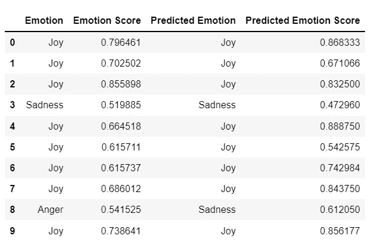

# 如何从零开始建立一个情感语调分析器

> 原文：<https://towardsdatascience.com/how-to-build-an-emotional-tone-analyzer-from-scratch-ea286b8ee4de>

## 如何构建一个高性能的情感语调分析器来与 IBM Watson 竞争，而无需支付每 API 交易费用


[吴怡](https://unsplash.com/@takeshi2?utm_source=unsplash&utm_medium=referral&utm_content=creditCopyText)在 [Unsplash](https://unsplash.com/s/photos/emoji?utm_source=unsplash&utm_medium=referral&utm_content=creditCopyText) 上拍照

# 介绍

在最近的一篇文章中，我展示了如何使用 IBM Watson 的“声调分析器”，它可以将文本的情感分析直接嵌入到用 Python(或其他语言)编写的机器学习应用程序中。

[](/how-to-use-the-ibm-watson-tone-analyzer-to-perform-emotional-sentiment-analysis-in-python-d1d4ad022d0b) [## 如何使用 IBM Watson Tone Analyzer 在 Python 中执行情感情绪分析

### 如何使用 IBM Watson 人工智能平台来预测客户在写作时的主要情绪…

towardsdatascience.com](/how-to-use-the-ibm-watson-tone-analyzer-to-perform-emotional-sentiment-analysis-in-python-d1d4ad022d0b) 

本文继续开发和解释 Python 代码，探索与一个虚构的在线女装零售商的客户反馈相关的开放许可数据集，使用 tone analyzer 预测客户写评论时的情绪。

在结论中，我注意到 IBM Watson 的免费定价计划将客户限制在每月 2，500 个 API 调用，如果我选择对所有 23，000 个数据点执行代码，那么它们的计量成本将是 202 美元(~ 149 美元)，并且代码运行将花费大约 4 个小时。

当我思考 IBM Watson Tone Analyzer 的利与弊时，我开始思考如何自己编写类似的东西，对客户在编写自由文本格式反馈时的情绪做出有用的预测，但这样会执行得更快，并避免大型数据集的交易成本。

本文的其余部分解释了我如何从头开始构建一个情感语调分析器，以及它与 IBM Watson 服务的比较。

# 构建情感语调分析器

## 1.获取一些数据

首先要做的是获得一些数据来再次构建和测试，我已经选择重用开放许可女装在线零售数据集([https://www . ka ggle . com/nica potato/women-ecommerce-clothing-reviews](https://www.kaggle.com/nicapotato/womens-ecommerce-clothing-reviews))。

这些数据是在“CC0:公共领域”许可下授权的，这意味着“你可以复制、修改、分发和执行这些作品，即使是出于商业目的，都无需征得许可”(详见 https://creativecommons.org/publicdomain/zero/1.0/)



作者图片

我使用的数据集是第一篇文章的输出数据集，该文章对 2000 行进行了采样，然后使用 IBM Watson API 调用的每月免费配额来返回客户体验的主要情绪(`Emotion`)和一个指示该情绪有多强烈的分数(`Emotion Score`)。

我还将数据集的副本放入`df_reviews_raw`中，以便稍后进行比较。

## 2.分为培训和验证/坚持

这里，我选择以 80/20 的比例对两个数据帧进行采样，而不是采用更常见的方法返回 4 个 numpy 数组(`X_train, y_train, X_test, y_test = train_test_split(df_reviews, test_size=0.2, random_state=42)`)。

原因是，稍后我需要将评论“矢量化”成一组新的特征，如果将训练和测试数据保留为 DataFrame 而不是 numpy 数组，这将更容易做到。

最后，分割的数据帧被深度复制，以避免在我们开始向分割的数据帧添加新特征时会发生的`SetWithCopyWarning`。

训练数据将用于 k-fold 交叉验证，有效地充当训练和测试数据，而验证/排除数据将在建模结束时用于判断性能和避免过度拟合。

## 3.重新平衡培训数据

```
Joy        0.901569
Sadness    0.082026
Anger      0.008559
Fear       0.007846
Name: Emotion, dtype: float64
```

数据严重不平衡，超过 90%的数据被归类为“快乐”情绪。在开发过程中，我尝试了让数据不平衡或重新平衡，重新平衡产生了一个模型，该模型对拒不合作的数据集表现得更好，因此数据需要重新平衡…

这段代码对数据进行了重新采样，提供了与原始数据帧相似的行数，但对 4 种情绪进行了平均采样

```
Anger      350
Fear       350
Joy        350
Sadness    350
Name: Emotion, dtype: int64
```

## 4.特征工程

下一步是使用`TfidfVectorizer`对评论文本进行矢量化。这是通过分析文本中与目标变量相关的单字(单个单词)和双字(两个连续单词的组合)来实现的。

然后可以手动检查这些 ngrams，看它们是否有意义，然后将其附加到数据上，以提供可用于预测性机器学习分类算法的数字特征。

`TfidfVectorizer`已经被安装和改造。这意味着作为一个模型，`TfidfVectorizer`已经被构建为使用训练数据来驱动一组预测，然后生成(转换)的数据已经从模型返回。

看一看已经产生的东西就更容易理解了



作者图片

我们的训练数据中的 1400 行中的每一行都有一组 300 个标记化的单词(标记化只是用唯一的数字或标记替换英语单词的过程)。

这 300 个单词中的每一个都有一个值，表明它在评论文本中使用了多少。

## 5.评估特征工程

从这里开始，我们只需要一小段代码来看看哪些英语单词和单词与 4 种情绪最相关，这将提供一个常识性的检查，以确定该方法是否有效…

```
Joy:
Most correlated unigrams: fits, great, comfortable, got, true, nice, pounds, love, perfect, bad, length, lay, petite, much, disappointed, across, pulled, though, bust, skirt
Most correlated bigrams: true size, runs slightly, need wear, dry clean, fabric bad

Sadness:
Most correlated unigrams: wanted, sad, disappointed, get, saw, like, pounds, great, wore, love, lay, size, even, much, material, received, first, would, across, still
Most correlated bigrams: need wear, runs slightly, going back, fabric bad, pounds usually

Fear:
Most correlated unigrams: across, pulled, shoulders, fear, squareapple, underlayer, types, si, narrow, done, space, slightly, romper, different, way, vest, chest, part, glad, guess
Most correlated bigrams: runs slightly, types fabric, small athletic, little short, space arms

Anger:
Most correlated unigrams: problem, strike, flat, pounds, idea, dressy, purchased, deep, zipper, mentioned, small, shows, appears, reviewers, lay, sheer, reviews, pants, cami, pink
Most correlated bigrams: need wear, pounds usually, reviewers mentioned, sale price, runs slightly
```

这看起来很合理。与快乐、悲伤、恐惧和愤怒相关联的单词看起来确实可信。当“轻微跑动”出现在快乐、悲伤和恐惧中时，二元模型看起来不太合理。

总的来说，我们拥有的似乎是一组合理的数据，可以进入预测模型构建阶段。

## 6.建立模型

6.1 选择 X 和 y(特征和目标)数据

在开发期间，我确实尝试构建了一个仅使用矢量化单词的模型，但是我发现，如果我将`Review Rating`和`Review Polarity`作为特征包括在内，那么针对验证/保留集的性能就会提高，这就是将这些列应用于带有`df_reviews_train.iloc[:,[3,5]`的矢量化单词的原因。

6.2 超参数调谐

```
RandomForestClassifier(bootstrap=False, max_depth=40, max_features='sqrt', min_samples_split=5, n_estimators=200, random_state=42)
```

`TUNED_HYPER_PARAMS_500`字典包含我在开发过程中通过在 5 个数据折叠上执行 500 次迭代的`RandomizedSearchCV`确定的超参数，因为 2500 次拟合需要相当长的时间，所以我从文章中省略了这一点，只使用了最佳参数。要了解全部细节，请查看 GitHub 项目。

## 7.评估模型

7.1 根据培训和测试数据进行评估

初始评估是通过将训练数据分成 5 个部分，并使用每个部分作为训练/测试集来评估模型的准确性…


作者图片

使用混淆矩阵来可视化性能也是有用的。如果你对如何为 k 倍交叉验证建立混淆矩阵的完整解释感兴趣，我已经在另一篇文章中解释了细节

[](/how-to-plot-a-confusion-matrix-from-a-k-fold-cross-validation-b607317e9874) [## 如何从 K 倍交叉验证中绘制混淆矩阵

### 如何为分类机的 k 折叠交叉验证评估中的所有折叠绘制混淆矩阵…

towardsdatascience.com](/how-to-plot-a-confusion-matrix-from-a-k-fold-cross-validation-b607317e9874) [](https://grahamharrison-86487.medium.com/how-to-plot-a-confusion-matrix-from-a-k-fold-cross-validation-b607317e9874) [## 如何从 K 倍交叉验证中绘制混淆矩阵

### 如何为分类机的 k 折叠交叉验证评估中的所有折叠绘制混淆矩阵…

grahamharrison-86487.medium.com](https://grahamharrison-86487.medium.com/how-to-plot-a-confusion-matrix-from-a-k-fold-cross-validation-b607317e9874) 

作者图片

k 倍交叉验证的平均准确度为 0.9835714285714285，非常高。混淆矩阵显示，实际上是“快乐”的 17 个数据点被预测为“悲伤”，但除此之外，预测看起来确实非常好。

“恐惧”和“愤怒”是 100%准确的，这看起来很可疑。这可能是因为训练数据中非常少的数量或数据点被分类为恐惧和愤怒，并且已经被向上采样，所以这些记录中的变化非常小，这使得算法很容易以高精度进行预测。

这表明有必要根据包含 4 种情绪(包括罕见情绪)原始比例的验证/拒绝数据来评估绩效。

7.2 根据验证/拒绝数据进行评估

请注意，该模型现在适用于完整的 X_train 和 y_train 数据集。这是因为 k-fold 交叉验证使模型适合 5 个数据集，每个数据集占训练数据的 80%。

针对 100%的训练数据而不是 80%的训练数据完成拟合极有可能产生更准确的模型。



作者图片

相对于验证/保留集的准确度是 90.32%，这并不坏，但不幸的是，由于数据集如此不平衡，仅仅猜测每个记录的“Joy”将是具有 92.3%准确度的粗糙模型。

尽管原始模型的 f1 分数会更低，但无论如何，本文的重点是演示如何从头开始构建情感语调分析器。这种方法是合理的，只是如果选择的源数据不那么不平衡，性能会好得多。

## 8.将预测添加到数据集

记住 IBM Watson 的输出，它产生了两个特性

*   主要情绪
*   主要情感的得分

下面的代码通过将这些功能添加到验证/保留数据中，然后执行手动、直观的检查来查看它们是否合理，从而模拟该功能。

下面的代码添加了这些功能。应当注意的是，`model.predict_proba(X_val)`返回 shape (351，4)的 numpy 数组，即验证数据中的每条记录 1 行，4 列-4 种情绪中的每种情绪 1 列，其值等于每种情绪的概率。

由于期望的结果是主要情绪的分数，因此`ALPHABETICAL_EMOTION_MAP`为`pd.Series(predicted_classes).map(ALPHABETICAL_EMOTION_MAP).to_numpy()`建立映射，以提取每行上预测情绪的分数。



作者图片

从快速，视觉检查，它看起来都很合理。第一个记录被 IBM Watson 预测为 0.796461 的“Joy”，被 scratch-build tone analyzer 预测为 0.777917 的“Joy”。所有前 10 个记录看起来都很合理，包括 IBM Watson 预测为“愤怒”和自制分析器预测为“悲伤”的第 8 行(预测是针对负面情绪之一)。

## 9.对整个数据集进行预测

在最初的文章中，我使用 IBM Watson 对 2，000 个采样行进行预测，但是源数据包含 23，000 行。我不愿意花 202 美元(约 149 英镑)买全套，所以在做了这么多艰苦的工作后，我决定不在我的分析中加入情感因素。

现在我有了一个临时构建的情绪语气分析器，最后一步是用它来预测源数据中所有 23，000 行的客户情绪…

```
Wall time: 21.2 s
```

我们做到了！scratch build emotional tone analyser 的运行时间为 21.2 秒，而 IBM Watson API 调用运行 23，000 个数据点需要 4 个多小时，成本为零，而 IBM Watson 的每 API 调用成本为 202 美元(约 149 英镑)。

剩下的就是比较结果，看看他们如何叠加…

```
Joy        0.7940
NaN        0.1235
Sadness    0.0685
Anger      0.0075
Fear       0.0065
Name: Emotion, dtype: float64
```

```
Joy        0.863239
Sadness    0.135490
Anger      0.000712
Fear       0.000559
Name: Emotion, dtype: float64
```

# 结论

与 IBM Watson 对 2000 行样本的预测为 79.4%相比，我们的临时构建的情感语气分析器对 23，000 行完整数据集的预测为 86.3%。

13.5%的评论被 scratch 算法预测为“悲伤”，而 IBM Watson 的预测为 6.9%。IBM Watson 在 12.4%的情况下未能做出预测，但临时构建的算法总能做出预测。“愤怒”和“恐惧”看起来相差 10 个数量级，但在两个数据集中的相对百分比非常低。

由于我们不知道 IBM Watson 是如何构建的，也不知道它自己的预测有多准确，这使得评估我们自己的算法的真正准确性非常困难，而且情绪无论如何都可能是主观的。在一次试验中，一个评论者可能会说他们有大约 53%的人感到悲伤，但实际上他们可能已经接近其他的情绪，甚至可能已经感觉到了各种情绪的混合。

作为评估的进一步阶段(本文之后),我采用了 scratch built 算法的输出，并使用它来识别与 Power BI 仪表板中的评论文本相关联的积极(快乐)和消极(悲伤、愤怒或恐惧)情绪。

这个过程和我所获得的知识将会是未来一篇文章的主题，但是我可以说的是，预测的情绪为观想增加了真正的洞察力。

通过“悲伤”、“愤怒”和“恐惧”过滤的评论将仪表板用户直接带到负面评论，这些评论是最有用的，因为它们可以用于改进评论主题的产品和服务。

# 感谢您的阅读！

如果你喜欢读这篇文章，为什么不看看我在 https://grahamharrison-86487.medium.com/的其他文章呢？此外，我很乐意听到您对这篇文章、我的任何其他文章或任何与数据科学和数据分析相关的内容的看法。

如果你想联系我讨论这些话题，请在 LinkedIn 上找我—【https://www.linkedin.com/in/grahamharrison1 或者发电子邮件到[ghar rison @ Lincoln college . AC . uk](mailto:GHarrison@lincolncollege.ac.uk)。

如果你想通过订阅来支持作者和全世界 1000 个为文章写作做出贡献的人，请使用下面的链接(注意:如果你使用这个链接免费注册，作者将收到一定比例的费用)。

[](https://grahamharrison-86487.medium.com/membership) [## 通过我的推荐链接加入媒体-格雷厄姆哈里森

### 作为一个媒体会员，你的会员费的一部分会给你阅读的作家，你可以完全接触到每一个故事…

grahamharrison-86487.medium.com](https://grahamharrison-86487.medium.com/membership)