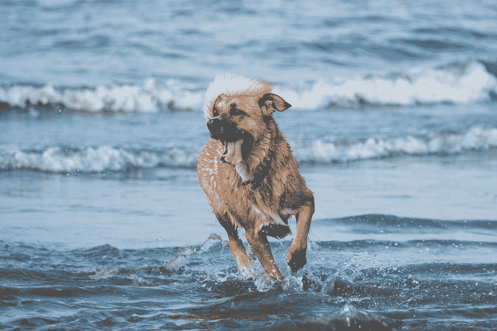
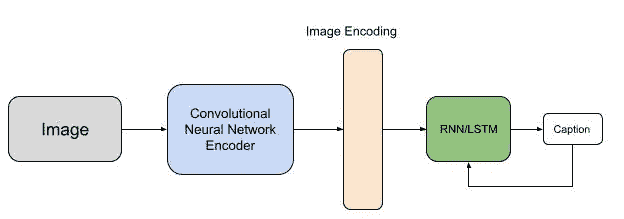

# 如何在 Pytorch 中建立图像字幕模型

> 原文：<https://towardsdatascience.com/how-to-build-an-image-captioning-model-in-pytorch-29b9d8fe2f8c>

## 如何在 Pytorch 中构建图像标题模型的详细分步说明


亚当·达顿在 [Unsplash](https://unsplash.com?utm_source=medium&utm_medium=referral) 上的照片

在本文中，我将解释如何使用 Pytorch 深度学习库构建图像字幕模型架构。除了解释模型架构背后的直觉，我还将提供模型的 Pytorch 代码。

请注意，本文写于 2022 年 6 月，因此 Pytorch 的早期/未来版本可能略有不同，本文中的代码也不一定有效。

## 什么是图像字幕？

顾名思义，图像字幕是将图像输入到人工智能模型，并接收描述/总结图像内容的文本字幕作为其输出的任务。例如，如果我将以下图片输入到图像字幕模型中:



照片由[拍摄，莱恩号](https://unsplash.com/@lyanvoyages?utm_source=medium&utm_medium=referral)在 [Unsplash](https://unsplash.com?utm_source=medium&utm_medium=referral) 上航行

该模型将返回类似“狗在水中跑”的文本标题。图像字幕模型由两个主要组件组成:CNN(卷积神经网络)编码器和语言模型/RNN(某种可以产生文本的 NLP 模型)解码器。CNN 编码器存储关于输入图像的重要信息，解码器将使用这些信息生成文本字幕。

为了训练图像字幕模型，最常用的数据集是 Flickr8k 数据集和 MSCOCO 数据集。你可以在这里找到 Flickr 数据集[的下载链接，在这里](https://www.kaggle.com/datasets/adityajn105/flickr8k)找到 MSCOCO 数据集[的链接。Flickr8k 数据集由 8000 幅图像组成，每幅图像都有 5 个不同的标题来描述图像，而 MSCOCO 数据集由 328000 幅图像组成。从入门的角度来看，推荐使用 Flickr 数据集，因为它不像 MSCOCO 那么大，更容易处理。但是如果您试图构建一个可以在生产中部署/使用的模型，那么 MSCOCO 可能更好。](https://cocodataset.org/#home)

## **编码器-解码器**模型架构

正如我之前提到的，编码器-解码器架构由两个组件组成:一个卷积神经网络，用于对图像进行编码(即将其转换为丰富的嵌入表示)，一个递归神经网络(或 LSTM)，将该图像作为输入，并接受训练，使用一种称为教师强制的机制对字幕进行顺序解码。下面是这个模型的一个很好的示意图:



作者图片

**CNN:**通常，CNN 往往是这种模型架构中计算量最少/最复杂的部分。为什么？因为大多数图像字幕模型倾向于使用迁移学习来简单地加载已经存在的强大 CNN 架构的预训练权重。例如，在本文中，我将使用将加载到 Pytorch 的 torchvision 库中的 Inception V3 CNN 网络。然而，除了《盗梦空间》,你还可以使用许多其他的 CNN，如雷斯网、VGG 或 LeNet。我为 CNN 使用迁移学习而不是从头开始训练它的主要原因是因为这个任务是如此的普遍和广泛。它不需要 CNN 学习非常具体的东西(CNN 的唯一目的是为图像创建丰富的嵌入)。模型必须学习的对图像字幕有益的任何特征将在整个模型的训练过程中学习，并且其权重将被微调。

以下是 CNN 编码器的 Pytorch 型号代码:

```
import torch
import torch.nn as nn
import torchvision.models as modelsclass CNNEncoder(nn.Module):
 def __init__(self, embed_size):
   super(CNNEncoder, self).__init__()
   self.inception = models.inception_v3(pretrained=True,
                                       aux_logits=False)
   self.inception.fc = nn.Linear(self.inception.fc.in_features,
                                                    embed_size)
   self.relu = nn.ReLU()
   self.dropout = nn.Dropout(0.5)
 def forward(self, input):
   features = self.inception(input)
   return self.dropout(self.relu(features)) 
```

如你所见，这是一个相对简单的 CNN 架构。唯一的区别是，我们采用初始网络的最后一个完全连接的层，并手动将其更改为映射/连接到我们希望我们的特征嵌入的嵌入大小(以及 RNN 解码器将作为输入接受的大小)。

**RNN 解码器:**不像 CNN 的，我们通常不使用 RNN/LSTM 的迁移学习。如果您熟悉 LSTM 架构，您会知道训练是按顺序进行的，每个连续的单元在下一个单元之前被训练。LSTM 的输入通常只是前一个单元的隐藏状态和前一个 LSTM 单元的输出。然而，对于该模型，我们将连接由 CNN 产生的特征嵌入和 LSTM 的先前输出，并将该连接的张量传递到 LSTM 中。你可以从整个编码器-解码器架构的图像中看到这一点:


作者图片

这是 LSTM 的 Pytorch 代码:

```
class DecoderRNN(nn.Module):
  def __init__(self, embed_size, hidden_size, vocab_size):
    super(DecoderRNN, self).__init__()
    self.embed = nn.Embedding(vocab_size, embed_size)
    self.lstm = nn.LSTM(embed_size, hidden_size)
    self.linear = nn.Linear(hidden_size, vocab_size)
    self.dropout = nn.Dropout(0.5)
  def forward(self, features, captions):
    embeddings = self.dropout(self.embed(captions))
    embeddings = torch.cat((features.unsqueeze(0), embeddings), 
                                                        dim=0)
    hiddens, _ = self.lstm(embeddings)
    outputs = self.linear(hiddens)
    return outputs
```

这个模型中的一些超参数必须由你来选择(特别是 hidden_size 和 embed_size 参数；我只是两个都用了 256)。vocab 大小是一个参数，您必须根据所使用的数据集进行计算。在上面的模型代码中，像许多/大多数 LSTM 架构一样，为了实际获得每个单元格预测的单词，我使用了一个线性层，该层采用隐藏层并将其映射到 vocab。更重要的一点是，在这个模型中，我从头开始生成单词 embeddings。正如你在 LSTM 代码中看到的，我使用了一个神经网络。嵌入层，它接受 vocab 中每个单词的一键编码，并将它们转换为 embed_size 的嵌入。现在，我们通常不会从零开始生成单词嵌入(例如，许多人只是使用转换器权重)，因为这延长了训练过程，但是因为我们使用 LSTM 作为解码器，所以我们不能真正加载预训练的权重并使用它们。

```
class Encoder_Decoder(nn.Module):
  def __init__(self, embed_size, hidden_size, vocab_size):
    super(Encoder_Decoder, self).__init__()
    self.cnn = CNNEncoder(embed_size)
    self.decoderRNN = DecoderRNN(embed_size, hidden_size,
                                 vocab_size)
  def forward(self, images, captions):
    features = self.cnn(images)
    outputs = self.decoderRNN(features, captions)
    return outputs
```

我们通过将 CNN 的输出作为解码器 LSTM 的输入来连接两个模型，并返回 LSTM 的最终输出。这个最终的编码器-解码器模型是我们将在我们的数据上训练的实际模型(不是另外两个)。

## 对编码器-解码器模型的修改

虽然上面描述的模型架构已经是构建图像字幕模型的好方法，但是还有几种方法可以修改模型，使其更加强大。

**注意机制:**在高层次上，当解码器生成字幕的每个单词时，注意机制允许模型注意(或本质上关注)图像的相关部分。例如，以前面一只在水上奔跑的狗为例，当解码器为单词“狗”加字幕时，注意力机制将允许模型专注于包含狗的图像的空间区域。

我们可以使用两种类型的注意力机制:

**软注意:**软注意涉及通过考虑/注意图像的多个部分来构造单词——每个部分的程度不同。基本上，只要把它想象成使用——有时是许多——图像的不同部分，每个部分都有不同的强度。图像的某些部分将比图像的其他部分被更强烈地考虑。

**硬注意:**硬注意涉及到考虑图像的多个部分，但是与软注意相反，图像的每个被考虑的部分具有相同的强度。换句话说，在生成特定单词时，被选择的图像的每个部分(即，模型“关注的”)被完全考虑，而未被选择的图像部分被完全忽略。

在我们将 CNN 产生的特征嵌入馈送到解码器之前，为了添加注意机制，我们添加了将应用于特征嵌入的单独的线性/注意层。下面是一些伪代码/Pytorch 代码演示软注意:

```
self.attention = nn.Linear(embed_size, embed_size)
self.softmax = nn.Softmax()attention_output = self.softmax(self.attention(feature_embedding))
feature_embedding = feature_embedding * attention_output
```

softmax 用于创建特征嵌入的概率分布。将这些概率与原始特征嵌入相乘将产生新的嵌入层，我们将把该新的嵌入层馈送给解码器。

**使用转换器作为解码器:**使用像 BERT 这样强大的转换器是构建更好的图像字幕模型的下一步。虽然这似乎是一个显而易见的选择，但在现实中却更具挑战性。这是因为转换器的固有结构限制了它只能输入单词和文本。例如，BERT 被预先训练了像下一句预测和掩蔽语言建模这样的任务，这使得它很难将文本之外的东西纳入其输入。要将变压器端到端地纳入培训过程，需要一个特殊的/经过修改的变压器。有一些这方面的论文发表过，像[这个](https://arxiv.org/abs/2203.15350)和[这个](https://arxiv.org/abs/2101.10804)。

我希望您觉得这些内容很容易理解。如果你认为我需要进一步阐述或澄清什么，请在下面留言。

## 参考

MSCOCO 数据集:[https://cocodataset.org/#home](https://cocodataset.org/#home)

Flickr8k 数据集:[https://www.kaggle.com/datasets/adityajn105/flickr8k](https://www.kaggle.com/datasets/adityajn105/flickr8k)