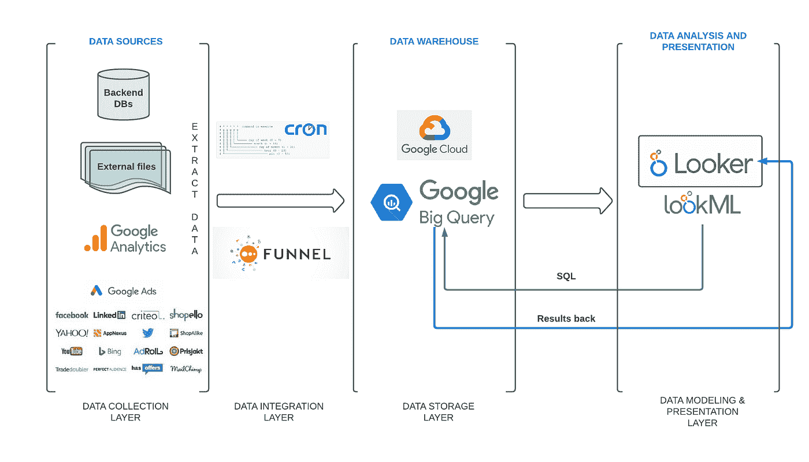
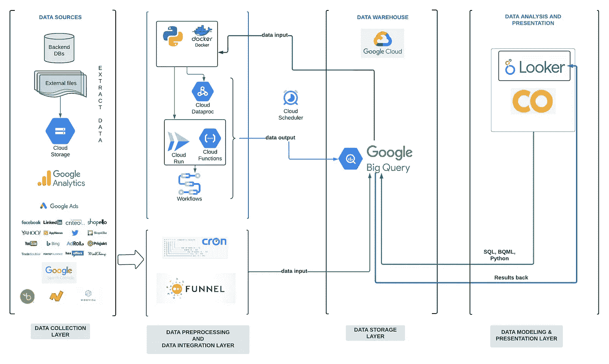

# 如何利用谷歌云生态系统构建和扩展数据平台

> 原文：<https://towardsdatascience.com/how-to-build-and-scale-a-data-platform-with-the-google-cloud-ecosystem-e62f8034b42b>

## 使用 Google 的工具堆栈构建数据平台的电子商务之旅

亚历山大·布西在 [Unsplash](https://unsplash.com?utm_source=medium&utm_medium=referral) 上拍摄的照片

从头开始构建数据平台既令人兴奋又令人畏惧。

无论你是早期还是晚期公司，你在建立基础数据平台方面的选择**将可能对未来几年的业务产生重大影响。**

当然，****最初的目标**应该是解决最燃眉之急的业务问题(例如，减少重复和手动分析)。**

**然而，**长期目标**应该是通过简化您的决策过程来帮助您扩展业务。**

**考虑到这两个目标，这篇博文将展示我们的**电子商务** **之旅，使用 Google 的工具栈**从零开始构建一个数据平台。**

****首先**，我们将解释促使我们决定构建数据平台的业务需求。**

****然后**，我们将分享我们在项目开始时使用了哪些谷歌工具，以及我们的数据架构是如何围绕可用的谷歌云服务发展的。**

****最后**，如果你自己决定走这条路，我们会指出构建数据平台时需要注意的事项。**

# **决策:为什么要构建数据平台？**

**在电子商务领域突然繁荣之后，我们建立数据平台的计划始于 2020 年。**

**随着增长高于预期，我们经历了**两个重大的** **问题******影响了我们的决策过程**:****

*   *******问题#1 |初始需求:*******

****作为一家拥有 40 多家店铺的电子商务公司，我们遇到了**数据孤岛问题。**换句话说，我们的主要数据来源——销售历史、绩效营销数据来源([谷歌分析](https://analytics.google.com/analytics/web/#/)和 15+其他流量来源)、财务报告等。，被孤立了。****

****这导致业务部门的手动工作增加，即他们手动下载来自不同来源的数据，并将它们重叠在 [Google Sheets](https://www.google.com/sheets/about/) 中，以创建跨数据集洞察。因此，我们需要一个详细的控制框架。****

****因此，我们对数据平台的**初始业务需求**是解决数据孤岛问题，并自动创建跨数据集(和跨部门)的数据洞察。****

*   *******一期#2 |长期需求:*******

****为了给我们的客户提供更好的服务，**我们** **需要开发更高级的分析用例:******

*   ****优化库存水平的需求预测模型。****
*   ****创造更好的时事通讯的市场篮子分析模型。****
*   ****利用竞争对手的价格制定更好的定价策略的动态定价模型。****
*   ****客户细分模型，以便更好地了解客户的购物偏好，并为他们提供定制优惠和忠诚度折扣。****

****因此，我们对数据平台的**长期需求**是通过开发更高级的分析用例来帮助我们扩大业务规模。****

****牢记这两个要求，我们将分享我们构建和扩展数据平台的旅程。****

# ****开发:如何构建和扩展数据平台？****

****在达成构建数据平台的跨业务和技术决策后，我们开始评估最适合我们的云解决方案。****

****主要标准是*云提供商支持我们扩大(或缩小)*并且*我们可以轻松控制成本。*****

****当谈到*扩展*标准时，所有云提供商都能够按照我们的业务要求支持我们。然而，云供应商之间的*定价*不同，我们评估谷歌云在我们计划使用的服务上提供了更多折扣。此外，由于我们已经大量使用 GoogleAds，我们更容易获得内部和外部咨询支持。****

****这也是我们决定收购**谷歌云平台**的原因。****

****因此，**我们开始构建我们的初始数据层:******

********

****初始数据架构[图片由作者提供]****

****如上图所示，初始数据架构由以下几层组成:****

*   *******#1:数据收集层:*** 呈现最初必须导入到我们的数据仓库中的最相关的数据源。****
*   *******#2:数据集成层:*** 呈现用于导入电子商务数据集的 [cron jobs](https://en.wikipedia.org/wiki/Cron) 和用于导入效果营销数据集到我们的数据仓库的[漏斗. io](https://funnel.io/) 平台。****
*   *******#3:数据存储层:*** 呈现选中的数据仓库解决方案，即 [BigQuery](https://cloud.google.com/bigquery) 。****
*   *******#4:数据建模与表示层*** :呈现选择的数据分析平台，即 [Looker](https://www.looker.com/) 。****

****总结我们最初的工作:****

*   ******首先，我们致力于创建*数据存储层，将来自两个主要数据源集群(商店电子商务数据集和绩效营销源)的数据导入 BigQuery。*******
*   *******其次，**我们通过使用 Looker 开发跨数据集自助数据模型，开始创建 ***数据建模&表示层*** 。*****

*****我们在 Google Cloud 中构建数据平台的初始资源可以量化如下:*****

*   *******2 个工具—** [BigQuery](https://cloud.google.com/bigquery) 和 [Looker](https://www.looker.com/) ，*****
*   *******6 人—** 负责管理数据管道(cron jobs + Funnel.io 平台)和初始分析需求(数据建模)，*****
*   *******3 个月**——从收购谷歌云到展示第一份分析见解。*****

*****必须提到的是，最初，我们没有专门的数据团队来构建数据平台。*****

*****相反，我们在两个部门之间分配工作——来自 IT 部门的五名同事(负责数据管道)和来自业务开发部门的一名同事(负责数据建模)。*****

*****借助列出的资源和组织结构，我们实现了最初的业务目标，并自动化了跨数据集数据洞察的创建。*****

*****从那时起，对数据洞察的业务需求开始增长，计划是开始开发更高级的分析用例。*****

*****这导致了数据架构的变化和新 Google 服务层的扩展:*****

**********

*****改变了数据架构[图片由作者提供] **********

*****从上面提供的图片可以看出，我们用 ***数据预处理层*** 扩展了我们的数据架构，并开始使用新的谷歌云服务和工具:*****

*   *****[**云存储**](https://cloud.google.com/storage/docs/introduction) —用于在谷歌云中存储我们的外部文件。*****
*   *****[**云运行**](https://cloud.google.com/run/docs#:~:text=Cloud%20Run%20is%20a%20managed,matters%20most%20%E2%80%94%20building%20great%20applications.) —用于部署用 Python 开发的分析管道，并包装为 [Flask](https://flask.palletsprojects.com/en/2.2.x/) 应用程序。*****
*   *****[**Google Functions**](https://cloud.google.com/functions/docs/concepts/overview)—用于编写简单、单一用途的函数，附加到云服务发出的事件上。*****
*   *****[**谷歌工作流**](https://cloud.google.com/workflows/docs/overview) —用于编排需要以特定顺序执行的连接分析管道。*****
*   *****[**Google Colab**](https://colab.research.google.com/)—用于创建快速 PoC 数据科学模型。*****

*****随着数据架构的扩展，我们的资源有所增长:*****

*   *******从 2 到 7 工具——**从**到**只使用只使用**biqquery 和 Looker，我们开始使用云存储、云运行、谷歌功能、谷歌工作流、谷歌 Colab。*******
*   *********从两个团队(IT 和业务开发)的 6 人增加到一个团队(数据和分析)的 8 人—** 数据和分析团队成立，现在对所有数据层拥有完全的所有权。*******
*   *******从 3 个月的初步洞察到 2 年多的持续开发—** 我们正在逐步开发更高级的分析用例。*****

*****这就是我们目前所处的位置——积极致力于提供新的、更先进的分析用例，以简化我们的决策过程并更好地支持我们的客户。*****

*****最后，我们将分享如果您从零开始构建数据平台，应该关注什么的主要要点。*****

# *****总结一下:需要注意什么？*****

*****在开始构建云中的数据平台之前，请考虑以下两个主题:*****

*   *****你的优先事项和当务之急是什么？ —优先处理数据平台应该立即为您解决的用例，这些用例可以立即产生商业价值。*****
*   *****你的制约因素是什么？— 思考并量化一切—从软件和人力资源到所需的时间和精力、内部知识水平和资金资源。*****

*****在这一部分，请记住两个方面:*****

*   *******从速赢开始** —不要直接钻研数据科学和机器学习模型开发，而是从速赢用例(通常是描述性统计用例)开始。*****
*   *******实事求是—** 在设定数据平台目标时，重要的是要实事求是地考虑在给定的当前约束条件下，什么是可行的。*****

*****此外，在数据平台的开发过程中，要特别注意以下几点:*****

*   *******构建数据管道** —正确开发的数据管道将为您节省金钱、时间和精力。开发管道是开发中最关键的部分，也就是说，您的管道经过适当的测试，并向业务用户提供新数据，而不会因为各种数据和系统异常而不断中断。*****
*   *******组织和维护数据仓库—** 有了新的数据源，数据仓库会很快变得混乱。为更好的数据仓库组织实现开发标准和命名约定。*****
*   *******数据预处理—** 考虑尽早获得数据预处理工具，通过对数据集进行去规范化来提高仪表板性能并降低计算成本。*****
*   *******数据治理和安全—** 制定关于数据生命周期(数据收集、存储、处理和处置)的内部标准和数据政策。*****

*****通过列出这些要点，我们结束了我们的帖子。*****

*****如果你决定建立自己的数据平台，我们希望这篇文章对你有所帮助。*****

********鸣谢:**感谢我的同事 [Stefan Gajanovic](https://medium.com/u/2a5421855bbd?source=post_page-----e62f8034b42b--------------------------------) ，他帮助我们将改变后的数据架构可视化。*****