# 如何使用 Keras 函数式 API 构建张量流模型

> 原文：<https://towardsdatascience.com/how-to-build-tensorflow-models-with-the-keras-functional-api-bb6f084def83>

## 使用 Keras Functional API 构建定制模型的示例和代码


照片由[马文·迈耶](https://unsplash.com/@marvelous?utm_source=medium&utm_medium=referral)在 [Unsplash](https://unsplash.com?utm_source=medium&utm_medium=referral) 上拍摄

**Keras Functional API** 提供了一种在 TensorFlow 中构建灵活复杂的神经网络的方法。功能 API 用于设计非线性网络。在本文中，您将发现 Keras Functional API 用于创建网络:

*   是非线性的。
*   共享图层。
*   有多个输入和输出。

# Keras 序列模型

我们使用了 [CNN 教程](https://www.machinelearningnuggets.com/cnn-tensorflow/)中的 Sequential API，用 Keras 和 TensorFlow 建立了一个图像分类模型。顺序 API 包括堆叠层。一层接着一层，直到最后的致密层。这使得用顺序 API 设计网络变得简单明了。

```
parameters = {"shape":28, "activation": "relu", "classes": 10, "units":12, "optimizer":"adam", "epochs":1,"kernel_size":3,"pool_size":2, "dropout":0.5}
# Setup the layers
model = keras.Sequential(
  [
      layers.Conv2D(32, kernel_size=(parameters["kernel_size"], parameters["kernel_size"]), input_shape =(parameters["shape"], parameters["shape"], 1),activation=parameters["activation"]),
      layers.MaxPooling2D(pool_size=(parameters["pool_size"], parameters["pool_size"])),
      layers.Conv2D(64, kernel_size=(parameters["kernel_size"], parameters["kernel_size"]), activation=parameters["activation"]),
      layers.MaxPooling2D(pool_size=(parameters["pool_size"], parameters["pool_size"])),
      layers.Flatten(),
      layers.Dropout(parameters["dropout"]),
      layers.Dense(parameters["classes"], activation="softmax"),
  ]
)
```

顺序 API 将您限制为一个输入和一个输出。但是，在某些情况下，您可能希望设计具有多个输入和输出的神经网络。例如，给定一个人的图像，您可以设计一个网络来预测几个属性，如性别、年龄和头发颜色。这是一个单输入多输出的网络。为此，需要**顺序 API** 。绘制网络图显示各层以线性方式排列。

```
keras.utils.plot_model(model, "model.png",show_shapes=True)
```

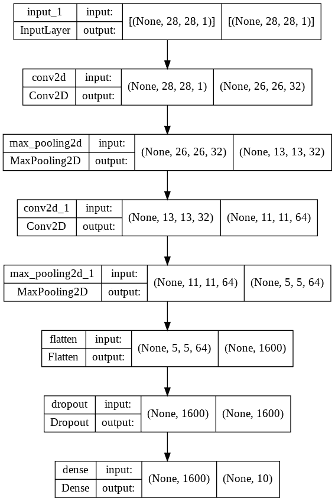

作者图片

# Keras 功能模型

设计功能模型与开发顺序模型略有不同。让我们来看看这些不同之处。

# 定义输入

第一个区别是创建输入层的要求。使用顺序 API，您不必定义输入层。在第一层定义输入形状就足够了。

输入层包含要传递给网络的数据的形状和类型。

```
inputs = keras.Input(shape=(parameters["shape"], parameters["shape"], 1))
inputs.shape
# TensorShape([None, 28, 28, 1])
inputs.dtype
# tf.float32
```

如果数据是一维的，则定义输入图层时不考虑批次大小。

```
inputs = keras.Input(shape=(784,))
```

# 连接层

下一个区别是如何使用函数式 API 连接各层。为了创建连接，我们创建另一个层并将`inputs`层传递给它。将每一层都视为一种功能，可以更好地理解这一点。由于这些层是函数，它们可以用参数调用**。例如，让我们将`inputs`传递给一个`Conv2D`层。**

```
conv2D = layers.Conv2D(32)
x = conv2D(inputs)
x
# <KerasTensor: shape=(None, 26, 26, 32) dtype=float32 (created by layer 'conv2d_7')>
```

在上面的例子中，我们创建了一个`Conv2D`层，作为一个函数调用它并传递输入。作为传递到卷积层的结果，结果输出的形状不同于初始的`inputs`形状。

# 函数式 API Python 语法

上面的例子显示了如何定义和连接网络。但是，语法可以简化。简化版看起来像这样:

```
conv2D = Conv2d(...) (inputs)
```

`conv2D()`类似于`conv2D.__call__(self,....)`。Python 对象实现了`__call__()`方法。Keras 层也[实现这个方法](https://github.com/keras-team/keras/blob/6b2a04f3af0eb53d4cd9abcbf60593c0e086c027/keras/engine/topology.py#L543)。该方法返回给定输入张量的输出。

```
inputs = keras.Input(shape=(parameters["shape"], parameters["shape"], 1))
conv2D = layers.Conv2D(32, kernel_size=(parameters["kernel_size"], parameters["kernel_size"]), input_shape =(parameters["shape"], parameters["shape"], 1),activation=parameters["activation"])(inputs)
conv2D
# <KerasTensor: shape=(None, 26, 26, 32) dtype=float32 (created by layer 'conv2d_8')>
```

# 创建模型

让我们向网络中添加几个层，以演示如何在使用 Functional API 定义层时创建 Keras 模型。

```
parameters = {"shape":28, "activation": "relu", "classes": 10, "units":12, "optimizer":"adam", "epochs":1,"kernel_size":3,"pool_size":2, "dropout":0.5}
inputs = keras.Input(shape=(parameters["shape"], parameters["shape"], 1))
conv2D = layers.Conv2D(32, kernel_size=(parameters["kernel_size"], parameters["kernel_size"]), input_shape =(parameters["shape"], parameters["shape"], 1),activation=parameters["activation"])(inputs)
maxPooling2D = layers.MaxPooling2D(pool_size=(parameters["pool_size"], parameters["pool_size"]))(conv2D)
conv2D_2 =layers.Conv2D(64, kernel_size=(parameters["kernel_size"], parameters["kernel_size"]), activation=parameters["activation"])(maxPooling2D)
maxPooling2D_2 = layers.MaxPooling2D(pool_size=(parameters["pool_size"], parameters["pool_size"]))(conv2D_2)
flatten =   layers.Flatten()(maxPooling2D_2)
dropout = layers.Dropout(parameters["dropout"])(flatten)
ouputs = layers.Dense(parameters["classes"], activation="softmax")(dropout)
```

当传递`inputs`和`outputs`时，使用`**keras.Model**`函数创建一个 Keras 模型。

```
model = keras.Model(inputs=inputs, outputs=outputs, name="mnist_model")
```

我们可以绘制模型来确认它与我们使用顺序 API 定义的模型相似。

```
keras.utils.plot_model(model, "model.png",show_shapes=True)
```

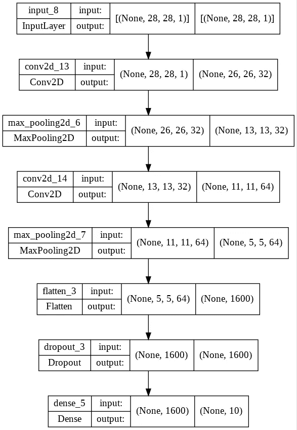

作者图片

# 功能 API 模型的训练和评估

在功能 API 和顺序 API 中，训练和评估模型是相同的。`keras.Model`利用`fit`和`evaluate`方法。

```
(x_train, y_train), (x_test, y_test) = keras.datasets.mnist.load_data()
x_train = x_train.astype("float32") / 255
x_test = x_test.astype("float32") / 255
model.compile(
    loss=keras.losses.SparseCategoricalCrossentropy(from_logits=True),
    optimizer=keras.optimizers.RMSprop(),
    metrics=["accuracy"],
)
history = model.fit(x_train, y_train, batch_size=64, epochs=2, validation_split=0.2)
test_scores = model.evaluate(x_test, y_test, verbose=2)
print("Test loss:", test_scores[0])
print("Test accuracy:", test_scores[1])
```

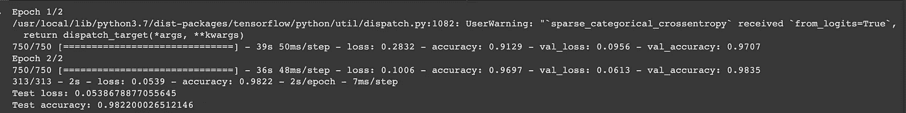

作者图片

# 保存和序列化功能 API 模型

**模型保存和序列化**在函数式 API 和顺序式 API 中工作相同。例如，我们可以使用`model.save()`保存整个模型。

```
model.save("saved_model")
del model
model = keras.models.load_model("saved_model")
model.summary()
```

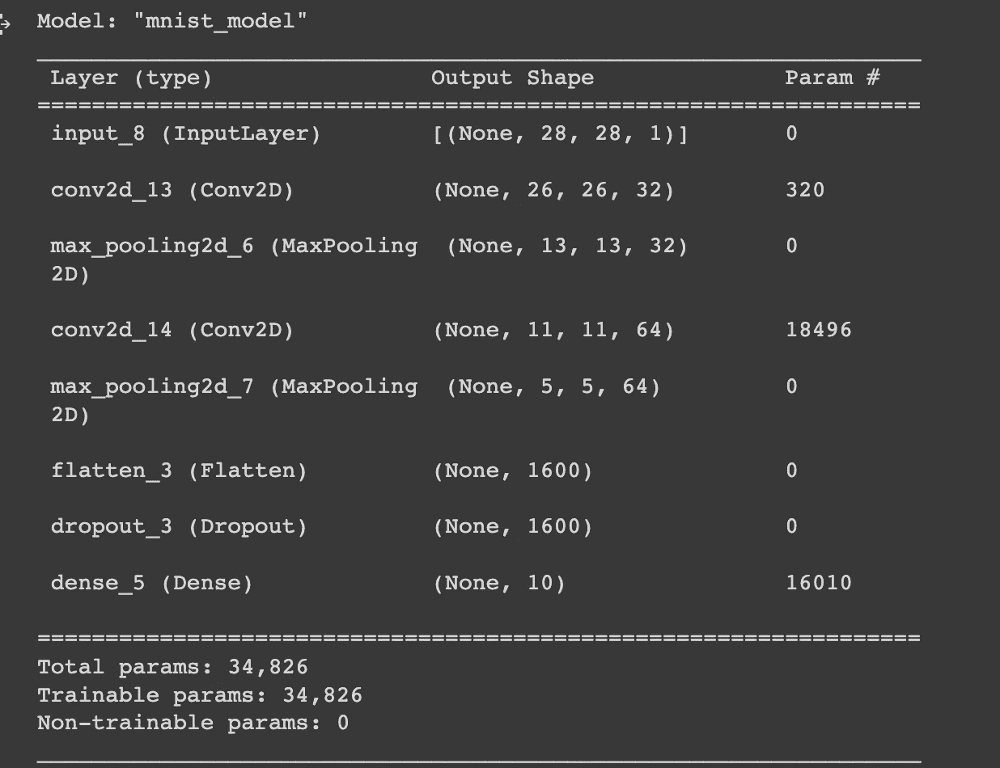

作者图片

# 如何将功能模型转换为顺序 API 模型

通过创建一个`Sequential`实例并添加层，可将带有线性层的功能模型转换为顺序模型。

```
seq_model = keras.models.Sequential()
for layer in model.layers:
    seq_model.add(layer)
seq_model.summary()
```

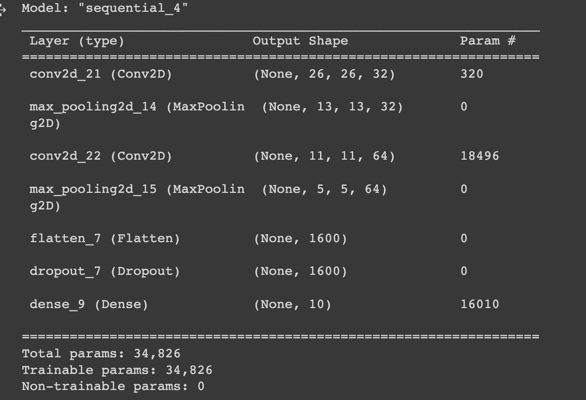

作者图片

# 如何将顺序模型转换为功能 API 模型

类似地，我们可以将时序网络转换为功能模型。

```
inputs = keras.Input(batch_shape=seq_model.layers[0].input_shape)
x = inputs
for layer in seq_model.layers:
    x = layer(x) 
outputs = x
func_model = keras.Model(inputs=inputs, outputs=outputs, name="func_mnist_model")
func_model.summary()
```

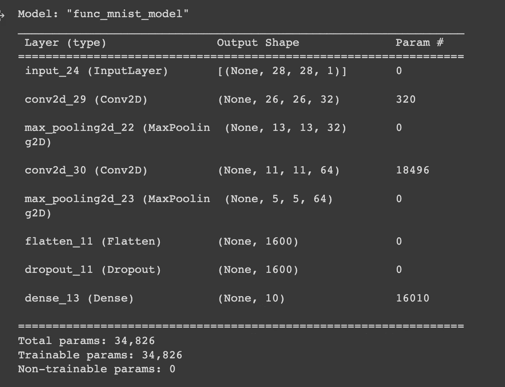

作者图片

# 标准网络模型

让我们看看如何使用功能性 Keras API 定义标准神经网络。

# 多层感知

我们首先定义一个具有多个隐藏层的神经网络，并绘制模型。

```
inputs = keras.Input(shape=(parameters["shape"], parameters["shape"], 1))
dense1 = layers.Dense(128)(inputs)
dropout = layers.Dropout(parameters["dropout"])(dense1)
dense2 = layers.Dense(128)(dropout)
dropout1 = layers.Dropout(parameters["dropout"])(dense2)
outputs = layers.Dense(parameters["classes"], activation="softmax")(dropout1)
model = keras.Model(inputs=inputs, outputs=outputs, name="mnist_model")
keras.utils.plot_model(model, "model.png",show_shapes=True)
```

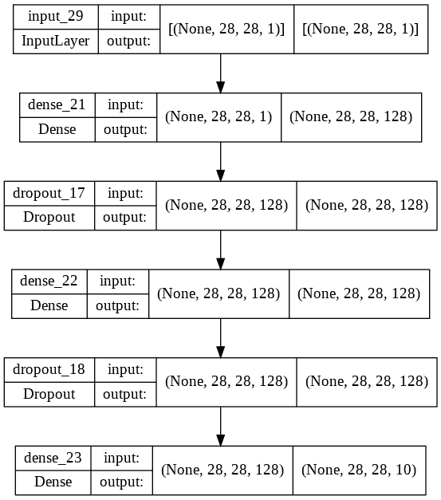

作者图片

# 卷积神经网络

接下来，我们看看如何使用函数式 API 定义[卷积神经网络](https://www.machinelearningnuggets.com/cnn-tensorflow/)。该网络具有卷积层、汇集层、扁平化层和致密层。

```
inputs = keras.Input(shape=(parameters["shape"], parameters["shape"], 1))
conv2D = layers.Conv2D(32, kernel_size=(parameters["kernel_size"], parameters["kernel_size"]), input_shape =(parameters["shape"], parameters["shape"], 1),activation=parameters["activation"])(inputs)
maxPooling2D = layers.MaxPooling2D(pool_size=(parameters["pool_size"], parameters["pool_size"]))(conv2D)
conv2D_2 =layers.Conv2D(64, kernel_size=(parameters["kernel_size"], parameters["kernel_size"]), activation=parameters["activation"])(maxPooling2D)
maxPooling2D_2 = layers.MaxPooling2D(pool_size=(parameters["pool_size"], parameters["pool_size"]))(conv2D_2)
flatten =   layers.Flatten()(maxPooling2D_2)
dropout = layers.Dropout(parameters["dropout"])(flatten)
outputs = layers.Dense(parameters["classes"], activation="softmax")(dropout)
model = keras.Model(inputs=inputs, outputs=outputs, name="mnist_model")
keras.utils.plot_model(model, "model.png",show_shapes=True)
```

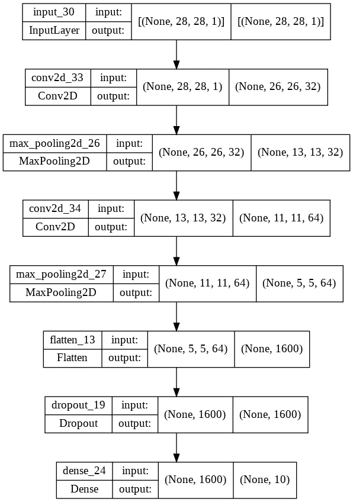

作者图片

# 递归神经网络

让我们看看使用函数式 API 的双向 LSTM 的定义。该网络包含一个[嵌入层](https://keras.io/api/layers/core_layers/embedding/)。

```
inputs = keras.Input(784,)
embedding = layers.Embedding(512, 64, input_length=1024)(inputs)
bidirectional1 = layers.Bidirectional(layers.LSTM(64, return_sequences=True))(embedding)
bidirectional2 = layers.Bidirectional(layers.LSTM(64,))(bidirectional1)
dense1 = layers.Dense(32, activation='relu')(bidirectional2)
outputs = layers.Dense(1, activation='sigmoid')(dense1)
model = keras.Model(inputs=inputs, outputs=outputs, name="lstm_model")
keras.utils.plot_model(model, "model.png",show_shapes=True)
```

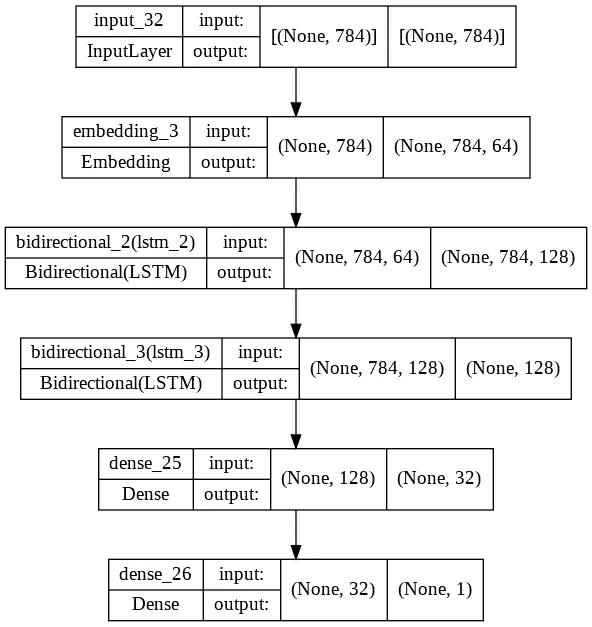

作者图片

# 共享层模型

使用功能 API 定义层可以创建共享特定层的网络。网络中会多次使用共享层。

# 共享输入层

本例定义了一个 CNN，两个卷积模块共享一个输入层。然后我们使用`concatenate`层连接这些模块的输出。之后，我们将结果传递给一个`DropOut`层，最后传递给完全连接的层。

```
inputs = keras.Input(shape=(parameters["shape"], parameters["shape"], 1))
conv2D = layers.Conv2D(32, kernel_size=(parameters["kernel_size"], parameters["kernel_size"]), input_shape =(parameters["shape"], parameters["shape"], 1),activation=parameters["activation"])(inputs)
maxPooling2D = layers.MaxPooling2D(pool_size=(parameters["pool_size"], parameters["pool_size"]))(conv2D)
flatten1 =   layers.Flatten()(maxPooling2D)
conv2D_2 = layers.Conv2D(64, kernel_size=(parameters["kernel_size"], parameters["kernel_size"]), activation=parameters["activation"])(inputs)
maxPooling2D_2 = layers.MaxPooling2D(pool_size=(parameters["pool_size"], parameters["pool_size"]))(conv2D_2)
flatten2 =   layers.Flatten()(maxPooling2D_2)
# merge layers
merged_layers = layers.concatenate([flatten1, flatten2])
dropout = layers.Dropout(parameters["dropout"])(merged_layers)
outputs = layers.Dense(parameters["classes"], activation="softmax")(dropout)
model = keras.Model(inputs=inputs, outputs=outputs, name="mnist_model")
keras.utils.plot_model(model, "model.png",show_shapes=True)
```

绘制网络图显示了不同层之间的联系。

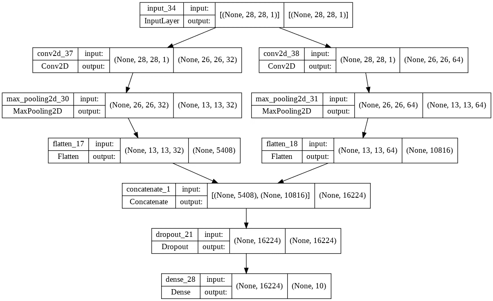

作者图片

# 共享特征提取层

在本例中，我们创建了一个由两个双向 LSTMs 共享的嵌入层。共享特征提取层允许在网络中多次共享相同的**特征提取器**。例如，在两个输入之间共享此信息可以使用较少的数据训练网络成为可能。

```
inputs = keras.Input(784,)
embedding = layers.Embedding(512, 64, input_length=1024)(inputs)
bidirectional1 = layers.Bidirectional(layers.LSTM(64, return_sequences=True))(embedding)
bidirectional2 = layers.Bidirectional(layers.LSTM(64, return_sequences=True))(embedding)
# merge layers
merged_layers = layers.concatenate([bidirectional1, bidirectional2])
dense1 = layers.Dense(32, activation='relu')(merged_layers)
outputs = layers.Dense(1, activation='sigmoid')(dense1)
model = keras.Model(inputs=inputs, outputs=outputs, name="lstm_model")
keras.utils.plot_model(model, "model.png",show_shapes=True)
```

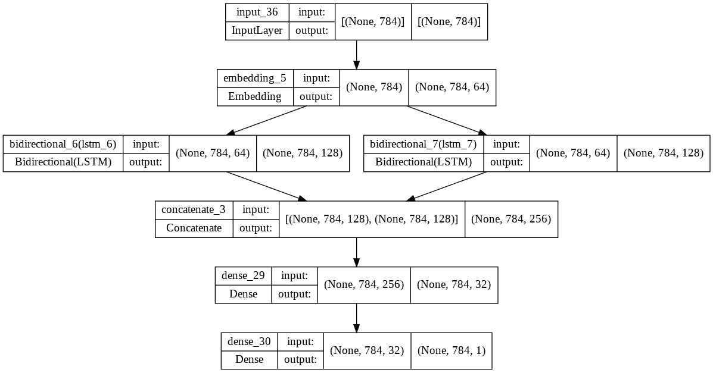

作者图片

接下来，让我们讨论多输入多输出场景。

# 多输入多输出模型

具有多个输入和输出的网络也可以使用函数式 API 来定义。这对于顺序 API 是不可能的。

# 多输入模型

在本例中，我们定义了一个网络，它采用两个不同长度的输入。我们将输入传递给密集层，并使用`add`层对它们求和。

```
input1 = keras.Input(shape=(16,))
x1 =layers.Dense(8, activation='relu')(input1)
input2 = layers.Input(shape=(32,))
x2 = layers.Dense(8, activation='relu')(input2)
# equivalent to `added = tf.keras.layers.add([x1, x2])`
added = layers.Add()([x1, x2])
out = layers.Dense(4)(added)
model = keras.Model(inputs=[input1, input2], outputs=out)
keras.utils.plot_model(model, "model.png",show_shapes=True)
```


作者图片

# 多输出模型

功能 API 支持定义具有**多输出**的模型。下面的例子定义了一个具有两个输出层的[卷积神经网络](https://www.machinelearningnuggets.com/cnn-tensorflow/)。例如，给定一个人的图像，这个网络可以预测性别和头发颜色。

```
image_input = keras.Input(shape=(parameters["shape"], parameters["shape"], 3), name="images") 
x = layers.Conv2D(filters=32,kernel_size=(3,3),activation='relu')(image_input)
x = layers.MaxPooling2D(pool_size=(2,2))(x)
x = layers.Conv2D(filters=32,kernel_size=(3,3), activation='relu')(x)
x = layers.Dropout(0.25)(x)
x = layers.Conv2D(filters=64,kernel_size=(3,3), activation='relu')(x)
x = layers.MaxPooling2D(pool_size=(2,2))(x)
x = layers.Dropout(0.25)(x)
x = layers.Flatten()(x)
x = layers.Dense(128, activation='relu')(x)
x = layers.Dropout(0.25)(x)
gender_prediction = layers.Dense(3, activation='softmax')(x)
age_prediction = layers.Dense(3, activation='softmax')(x)
model = keras.Model(
    inputs=image_input,
    outputs=[gender_prediction, age_prediction],
)
keras.utils.plot_model(model, "model.png",show_shapes=True)
```

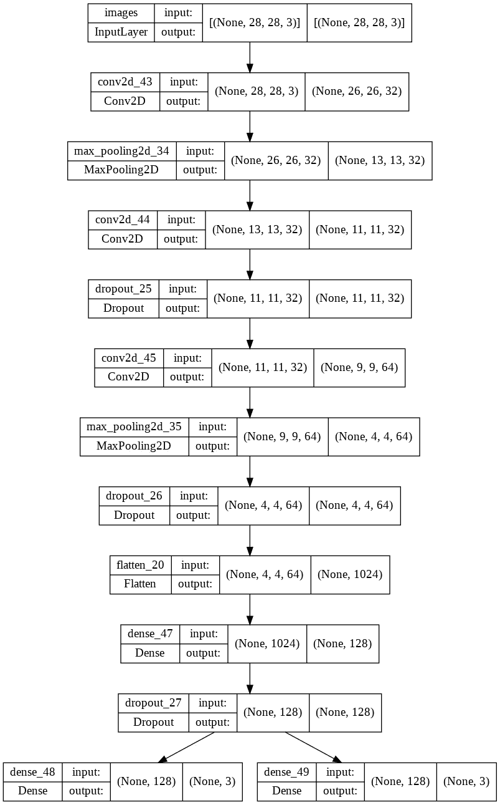

作者图片

# 使用相同的图层图表来定义多个模型

Functional API 还支持使用相同的层定义多个模型。这是可能的，因为使用函数式 API 创建模型只需要输入和输出。例如，这适用于编码解码器网络架构。

```
encoder_input = keras.Input(shape=(28, 28, 1), name="img")
x = layers.Conv2D(16, 3, activation="relu")(encoder_input)
x = layers.Conv2D(32, 3, activation="relu")(x)
x = layers.MaxPooling2D(3)(x)
x = layers.Conv2D(32, 3, activation="relu")(x)
x = layers.Conv2D(16, 3, activation="relu")(x)
encoder_output = layers.GlobalMaxPooling2D()(x)
encoder = keras.Model(encoder_input, encoder_output, name="encoder")
encoder.summary()
x = layers.Reshape((4, 4, 1))(encoder_output)
x = layers.Conv2DTranspose(16, 3, activation="relu")(x)
x = layers.Conv2DTranspose(32, 3, activation="relu")(x)
x = layers.UpSampling2D(3)(x)
x = layers.Conv2DTranspose(16, 3, activation="relu")(x)
decoder_output = layers.Conv2DTranspose(1, 3, activation="relu")(x)
autoencoder = keras.Model(encoder_input, decoder_output, name="autoencoder")
autoencoder.summary()
```

# Keras 功能 API 的优势和劣势

Keras Functional API 在设计非线性网络时非常方便。如果您认为您可能需要将网络转换为非线性结构，那么您应该使用函数式 API。函数式 API 的一些优势包括:

*   与子类化`[Model](https://www.tensorflow.org/guide/keras/custom_layers_and_models)`的[相比，它的**更少冗长。**](https://www.tensorflow.org/guide/keras/custom_layers_and_models)
*   创建一个`Input`的要求确保了**所有的功能网络都将运行**，因为传递错误的形状会导致立即出错。
*   功能模型**更容易绘制和检查**。
*   易于**序列化和保存功能模型**，因为它们是数据结构。

然而，使用函数式 API 的一个缺点是它不支持动态架构，如[递归网络或树形网络](https://www.kdnuggets.com/2016/06/recursive-neural-networks-tensorflow.html)。

# 功能 API 最佳实践

在使用 Keras Functional API 时，请牢记最佳实践:

*   始终打印网络概要给**以确认各层的形状**符合预期。
*   将网络绘制到**确保各层按照你的预期连接**。
*   **命名图层**以便于在网络图和概要中识别。比如说`Conv2D(...,name="first_conv_layer")`。
*   使用与层相关的**变量名，例如`conv1`和`conv2`用于卷积层。这将在检查地块和网络摘要时阐明图层的类型。**
*   **没有创建[自定义训练循环](https://www.machinelearningnuggets.com/keras-custom-training-loops/)，而是使用** `**keras.Model**` **来创建模型**，因为这样更容易通过`fit`方法训练模型，并使用`evalaute`方法评估它们。

# 最后的想法

在本文中，您发现可以使用顺序 API 在 Keras 中设计神经网络。特别是，我们涵盖了:

*   如何在 Keras 中定义功能模型？
*   如何训练和评估 Keras 序列网络？
*   定义具有多个输入和输出的 Keras 网络。
*   如何绘制和检验 Keras 序列模型？
*   基于 Keras 序列网络的特征提取。

[在 LinkedIn 上关注我](https://www.linkedin.com/in/mwitiderrick/)获取更多技术资源。