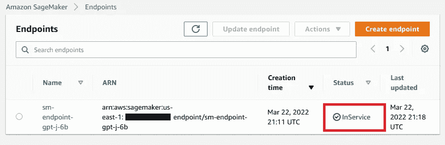
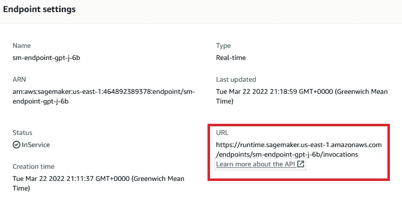
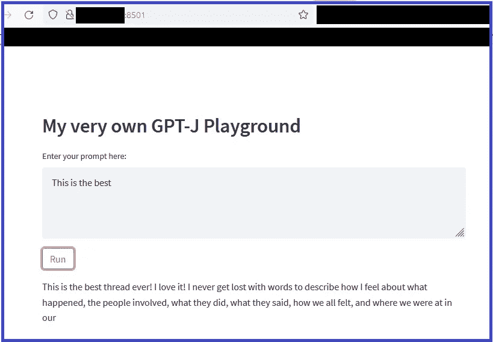

# 如何建立自己的 GPT J 游乐场

> 原文：<https://towardsdatascience.com/how-to-build-your-own-gpt-j-playground-733f4f1246e5>

## 利用 Streamlit、拥抱脸和 AWS 创建您自己的文本生成应用程序

蒂埃里·勒迈特在 [Unsplash](https://unsplash.com?utm_source=medium&utm_medium=referral) 上的照片

# 这是怎么回事？

当 [OpenAI](https://openai.com/) 为其 GPT-3 模型发布[游乐场时，社区很快创建了各种令人印象深刻的演示，其中许多可以在](https://gpt3demo.com/apps/openai-gpt-3-playground)[棒极了的 GPT-3 Github repo](https://github.com/elyase/awesome-gpt3) 中找到。

但是如果我们想创建我们自己的文本生成平台呢？GPT-3 是专有的，使用 API 来生成文本会让我们付出代价。这也意味着我们必须将我们的数据发送到 OpenAI。理想情况下，我们想做的是在我们控制的环境中托管一个开源文本生成模型和一个游乐场应用程序。

看起来我们很幸运。2021 年， [Eleuther AI](https://www.eleuther.ai/) 创造了 GPT-J，一个开源的文本生成模型，与 GPT-3 竞争。当然，该模型在 Hugging Face (HF)模型中心上[可用，这意味着我们可以利用亚马逊 SageMaker](https://huggingface.co/EleutherAI/gpt-j-6B) 中的 [HF 集成来轻松部署该模型。为了创建一个与模型交互的 web 界面，我们可以使用](https://docs.aws.amazon.com/sagemaker/latest/dg/hugging-face.html) [Streamlit](https://streamlit.io/) ，它允许我们只使用 Python 就能编写 web 应用程序:)

那我们开始吧！教程的完整代码可以在这个 [Github repo](https://github.com/marshmellow77/gptj-playground) 中找到。

# 部署 GPT J 模型

拥抱脸的人已经让在亚马逊 SageMaker 上部署像 GPT-J 这样的 6B 参数模型变得非常容易，几乎没有任何不便。来自 HF 团队的 Philipp Schmid 在他的[博客文章](https://www.philschmid.de/deploy-gptj-sagemaker)中概述了这个过程——所有需要的就是 24 行代码:

在 SageMaker 上部署 GPT-J 的代码(信用:[https://www.philschmid.de/deploy-gptj-sagemaker](https://www.philschmid.de/deploy-gptj-sagemaker)

一旦我们在 SM 笔记本中运行此代码，将需要几分钟时间来部署端点。终端准备就绪时，SM 控制台会告诉我们:

作者图片

# 创建 web 界面

## 设置 EC2

一旦模型部署在 SageMaker 端点上，我们就可以在笔记本上运行推理请求。但是为什么就此打住呢？借助 Streamlit 的力量，我们可以轻松创建自己的 GPT J 游乐场！

我们需要的只是一台服务器，我们可以在其中托管 Streamlit 应用程序并访问 SM 端点。如果我们选择在与端点相同的帐户中的 EC2 实例上这样做，我们可以通过 SM 提供的 API 访问端点:

作者图片

我们需要做的只是提供一个小型 EC2 实例，例如 t3.medium，因为它将只托管 web 应用程序。一旦实例启动并运行，我们就安装 [miniconda](https://docs.conda.io/en/latest/miniconda.html) 并通过 pip install 安装所需的库:

为了连接到我们的端点，我们还需要将我们的凭证从 EC2 传递到 SageMaker。有很多方法可以做到这一点，更多信息请查看 [AWS 文档](https://boto3.amazonaws.com/v1/documentation/api/latest/guide/credentials.html)。在本教程中，我将使用一个[共享凭证文件](https://boto3.amazonaws.com/v1/documentation/api/latest/guide/credentials.html#shared-credentials-file)。

## 创建简化应用程序

现在我们可以开发我们的 Streamlit 应用程序，这非常简单。让我们首先定义一个方法来处理模型有效负载和响应的预处理和后处理:

现在我们需要一个文本字段，我们可以在其中输入提示，调用我们的 *generate_text()* 方法，并显示模型响应:

就是这样！非常简单，不是吗？

## 测试应用程序

让我们测试一下这个设置！我们可以使用*streamlit run<python-script>*[命令](https://docs.streamlit.io/knowledge-base/using-streamlit/how-do-i-run-my-streamlit-script)开始运行 streamlit 应用程序。这将在端口 8501 上开始运行应用程序，因此我们需要确保端口 8501 没有被阻塞(在 EC2 实例上，这意味着需要更新相应的安全组，以允许到端口 8501 的流量通过)。一旦应用程序启动并运行，我们就可以通过*http://<EC2-IP-ADDRESS>:8501 访问它。*

我们将看到一个文本框，我们可以在那里输入我们的提示和一个*运行*按钮，将调用我们的 GPT-J 模型。让我们在文本框中输入一个提示，然后运行模型。几秒钟后，它应该返回生成的文本:

作者图片

就这样——我们刚刚在自己的 playground 应用程序中用 GPT-J 模型生成了第一个文本！

# 结论

有许多方法可以改善这个游乐场，其中一些是:

*   新生成的文本可以用作模型的新提示。这将使我们能够继续就同一主题编写文本。
*   防止模型在句子中间停止。
*   引入参数来影响生成的文本，例如*温度*和*最高温度*。你可以在这篇博文的[中找到更多关于这些参数和文本生成的信息。](https://huggingface.co/blog/how-to-generate)

我希望你觉得这个教程有用，如果你有任何问题或意见，请联系我们。

***【2022 年 5 月 11 日编辑:我现在已经发表了一篇*** [***的博文***](/how-to-use-gpt-j-for-almost-any-nlp-task-cb3ca8ff5826?source=your_stories_page-------------------------------------) ***讲述了如何使用这个 GPT-J 游乐场的应用来完成(几乎)任何 NLP 任务。】***