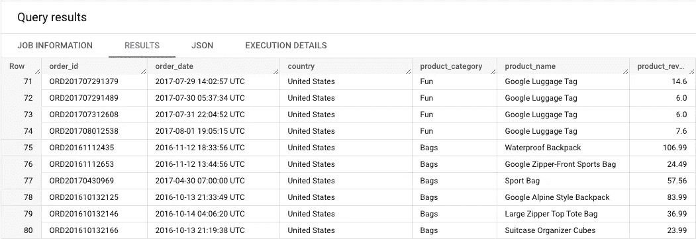
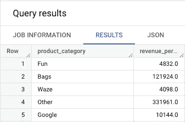
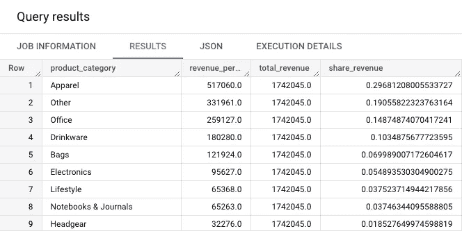
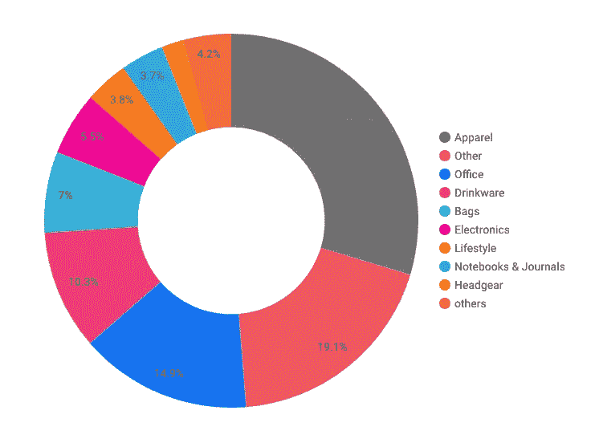
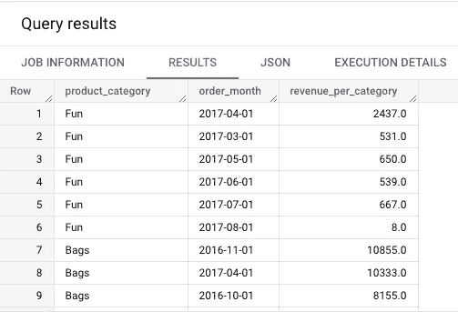
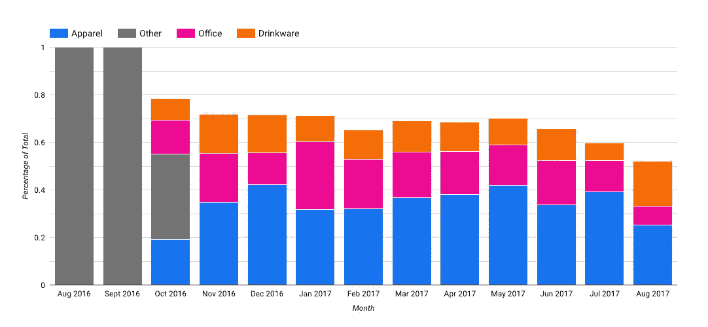

# 如何使用 SQL 计算 BigQuery 中的百分比

> 原文：<https://towardsdatascience.com/how-to-calculate-a-percentage-of-total-in-bigquery-using-sql-59b077c1225f>

## 比较一行对所有行总和的贡献

由[卡里姆·曼吉拉](https://unsplash.com/@karim_manjra?utm_source=medium&utm_medium=referral)在 [Unsplash](https://unsplash.com?utm_source=medium&utm_medium=referral) 拍摄的照片

# 为什么要用总数的百分比？

假设你有一个销售咖啡的电子商务网站，你有三种不同类别的产品:阿拉比卡、罗布斯塔和利百丽卡。

在一份报告上，你看到 2022 年 6 月，你卖出了阿拉比卡的**34.5 万€，罗布斯塔**的**11.2 万€，利百丽卡**的**13 万€。从绝对值来看，你会注意到阿拉比卡咖啡是你最大的收入来源，但从百分比来看，**它代表了你本月销售额的 73%** 。**

> 这个想法是看一行对所有行的总和的贡献

为了避免通过将一个值除以所有值的总和来手动计算该百分比，我们将学习如何使用 SQL 来帮助我们，并帮助回答以下问题:

*   **什么产品对我们公司的收入贡献最大？**
*   **随着时间的推移，我们国家的市场份额如何演变？**

在本文中，我们的数据来自于[谷歌商品电子商务网站](https://shop.googlemerchandisestore.com/)。对于我们的分析，我们的表包含销售的产品、产品名称和类别以及产生的收入。

我们的基本数据表。(图片由[作者](https://romaingranger.medium.com/)提供)

## 产品类别对总收入的贡献

对于我们的第一个业务问题，我们想知道每个产品类别对我们总收入的贡献有多大。

首先，我们需要计算每个产品类别的总收入。

我们计算每个产品类别的总收入。

因此，我们得到一个表，每个产品类别和产生的收入各占一行。

每个产品类别的总收入。(图片由[作者](https://romaingranger.medium.com/)

我们的网店总共有 **21 个类目**，如果做营收之和(`revenue_per_category`字段之和)，得到**174 万**(也就是我们的网店总营收)**。**

现在，要获得总收入的百分比，我们需要将每个类别的收入除以总收入。

为了实现这一点，不使用`JOIN`子句，您可以使用`OVER()`子句。让我们深入细节:

在顶部的`WITH`子句中，我们有一个计算每个类别收入的第一个查询。在我们的主语句中，在`*`之后有两行:

*   第一行计算总收入(您实际上并不需要它，**它只是为了突出语法**并展示如何使用窗口函数)
*   第二行计算每个类别的收入份额。

你可以注意到我们使用了一个`SAFE_DIVIDE`函数，以防我们除以 0(意味着我们的总收入为 0)。该函数将返回收入份额的`NULL`值，而不是抛出“**除以 0”**错误。

每个类别的收入份额。(图片由[作者](https://romaingranger.medium.com/)提供)

这就是你如何在 Data Studio 中用饼状图绘制它:

每个产品类别占我们总收入的份额。(图片由[作者](https://romaingranger.medium.com/)提供)

服装**类别是贡献最大的类别，与**其他**和**办公室**并列。**

我们可以看到，我们有两个不同的类别**其他**和**其他。**

*   **其他**是我们数据中标注为“其他”的类别。
*   **其他**是因为 Data studio 在数据点过多的时候会截断结果。这里我们只显示 10 个切片，但是我们有 21 个类别。通过这样做，Data Studio 将所有剩余的类别组合成一个名为 **others** 的类别。

## 一段时间内产品类别对收入的贡献

对于我们的第二个业务问题，我们想知道我们的产品类别的收入份额是如何随着时间变化的。

为此，我们将计算每个产品类别每月的收入，然后计算该月每个产品类别占总收入的百分比。

首先，我们需要计算每个类别在一段时间内的总收入(在我们的例子中是每个月)。我们每月增加第二个`GROUP BY`。

因此，每个月每个产品类别和产生的收入各占一行。

我们每个类别的每月总收入。(图片由[作者](https://romaingranger.medium.com/)提供)

为了查看随时间的变化，我们不查看 21 个类别，而是放大第一个业务问题中看到的**前 4 个类别**:服装、其他、办公用品和饮料。

您可以注意到，我们创建了一个子查询，它封装了我们的`ratio`字段，在我们计算出每月总数的百分比后，过滤所需的类别。如果我们之前进行了筛选，总收入将只代表这四个类别。

我们在这个查询中的窗口函数与本文前一部分中使用的非常相似，除了我们的`OVER()`子句现在将每个月划分为分区。

这导致了以下结果:

几个月来我们前四大类别总收入的百分比。(图片由[作者](https://romaingranger.medium.com/)提供)

我们可以观察到 **Other** 类别肯定是跟踪错误或被贴错标签，因为它不会在一个月内返回，并且是 2016 年 8 月至 9 月期间唯一出现的类别。

随着时间的推移，我们确实看到这三个类别占我们商店收入的 60%,而在 2017 年 1 月,**“办公室”**类别的贡献超过了以往。

# 结论

如果我们在 SQL 中学习这种方法，它可以节省手动计算的时间，并且能够为许多类别/维度扩展这种计算。

这也是因为并不是所有的数据仓库系统都提供了一种有效的方法来计算一个比率或总份额。BigQuery 的情况并非如此。

其他系统，如亚马逊红移或雪花有一个名为`ratio_to_report()`的窗口函数，它计算我们在本文中看到的内容。数据可视化系统，如 Tableau 或 QlikSense，也使计算总百分比变得更加容易。

感谢您的阅读；我希望这篇文章给了你计算和理解它背后的方法的关键。