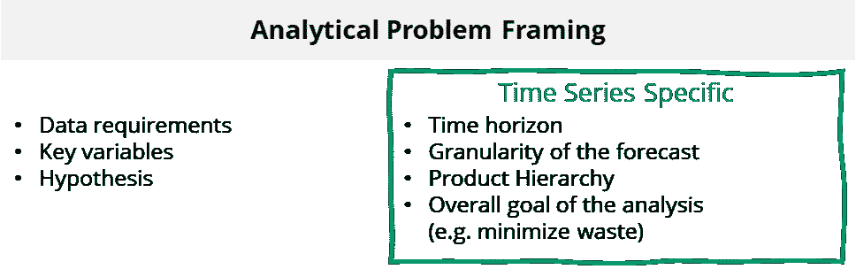
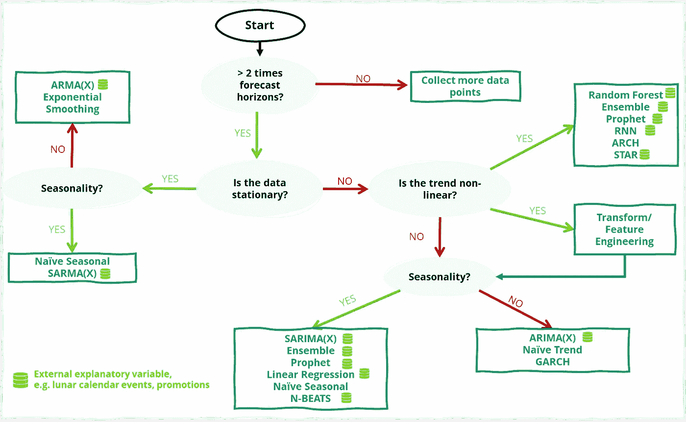
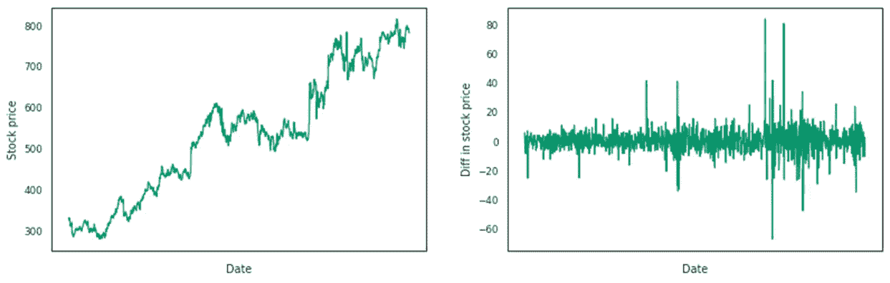
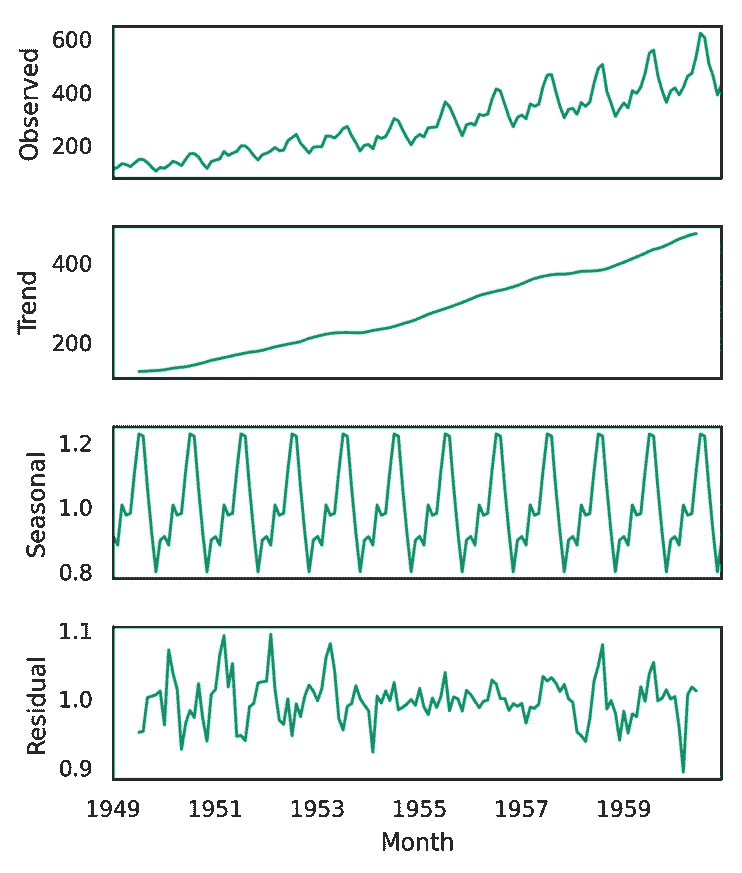

# 如何选择预测模型

> 原文：<https://towardsdatascience.com/how-to-choose-a-forecasting-model-fa9c4a2e75b8>

## 选择时间序列方法的决策树

尼克·希利尔在 [Unsplash](https://unsplash.com?utm_source=medium&utm_medium=referral) 上的照片

*由戈西亚·科莫尔和克劳迪娅·邦尼撰写，由约斯特·德·泰耶评论。*

**关键要点:**

*   在处理时间序列时，经典的统计方法不能直接适用，所以一定要使用特定于时间序列的方法
*   理解业务问题和数据对于选择最合适的模型至关重要
*   选择模型只是模型训练、评估、改进和操作的激动人心的旅程的开始

**简介**

对于在动荡环境中运营的任何企业来说，预测都是一项至关重要的职能。捕捉经济和未来需求的可变性是对变化做出快速反应并调整供应、采购、物流等业务的关键技能。预测的好处包括降低库存成本、减少浪费、减少缺货和实现更高的服务水平。

时间序列分析是一种特定的方法，可以帮助企业提高其预测能力。它分析在一段时间间隔内收集的一系列等距数据点，以提取数据的有意义的统计数据并预测其未来值。

然而，随着数据科学的日益普及和数据的日益复杂，可能的时间序列模型的数量可能会多得令人难以招架。您是否需要一个简单的解决方案来最好地获取历史销售额，或者您的业务是否严重依赖于需要考虑的外部因素？这些是在数据探索期间需要询问的示例问题，以便为分析问题选择最适合的模型。在本文中，我们将介绍我们的方法来执行时间序列建模，包括分析问题框架，数据探索和我们的时间序列模型选择的新框架。

1.  **分析问题框架**

在我们方法的第一阶段，业务问题被转化为分析问题，因此，范围被定义。这一步对于建立分析方法至关重要。一般来说，分析性问题框架包括定义要测试的假设、要提取的变量和整体解决方案的成功标准。然而，时间序列分析需要额外的步骤来扩展标准的人工智能方法。

一般来说，时间序列解决方案的总体目标是最小化预测的误差。通过提高需求预测的准确性，这可以转化为企业避免不必要的库存或最后一分钟运费的成本。通过分析确定这一目标非常重要，它将决定感兴趣的变量、时间范围、预测粒度和数据层次。

时间范围被定义为我们预测数据的时间段。例如，采购团队需要提前 10 周订购特定数量的材料。在这种情况下，预测范围至少是 10 周，10 周可能提供最好的准确性。根据业务问题，选择正确的时间范围以在正确的时间从解决方案中获得可操作的见解非常重要。

预测粒度被定义为时间维度，其中数据被格式化用于预测，例如每周、每月或每年。例如，每周预测将需要子周预测粒度来包含数据中的模式。还应该确定粒度以获得最佳洞察力，但粒度也会受到数据可用性的影响。

在开始对数据进行预测分析之前，了解产品层次结构非常重要。最佳层次结构的选择不仅取决于业务问题，还取决于数据的可用性。例如，如果产品经常变化，但它们的组成非常相似，那么将相似的产品分组并一起预测会很有趣

**2。数据探索和需求**

数据探索通常包括将数据分成训练集和测试集、异常值检测和识别缺失值。这些步骤也可以用时间序列数据来执行，但是需要额外的步骤来开始建模。

当使用时间序列数据时，重要的是检测数据中任何与时间相关的模式，这有助于理解手头的问题并在以后选择模型。当季节性因素影响一周中的天数[【1】](#_ftn1)等数据时，时间序列中就会出现季节性模式。通过绘制数据或在数据探索阶段进行季节性分解，可以更清楚地识别这些模式。

特征工程是对模型质量有很大影响的一个步骤。在时间序列中，可以设计不同类型的特征，例如日期时间特征、滞后特征和滚动窗口统计。参见一篇关于时间序列模型特征工程的伟大文章[【2】](#_ftn2)。

除了历史数据，还有其他外部因素可以帮助更好地预测未来。我们称这些变量为“外部因素”。在这个数据探索阶段，识别这些变量、理解它们并转换它们以适应模型是很重要的。例如，汽车销售可以帮助预测汽车零部件的需求。通过将这一外部因素添加到解释变量中，可以提高预测模型的性能。

**3。选择型号**

时间序列数据具有许多影响未来值的特征，因此我们创建了一个决策树来帮助选择最佳拟合模型。这里有一个如何使用决策树的例子:

首先，检查数据集中有多少个数据点。我们的经验法则是数据集应该包含至少 2 个预测周期。如果不是这样，你需要收集更多的数据。

通过计算观察值之间的差异实现股票价格数据集中平稳性的示例。图灵感来自:【https://otexts.com/fpp2/stationarity.html】T2

如果你有足够的数据，平稳性评估。平稳数据被定义为在一段时间内具有恒定的方差和均值。您可以运行一个增强的 Dickey-Fuller (ADF)测试来统计检查这一点，但是您也可以在绘制一段时间的数据时直观地看到这一点。为了实现平稳性，使用时间 *t* 和 *t-1* 的观测值之间的差值，而不是时间 *t* 的观测值。

观测数据的季节分解示例。图灵感来源:[https://machine learning mastery . com/decompose-time-series-data-trend-seasonity/](https://machinelearningmastery.com/decompose-time-series-data-trend-seasonality/)

接下来，您需要确定数据的季节性。通过分解时间序列数据，您可以识别数据的趋势、季节模式和残差。最常用的方法是经典的季节分解法，但也有其他方法(例如 X11 分解、座位分解)。如果您的数据不是季节性的，您可以在 ARMA(X)和指数平滑之间进行选择，这取决于您是否需要向模型中添加外部变量。

如果您的数据不是静态的，则需要检查趋势是否是线性的，以便在线性和非线性模型之间进行选择。在非线性时间序列中，序列的当前值不是过去观测值的线性函数。当应用于来自线性模型的残差时，BDS 测试可以检测省略的非线性结构的存在。然而，就像经典回归分析一样，数据的非线性可以通过预测或预测变量(如 log())的转换来忽略。此外，如果非线性数据可以划分为线性周期，则可以执行分段线性分析。然而，非线性模型，包括基于集合建模或神经网络的模型，以其高性能而闻名，并允许在预测中纳入外部变量，这有助于解释结果。

**4。模型性能和操作**

有许多关于时间序列评估指标的优秀文章，我们建议阅读这些[[3–5](#_ftn3)]。此外，定制的度量标准可以被设计成在特定的组织中工作得最好，并且可以被业务涉众容易地解释。您的预测模型也可以用简单的方法作为基准，如简单预测或移动平均法。

预测是使用历史数据完成的，正如机器学习中经常发生的那样，使用一个训练过的模型将导致随着时间的推移误差越来越大。模型生命周期监控对于及时发现性能下降至关重要，样本外预测是一种有效的规避方法，它通过一段时间内的滚动窗口训练模型。

最后，重要的是要记住，选择一个模型只是这个过程的开始。彻底的实验和随后的模型改进将确保它尽可能准确。需要考虑模式的运作，包括如何将其纳入现有系统和业务流程。

**结论**

时间序列建模是各种业务的基本技能。通过了解业务问题和数据，选择最合适的模型，训练和评估模型，并迭代地改进和操作它，企业可以提高他们的预测能力，并做出更好的数据驱动的决策。我们希望通过遵循这些步骤并使用系统化的方法，您可以选择满足业务需求的预测模型，并帮助您做出更准确的预测。

*所有图片均由作者提供。*

**参考文献:**

[【1】](#_ftnref1)hynd man，R.J .，& Athanasopoulos，G. (2021)预测:原理与实践，第 3 版，OTexts:澳大利亚墨尔本。OTexts.com/fpp3.访问时间为 2022 年 3 月 4 日。

[2][https://medium . com/data-science-at-Microsoft/introduction-to-feature-engineering-for-time-series-forecasting-620 aa 55 fcab 0](https://medium.com/data-science-at-microsoft/introduction-to-feature-engineering-for-time-series-forecasting-620aa55fcab0)

[3][https://medium . com/analytics-vid hya/error-metrics-used-in-time-series-forecasting-modeling-9f 068 BDD 31 ca](https://medium.com/analytics-vidhya/error-metrics-used-in-time-series-forecasting-modeling-9f068bdd31ca)

[4][https://towards data science . com/time-series-forecast-error-metrics-you-should-know-cc 88 b 8 c 67 f 27](/time-series-forecast-error-metrics-you-should-know-cc88b8c67f27)

[5][https://medium . com/@ Dave . cote . MSC/rdr-score-metric-for-evaluation-time-series-forecasting-models-1c 23 f 92 f 80 e 7](https://medium.com/@dave.cote.msc/rdr-score-metric-for-evaluating-time-series-forecasting-models-1c23f92f80e7)