# 如何为您的数据科学项目选择有效的视觉效果

> 原文：<https://towardsdatascience.com/how-to-choose-an-effective-visual-for-your-data-science-project-3e7c0a291a55>

## 免费下载指南，帮助您选择合适的产品


作者图片

视觉沟通是每个专业人士必备的技能。决策在很大程度上依赖于数据，这些数据的数量如此之大，以其原始格式是无法消费的。因此，应用某种程度的图形抽象是必要的。

Dataviz 已经成为一种共享的“语言”,将数据整理成更容易理解的形式，突出模式和异常值。传统上，商业世界在讲故事和技术分析之间划了一条明显的界限，而今天，公司更看重那些跨越这两个领域的人。**公民数据科学家** ( [一词由 Gartner](https://www.gartner.com/en/documents/3534848) 创造，指的是能够执行简单或中等复杂的分析任务，但其主要工作职能不在统计和分析领域本身的人)的崛起是事实。

制作设计良好、有说服力且清晰的图表是任何数据科学家的关键能力，这一切都始于选择正确的类型。这篇文章将有望让你掌握基本的视觉“语法”,以创建强有力地描绘你的想法的引人注目的可视化。

# 有一个图表！

**寻求选择有效可视化的第一步**是理解你的数据，这样你就可以清楚地定义你想要传达给最终用户的信息:

‣:它是什么类型的？名义上？序数？比例？区间？(—见下面的备忘录)
‣需要什么样的分组？‣不同的数据部分如何相互关联？
‣最普遍的价值观是什么？
‣他们的比例重要吗？
‣它们是如何随时间变化的？
‣:顺序重要吗？

每个星盘都有一个基于其属性的特定目标，所以第二步**是选择一个与你的目标一致的观想。这不是一个简单的任务，有很多关于这个主题的文献——我将在本文的下一部分向您介绍最流行的方法。**

在本节中，我将尝试缩小常见 dataviz 目标的范围，并解释您可能面临的最常见案例背后的决策过程。这不是一个全面的列表，肯定会有例外，但是理解基础知识是至关重要的。我们将首先描述用例，然后给出一个可以在这个类别中回答的示例问题，最后添加最流行的图表类型和一个可视化示例。

**n.b.** :在这些例子中，我将使用我在 [**中制作的图表，但这些概念也适用于在其他应用程序/库中制作的图表。**](https://plotly.com)

```
**Quick Memo on Data Types****✅ Qualitative** data cannot be measured numerically, but can be described through language:
‣ **Nominal** data have distinct values, but without a built-in order, e.g. country, gender, customer name.
‣ **Ordinal** data have a ranked or positioned value but the magnitude of the differences is not well defined, e.g. satisfaction scale: low, medium, high.**✅ Quantitative** data can be measured numerically:
‣ **Intervals** are data where the **absolute** differences are significant (addition and subtraction operations can be performed), e.g. cost.
‣ **Ratios** are data where the **relative** differences are significant (multiplication and division operations may be performed), e.g. you cannot sum up the rainfall in a week, but you can calculate the average, or you can say this week's rainfall is two times higher than last week.All quantitative variables are in turn divided into two types:
‣ **Discrete** data have finite possible values, obtained by counting, e.g. number of children a family has (0, 1, 2, 3, etc).
‣ **Continuous** data cannot be counted, but are obtained by measuring – hypothetically they are infinite, e.g. a building’s height (20.450m, 20.451m, etc).
```

准备好了吗？我们走吧！

## ➊——指标

‣ **最适合:**告知你的听众一个具体的数据点或数值。这不是“真正的图表”,但经常在 KPI 仪表板中使用，以引起对关键数字的注意。
‣ **样本用例**:本周销售总数。
‣ **图表类型**:单个指示器(如数字、增量和仪表)。

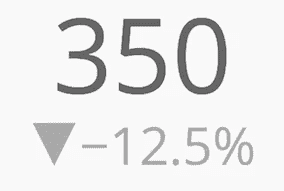

指标示例[本周销售总数]

## ➋ —名义数据比较

‣ **最适合:**比较没有特定顺序的值。
‣ **样本用例**:每个国家的产品销售额。
‣ **图表类型**:条形图，最好按字母顺序标注。

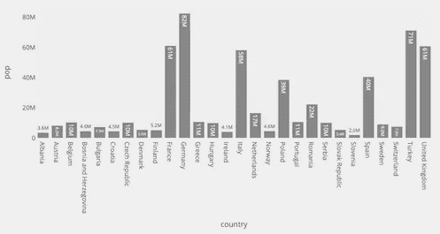

名义数据示例[每个国家的产品销售额]

## ➌——排名

‣ **最适合:**两个或多个子集相对大小的排序。
‣ **样本用例**:人均可支配收入最高的国家。
‣ **图表类型**:以降序排列的条形图，强调高值，或以升序排列，强调低值。

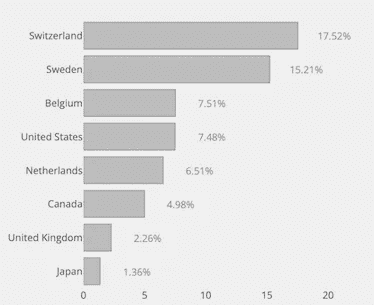

排名示例[每个国家最高可支配收入]

## ➍ —时间序列

‣ **最适合:**通过内在化趋势、模式和可变性，比较在相同时间段内进行的测量，通常用于预测。
‣ **样本用例**:股票价格分析。
‣ **图表类型**:折线图，其中 x 轴绘制时间增量，y 轴精确显示被测量变量的值。

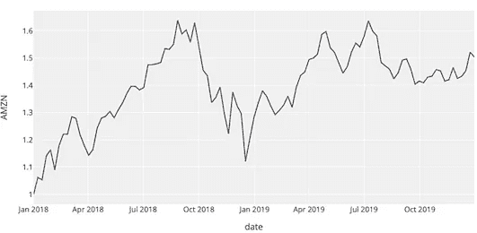

时间序列示例[股票价格分析]

## ➎相关性

‣ **最擅长:**确定两个或多个变量如何可能有正或负的关系或者根本没有关系。
‣ **样本用例**:总账单和小费之间的差异。
‣ **图表类型**:当涉及两个变量时:带有线性回归线的散点图(显示趋势)。—对于三个变量:气泡图(尺寸为第三维)。

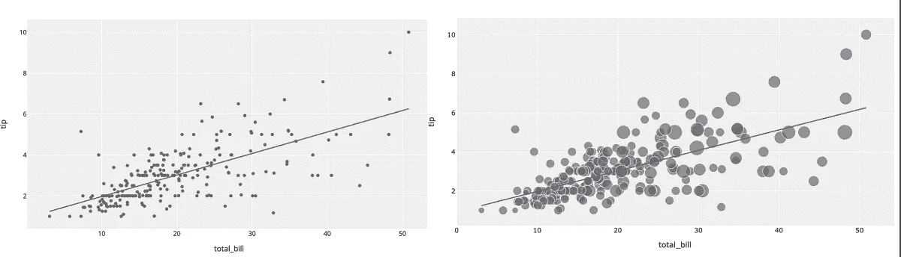

相关性示例[左:总账单和小费之间的差异—右:相同，基于用餐人数]

## ➏ —偏差

‣ **最适合:**测量数值和参考值之间的差异，例如数据点与平均值或中值的差异。
‣ **样本用例**:本月的气温与上月的中值对比。
‣ **图表类型**:包含偏离参考线的折线图，以强调整体模式。—或者:发散条形图，以强调测量结果。

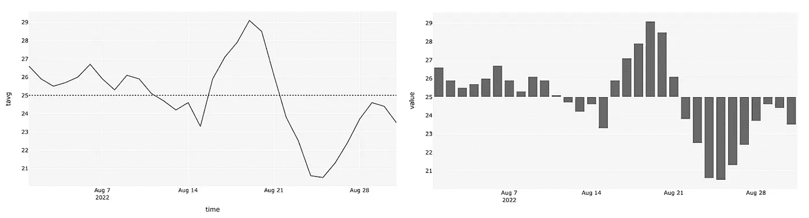

偏差示例[本月温度与上月中值的对比]

## ➐ —分布

‣ **最佳:**说明人口中事件发生的频率。
‣ **样本用例**:受访者的年龄分布。
‣ **图表类型**:柱状图。

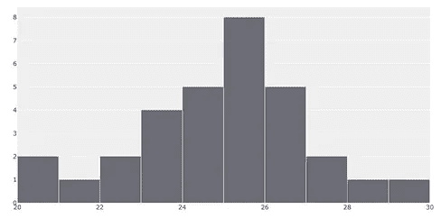

分布示例[受访者的年龄分布]

## ➑——作文

‣ **最适合:**测量整体的单个值。
‣ **样本用例**:各部门对总预算的分配。
‣ **图表类型**:条形图，其中条形大小对应于总值的百分比。饼图通常不太能有效地展示数据。

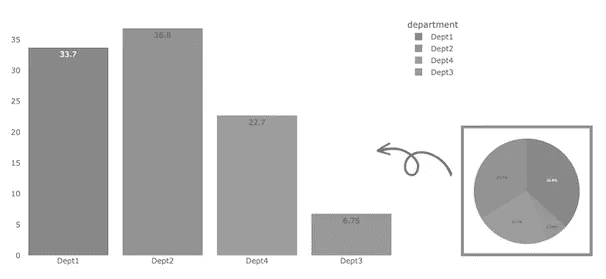

构成示例[各部门总预算的分配]

## ➒ —原始数据

‣ **最适合:**查看精确数值，或比较单个数值。这不是“真正的可视化”,但经常用于需要深入到成分记录的分析中。
‣ **样本用例**:公司的薪酬记录。
‣ **图表类型**:表格。

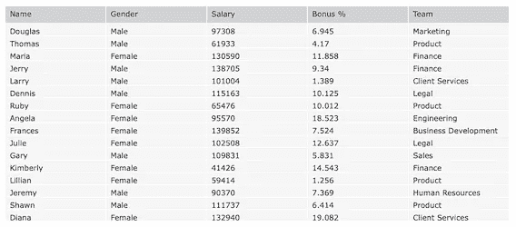

原始数据示例[公司的薪酬记录]

## ➓ —不确定性

```
Nearly every dataset we work with has some uncertainty generated from **inefficient representation of data** (summary statistics) and **statistical inference** (data sample and probability), so how we choose to represent this can influence how the data is perceived by decision makers, who are usually more comfortable with certain messages.
```

‣ **最适合:**表示测量中可能值的范围，即给出测量精度的一般感觉。
‣ **样本用例** : A 级成绩预测。
‣ **图表类型**:折线图、条形图、散点图等中的误差线。

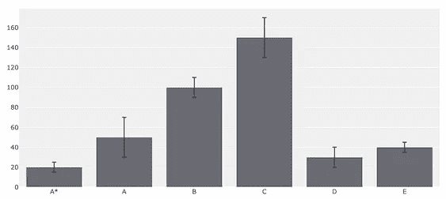

不确定性示例[A-level 成绩预测]

# 常用图表选择工具包

dataviz 的艺术不仅仅是将数据转换成图表；这也是关于知道如何以一种有意义的方式呈现你的数据和信息。选择正确的图表不是一项简单的任务，通常没有单一或理想的答案。为了帮助您在多个选项之间做出选择，有几个工具包可供您参考。

以下是我策划的工具列表:

## ➊——安德鲁·阿贝拉博士的极端呈现法

也许最著名的决策图是 Andrew Abela 博士的[极端呈现](https://extremepresentation.com/design/7-charts/) 方法论，其中图表分为四种类型:比较、组成、分布、关系。

## ➋——金融时报视觉词汇

尽管英国《金融时报》的目标读者是记者，但他们指南的内容对任何可视化数据的人来说都是普遍适用的。它概述了九个类别和 70 多种图表类型，并描述了在实践中如何以及何时使用这些图表。

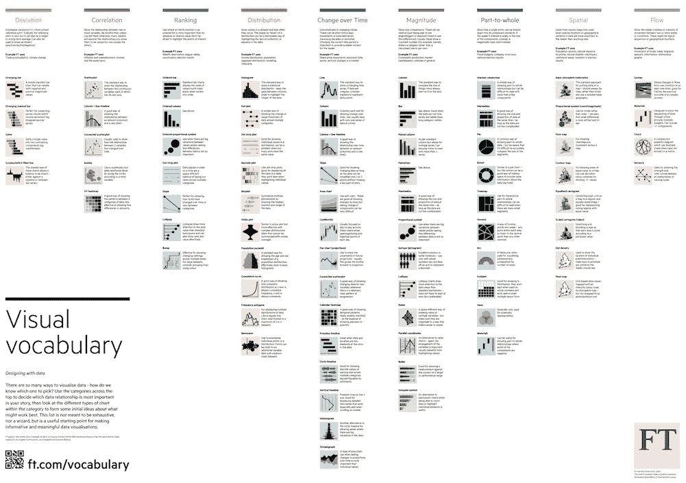

麻省理工学院许可证:[链接](https://github.com/Financial-Times/chart-doctor/tree/main/visual-vocabulary)

## ➌——dataviz 项目

[这个项目](https://datavizproject.com)展示了一个交互式的可视化目录，不仅按名称和功能分类，还按数据类型和形状分类。

## 从数据到文本的➍—

[From Data to Viz](https://www.data-to-viz.com) 是一个图表选择工具，它会引导您找到最适合您的 Dataviz 需求的图表，并链接到构建它的代码(R、Python 和 D3)。

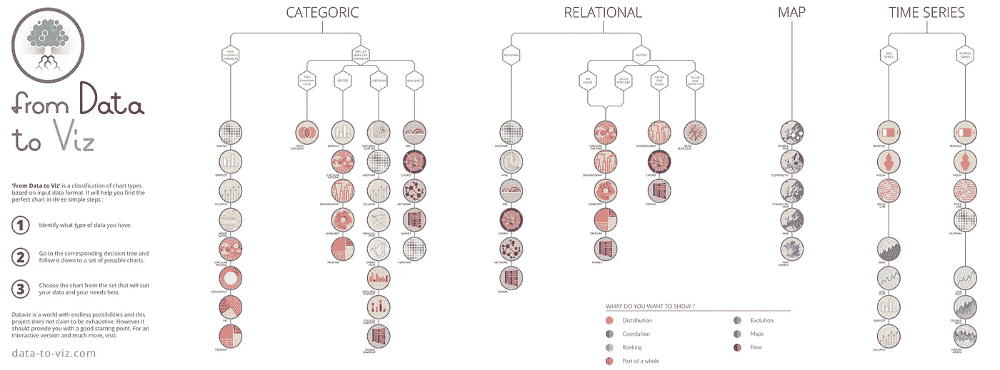

麻省理工学院许可证:[链接](https://github.com/holtzy/data_to_viz)

## ➎——可视化宇宙

[可视化宇宙](http://visualizationuniverse.com)是图表、Dataviz 书籍和按流行和趋势排列的工具的绝佳指南。它是由谷歌新闻实验室和 T21 合作设计的。

# 外卖食品

有两大类图表:一类允许观众探索数据，另一类快速清晰地传达见解。在这两种情况下，最重要的是要记住简单是王道:简单明了地讲述一个清晰的故事，让你的观众明白，这比展示复杂的图表，把注意力从关键信息上引开，要有力得多。

> 对于 Dataviz 来说，简单是王道

也就是说，祝你第一次(或下一次)dataviz 之旅好运。

🆓 👉如果你想收藏本文中讨论的可视化用例，你可以从[我的 Gumroad 页面](https://semikoen.gumroad.com/l/HowToChooseAnEffectiveVisual)下载一个**免费的** pdf。

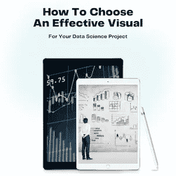

[如何为您的数据科学项目选择有效的视觉效果|免费电子书](https://semikoen.gumroad.com/l/HowToChooseAnEffectiveVisual)

感谢阅读！

*我经常在媒体上写关于领导力、技术&的数据——如果你想阅读我未来的帖子，请*[*‘关注’我*](https://medium.com/@semika) *！
我的新书《技术智慧》现已面世—* [*先睹为快*](https://semikoen.gumroad.com/l/technicalwisdom) *！*