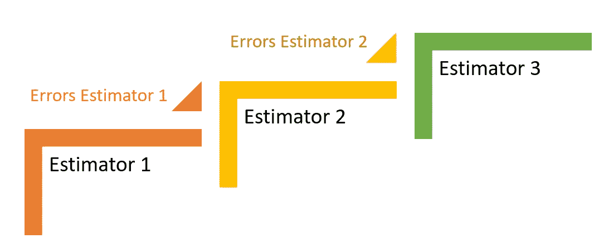
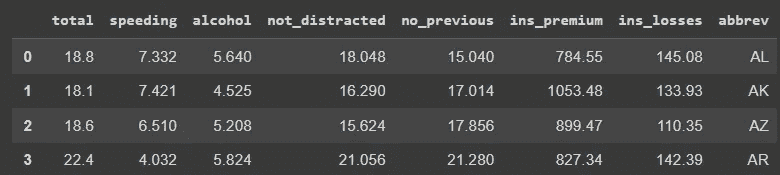
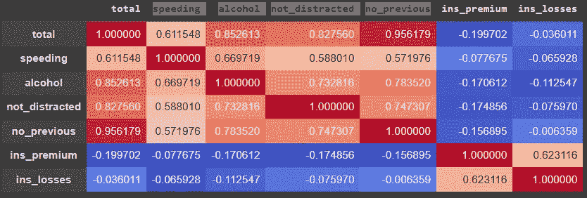
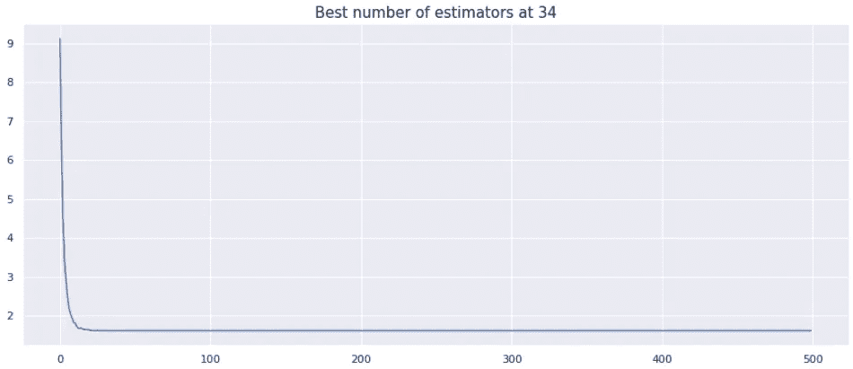
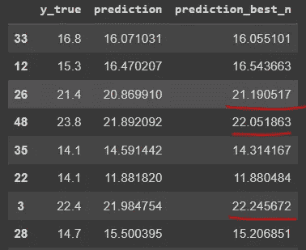

# 梯度推进中如何选择估计量的个数

> 原文：<https://towardsdatascience.com/how-to-choose-the-number-of-estimators-for-gradient-boosting-8d06920ab891>

## 一个简单的循环来调整你的模型


布莱登·特罗洛普在 [Unsplash](https://unsplash.com/s/photos/sequence?utm_source=unsplash&utm_medium=referral&utm_content=creditCopyText) 拍摄的照片

# 介绍

在数据科学中，目前有许多算法可供使用。因此，一种有用的技术是将它们结合在一个模型中，以获得各自的优点，从而得到一个更准确的模型。

使用 Scikit-Learn，您会发现随机森林算法，即 bagging 类集成模型。另一方面，您还会发现 Boosting 模型，它按顺序训练估计器，将一个模型的结果传递给下一个模型，试图改进预测，直到它们达到最佳结果。

创建梯度增强估计器时，您会发现这个超参数`n_estimator=100`的默认值为 100 棵树，需要创建这些树才能得到结果。很多时候，我们只是将它设置为默认值，或者根据需要增加，甚至使用网格搜索技术。

[](/grid-search-or-random-search-for-model-tuning-f09edab6aaa3)  

在这篇文章中，我们将找到一个简单的方法来得到一个单一的数字来训练我们的模型。

# 梯度推进

使用这个类`**from** sklearn.ensemble **import** GradientBoostingRegressor`可以从 Scikit-Learn 加载梯度增强。梯度推进算法可用于分类或回归模型。它是一个基于树的估计器，这意味着它由许多决策树组成。

*树 1* 的结果会产生错误。这些误差将被用作*采油树 2* 的输入。同样，上一个模型的误差将被用作下一个模型的输入，直到它达到`n_estimators`值。



每个模型都会符合前一个模型的误差。图片由作者提供。

由于每个估计量都将符合前一个估计量的误差，因此预期预测的组合将优于任何一个单独的估计量。每次迭代后，我们都使模型变得更复杂，减少了偏差，但增加了方差。所以我们必须知道何时停止。

让我们看看现在该如何做。

# 准备模型

这个练习的代码很简单。我们所要做的就是在每次迭代后循环一次，并检查哪一次我们有最低的误差。

让我们从选择数据集开始。我们将使用来自 seaborn 库的 [*car_crashes*](https://github.com/mwaskom/seaborn-data/blob/master/car_crashes.csv) 数据集(这是 BDS 许可下的一个开放数据)。

```
# Dataset
df = sns.load_dataset('car_crashes')
```

下面快速看一下数据。我们将尝试使用其他特征作为预测值来估计`total`的数量。既然是实数输出，我们就说回归模型。



[车祸数据集](https://github.com/mwaskom/seaborn-data/blob/master/car_crashes.csv)，来自 seaborn。图片由作者提供。

快速查看相关性。

```
# Correlations
df.corr().style.background_gradient(cmap='coolwarm')
```



数据集中的相关性。图片由作者提供。

好的，没有严重的多重共线性。我们可以看到`ins_premium`和`ins_losses`与`total`没有很好的关联，所以我们在模型中不考虑它们。

如果我们检查丢失的数据，没有

```
# Missing
df.isnull().sum()
0
```

很好，现在让我们拆分数据。

```
# X and y
X = df.drop(['ins_premium', 'ins_losses', 'abbrev', 'total'], axis=1)
y = df['total']# Train test
X_train, X_test, y_train, y_test = train_test_split(X, y, test_size=0.3, random_state=22)
```

我们可以创建一个管道来缩放数据并对其建模(*缩放这些数据真的不是很有必要，因为它们已经处于相同的缩放比例，基于十进制*)。接下来，我们将数据拟合到模型中，并预测结果。

我使用了 500 个 T4 为 0.3 的估值器。

> 学习率是我们达到最小误差所采取的步长。如果我们使用的值太高，我们可能会超过最小值。如果我们用一个太小的数字，我们甚至可能无法接近它。所以，你可以考虑的一个经验法则是:如果你有大量的评估者，你可以使用较低的学习率值。如果你只有几个估值器，最好使用更高的学习率值。

```
steps = [('scale', StandardScaler()),
         ('GBR', GradientBoostingRegressor(n_estimators=500, learning_rate=0.03)) ]# Instance Pipeline and fit
pipe = Pipeline(steps).fit(X_train, y_train)# Predict
preds = pipe.predict(X_test)
```

现在评估。

```
# RMSE of the predictions
print(f'RMSE: { round(np.sqrt(mean_squared_error(y_test, preds)),1 )}')**[OUT]: RMSE: 1.1**# Mean of the true Y values
print(f'Data y mean: {round( y.mean(),1 )}')**[OUT]: Data y mean: 15.8**
```

很好。我们的 RMSE 大约是平均值的 6.9%。平均来说，我们就差这么多。

# 确定估计量的数量

现在，让我们检查一种方法来调整我们的模型，选择最佳数量的估计量来训练，这将使我们的错误率最低。

就像我说的，我们真的不需要缩放这个数据，因为它已经是相同的比例了。所以我们来拟合一下模型。

```
#Model
gbr = GradientBoostingRegressor(n_estimators=500, learning_rate=0.3).fit(X_train, y_train)
```

现在是好东西了。梯度推进中有一种方法，允许我们迭代每个训练好的估计器的预测，从 1 到 500。因此，我们将创建一个循环，遍历`gbr`模型中的 500 个估计器，使用方法`staged_predict()`预测结果，计算均方误差，并将结果存储在列表`errors`中。

```
# Loop for the best number
errors = [ mean_squared_error(y_test, preds) for preds in gbr.staged_predict(X_test)]# Optimal number of estimators
optimal_num_estimators = np.argmin(errors) + 1
```

接下来，我们可以绘制结果。

```
#Plot
g=sns.lineplot(x=range(500), y=errors)
g.set_title(f'Best number of estimators at {optimal_num_estimators}', size=15);
```



最佳估计数。图片由作者提供。

我们看到最低的错误率是用 34 个估值器。因此，让我们用 34 个估计器重新训练我们的模型，并与用管道训练的模型的结果进行比较。

```
# Retrain
gbr = GradientBoostingRegressor(n_estimators=34, learning_rate=0.3).fit(X_train, y_train)# Predictions
preds2 = gbr.predict(X_test)
```

正在评估…

```
# RMSE of the predictions
print(f'RMSE: { round(np.sqrt(mean_squared_error(y_test, preds2)),1 )}')
**[OUT]: RMSE: 1.0**# Data Y mean
print(f'Data y mean: {round( y.mean(),1 )}')**[OUT]: Data y mean: 15.8**
```

我们从 6.9%降到了现在的 6.3%。近似的好 9%。我们来看几个预测。



两个模型的预测。图片由作者提供。

有趣的结果。第二个模型的一些预测比第一个要好。

# 在你走之前

我们从 Scikit-Learn 中学习了如何确定调整 a `GradientBoostingRegressor`的最佳估计数。这是一个超参数，可以在这种集合模型中发挥作用，它按顺序训练估计量。

有时，在几次迭代之后，模型可能会开始过度拟合，因此它会开始过多地增加方差，从而影响预测。

我们看到，在这种情况下，一个简单的循环可以帮助我们找到最优解。但是，当然，对于大型数据集来说，计算起来可能很昂贵，所以一个想法是首先尝试一个较低的`n_estimators`,看看您是否能尽快达到最小误差。

下面是 GitHub 中的[完整代码。](https://github.com/gurezende/Studying/blob/master/Python/sklearn/GradientBoosting.ipynb)

如果你喜欢这个内容，请关注我的博客。

[](http://gustavorsantos.medium.com/)  

在 [LinkedIn](https://www.linkedin.com/in/gurezende/) 上找到我。

这个练习是基于参考文献中 Aurélien Géron 的优秀教科书。

# 参考

[](https://scikit-learn.org/stable/modules/generated/sklearn.ensemble.GradientBoostingClassifier.html)  [](https://www.amazon.com/Hands-Machine-Learning-Scikit-Learn-TensorFlow/dp/1098125975/ref=pd_lpo_2?pd_rd_w=DBmLe&content-id=amzn1.sym.116f529c-aa4d-4763-b2b6-4d614ec7dc00&pf_rd_p=116f529c-aa4d-4763-b2b6-4d614ec7dc00&pf_rd_r=81QQEFQYR0K7ZTFRHMJD&pd_rd_wg=iPGdg&pd_rd_r=1b48e671-181a-44bc-8d3b-7b6384e9edcd&pd_rd_i=1098125975&psc=1) 