# 如何选择神经网络的最佳学习速率

> 原文：<https://towardsdatascience.com/how-to-choose-the-optimal-learning-rate-for-neural-networks-362111c5c783>

## 通过示例调整最重要的神经网络超参数的指南


图片来自 [Pixabay](https://pixabay.com//?utm_source=link-attribution&utm_medium=referral&utm_campaign=image&utm_content=7416308) 的[大卫主人](https://pixabay.com/users/10genie-7861852/?utm_source=link-attribution&utm_medium=referral&utm_campaign=image&utm_content=7416308)

使用 ML 和 DL 算法时，超参数调整或优化是一个主要挑战。超参数几乎控制了这些算法中的一切。

在我的*[***神经网络超参数分类***](/classification-of-neural-network-hyperparameters-c7991b6937c3)*帖子中，我已经用一个合适的[分类图](/classification-of-neural-network-hyperparameters-c7991b6937c3#a105)讨论了 12 种神经网络超参数。**

**这些超参数决定了运行神经网络模型的时间和计算成本。它们甚至可以决定网络的结构，最终直接影响网络的预测精度和泛化能力。**

**在这些超参数中，最重要的神经网络超参数是用α(***α***)表示的 ***学习率*** 。**

**DL 初学者总会问学习率有多重要。我可以这样回答这个问题。**

> **在训练神经网络时，如果只允许我调整一个超参数，我会毫不犹豫地选择调整学习率。**

**让我们深入了解更多细节，找出什么是学习率，以及它如何影响神经网络的训练过程。**

# **神经网络的学习率是多少？**

**学习率是神经网络中最重要的超参数。可以在任何优化算法中找到，如 RMSprop、Adam、梯度下降等。**

```
**from tensorflow.keras.optimizers import RMSprop
RMSprop(**learning_rate=0.001**, ...)**
```

**在训练过程的开始，网络的参数(权重和偏差)用随机值初始化，但是这些不是给出最小误差或损失的最佳值。这就是我们继续培训的原因。**

**在网络的每个训练步骤(迭代)中，将向前传播步骤中计算的结果与地面真实(实际)值进行比较，以计算误差或损失分数。然后，在反向传播步骤中反向传播该误差，以调整权重和偏差的初始值，从而在接下来的训练步骤中最小化该误差。我们继续训练，直到误差最小。**

**为了计算每个训练步骤的预测值和实际值之间的误差，需要一个 ***损失函数*** 。在训练过程中，我们的目标是尽可能将损失函数最小化。为了最小化损失函数，我们需要一个 ***优化器*** (优化算法)。**

**在 Keras 中，优化器可以定义为一个函数，如`RMSprop()`、`Adam()`、`SGD()`等。学习率可以被指定为函数中的一个关键字参数，就像我之前展示的那样。**

**当我们绘制相对于单个重量值(x 轴)的损失函数(y 轴)时，我们得到 2D 平面中的误差曲线。**

**当我们绘制相对于两个权重值(x 和 y 轴)的损失函数(z 轴)时，我们得到 3D 平面中的误差曲线。这种类型的 3D 曲线通常被称为 ***误差山*** ，通常用于描述与学习率和 DL 算法优化相关的事情！**

**现实世界的神经网络最终会有成千上万的权重值。当神经网络有那么多的权重时，我们无法想象误差曲线的可视化！**

**误差山就像一座有山峰和山谷的真正的山。峰值代表高误差值，而谷值代表低误差值。想象权重的随机初始值在那座山的一个顶峰。**

**在优化过程中，算法需要采取一系列微小的步骤来降低误差山，以最小化误差。每一小步都有两个属性:方向和大小。**

**步长的方向由梯度(导数)决定。为了得到方向，我们应该计算误差对重量值的导数。**

**步长由学习速率决定。它决定了优化器下降误差曲线的快慢。有了较大的学习率，优化器会采取较大的步骤来降低错误率。在学习率较低的情况下，优化器会采取较小的步骤来降低错误率。**

# **学习率如何影响神经网络的训练过程**

**接下来我们想了解的是学习率如何影响神经网络的训练过程。确定神经网络模型的最佳学习速率非常重要。**

**这里将讨论四种不同的场景:**

*   ****以较小的学习速率(α1)缓慢收敛****
*   ****以较大的学习率(α2)在最小值附近振荡****
*   ****学习率非常大的振荡和发散(α3)****
*   ****以最优学习率(α4)适当收敛****

**让我们详细讨论每个场景。**

## **场景 1:以较小的学习速率缓慢收敛**

**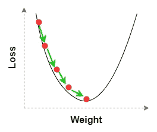**

****收敛慢**(图片由作者提供，用 draw.io 制作)**

**当学习率远小于最佳值时会发生这种情况(α1 << α4). The algorithm takes very small steps to descend the error mountain in order to reach the minimum. So, the convergence happens very slowly and the algorithm takes a lot more time to converge. But, the convergence is guaranteed if we allow the algorithm to run for a long period of time with a high number of epochs! So, it is time-consuming even if we get accurate results.**

## **Scenario 2: Oscillating around the minimum with a large learning rate**

**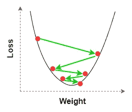**

****过冲并在最小值**附近振荡)(图片由作者提供，使用 draw.io 制作)**

**当学习率大于最佳值(α2 > α4)时会出现这种情况。如图所示，当算法采取大的步骤来降低误差山时，优化器在第一步中超过了最佳权重，并且在下一步中再次超过。该算法试图达到最小值，但它仍然远离最小值。在最后的步骤中(接近最小值)，优化器在最小值附近振荡，并且永远不会达到最小值，即使我们在很长一段时间内以大量的时期运行该算法。无论如何，这允许我们在早期获得一个较低的(但不是最佳的)误差值，比前一种情况更快！**

## **场景 3:学习率非常大的振荡和发散**

**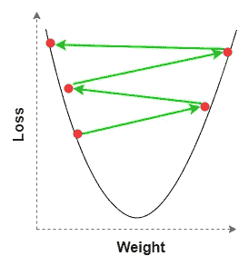**

****超调振荡发散**(图片由作者提供，用 draw.io 制作)**

**当学习率远大于最优值(α3 >> α4)时会出现这种情况。因为学习率 ***非常*** 大，所以算法从不试图下误差山。相反，它会在第一步中超出最佳权重，并在接下来的步骤中继续超出。在最初的几个步骤之后，随着优化器偏离最小值，错误开始增加。在最后的步骤中，优化器在一个比开始的错误值更高的错误附近振荡。这个过程叫做 ***振荡发散*** 。这是最坏的情况，因为算法结束时的误差比开始时更大！**

## **场景 4:以最优学习速率适当收敛**

**我们应该避免以上三种情况，尤其是第三种。通过改变 Adam 优化器的学习速率，最佳学习速率在α1 和α2 (α1 < α4 < α2). With the optimal learning rate, the algorithm reaches the minimum in a short period of time with a considerably fewer number of epochs!**

# **Guidelines for choosing the optimal learning rate with examples**

**This is the most important section of this article. I’ll use an example to show you how the above four scenarios actually happen during the training process.**

## **Approach**

**I’ll train a [浅层自动编码器模型](/generate-mnist-digits-using-shallow-and-deep-autoencoders-in-keras-fb011dd3fec3)在 [**MNIST 数据集**](https://rukshanpramoditha.medium.com/acquire-understand-and-prepare-the-mnist-dataset-3d71a84e07e7) (见最后的[引文](#f7cb))之间出现几次。我将从默认的学习率值 0.001 开始，然后按照下面的指导方针，为您提供一个找到最佳学习率的 ***系统方法*** 。**

**(作者代码)**

## **指导方针**

*   ****最好从优化器的默认学习率值开始。**这里，我使用 Adam 优化器，其默认学习率值为 0.001。当训练开始时，监视模型在最初几个时期的表现。我得到了以下训练和验证损失值。**

**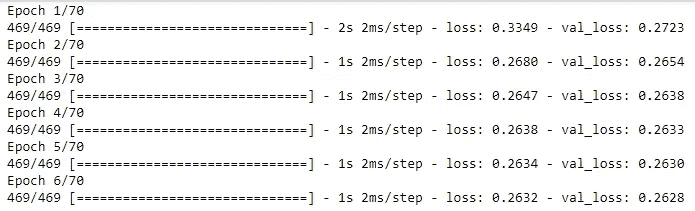**

****输出 1** (图片作者提供)**

**很明显，在每个时期之后，训练和验证损失都减少了。因此，您应该继续运行模型，直到所有的时期(这里是 70 个)都完成。完成训练过程后我得到了以下情节。**

**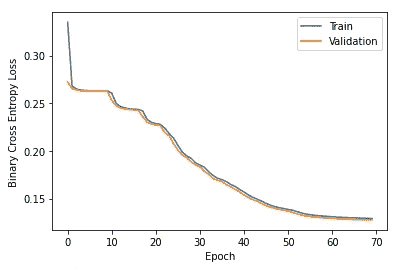**

****输出 2** (图片作者提供)**

**最好也在最后几个时期监控模型的性能。**

**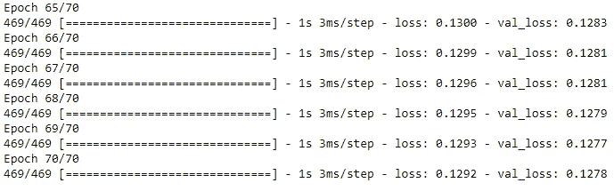**

****输出 3** (图片作者提供)**

**通过查看图(输出 2)，我们可以确定初始学习率太小，收敛发生得非常慢。这对应于场景 1。所以， **α1 = 0.001** (默认值)。当事情发生这样的时候，我们有两个选择。**

*   ****显著增加历元数，以相同的学习速率再次训练模型。**注意，这很费时间。通过增加历元的数量(这里，我们从 70 增加到 130)，我们给模型更多的时间来进一步收敛。我在完成全部 130 个纪元后得到了下面的情节。**

**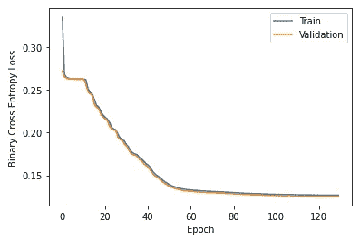**

****输出 4** (图片作者提供)**

**我还监控了模型在过去几个时期的表现。**

**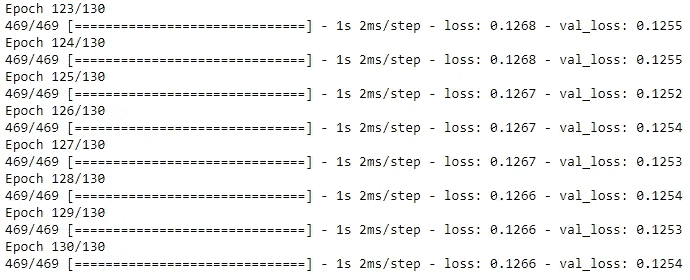**

****输出 5** (图片作者提供)**

**增加历元数后，模型的性能提高了(主持输出 3 和输出 5 的最后几行)。该模型消耗了更多的时间来获得这种性能改进。这是这个选项的缺点。所以，不如试试第二种选择。**

*   ****增加学习率的值。**注意，在这里，我们不增加历元的数量。这里设置为 70。新的学习率是 0.01。完成训练后我得到了以下情节。**

**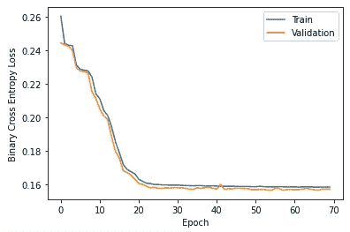**

****输出 6** (图片作者提供)**

**我还监控了模型在最初几个时期的性能。**

**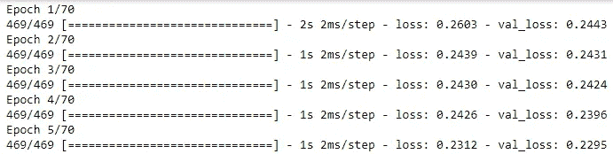**

****输出 7** (图片作者提供)**

**通过增加学习率的值，该算法在早期和中期很快降低了误差山。因此，我们在早期获得了较低的误差值。您可以通过比较输出 1 和输出 7 来确认这一点。另一个证实是，学习率为 0.01 的模型仅用了大约 20 个历元就达到了 0.16 的误差，但是具有默认学习率值(0.001)的模型用了大约 40 个历元才达到相同的误差。**

**让我们看看模型在最近几个时代的表现。**

**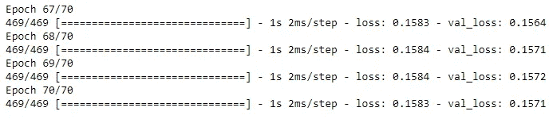**

****输出 8** (图片作者提供)**

**我们可以将这个输出与输出 3 进行比较。查看两个输出的最后一行。在输出 8 中，训练和验证损失都显著高于输出 3 中的相应值。即使算法在学习率较大的早期和中期给出了较低的误差值，但仍远未达到最小值。这对应于场景 2。所以， **α2 = 0.01** 。**

**现在，很明显，最佳学习率(α4)应该在α1 和α2 之间的某个位置(0.001 < α4 < 0.01).**

*   ****尝试α1 和α2 之间的不同学习率值。**我推荐你从下侧开始。因此，我们可以将这些值增加为 0.0015、0.002 和 0.0025。这是结果。**

1.  **`learning_rate=0.0010` : Val — 0.1278，Train — 0.1292，第 70 个历元**
2.  **`learning_rate=0.0015` : Val — 0.1264，Train — 0.1280，第 70 个历元**
3.  **`learning_rate=0.0020` : Val — 0.1265，Train — 0.1281，第 70 个历元**
4.  **`learning_rate=0.0025` : Val — 0.1286，Train — 0.1300 在第 70 个历元**

**通过观察上述结果，我们可以得出结论，最佳学习率出现在 0.0015 和 0.0020 之间的某处。所以，我们可以尝试以下数值。**

1.  **`learning_rate=0.0016` : Val — 0.1259，Train — 0.1276，第 70 个历元**
2.  **`learning_rate=0.0017` : Val — 0.1258，Train — 0.1275，第 70 个历元**
3.  **`learning_rate=0.0018` : Val — 0.1267，Train — 0.1280，第 70 个历元**

> **通过查看上述结果，我们可以得出结论，最佳学习率为 0.0017，这可能因[这些因素](#1821)而异。**

> ****注意:**这个最佳学习率仅用 70 个时期就给出了比我们用 130 个时期以 0.001 的学习率获得的结果更好的结果！**

**不是以默认的学习率值或任何其他小的学习率值开始，如果你以*非常大的*学习率开始，你可以通过查看前几个时期的训练和验证损失来知道它。**

**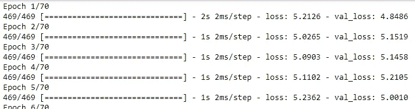**

****输出 9** (图片作者提供)**

**启动误差在第 5 个时期增加！该模型将在下一个纪元开始振荡发散！这种情况发生在学习率很大的时候(这里我用了 10！).这对应于场景 3。所以， **α3 = 10** 。**

**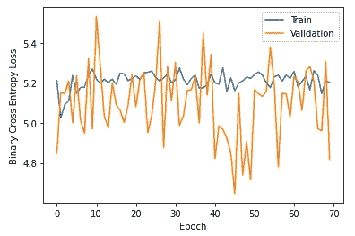**

****输出 10** (图片作者提供)**

**当你得到一个类似上面的图时，考虑显著降低学习率，然后用你新的学习率再次训练模型。**

# **决定学习率值的因素**

**有各种因素影响学习率的值。它们包括:**

*   **网络结构(宽度和深度)**
*   **神经网络架构的类型(例如 MLP、CNN、AE)**
*   **数据集的性质**
*   **优化器的类型(例如，RMSprop 优化器的最佳学习率不会是 Adam、SGD 等其他优化器的最佳值。)**
*   **[随机状态](/why-do-we-set-a-random-state-in-machine-learning-models-bb2dc68d8431)涉及一些函数，如 **train_test_split()** 和某些 DL 算法**

# **在 Keras 优化器中更改默认学习率**

**默认情况下，Keras 为其优化器的学习率提供了一个默认值。在大多数情况下，该值为 0.001。从默认的学习率值开始比较好。但是，在大多数情况下，我们需要改变这个值。**

**默认情况下，Keras 将优化器的类型定义为模型的 compile()方法中的字符串标识符。**

```
**# As a string identifier
model.compile(**optimizer="rmsprop"**,...)**
```

**当以这种方式定义优化器时，没有调整学习率值的选项。默认学习率值将应用于优化器。**

**要更改默认值，我们需要避免使用优化器的字符串标识符。相反，我们应该为优化器使用正确的函数。在本例中，它是 RMSprop()函数。新的学习率可以在该函数的`learning_rate`参数中定义。**

```
**from tensorflow.keras.optimizers import RMSprop
model.compile(**optimizer=RMSprop(learning_rate=0.005)**,...)**
```

# **静态与动态学习率**

**到目前为止，我们使用静态学习率。我们仅在培训后*更改了学习率的值。所以，值是静态的！相反，动态学习率在*训练期间改变其值*。在大多数情况下，动态学习率比静态学习率表现得更好。***

**要了解更多关于动态学习率的信息，请阅读我的文章，*[*Keras 优化器中的学习率计划和衰减*](https://rukshanpramoditha.medium.com/learning-rate-schedules-and-decay-in-keras-optimizers-f68bf91de57d)*。****

# ***结论***

***学习率是最重要的神经网络超参数。它在训练网络的时候可以决定很多事情。***

***在 Keras 的大多数优化器中，默认的学习率值是 0.001。这是培训入门的推荐值。***

***当调整任何超参数时，不仅仅是学习率，我们应该总是试图缩小超参数的最佳值所在的范围。***

***调整学习率时，有必要在每个时期结束时监控训练和验证损失。您可以使用由`model.fit()`方法返回的 ***历史*** 对象中存储的信息绘制一个图。您还可以在训练过程中实时查看这些值。确保在`model.fit()`方法中设置了`verbose=2`来打印每个时期的值。***

**最后，我可以说，**

> **调整神经网络的学习速率是很棘手的。这只能通过在每个时期后监控训练和验证损失并遵循系统方法来实现。这不是一次性的、容易的过程。这是一个迭代的任务！一旦获得，最佳值会随着这些因素而变化[。](#1821)**

**今天的帖子到此结束。**

****如果您有任何问题或反馈，请告诉我。****

## **阅读下一篇(推荐)**

*   ****Keras 优化器中的学习率计划和衰减****

**<https://rukshanpramoditha.medium.com/learning-rate-schedules-and-decay-in-keras-optimizers-f68bf91de57d>  

*   **神经网络超参数分类**

</classification-of-neural-network-hyperparameters-c7991b6937c3>  

*   **参数 Vs 超参数:有什么区别？**

<https://rukshanpramoditha.medium.com/parameters-vs-hyperparameters-what-is-the-difference-5f40e16e2e82>  

*   **全集我的** [**神经网络与深度学习教程**](https://rukshanpramoditha.medium.com/list/neural-networks-and-deep-learning-course-a2779b9c3f75)

**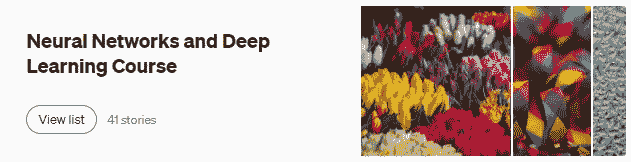**

**(作者截图)**

## **支持我当作家**

**我希望你喜欢阅读这篇文章。如果你愿意支持我成为一名作家，请考虑 [***注册会员***](https://rukshanpramoditha.medium.com/membership) *以获得无限制的媒体访问权限。它只需要每月 5 美元，我会收到你的会员费的一部分。***

**<https://rukshanpramoditha.medium.com/membership>  

非常感谢你一直以来的支持！下一篇文章再见。祝大家学习愉快！** 

## **MNIST 数据集信息**

*   ****引用:**邓，l，2012。用于机器学习研究的手写数字图像 mnist 数据库。 **IEEE 信号处理杂志**，第 29 卷第 6 期，第 141–142 页。**
*   ****来源:**[http://yann.lecun.com/exdb/mnist/](http://yann.lecun.com/exdb/mnist/)**
*   ****许可:***Yann le Cun*(NYU 库朗研究所)和 *Corinna Cortes* (纽约谷歌实验室)持有 MNIST 数据集的版权，该数据集在*知识共享署名-共享 4.0 国际许可*([**CC BY-SA**](https://creativecommons.org/licenses/by-sa/4.0/))下可用。您可以在此了解有关不同数据集许可类型[的更多信息。](https://rukshanpramoditha.medium.com/dataset-and-software-license-types-you-need-to-consider-d20965ca43dc#6ade)**

**[鲁克山普拉莫迪塔](https://medium.com/u/f90a3bb1d400?source=post_page-----362111c5c783--------------------------------)
2022–09–21****