# 如何为神经网络选择合适的激活函数

> 原文：<https://towardsdatascience.com/how-to-choose-the-right-activation-function-for-neural-networks-3941ff0e6f9c>

## 用视觉表征分析不同类型的激活函数——神经网络和深度学习课程:第五部分

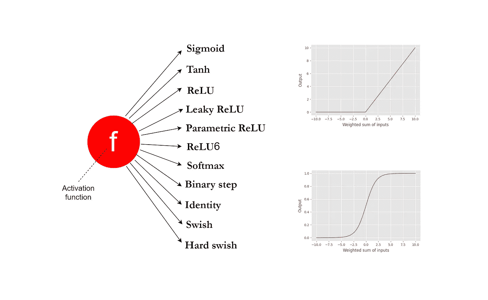

图片由作者提供，使用 draw.io 和 matplotlib 制作

# 介绍

在我们的 [**神经网络和深度学习课程**](https://rukshanpramoditha.medium.com/list/neural-networks-and-deep-learning-course-a2779b9c3f75) 的[第 1 部分](/the-concept-of-artificial-neurons-perceptrons-in-neural-networks-fab22249cbfc)中，正如这里介绍的，我们已经讨论了在神经网络模型中使用激活函数的主要目的。

在隐藏层和输出层的每个节点，激活函数被应用于称为 **z** 的输入的加权和(这里输入可以是原始数据或前一层的输出)。

今天，我们将讨论神经网络中使用的以下不同类型的激活函数。

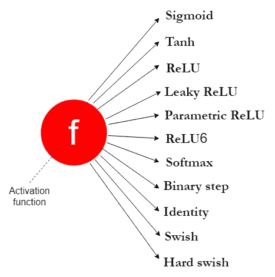

**不同类型的激活功能**(图片由作者提供，用 draw.io 制作)

可视化表示将帮助您理解激活功能的功能定义和不同的使用场景。

文末:

*   你会对什么时候使用哪个激活功能有一个清晰的认识。
*   你会明白不同激活功能的定义。

# 神经网络中不同层的激活函数

神经网络通常由三种类型的层组成:输入层、隐藏层和输出层。

输入层仅保存输入数据，不执行任何计算。因此，这里没有使用激活函数。

我们必须在神经网络的隐藏层中使用非线性激活函数。这是因为我们需要在网络中引入非线性来学习复杂的模式。如果没有非线性激活函数，具有许多隐藏层的神经网络将成为一个巨大的线性回归模型，对于从现实世界的数据中学习复杂的模式是无用的。神经网络模型的性能将根据我们在隐藏层内部使用的激活函数的类型而显著变化。

我们还必须在神经网络的输出层内部使用激活函数。激活函数的选择取决于我们想要解决的问题的类型。

# 线性与非线性函数

大多数激活函数是非线性的。然而，我们也在神经网络中使用线性激活函数。例如，我们在解决回归问题的神经网络模型的输出层中使用线性激活函数。一些激活函数由两个或三个线性分量组成。这些函数也被归类为非线性函数。

区分线性和非线性函数将是有用的。一个线性函数(称为 **f** )接受输入 **z** 并返回输出 **cz** ，它是输入与常数 **c** 的乘积。数学上，这可以表示为 **f(z) = cz** 。当 c=1 时，函数按原样返回输入，不对输入进行任何更改。线性函数的图形是一条*单一直线*。

任何非线性函数都可以归类为非线性函数。非线性函数的图形不是一条直线。它可以是一个复杂的模式，也可以是两个或多个线性组件的组合。

# 不同类型的激活功能

我们将讨论神经网络中常用的激活函数。

## 1.Sigmoid 激活函数

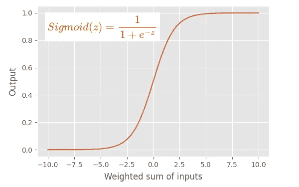

**Sigmoid 激活函数**(图片由作者提供，用 latex 编辑器和 matplotlib 制作)

**主要特性:**

*   这也称为逻辑回归模型中使用的*逻辑函数*。
*   sigmoid 函数有一个 **s 形的**图形。
*   显然，这是一个非线性函数。
*   sigmoid 函数将其输入转换为 0 到 1 之间的概率值。
*   它将较大的负值转换为 0，将较大的正值转换为 1。
*   对于输入 0，它返回 0.5。值 0.5 被称为阈值，其可以决定给定的输入属于哪两类。

**用法:**

*   在早期，sigmoid 函数被用作 MLPs、CNN 和 RNNs 中隐藏层的激活函数。
*   然而，在 RNNs 中仍然使用 sigmoid 函数。
*   目前，我们通常不将 sigmoid 函数用于 MLPs 和 CNN 中的隐藏层。相反，我们在那里使用 ReLU 或 Leaky ReLU。
*   当我们构建二元分类器时，必须在输出层使用 sigmoid 函数，在该分类器中，根据函数返回的输入的概率值，将输出解释为类标签。

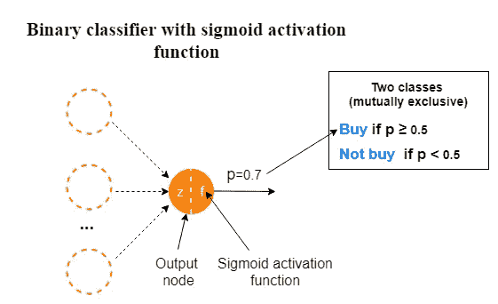

**使用 sigmoid 函数的二元分类**(图片由作者提供，用 draw.io 制作)

*   当我们构建多标签分类模型时，使用 sigmoid 函数，在该模型中，每个相互包含的类有两个结果。不要将这与多类分类模型相混淆。

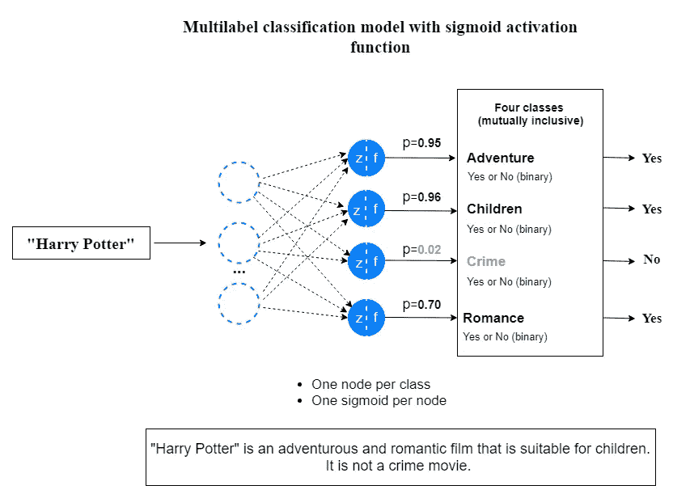

【sigmoid 函数多标签分类(图片由作者提供，用 draw.io 制作)

**弊端:**

由于以下缺点，我们通常不在隐藏层中使用 sigmoid 函数。

*   sigmoid 函数存在梯度消失的问题。这也被称为梯度的饱和。
*   sigmoid 函数收敛较慢。
*   它的输出不是以零为中心的。因此，这使得优化过程更加困难。
*   由于包含了 **e^z** 项，该函数的计算量很大。

## 2.Tanh 激活函数

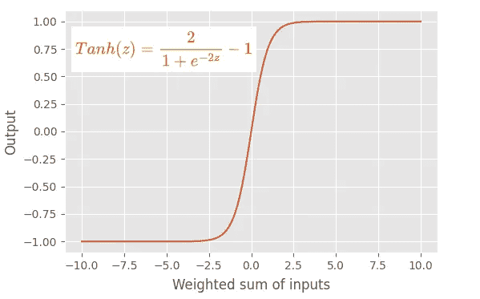

**Tanh 激活函数**(图片由作者提供，用 latex 编辑器和 matplotlib 制作)

**关键特性:**

*   双曲正切函数的输出范围总是在-1 和+1 之间。
*   像 sigmoid 函数一样，它有一个 s 形图形。这也是一个非线性函数。
*   使用双曲正切函数优于 sigmoid 函数的一个优点是双曲正切函数以零为中心。这使得优化过程更加容易。
*   双曲正切函数比 sigmoid 函数具有更陡的梯度。

**用法:**

*   直到最近，tanh 函数被用作 MLPs、CNN 和 RNNs 中隐藏层的激活函数。
*   然而，在 RNNs 中仍然使用 tanh 函数。
*   目前，我们通常不为 MLPs 和 CNN 中的隐藏层使用 tanh 函数。相反，我们在那里使用 ReLU 或 Leaky ReLU。
*   我们从不在输出层使用双曲正切函数。

**弊端:**

由于以下缺点，我们通常不在隐藏层中使用双曲正切函数。

*   双曲正切函数有消失梯度问题。
*   由于包含了 **e^z** 项，该函数的计算量很大。

## 3.ReLU 激活功能

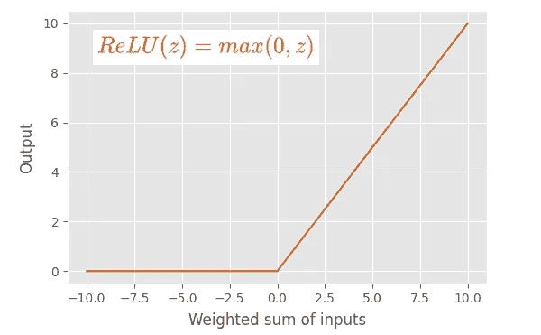

**ReLU 激活函数**(图片由作者提供，用 latex 编辑器和 matplotlib 制作)

**主要特性:**

*   ReLU(**Re**ctived**L**linear**U**nit)激活函数是 sigmoid 和 tanh 激活函数的一个很好的替代品。
*   发明 ReLU 是深度学习取得的最重要突破之一。
*   这个函数没有消失梯度的问题。
*   这个函数的计算开销很小。认为 ReLU 的收敛速度比 sigmoid 和 tanh 函数快 6 倍。
*   如果输入值为 0 或大于 0，ReLU 函数按原样输出输入。如果输入小于 0，ReLU 函数输出值 0。
*   ReLU 函数由两个线性分量组成。因此，ReLU 函数是分段线性函数。实际上，ReLU 函数是一个非线性函数。
*   ReLU 函数的输出范围可以从 0 到正无穷大。
*   收敛速度比 sigmoid 和 tanh 函数快。这是因为 ReLU 函数对于一个线性分量具有固定导数(斜率),而对于另一个线性分量具有零导数。因此，使用 ReLU 功能，学习过程要快得多。
*   使用 ReLU 可以更快地执行计算，因为函数中不包含指数项。

**用法:**

*   ReLU 函数是现代 MLP 和 CNN 神经网络模型中隐藏层的默认激活函数。
*   我们通常不在 RNN 模型的隐藏层中使用 ReLU 函数。相反，我们使用 sigmoid 或 tanh 函数。
*   我们从不在输出层使用 ReLU 函数。

**缺点:**

*   使用 ReLU 函数的主要缺点是它有一个垂死的 ReLU 问题。
*   积极面的价值可以非常高。这可能导致训练期间的计算问题。

## 4.泄漏 ReLU 激活功能

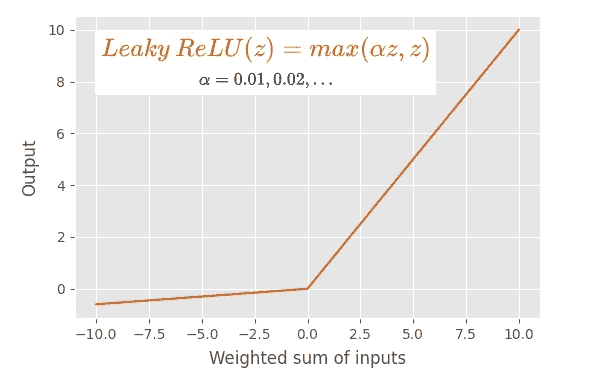

**Leaky ReLU 激活函数**(图片由作者提供，用 latex 编辑器和 matplotlib 制作)

**主要特点:**

*   泄漏 ReLU 激活函数是默认 ReLU 函数的修改版本。
*   和 ReLU 激活函数一样，这个函数没有消失渐变的问题。
*   如果输入值是大于 0 的 0，leaky ReLU 函数就像默认 ReLU 函数一样输出输入。但如果输入小于 0，leaky ReLU 函数输出一个由 **αz** 定义的小负值(其中 **α** 为小常数值，通常为 0.01， **z** 为输入值)。
*   它没有任何导数为零的线性分量(斜率)。因此可以避免将死的 ReLU 问题。
*   使用泄漏 ReLU 的学习过程比默认 ReLU 更快。

**用法:**

*   ReLU 函数的相同用法也适用于泄漏 ReLU 函数。

## 5.参数 ReLU (PReLU)激活功能

**主要特性:**

*   这是 ReLU 函数的另一个变体。
*   这几乎类似于泄漏的 ReLU 函数。唯一的区别是值 **α** 变成了一个可学习的参数(因此得名)。我们将 **α** 设为网络中每个神经元的参数。所以 **α** 的最优值是从网络中学习的。

## 6.ReLU6 激活功能

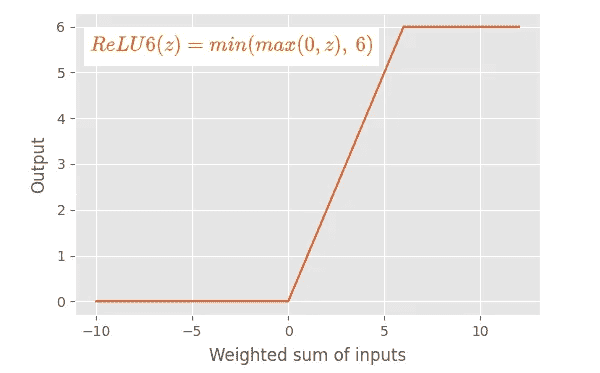

**ReLU6 激活函数**(图片由作者提供，用 latex 编辑器和 matplotlib 制作)

**主要特点:**

*   ReLU 和 ReLU6 之间的主要区别在于，ReLU 允许在正侧有非常高的值，而 ReLU6 在正侧限制为值 6。任何大于或等于 6 的输入值都将被限制为值 6(因此得名)。
*   ReLU6 函数由三个线性分量组成。这是一个非线性函数。

## 7.Softmax 激活功能

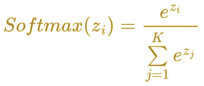

**Softmax 激活功能**(图片由作者提供，用 latex 编辑器制作)

**主要特点:**

*   这也是一个非线性激活函数。
*   softmax 函数计算一个事件(类)在 **K** 个不同事件(类)上的概率值。它计算每个类的概率值。所有概率的总和是 1，意味着所有事件(类)是互斥的。

**用法:**

*   我们必须在多类分类问题的输出层使用 softmax 函数。

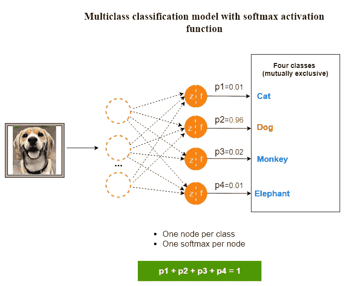

**使用 softmax 函数进行多类分类**(图片由作者提供，使用 draw.io 制作)

*   我们从不在隐藏层中使用 softmax 函数。

## 8.二元阶跃激活函数

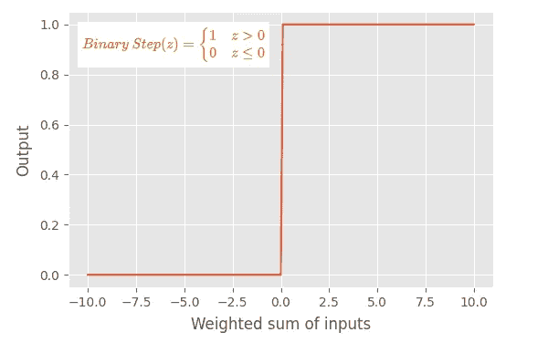

**二进制步进激活函数**(图片由作者提供，用 latex 编辑器和 matplotlib 制作)

**关键特性:**

*   该功能也被称为*阈值激活功能*。我们可以为阈值设置任何值，这里我们指定值为 0。
*   如果输入大于阈值，该函数输出值 1。如果输入等于或小于阈值，此函数输出值 0。
*   这会输出一个二进制值，0 或 1。
*   二元阶跃函数由两个线性分量组成。正因为如此，这个函数是一个分段线性函数。实际上，二元阶跃函数是一个非线性函数。
*   这个函数不是光滑函数。

**用法:**

*   实际上，我们通常不在现代神经网络模型中使用这个函数。
*   然而，我们可以用这个函数来解释理论概念，如“激发一个神经元”，“感知器的内部工作原理”。因此，阶跃函数在理论上是重要的。

## 9.身份激活功能

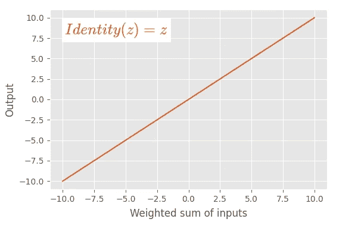

**身份激活功能**(图片由作者提供，用 latex 编辑器和 matplotlib 制作)

**主要特性:**

*   这也被称为*线性激活函数*。
*   当我们谈论激活函数时，这是唯一被认为是线性函数的函数。
*   该函数按原样输出输入值。不会对输入进行任何更改。

**用法:**

*   此函数仅用于解决回归问题的神经网络模型的输出层。

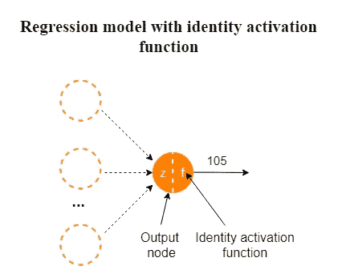

**带恒等函数的回归**(图片由作者提供，用 draw.io 制作)

*   我们从不在隐藏层中使用标识函数。

## 10.Swish 激活功能

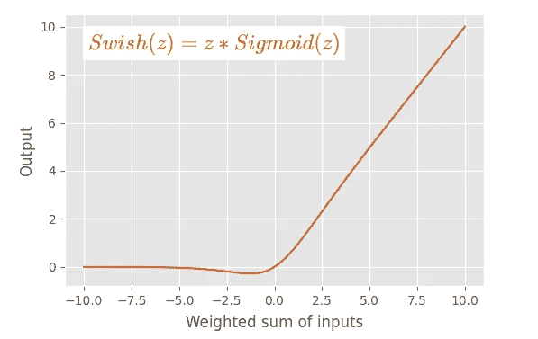

**Swish 激活功能**(图片由作者提供，用 latex 编辑器和 matplotlib 制作)

**主要特性:**

*   该函数由 sigmoid 函数乘以输入 **z** 构成。
*   这是一个非线性函数。
*   该图非常类似于 ReLU 激活函数的图。
*   曲线比 ReLU 激活函数更平滑。这种平滑度在训练模型时非常重要。函数在训练时容易收敛。

**用法:**

*   该功能仅用于隐藏层。
*   我们从不在神经网络模型的输出层使用这个函数。

**缺点:**

*   Swish 函数的主要缺点是计算量大，因为函数中包含了 **e^z** 项。这可以通过使用下面定义的称为“硬刷”的特殊功能来避免。

## 11.硬嗖嗖(H-Swish)激活功能

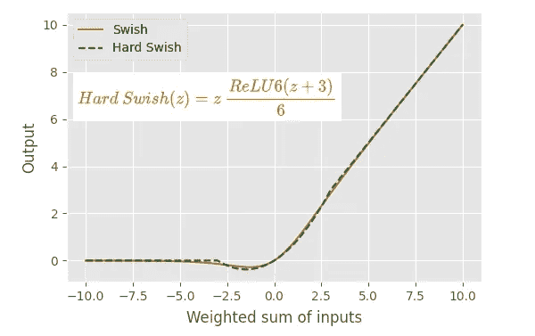

**硬 Swish (H-Swish)激活功能**(图片由作者提供，用 latex 编辑器和 matplotlib 制作)

**主要特点:**

*   该图与 Swish 函数的图相同。
*   这在计算上是廉价的，因为 sigmoid 函数被线性模拟代替。

**用法:**

*   硬 Swish 的用法类似于 Swish 激活功能的用法。

# 摘要

激活函数只是数学函数。激活函数应该具有的主要特征是该函数应该是可微分的，因为这是模型训练中反向传播的要求。

选择正确的激活函数是主要的挑战，它可以被认为是一种超参数调整，其中程序员通过理解问题定义并考虑模型的性能和损失函数的收敛性来手动选择激活函数。

## 选择正确激活功能的一般准则

这里总结了上面讨论的不同激活功能的使用场景。当您训练自己的神经网络模型时，您可能会发现这很有用。

*   在神经网络的输入层节点中不需要激活函数。因此，在定义输入层时，您不需要担心激活函数。
*   输出层激活函数取决于我们想要解决的问题的类型。在回归问题中，我们使用一个节点的线性(恒等)激活函数。在二元分类器中，我们使用具有一个节点的 sigmoid 激活函数。在多类分类问题中，我们使用 softmax 激活函数，每个类一个节点。在多标签分类问题中，我们使用 sigmoid 激活函数，每个类一个节点。
*   我们应该在隐藏层中使用非线性激活函数。通过考虑模型的性能或损失函数的收敛性来做出选择。从 ReLU 激活功能开始，如果你有一个垂死的 ReLU 问题，试试 leaky ReLU。
*   在 MLP 和 CNN 神经网络模型中，ReLU 是隐藏层的默认激活函数。
*   在 RNN 神经网络模型中，我们对隐藏层使用 sigmoid 或 tanh 函数。双曲正切函数具有更好的性能。
*   只有身份激活函数被认为是线性的。所有其他激活函数都是非线性的。
*   我们从不在隐藏层中使用 softmax 和 identity 函数。
*   我们只在隐藏层中使用 tanh、ReLU、ReLU 的变体、swish 和 hard swish 函数。
*   最近的研究发现了 swish 和 hard swish 函数。

今天的帖子到此结束。感谢阅读！

通过 [**订阅我的** **邮箱列表**](https://rukshanpramoditha.medium.com/subscribe) ，再也不会错过一个精彩的故事。我一点击发布按钮，你就会在收件箱里收到每一篇文章。

如果你愿意，你可以 [**注册成为会员**](https://rukshanpramoditha.medium.com/membership) 来获得我写的每一个故事的全部信息，我将会收到你的一部分会员费。

一如既往，祝大家学习愉快！

[鲁克山普拉莫迪塔](https://medium.com/u/f90a3bb1d400?source=post_page-----3941ff0e6f9c--------------------------------)
**2022–01–19**