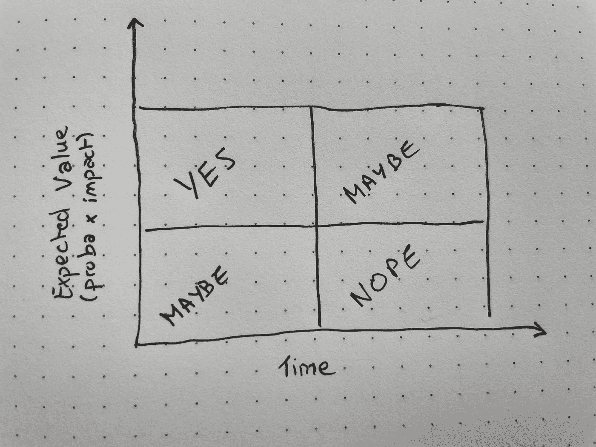
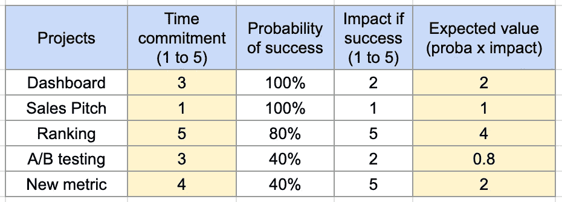
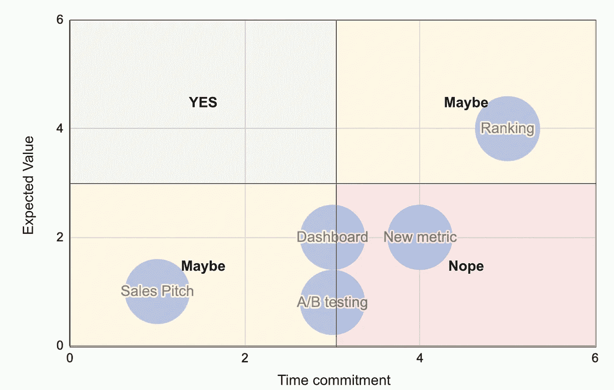

# 如何选择要处理的数据项目

> 原文：<https://towardsdatascience.com/how-to-choose-which-data-projects-to-work-on-c6b8310ac04e>

## 如果你有一个合理利用时间的方法，你可以优化你创造的价值

作为一名业务/数据分析师/科学家，经常会有过多的项目需要处理。知道如何选择正确的项目会对你的职业生涯和你工作的公司产生巨大的影响。

当你开始领导一个团队时，这一点变得尤为重要，但这不是通常教授的内容。在这篇文章中，我提供了一个简单的方法来对不同的项目进行排序，并决定在哪些项目上投入时间。

# #1:了解数据世界的现实

*   **很多项目没有转化为现实生活中的影响。**几年前，Gartner 估计 60%的大数据项目会失败。这个数字后来被认为过于保守，真实值接近 85% [1]。**相反，几个项目就能产生巨大的影响。**
*   选择一个数据项目(并在其中投入时间)与投资一家初创公司非常相似——你可以有几个“获奖项目”和许多无法上市的项目。使用这种观点可以帮助你建立自己的时间投资理论，并确保优化你创造的价值。

数据项目的时间投资矩阵(图片由作者提供)

# #2:给你的潜在项目打分

*   成功概率:这个项目成功的可能性有多大？我所说的成功是指——将对现实生活产生影响，也就是说，将引发变化，而这些变化可以归因于您的项目？
*   **影响:这个项目的影响有多大？**你的项目能为公司赚多少钱？
*   时间:你需要多长时间来完成这个项目？你花在一个项目上的时间越多，留给其他人的时间就越少。
*   **(可选)学习:做这个项目你会学到什么？如果是 tie，考虑“长期投资”可能会很有意思——基本上这个项目会教会你/公司多少东西。**

# #3:定义你的时间投资理论和你的多样化策略

*   **时间量:一个季度你能接手多少项目？根据你在公司的经验，或者如果你正在管理一个团队，这种情况可能会彻底改变。**
*   **风险偏好:你对风险的接受程度如何？你更喜欢稳扎稳打，还是可以接更多本来就有风险的项目？**
*   根据以上所述，你如何最大化你的影响力？你会选择一些高回报、高风险的项目，还是会选择很多回报有保证的小项目？

# 真实场景的例子

让我们假设您正在为一家客户关系管理(CRM)公司工作，并且您正在支持业务团队的数据需求。您从以下五个问题开始第三季度:

*   **#1:仪表板提问**:销售团队想要一个仪表板来跟踪特定产品的销售情况。这个问题非常简单，但是由于这是一个将由多个利益相关方使用的仪表板，因此达成一致将非常耗时。
*   **#2:推销提问**:合作伙伴管理团队正在组织一次推销，以将一个重要客户转化为更高价位的客户，希望您的帮助。这个问题也很简单，只需要几天时间。这项任务的影响不一定重要，但你相信如果你找到一种方法来实际衡量这个要求，可能会有一些潜力。
*   **#3:排名提问**:收购团队希望更聪明地确定他们的潜在客户，并希望您能根据他们转化为付费客户的可能性对他们的潜在客户进行排名。他们目前使用的模型非常简单，你相信有很多事情可以做。这样一个项目的影响可能是惊人的，但建立一个模型并获得内部的认同将需要大量的工作。
*   **# 4:A/B 测试提问:**销售团队(再次)尝试一种新的销售方法，并希望帮助他们建立一个实验来了解潜在的影响。从你收集的信息来看，这并不是一个真正的破坏性变化——如果有影响的话，应该是相当渐进的——而且从你做的快速功效分析来看，这个实验很有可能没有返回任何具有统计意义的结果。但是这个团队仍然想要完成它。
*   **#5:“新指标”提问:**。您的管理层希望开发一种新的“活动流失率”指标，即一种跟踪客户何时停止使用产品的指标，以便合作伙伴管理团队能够尽快接触到这些“有风险”的客户。该项目似乎很有趣，但是快速的内部文献回顾显示，该团队在过去几年中已经试图建立这样的指标，但每次都失败了(主要是由于内部政治)。

根据您从所有不同项目中收集的背景信息以及您对自己能力的评估，您对每个项目的评分如下:

项目记分卡示例(图片由作者提供)

这允许您构建以下图表，其中 x=时间承诺，y=期望值:

时间承诺 x 期望值矩阵(图片由作者提供)

由此看来，你应该优先考虑 3 个项目:排名项目，销售项目和仪表板项目。

现在，如果你有时间做所有这些项目，一切都好！但如果没有，这就是你的“时间投资”论点发挥作用的地方——它将帮助你在这些“关系”中做出决定，并得出最终清单。现在你已经为这个季度做好了一切准备！

注意:上表中的所有数字都应该基于你自己对情况的理解、你的能力以及你的投资论文。对于两个从事相同项目的不同的人来说，这个表格会有很大的不同——这个框架只是让你合理化你的决策过程的一种方式。

# 改善决策过程的其他技巧

*   **寻找跨职能合作的项目。**最终，您项目的成功取决于它是否会被实施/使用(这部分不是在您的控制之下)。尽早与不同的利益相关者达成一致非常重要，这样才能确保成功。
*   **寻找时机合适的项目。优秀的足球运动员会跟着球走——当球落地时，最好的足球运动员已经在那里了。了解你所在行业的发展方向，并坚持到底。**
*   **深入了解赢家。有时候，加倍投资成功的项目比从头开始另一个项目或试图修复一个失败的项目更容易、更有影响力。在确定优先顺序时要冷酷无情。**
*   **在每个季度末回顾你的投资策略。**了解自己做得好(或做得不好)的地方，不断改进策略。

你会给这份清单添加什么吗？在评论里告诉我吧！

# 感谢阅读！

如果你觉得“有趣”,可以看看我的其他文章:

<https://medium.com/@jolecoco/what-training-at-the-gym-teaches-you-about-training-models-931e5878dc14>  </how-to-build-a-successful-dashboard-359c8cb0f610>  <https://medium.com/@jolecoco/the-art-of-turning-fuzzy-concepts-into-operational-metrics-part-1-9140b79d54b2>  

[1][https://www . techrepublic . com/article/85-of-big-data-projects-fail-but-your-developers-can-help-yours-success/](https://www.techrepublic.com/article/85-of-big-data-projects-fail-but-your-developers-can-help-yours-succeed/)