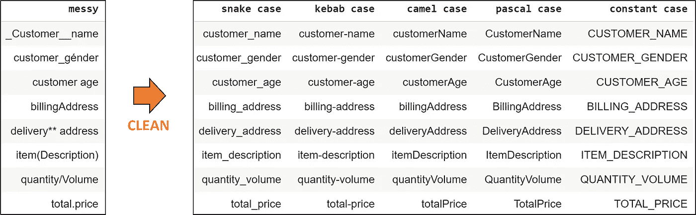
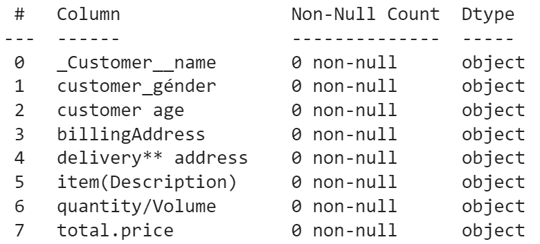

# 如何清理乱七八糟的熊猫栏目名称

> 原文：<https://towardsdatascience.com/how-to-clean-messy-pandas-column-names-20dc7400cea7>

## 不需要正则表达式


由[拍摄的照片](https://unsplash.com/@norevisions?utm_source=medium&utm_medium=referral) [Unsplash](https://unsplash.com?utm_source=medium&utm_medium=referral) 上没有修改

# 动机

真实世界的数据是混乱的。我们经常收到来自不同列命名格式的多个来源的数据，对它们进行标准化可能是一件麻烦的事情。尽管有这些麻烦，但在数据清理过程的早期将列名标准化为通用格式仍然很重要，以便更好地促进下游任务。正则表达式通常用于清理混乱的列名，但是编写正则表达式来处理各种混乱的情况可能会很乏味。这就是史基比出现的时候。

# 不足的

[skippy](https://aeturrell.github.io/skimpy/)通常用于提供熊猫数据框架中变量的汇总统计数据。然而这不是我们今天感兴趣的。Skimpy 的一个较少使用的函数是`clean_columms`便利函数，它有助于解决熊猫列名混乱的问题。

Skimpy 为标准化列名提供了一些常见的格式。下表显示了不同案例样式的结果列名。这些大小写样式在使用的大小写和分隔符方面有所不同。



作者图片

让我们看看如何使用 skimpy 来执行列名清理。

安装 Skimpy

```
pip install skimpy
```

导入库

```
import pandas as pd
from skimpy import clean_columns
```

让我们创建一个玩具数据集来看看 Skimpy 是如何工作的。

```
columns = ['_Customer__name',
           'customer_génder',
           'customer age',
           'billingAddress',
           'delivery** address  ',
           'item(Description)',
           'quantity/Volume',
           'total.price']
messy_df = pd.DataFrame(data = [], columns=columns, index=[0])
```

我们的玩具数据集具有混乱的列名的常见元素，包括重音符号、不同的分隔符、大小写和多个空格。



作者图片

# 蛇案

skimpy 标准化的默认格式是`snake` case 样式。蛇形大小写样式用下划线替换空格和符号分隔符，并将所有字符转换为小写。

```
clean_df = clean_columns(messy_df)
clean_df.columns.tolist()>>
['customer_name',
 'customer_gender',
 'customer_age',
 'billing_address',
 'delivery_address',
 'item_description',
 'quantity_volume',
 'total_price']
```

# 烤肉串盒

`kebab`大小写样式类似于 snake 大小写，除了它使用破折号分隔符而不是下划线。

```
clean_df = clean_columns(messy_df, case = 'kebab')
clean_df.columns.tolist()>> 
['customer-name',
 'customer-gender',
 'customer-age',
 'billing-address',
 'delivery-address',
 'item-description',
 'quantity-volume',
 'total-price']
```

# 骆驼箱

`Camel`大小写样式开始使用大写字符作为分隔符，每个字符串的第一个字符是小写的。

```
clean_df = clean_columns(messy_df, case = 'camel')
clean_df.columns.tolist()>>
['customerName',
 'customerGender',
 'customerAge',
 'billingAddress',
 'deliveryAddress',
 'itemDescription',
 'quantityVolume',
 'totalPrice']
```

# 帕斯卡案例

`Pascal`除了每个字符串的第一个字符是大写字母之外，大小写样式类似于 camel case。

```
clean_df = clean_columns(messy_df, case = 'pascal')
clean_df.columns.tolist()>>
['CustomerName',
 'CustomerGender',
 'CustomerAge',
 'BillingAddress',
 'DeliveryAddress',
 'ItemDescription',
 'QuantityVolume',
 'TotalPrice']
```

# 恒定情况

`Constant`大小写样式使用下划线分隔符，并将所有字符改为大写。

```
clean_df = clean_columns(messy_df, case = 'const')
clean_df.columns.tolist()>>
['CUSTOMER_NAME',
 'CUSTOMER_GENDER',
 'CUSTOMER_AGE',
 'BILLING_ADDRESS',
 'DELIVERY_ADDRESS',
 'ITEM_DESCRIPTION',
 'QUANTITY_VOLUME',
 'TOTAL_PRICE']
```

# 替换字符串

`clean_columns()`还提供替换字符串的选项。这对于纠正拼写错误的列名或将列重命名为标准格式非常有用。例如，我们可能希望将`Address`缩短为`Addr`，将`Description`缩短为`Desc`

```
clean_df = clean_columns(messy_df, case = 'pascal', replace = {'Address':'Addr', 'Description':'Desc'})
clean_df.columns.tolist()>>
['CustomerName',
 'CustomerGender',
 'CustomerAge',
 'BillingAddr',
 'DeliveryAddr',
 'ItemDesc',
 'QuantityVolume',
 'TotalPrice']
```

# 结论

处理混乱的列名是数据科学工作流的一部分，对于具有大量列和不同命名格式的数据集来说，这可能相当乏味。在本文中，我们研究了如何在不使用 regex 的情况下，使用 skimpy 将列名快速标准化为不同的常见大小写样式。

[加入 Medium](https://medium.com/@edwin.tan/membership) 阅读更多这样的故事。