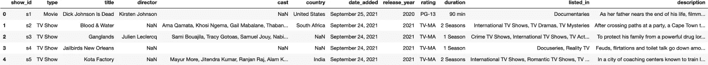
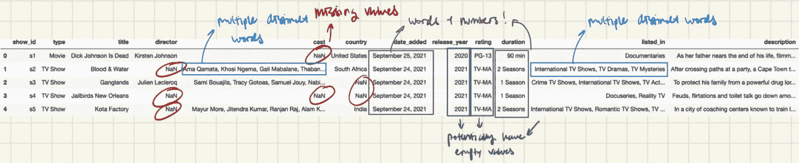
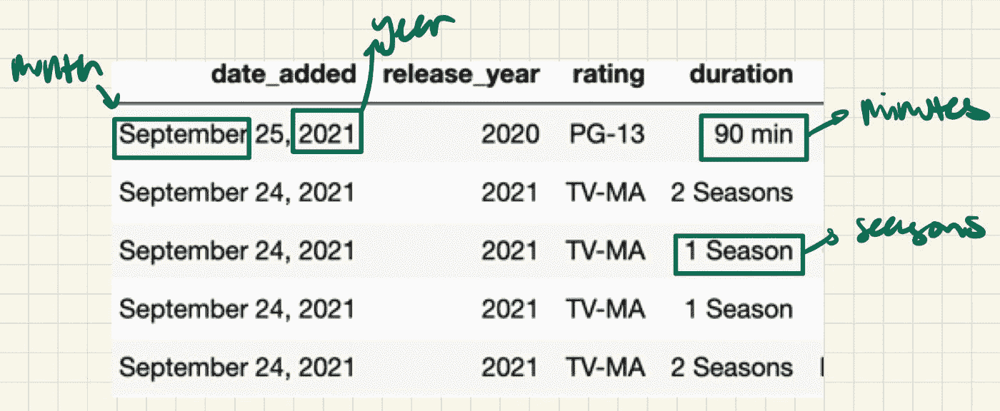
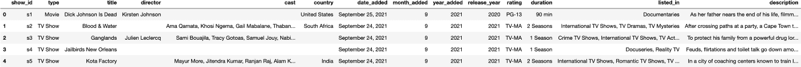
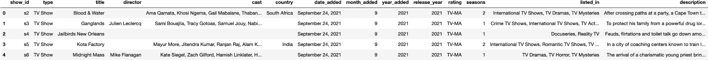
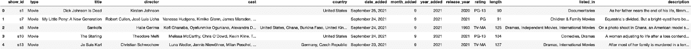
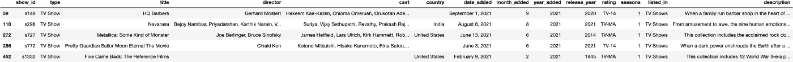
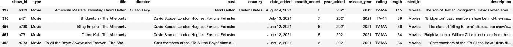

# 如何在 Python 中清理数据

> 原文：<https://towardsdatascience.com/how-to-clean-your-data-in-python-8f178638b98d>

## 关于如何清理你的数据以启动你的个人项目的详细指南

在 [Unsplash](https://unsplash.com?utm_source=medium&utm_medium=referral) 上由[Towfiqu barb huya](https://unsplash.com/@towfiqu999999?utm_source=medium&utm_medium=referral)拍摄的照片

当我参加大学的定向阅读项目(一个小型研究项目，本科生由研究生指导)时，*我只修了 R 课程*的两个统计学。虽然这些课程教会了我很多关于如何操作数据、创建数据可视化和提取分析的知识，但在这个项目中从事我的第一个个人项目让我**意识到我从未处理过“杂乱的数据”**。这些课程涉及预先清理和处理的数据集，但**没有教学生如何清理数据集**，这**为开始个人项目**制造了障碍。因此，我希望这篇文章可以作为一个起点，让你**学会如何有效地清理你的数据**来**启动你的个人项目**。

在这篇文章中，我将使用 [**网飞电视节目和电影数据集**](https://www.kaggle.com/datasets/shivamb/netflix-shows) ，其中有许多不一致和缺失的数据。

# 目录

1.  调查你的数据
2.  看**缺失数据**的比例
3.  检查每列的**数据类型**
4.  如果有多列字符串，检查**尾随空格**
5.  **处理缺失值** (NaN 值)
6.  **从数据集中提取更多信息以获得更多变量**
7.  检查各列的**唯一值**

*除特别注明外，所有图片均为作者所有。*

# 第一步:调查你的数据

在对数据集执行任何清理或操作之前，您应该浏览一下您的数据，以了解您正在处理的**变量，这些值是如何基于它们所在的列来构造的，也许您可以对需要解决的不一致之处有一个粗略的想法，否则它们在分析阶段会很麻烦。**在这里，根据您想要进行的分析，您还可以删除某些不需要的列。

# 1.打印数据集的前几行

这里，我打印了数据集的前 7 行，但是您可以打印 5 行或 10 行。我建议将它保持在 10 以下，否则对于您当前正在尝试做的事情来说，它会太过沉重——快速浏览数据集。

这样做可以让您很好地了解可能要处理的数据类型、需要执行转换或清理的列，以及能够提取的其他数据。

在我们更仔细地看这个之前，让我们执行下一步。

# 2.将变量保存到列表中

您希望这样做是为了让**能够方便地访问数据集**的不同列，尤其是当您希望对不同的列子集执行相同的转换时。

# 3.在每一栏中记下你必须解决的潜在问题。

为了保持条理，请注意您在数据集中看到的问题(通过像在步骤 1 中一样浏览您的数据集)。

上面的这张图片代表了我瞥一眼数据集所能看到的，也是你在查看数据集时应该考虑的事情。这里有几件事让我印象深刻:

*   有些列缺少值。如果不在过程的早期处理和解决，这可能会给分析和绘图带来许多问题。
*   有带文字和数字的栏目，比如`date_added`、`duration`。如果我们想按日期**制作时间序列图**或其他图**来探索持续时间与其他变量的关系，这可能是个问题。**
*   有两列包含由逗号连接在一起的多个不同的单词。如果我们想制作**剧情探索** `**listed_in**` **(流派)的分布或者网飞上的演员，这是一个问题。**
*   其他列可能会丢失值。下一步看如何用**检查哪些列有缺失值**和**它们有多少缺失数据。**

# 第二步:看缺失数据的比例

从这段代码中，您可以很容易地查看数据集中缺失值的分布，从而很好地了解需要处理哪些列来解决缺失值问题。

从输出中，您可以收集到以下见解:

*   `director`列丢失数据的百分比最高，约为 30%
*   `cast`和`country`列也有相当比例的缺失数据~ 9%
*   `date_added, rating`和`duration`没有那么多缺失数据~ 0% - 0.1%
*   幸运的是，大多数其他列都不是空的。

你的下一个问题可能是，**我如何处理这些缺少值的列？**

有几种方法可以处理它:

1.  完全删除该列。如果这个专栏对你的分析不是那么重要，那就放弃它。
2.  保持纵队。在本例中，因为**的** `**director, cast**` **和** `**country**` **列对我的分析**相当重要，所以我将保留它们。
3.  **插补——用替代值替换缺失数据的过程。**在这里，这样做是不可能的，因为大多数数据是字符串值，而不是数值。然而，我将会写一篇文章，更详细地讨论插补，为什么和什么时候应该使用它，以及如何在 R 和 Python 中借助一些包来使用它。

在我继续之前，我将提出跨行丢失值**的问题。**

在某些情况下，您可能想要检查数据集的所有行中缺失值的**分布(假设您的数据集没有大量的观察值/行)。从这里，你可以**根据这些行对你的分析的重要性从上面的选项中选择**。例如，数据集包含随时间变化的记录数据。即使一行可能包含丢失的值，您也可能不希望删除它，因为您希望保留重要的时间信息。**

在我向您展示如何处理 NaN 值之前，让我们继续第 3 步，即使是在保留列之后。

# 步骤 3:检查每一列的数据类型

在这里，您可以看到除了`release_year`之外，所有的列都将`object`作为它们的数据类型。在 pandas 中，object 表示字符串或混合类型(数值和非数值类型混合)。从我们的数据集中，您将能够判断哪些列是严格的字符串和混合类型。

# 步骤 4:如果你有字符串列，检查尾随空格

在我们知道我们正在处理的数据类型之后，让我们确保使用`strip`删除任何尾部字符和空白。

# 步骤 5:处理缺失值(NaN 值)

回到缺失值的列，我们来看看这些列:`director, cast, country, date_added, rating, duration`。我们可以根据这些列是字符串类型还是混合类型来对它们进行分段。

String: `director, cast, country, rating`(这里是一个字符串，不能混合，因为数值分开就没有任何意义)

混装:`date_added, duration`

`NaN`在熊猫中表示不是数字。它是一个特殊的浮点值，不同于 Python 中的`NoneType`。`NaN`处理数值可能会很烦人，尤其是当你想过滤掉它们用于绘图或分析的时候。为了让我们的生活更容易，让我们用别的东西代替这些 NaN 值。

对于字符串类型的值，我们可以用""或" None "或任何可以向您表明该条目中没有任何值的字符串来替换`NaN`值。在这里，我使用`fillna`函数将它替换为“”。因为它不是一个就地函数，所以我将更改后的值重新分配给数据集中的列。

在这里，您一定注意到我遗漏了持续时间列。这是因为我们稍后将对该专栏做一些事情。

# 第六步:看看是否有其他变量，你可以从其他变量中提取出来

对于混合类型的值，在我们处理缺失值问题之前，让我们看看是否可以提取一些数据来使我们的分析更丰富或处理更容易。

查看`date_added`，我们可以看到它包含了电影/节目被添加的月份、日期和年份。与其将所有这些信息放在一列，为什么不试着将它们分开呢？这样，我们可以选择隔离月或年如何与其他变量交互，而不是查看`date_added`，因为它的粒度会使任何趋势都难以发现。

下面，我编写了代码，不仅将信息分成另外两列，还过滤掉了带有`NaN`值的行，并用 0 替换它们，就像之前用""做的一样。

现在，新的数据集包含了`month_added`和`year_added`列。这将允许我们稍后进行一些趋势分析。

看一下`duration`，除了它是一个混合类型之外，在这个列中还有 2 个不同的时间单位。这是一个问题，因为我们处理的是两种不同类型的内容，它们的时间度量不同。因此，如果我们保持原样，制作`duration`的图表将很难理解。好的一面是有很多方法可以处理这个问题。我选择的处理方式是通过**将内容类型分为两个不同的数据集，自然，持续时间列将只是数字，只有一种时间单位。**通过这种方式，您可以**轻松清晰地使用这些值进行绘图。**

因为`duration`列既有字符串又有数字，**我还必须创建一个函数来从该列中提取数字，以便可以将它插入到两个新数据集的列中。**

# 步骤 7:检查列的唯一值

除了可能丢失的值之外，一旦执行分析，可能会遇到损坏的值。为了检查这一点，我们可以检查一些列的唯一值。让我们以数据集的前 5 行作为起点。

检查所有列的唯一值，尤其是标题、导演和演员，可能不是一种策略，因为可能有大量的唯一值需要检查。相反，让我们关注一个潜在唯一值的列表，这些值可能更容易检查，也更重要，因为它对未来的分析可能更有洞察力。粗略地看一下数据集，列`country, rating, listed_in`可能是感兴趣的。让我们先检查评级栏，因为这似乎是处理起来最简单的一个。

使用 Python 的内置函数`unique`，可以很容易地获得类似 rating 的列的唯一值。让我们试试那个！

这似乎很有趣。为什么电影分级的独特类型中有 74 分钟、84 分钟和 66 分钟？还有为什么会有 UR(未评级)和 NR(未评级)？它们的意思不是一样的吗？让我们通过提取具有这些奇怪条目的行来进一步研究这个问题。

使用这个代码块，我们可以看到 3 个不同的行包含这个奇怪的评级，它实际上属于 length 列。我们还可以看到问题所在的行号，这将有助于修复条目。

在快速搜索之后，我们可以通过将“错误评级”(实际上是持续时间)移到“长度”栏并输入正确的评级来修复这些条目。

对于 rating 列中的 UR 和 NR 值，我们应该在`netflix_shows`数据集中使用 NR 的地方保持一致性，并将 UR 值改为 NR。

现在我们已经清理了`rating`列，让我们看看国家和`listed_in`列。到目前为止，您一定已经意识到提取唯一值不像`rating`列那么容易。这是因为这些列中的值是由逗号连接在一起的单词，这使得提取单词集并从中找到唯一的单词变得更加困难。

我们将如何解决这个问题是通过为这个特例实现一个独特的函数。

首先，让我们思考一下什么样的数据结构可以轻松地赋予我们唯一的值。如果你猜对了，那你就对了！考虑到它的能力**以排序的顺序存储相同类型的独特元素，**这是一个适合我们想要做的数据结构。

然后，为了提取那些用逗号连接的单词，我们可以使用`split`函数来用逗号分割字符串。

使用该函数后，我们可以很容易地获得`country`和`listed_in`列的唯一值。

接下来，让我们检查唯一国家的列表，看看是否有任何不一致或错误。通过这样做和一点谷歌搜索，我们可以看到这个列表有一些问题:

*   苏联和俄罗斯都有
*   西德/东德和德国都有

我们可以通过对数据集进行一些修改来轻松解决这个问题。

至于流派列表，我们可以看到有些流派我们可能不想或不需要包括在内。因此，我们可以很容易地将其从数据集中删除，以使我们的分析更少混淆。

在电视节目和电影数据集中，都有“电视节目”和“电影”类型。从技术上讲，这不是一个流派，但可能是内容类型的标签。为了证实这一点，我们应该打印出这些“流派”在各自数据集中出现的次数。

假设是，如果这些“流派”出现在数据集的所有行中，这意味着它们只是标签。否则，我们将不得不进一步调查这些“类型”代表什么。

因为“流派”的数量小于数据集的大小，所以让我们使用代码的输出来检查这些行。

因为我已经编写了专门输出列表中行索引的代码，所以我们可以很容易地使用该列表和`iloc`函数来获得行的视图。

看一下这些行，现在很明显“电视节目”和“电影”类型被用来表示这些内容一开始就没有类型。既然我们理解了这意味着什么，我们可以选择在我们的分析中排除或包含它。在这里，我选择包括它，因为它不影响我的分析。

虽然这一步很繁琐，但它也很重要，因为它允许我们找到数据集中一眼看去隐藏的问题。

# 步骤 8:将清理后的数据集连接在一起以创建另一个数据集[可选]

这一步是可选的，但是如果你想把清理过的电视节目和电影数据集放在一个地方，你应该**连接**它们。

就是这样！您已成功清理此数据集。请记住，每个人都有自己的数据清理方法，其中很多都是通过努力理解数据集实现的。然而，我希望这篇文章能帮助你理解为什么数据科学家要花 80%的时间清理他们的数据集。**非常严肃地说，这篇文章强调了数据清理的重要性，更重要的是，需要一个好的数据清理方法来帮助你保持你的工作有条不紊，如果你需要在分析过程中回头再看的话**。你可以在这里查看完整的笔记本。

*感谢阅读。你可以在*[*LinkedIn*](https://www.linkedin.com/in/huong-ngo-016837210/)*和*[*Twitter*](https://twitter.com/hvngo2002)*上查看我！*