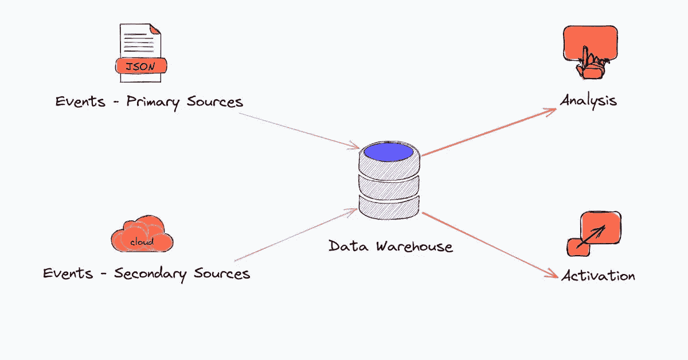

# 如何收集行为数据

> 原文：<https://towardsdatascience.com/how-to-collect-behavioral-data-2a891fad6bc5>

## 数据工程师和分析师指南

本帖所有图片均由作者创作

你的公司推出了一款新产品，而你的任务是建立行为数据基础设施？或者，您可能需要使用现代工具来改造现有的基础架构？

有几种不同的技术(CDI、CDP、ELT)可用于收集行为数据，同时，还有许多工具(Segment、Rudderstack、Airbyte 等)具有跨越多种技术的功能。

我知道在这个迷宫中穿行并做出明智的决定是令人生畏且耗时的。不过，你很幸运，在我担任 Integromat 增长主管期间，我花了大量时间做这件事，并在我建立探索数据工具的地方 [astorik](http://astorik.com) 时，继续跟踪所有新的数据工具和技术。

本指南的目标是介绍各种行为数据收集技术以及每种技术下的流行工具。但是首先，我想解释一下为什么行为数据很重要，以及它来自哪里。

# 为什么要收集行为数据？

行为数据是用户在与产品交互时执行动作或事件的结果，因此也被称为**事件数据**或**产品使用数据**。

行为数据为团队提供两个主要目的——了解产品如何被使用或不被使用(用户行为),以及在各种接触点建立个性化的客户体验以影响用户行为。

要了解产品的使用情况，需要事先对您想要测量其使用情况的功能进行检测，即跟踪用户执行的事件，并将这些事件发送给第三方工具进行分析。类似地，您需要跟踪事件，基于这些事件，您希望通过下游激活工具触发活动和体验。

启动新功能而不事先对其进行测试是一个典型的错误——它剥夺了分析这些功能如何使用(如果有的话)以及在相关事件发生(或不发生)时触发应用内体验或消息的机会。

# 行为数据从哪里来？

虽然我提到的事件发生在你的产品中，但是行为数据的实际来源可以是嵌入在你的产品中的外部工具或服务。出于对简单性的热爱，我喜欢将数据源分类为主要的和次要的。

# 主要数据源

您的核心产品— *web 应用、移动应用、智能设备、*或由专有代码驱动的组合 *—* 是主要或第一方行为数据源。

如果您的产品是使用无代码工具构建的，您将没有行为数据的主要来源——您将依赖无代码工具为您提供行为数据(通过 webhooks 或与数据收集工具的集成)。

要从主要来源收集数据，可以使用客户端和服务器端 SDK 或数据收集工具提供的 API。

# 次要数据源

二级数据源包括您的客户直接或间接与之交互的所有外部或**第三方工具**——用于认证、支付、应用内体验、支持、反馈、参与和广告的工具。

当第三方工具嵌入到您的核心产品体验中时，客户*会间接地或不知不觉地与第三方工具进行交互。示例包括用于身份验证的 Auth0、用于支付的 Stripe 和用于应用内体验的 AppCues 从用户的角度来看，即使在与这些外部工具交互时，他们也在使用你的产品。*

客户还与外部工具互动，这些工具*显然不是核心产品体验的一部分*，但却是不可或缺的接触点。通过 Zendesk 打开一张支持票，通过 Typeform 留下反馈，通过 Intercom 打开一封电子邮件，或者在脸书上做一个广告——这些都是有助于理解客户旅程的互动。

记住第三方工具会生成大量数据也很有帮助，但并不都是事件数据。就事件和对象而言，您究竟可以收集什么取决于您使用的数据收集工具所提供的集成。

要从二级来源收集数据，您可以使用数据收集工具提供的源集成，也可以编写自己的代码。

# 收集行为数据的技术和工具

就像现代数据领域的所有层一样，数据收集层在过去几年中经历了很多活动，推出了几个非常受欢迎的开源产品。

随着核心功能被扩展到覆盖相邻的用例，产品之间的重叠也在增加。

# CDI 和 CDP 的区别

CDI 或*客户数据基础设施*是一个不太常见的术语，经常与 CDP 或*客户数据平台混淆。*

没有*基础设施*就没有*平台*—CDP 本质上是 CDI 之上的一层，它提供了一组功能，可以使用可视化界面对数据进行一些很酷的处理。

**CDI 是一个独立的解决方案**,没有 CDP 也可以存在，而 CDP 由一些 CDI 供应商作为附件出售。

CDI 的主要方面如下:

1.  CDI ( *客户数据基础设施)*专门用于从*主要或第一方数据源*收集行为数据，但一些解决方案也支持少量次要数据源(第三方工具)。
2.  数据通常同步到云数据仓库，如 Snowflake、BigQuery 或 Redshift，但大多数 CDI 解决方案也能够将数据同步到第三方工具。
3.  所有 CDI 供应商都提供各种数据收集 SDK 和 API
4.  一些 CDI 解决方案存储数据的副本，一些使其可选，一些则不。

CDP 的核心功能包括身份解析，以及用户使用拖放 UI(无需编写 SQL)构建受众并将其同步到外部工具的能力。

# CDI 和 CDP 工具

关系和人物角色分别是细分市场的 CDI 和 CDP 产品。mParticle 采用了一种略有不同的方法，它在标准版中提供了 CDI 功能以及身份解析，而在高级版中则提供了受众培养功能。Segment 和 mParticle 都支持数据仓库和大量第三方工具作为目的地，并存储数据的副本，以便以后需要时可以访问。

RudderStack 事件流和 Jitsu 是开源的 CDI 解决方案，定位为分段连接的替代方案。这两种产品都支持仓库和第三方工具，但 RudderStack 提供了更广泛的目的地目录。

Snowplow 是唯一一个称自己为行为数据平台的 CDI 解决方案。它也是开源的，与其他产品不同，Snowplow 不支持第三方工具，因为它专注于仓库和一些开源项目作为目的地。

其他值得研究的 CDI 解决方案是 Freshpaint，它提供无代码或隐式跟踪，元路由器是一种服务器端 CDI，只在私有云实例中运行。

下面的链接将带您到各自工具的集成目录:

# ELT 工具

ELT 工具专门用于从大量第三方工具(二级来源)中提取所有类型的数据，并将数据加载到云数据仓库中。也就是说，并非 ELT 工具提供的所有集成都支持行为数据或事件数据。

ELT 工具不存储任何数据，也不支持第三方工具作为目的地。

Airbyte 是一个开源的 ELT 工具，有一个不断增长的连接器库和一个繁荣的贡献者社区。Airbyte 提供了 150 多个工具的源连接器，如 [Zendesk](https://airbyte.com/connectors/zendesk-support) 、 [Intercom](https://airbyte.com/connectors/intercom) 、 [Stripe](https://airbyte.com/connectors/stripe) 、 [Typeform](https://airbyte.com/connectors/typeform) 和[脸书广告](https://airbyte.com/connectors/facebook-marketing)，其中许多工具都会生成事件数据。Airbyte 还提供了一个连接器开发包(CDK ),您可以使用它来构建由 Airbyte 社区成员维护的集成。

其他 ELT 供应商包括 Fivetran、Stitch 和 Meltano(也是开源的)。

如前所述，CDI 解决方案还提供了与一些第三方工具的源代码集成，但这些集成不如 ELT 工具提供的集成全面和深入。

在考虑是使用 ELT 工具还是 CDI 工具的源集成从第三方工具中提取数据时，请考虑以下几点:

*   CDI 是从主要或第一方数据源(web 和移动应用程序以及物联网设备)收集行为数据的最佳选择
*   ELT 是收集所有类型数据的最佳工具，包括来自二级数据源的行为数据，二级数据源是推动各种客户体验的第三方工具。

# 产品分析工具

Amplitude、Mixpanel、Indicative、Heap 和 PostHog(开源)是专门用于行为数据分析的工具。与此同时，所有这些都提供了 SDK 和 API 来从您的主要(第一方)数据源收集数据。

产品分析工具本质上存储了您的数据副本，并允许您导出数据(通常需要额外付费)。您还可以使用 Airbyte 与[振幅](https://airbyte.com/connectors/amplitude)、[混合面板](https://airbyte.com/connectors/mixpanel)或[后日志](https://airbyte.com/connectors/posthog)的集成，将数据从这些工具导出到 Airbyte 支持的目的地。

然而，重要的是要记住，除了分析之外，还有很多行为数据的激活用例。

作为一种最佳实践，公司必须建立一个数据仓库来存储他们收集的所有数据的副本——使用专门构建的数据收集工具(CDI 和 ELT)更有效，防止供应商锁定，并且更有意义。

# 定制跟踪解决方案

如果现成的解决方案不适合您，您可以随时构建一个定制的跟踪服务，从您的应用程序中收集数据，并将其同步到您的仓库和下游应用程序。也就是说，有了这种解决方案的第一手经验，我可以告诉你，维护和故障排除不是小事，挫折是真实的。

更重要的是，有这么多不同风格的 CDI 和 ELT 解决方案可用，构建自己的解决方案并不是对工程资源的最佳利用。事实上，工程师通常讨厌构建集成——你可能就是其中之一，所以如果我错了，请告诉我。

# 结论

CDI 工具是专门为行为数据构建的，我强烈建议采用一种工具从主要或第一方数据源收集数据，并坚持使用 ELT 工具从第二或第三方数据源收集数据。

既然您已经对收集行为数据以进行分析和激活所需的工具有了更好的了解，那么在决定跟踪哪些事件以及将哪些数据发送到哪个目的地时，不要忘记与各个团队的利益相关者进行协作。

[*最早发表于 Airbyte 博客*](https://airbyte.com/blog/collect-behavioral-data-guide) *。*