# 如何比较两个或多个分布

> 原文：<https://towardsdatascience.com/how-to-compare-two-or-more-distributions-9b06ee4d30bf>

## [因果数据科学](https://towardsdatascience.com/tagged/causal-data-science)

## *比较分布的完整指南，从可视化到统计测试*


封面图片，由作者使用[nightcafe](https://creator.nightcafe.studio/)生成

比较变量在不同组中的经验分布是数据科学中的一个常见问题。特别是，在因果推断中，当我们不得不**评估随机化的质量**时，问题经常出现。

当我们想要评估一项政策(或 UX 特色、广告活动、药物……)的因果效应时，因果推断的黄金标准是<https://en.wikipedia.org/wiki/Randomized_controlled_trial>**随机对照试验，也称为 [**A/B 测试**](https://de.wikipedia.org/wiki/A/B-Test) 。在实践中，我们选择一个样本进行研究，并将其随机分为**对照组**和**治疗组**，并比较两组之间的结果。随机化确保两组之间的唯一差异是平均治疗，因此我们可以将结果差异归因于治疗效果。**

**T21 的问题是，尽管进行了随机分组，两组人永远不会完全相同。然而，有时候，他们甚至不“相似”。例如，我们可能在一个群体中有更多的男性，或者老年人，等等..(我们通常称这些特征为*协变量*或*控制变量*)。当这种情况发生时，我们不能再确定结果的差异仅仅是由于治疗，而不是由于**不平衡的协变量**。因此，在随机化之后，检查所有观察到的变量在各组之间是否平衡以及是否没有系统性差异总是很重要的。另一个选择是[分层抽样](https://en.wikipedia.org/wiki/Stratified_sampling)，为了事先确定某些协变量是平衡的。**

**在这篇博文中，我们将看到比较两个(或更多)分布的不同方法，并评估它们之间差异的大小和重要性。我们将考虑两种不同的方法，**视觉**和**统计**。这两种方法通常在**直觉**和**严谨**之间进行权衡:从图中，我们可以快速评估和探索差异，但很难判断这些差异是系统性的还是由噪声造成的。**

# **例子**

**让我们假设我们需要对一组个体进行一项实验，我们已经将他们随机分成了 T21 治疗组和对照组。我们希望它们尽可能具有可比性，以便将两组之间的任何差异仅归因于治疗效果。我们还将治疗组分成不同的*组*，用于测试不同的治疗方法(例如同一药物的微小变化)。**

**对于这个例子，我模拟了一个 1000 人的数据集，我们观察到他们的一系列特征。我从`[src.dgp](https://github.com/matteocourthoud/Blog-Posts/blob/main/notebooks/src/dgp.py)`导入数据生成过程`dgp_rnd_assignment()`，从`[src.utils](https://github.com/matteocourthoud/Blog-Posts/blob/main/notebooks/src/utils.py)`导入一些绘图函数和库。**

```
from src.utils import *
from src.dgp import dgp_rnd_assignment

df = dgp_rnd_assignment().generate_data()
df.head()
```

****

**数据快照，图片由作者提供**

**我们有 1000 个人的信息，为此我们观察`gender`、`age`和每周`income`。每个个体被分配到治疗组或对照组`group`，接受治疗的个体被分配到四个治疗组`arms`。**

# **两组——地块**

**让我们从最简单的设置开始:我们想要比较`treatment`和`control`组的收入分布。我们首先探索**视觉**方法，然后**统计**方法。第一个的优势是**直觉**而第二个的优势是**严谨**。**

**对于大多数可视化，我将使用 Python 的`[seaborn](https://seaborn.pydata.org/)`库。**

## **箱线图**

**第一种视觉方法是 [**箱线图**](https://en.wikipedia.org/wiki/Box_plot) 。箱线图是汇总统计和数据可视化之间的一个很好的折衷。**框**的中心代表*中位数*，而边界分别代表第一(Q1)和第三[四分位数](https://en.wikipedia.org/wiki/Quartile) (Q3)。相反,**须状物**延伸到框外超过 1.5 倍*四分位数间距* (Q3 — Q1)的第一个数据点。胡须外的点被单独标绘，通常被认为是 [**异常值**](https://en.wikipedia.org/wiki/Outlier) 。**

**因此，箱线图提供了汇总统计数据(方框和胡须)和直接的数据可视化(异常值)。**

```
sns.boxplot(data=df, x='Group', y='Income');
plt.title("Boxplot");
```

**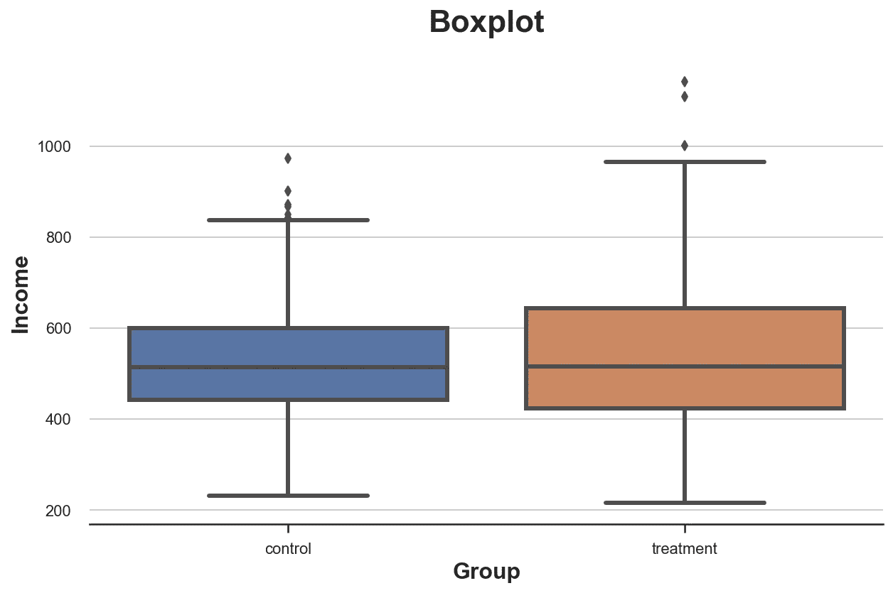**

**治疗组和对照组的收入分布，按作者分类**

**看起来`treatment`组中的`income`分布稍微分散一些:橙色的盒子更大，它的须覆盖的范围更广。然而，箱线图的**问题**在于它隐藏了数据的形状，告诉我们一些汇总统计数据，但不显示实际的数据分布。**

## **柱状图**

**绘制分布图最直观的方式是**直方图**。直方图将数据分组到等宽的**箱**中，并绘制每个箱内的观察数量。**

```
sns.histplot(data=df, x='Income', hue='Group', bins=50);
plt.title("Histogram");
```

**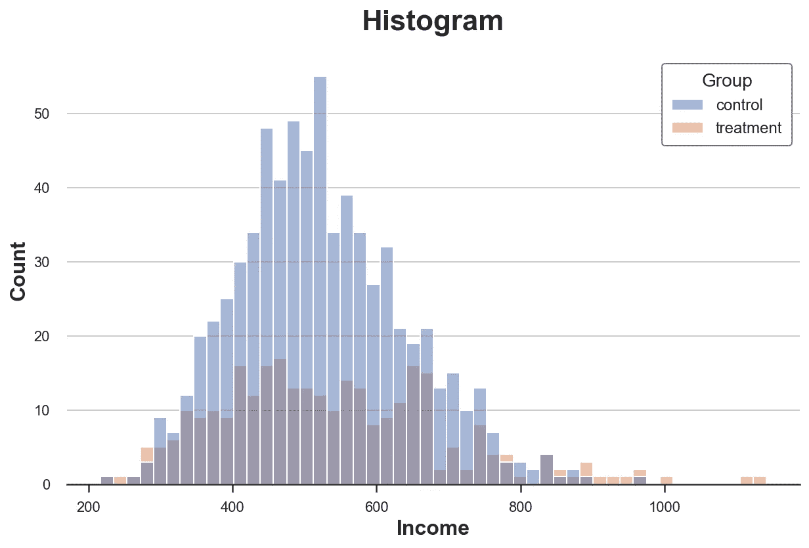**

**治疗组和对照组的收入分布，按作者分类**

**这个情节有多个**问题**:**

*   **由于两组有不同数量的观察值，这两个直方图是不可比的**
*   **箱的数量是任意的**

**我们可以解决第一个问题，使用`stat`选项来绘制`density`而不是计数，并将`common_norm`选项设置为`False`来分别归一化每个直方图。**

```
sns.histplot(data=df, x='Income', hue='Group', bins=50, stat='density', common_norm=False);
plt.title("Density Histogram");
```

**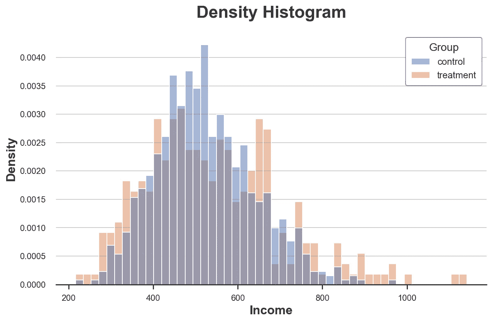**

**治疗组和对照组的收入分布，按作者分类**

**现在两个直方图有可比性了！**

**然而，一个重要的**问题**仍然存在:箱子的大小是任意的。在极端情况下，如果我们将数据聚集得更少，我们最终会得到最多一个观测值的箱，如果我们将数据聚集得更多，我们最终会得到单个箱。在这两种情况下，如果我们夸大，情节就失去了信息性。这是一个经典的[偏差-方差权衡](https://en.wikipedia.org/wiki/Bias%E2%80%93variance_tradeoff)。**

## **内核密度**

**一种可能的解决方案是使用 [**核密度函数**](https://en.wikipedia.org/wiki/Kernel_density_estimation) ，该函数试图用连续函数近似直方图，使用[核密度估计(KDE)](https://en.wikipedia.org/wiki/Kernel_density_estimation) 。**

```
sns.kdeplot(x='Income', data=df, hue='Group', common_norm=False);
plt.title("Kernel Density Function");
```

**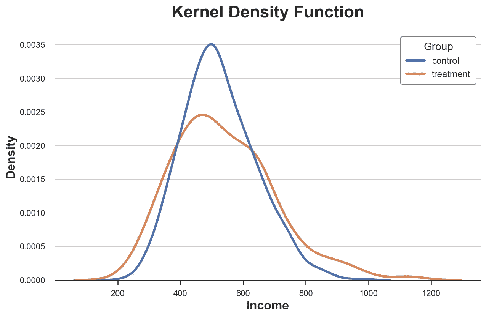**

**治疗组和对照组的收入分布，按作者分类**

**从图中可以看出，`income`的估计核密度在`treatment`组中似乎具有“更厚的尾部”(即更高的方差)，而各组之间的平均值似乎相似。**

**内核密度估计的**问题**是它有点像黑盒，可能会掩盖数据的相关特征。**

## **累积分布**

**两个分布的更透明的表示是它们的 [**累积分布函数**](https://en.wikipedia.org/wiki/Cumulative_distribution_function) 。在 x 轴的每个点(`income`)，我们绘制了具有相等或更低值的数据点的百分比。累积分布函数的主要**优点**是**

*   **我们不需要做出任何任意的选择(例如，箱的数量)**
*   **我们不需要执行任何近似(例如，用 KDE)，但是我们代表所有的数据点**

```
sns.histplot(x='Income', data=df, hue='Group', bins=len(df), stat="density",
             element="step", fill=False, cumulative=True, common_norm=False);
plt.title("Cumulative distribution function");
```

**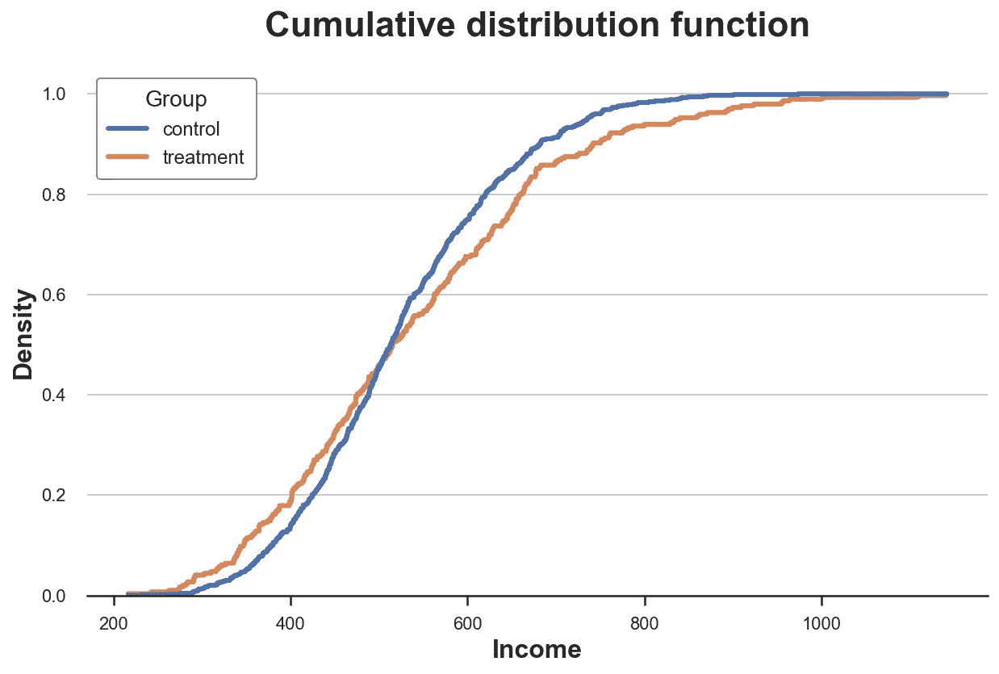**

**治疗组和对照组的累积收入分布，按作者分类的图像**

**我们应该如何解释这个图表？**

*   **由于两条线在 0.5 (y 轴)处交叉，这意味着它们的中值是相似的**
*   **由于橙色线位于左侧蓝线的上方和右侧蓝线的下方，这意味着`treatment`组的分布为较粗的尾部**

## **Q-Q 图**

**一个相关的方法是**Q-Q**plot，其中 *q* 代表分位数。Q-Q 图绘制了两种分布的分位数。如果分布相同，我们应该得到一条 45 度线。**

**Python 中没有原生的 Q-Q plot 函数，尽管`statsmodels`包提供了一个`[qqplot](https://www.statsmodels.org/dev/generated/statsmodels.graphics.gofplots.qqplot.html)` [函数](https://www.statsmodels.org/dev/generated/statsmodels.graphics.gofplots.qqplot.html)，但它相当麻烦。所以，我们就手工做。**

**首先，我们需要使用`percentile`函数计算两组的四分位数。**

```
income = df['Income'].values
income_t = df.loc[df.Group=='treatment', 'Income'].values
income_c = df.loc[df.Group=='control', 'Income'].values

df_pct = pd.DataFrame()
df_pct['q_treatment'] = np.percentile(income_t, range(100))
df_pct['q_control'] = np.percentile(income_c, range(100))
```

**现在我们可以绘制两个分位数分布图，加上 45 度线，代表基准完美拟合。**

```
plt.figure(figsize=(8, 8))
plt.scatter(x='q_control', y='q_treatment', data=df_pct, label='Actual fit');
sns.lineplot(x='q_control', y='q_control', data=df_pct, color='r', label='Line of perfect fit');
plt.xlabel('Quantile of income, control group')
plt.ylabel('Quantile of income, treatment group')
plt.legend()
plt.title("QQ plot");
```

**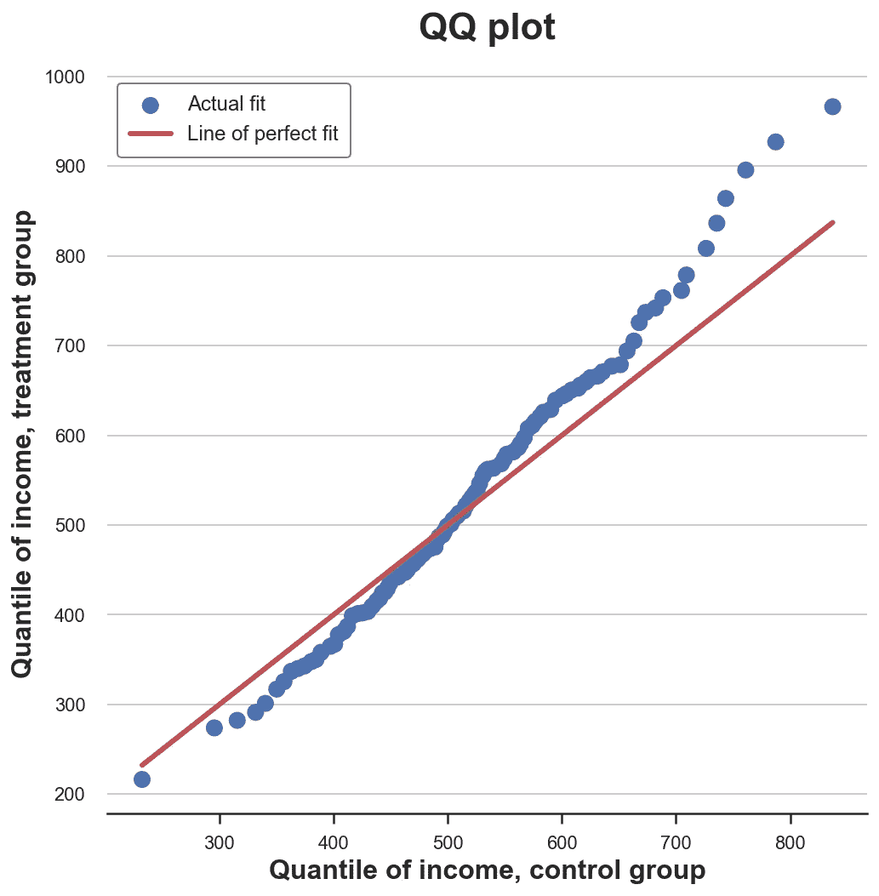**

**Q-Q 图，作者图片**

**Q-Q 图提供了与累积分布图非常相似的洞察**:治疗组的收入具有相同的中值(线在中心交叉),但尾部更宽(点在左端线的下方，右端线的上方)。****

# **两组—测试**

**到目前为止，我们已经看到了不同的方式来*可视化*分布之间的差异。可视化的主要优势是**直觉**:我们可以观察差异并直观地评估它们。**

**然而，我们可能希望更加**严谨**并尝试评估分布之间差异的**统计显著性**，即回答问题“*观察到的差异是系统性的还是由于采样噪声？*”。**

**我们现在要分析不同的测试来区分两个分布。**

## **t 检验**

**第一个也是最常见的测试是[学生 t 测试](https://en.wikipedia.org/wiki/Student's_t-test)。t 检验一般用于**比较均值**。在这种情况下，我们想要测试`income`分布的平均值在两组中是否相同。两均值比较检验的检验统计量由下式给出:**

****

**t 检验统计，作者图片**

**其中 *x̅* 是样本均值，而 *s* 是样本标准差。在温和条件下，检验统计量渐近分布为[学生 t](https://en.wikipedia.org/wiki/Student's_t-distribution) 分布。**

**我们使用来自`scipy`的`ttest_ind`函数来执行 t 检验。该函数返回测试统计和隐含的 [p 值](https://en.wikipedia.org/wiki/P-value)。**

```
from scipy.stats import ttest_ind

stat, p_value = ttest_ind(income_c, income_t)
print(f"t-test: statistic={stat:.4f}, p-value={p_value:.4f}")t-test: statistic=-1.5549, p-value=0.1203
```

**检验的 p 值为 0.12，因此我们**不拒绝**治疗组和对照组的*无差异的零假设意味着*。**

> ****注意**:t 检验假设两个样本中的方差相同，因此它的估计是在联合样本上计算的。[韦尔奇的 t 检验](https://en.wikipedia.org/wiki/Welch%27s_t-test)允许两个样本中的**不等方差**。**

## **标准化平均差(SMD)**

**一般来说，当我们进行随机对照试验或 A/B 试验时，最好始终对治疗组和对照组的所有变量**进行均值差异测试。****

**然而，由于 t-检验统计的分母取决于样本量，t-检验受到了**批评**，因为它使得 p 值很难跨研究进行比较。事实上，我们可能在差异非常小但样本量很大的实验中获得显著结果，而在差异很大但样本量很小的实验中获得不显著结果。**

**已经提出的一个解决方案是**标准化平均差异(SMD)** 。顾名思义，这不是一个适当的测试统计，而只是一个标准化的差异，可以计算如下:**

****

**标准化平均差异，作者图像**

**通常，低于 0.1 的值被认为是“小”差异。**

**良好的做法是收集所有治疗组和对照组变量的平均值，以及两者之间的距离测量值——t 检验或 SMD——到一个名为**平衡表**的表格中。我们可以使用`[causalml](https://causalml.readthedocs.io/en/latest/about.html)`库中的`[create_table_one](https://causalml.readthedocs.io/en/latest/causalml.html#module-causalml.match)`函数来生成它。正如这个函数的名字所暗示的，平衡表应该总是你在执行 A/B 测试时出现的第一个表。**

```
from causalml.match import create_table_one

df['treatment'] = df['Group']=='treatment'
create_table_one(df, 'treatment', ['Gender', 'Age', 'Income'])
```

****

**平衡表，作者图片**

**在前两列中，我们可以看到治疗组和对照组不同变量的平均值，标准误差在括号中。在**最后一列**中，SMD 值显示所有变量的标准化差异超过 0.1，表明两组可能不同。**

## **曼恩-惠特尼 U 检验**

**另一种测试是[曼-惠特尼 U 测试](https://en.wikipedia.org/wiki/Mann%E2%80%93Whitney_U_test)。此检验的零假设是两组具有相同的分布，而另一个假设是一组比另一组具有更大(或更小)的值。**

**与我们到目前为止看到的其他检验不同，Mann–Whitney U 检验对异常值不可知，并且集中于分布的中心。**

**测试**程序**如下。**

1.  **合并所有数据点并对其进行排序(按升序或降序)**
2.  **计算*u₁=r₁n₁(n₁+1)/2*，其中 *R₁* 为第一组数据点的排名之和， *n₁* 为第一组的点数。**
3.  **为第二组类似地计算 *U₂* 。**
4.  **测试统计数据由 u₂).min(u₁给出**

**在两个分布之间没有系统性等级差异的零假设下(即，相同的中值)，检验统计量是具有已知均值和方差的渐近正态分布。**

**计算 *R* 和 *U* 背后的**直觉**如下:如果第一个样本中的值都大于第二个样本中的值，那么 *R₁ = n₁(n₁ + 1)/2* ，因此 *U₁* 将为零(可达到的最小值)。否则，如果两个样本相似， *U₁* 和 *U₂* 将非常接近 *n₁ n₂ / 2* (可达到的最大值)。**

**我们使用来自`scipy`的`mannwhitneyu`函数来执行测试。**

```
from scipy.stats import mannwhitneyu

stat, p_value = mannwhitneyu(income_t, income_c)
print(f" Mann–Whitney U Test: statistic={stat:.4f}, p-value={p_value:.4f}")Mann–Whitney U Test: statistic=106371.5000, p-value=0.6012
```

**我们得到的 p 值为 0.6，这意味着我们没有拒绝治疗组和对照组中`income`分布相同的无效假设。**

> ****注**:关于 t 检验，对于两个样本中的**不等方差**存在一个版本的曼恩-惠特尼 U 检验，即[布鲁纳-芒泽尔检验](https://www.statisticshowto.com/brunner-munzel-test-generalized-wilcoxon-test/)。**

## **排列测试**

**一个非参数的替代方法是排列测试。这个想法是，在零假设下，两个分布应该是相同的，因此**洗牌**标签`group`不应该显著改变任何统计数据。**

**我们可以选择任何统计数据，并检查其在原始样本中的值与其在`group`标签排列中的分布相比如何。例如，让我们使用治疗组和对照组之间的样本均值的**差异作为检验统计量。****

```
sample_stat = np.mean(income_t) - np.mean(income_c)stats = np.zeros(1000)
for k in range(1000):
    labels = np.random.permutation((df['Group'] == 'treatment').values)
    stats[k] = np.mean(income[labels]) - np.mean(income[labels==False])
p_value = np.mean(stats > sample_stat)

print(f"Permutation test: p-value={p_value:.4f}")Permutation test: p-value=0.0530
```

**排列测试给出的 p 值为 0.053，意味着在 5%的水平上零假设的弱**非拒绝**。**

**我们如何**解读**p 值？这意味着数据中的均值差异大于置换样本均值差异的 1–0.0560 = 94.4%。**

**我们可以**可视化**测试，通过绘制测试统计量相对于样本值的排列分布。**

```
plt.hist(stats, label='Permutation Statistics', bins=30);
plt.axvline(x=sample_stat, c='r', ls='--', label='Sample Statistic');
plt.legend();
plt.xlabel('Income difference between treatment and control group')
plt.title('Permutation Test');
```

**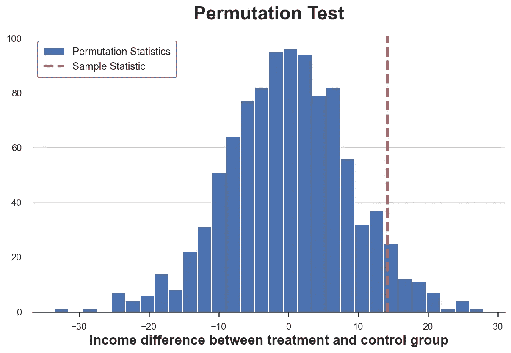**

**排列的平均差异分布，按作者分类的图像**

**正如我们所看到的，样本统计量相对于置换样本中的值来说非常极端，但并不过分。**

## **卡方检验**

**[卡方检验](https://matteocourthoud.github.io/post/chisquared/)是一种非常强大的检验，主要用于检验频率差异。**

**卡方检验的**最不为人知的应用**之一是测试两个分布之间的相似性。**的想法**是将两个组的观察结果结合起来。如果两个分布是相同的，我们将期望在每个箱中观察到相同的频率。重要的是，为了使测试有效，我们需要在每个箱中有足够的观察值。**

**我生成与*控制*组中`income`的十分位数分布相对应的箱，然后计算*处理*组中每个箱中的预期观察数，如果两个分布相同的话。**

```
# Init dataframe
df_bins = pd.DataFrame()

# Generate bins from control group
_, bins = pd.qcut(income_c, q=10, retbins=True)
df_bins['bin'] = pd.cut(income_c, bins=bins).value_counts().index

# Apply bins to both groups
df_bins['income_c_observed'] = pd.cut(income_c, bins=bins).value_counts().values
df_bins['income_t_observed'] = pd.cut(income_t, bins=bins).value_counts().values

# Compute expected frequency in the treatment group
df_bins['income_t_expected'] = df_bins['income_c_observed'] / np.sum(df_bins['income_c_observed']) * np.sum(df_bins['income_t_observed'])

df_bins
```

**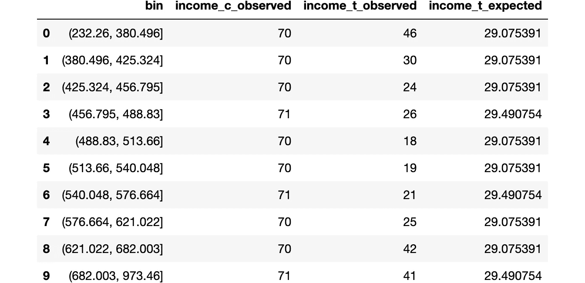**

**按作者分类的媒体夹和频率、图像**

**我们现在可以通过比较治疗组中预期的(E)和观察到的(O)数量来进行测试。测试统计由下式给出**

****

**卡方检验统计，图片由作者提供**

**其中由 *i* 和 *O* 索引的面元是面元 *i* 中的观察数据点数，而 *E* 是面元 *i* 中的预期数据点数。由于我们使用对照组中`income`分布的十分位数来生成箱，我们预计治疗组中每个箱的观察数量在所有箱中是相同的。检验统计量渐近分布为[卡方](https://en.wikipedia.org/wiki/Chi-squared_distribution)分布。**

**为了计算测试的统计量和 p 值，我们使用了来自`scipy`的`chisquare`函数。**

```
from scipy.stats import chisquare

stat, p_value = chisquare(df_bins['income_t_observed'], df_bins['income_t_expected'])
print(f"Chi-squared Test: statistic={stat:.4f}, p-value={p_value:.4f}")Chi-squared Test: statistic=32.1432, p-value=0.0002
```

**与迄今为止所有其他测试不同，卡方检验**强烈拒绝**两个分布相同的无效假设。为什么？**

**原因在于两个分布具有相似的中心但不同的尾部，卡方检验沿着**整个分布**测试相似性，而不仅仅是在中心，就像我们在之前的测试中所做的那样。**

**这个结果告诉了一个**警示故事**:在从 p 值得出盲目的结论之前，理解*你实际测试的是什么*是非常重要的！**

## **科尔莫戈罗夫-斯米尔诺夫试验**

**[Kolmogorov-Smirnov 检验](https://en.wikipedia.org/wiki/Kolmogorov%E2%80%93Smirnov_test)可能是比较分布的最流行的非参数检验。Kolmogorov-Smirnov 测试的想法是**比较两组的累积分布**。特别地，Kolmogorov-Smirnov 检验统计量是两个累积分布之间的最大绝对差。**

****

**Kolmogorov-Smirnov 检验统计，图片由作者提供**

**其中 *F₁* 和 *F₂* 是两个累积分布函数，而 *x* 是基础变量的值。Kolmogorov-Smirnov 检验统计量的渐近分布是 [Kolmogorov 分布](https://en.wikipedia.org/wiki/Kolmogorov%E2%80%93Smirnov_test#Kolmogorov_distribution)。**

**为了更好地理解测试，让我们画出累积分布函数和测试统计量。首先，我们计算累积分布函数。**

```
df_ks = pd.DataFrame()
df_ks['Income'] = np.sort(df['Income'].unique())
df_ks['F_control'] = df_ks['Income'].apply(lambda x: np.mean(income_c<=x))
df_ks['F_treatment'] = df_ks['Income'].apply(lambda x: np.mean(income_t<=x))
df_ks.head()
```

****

**累积分布数据集快照，按作者分类的图像**

**我们现在需要找到累积分布函数之间的绝对距离最大的点。**

```
k = np.argmax( np.abs(df_ks['F_control'] - df_ks['F_treatment']))
ks_stat = np.abs(df_ks['F_treatment'][k] - df_ks['F_control'][k])
```

**通过绘制两个累积分布函数和检验统计量的值，我们可以直观地看到检验统计量的值。**

```
y = (df_ks['F_treatment'][k] + df_ks['F_control'][k])/2
plt.plot('Income', 'F_control', data=df_ks, label='Control')
plt.plot('Income', 'F_treatment', data=df_ks, label='Treatment')
plt.errorbar(x=df_ks['Income'][k], y=y, yerr=ks_stat/2, color='k',
             capsize=5, mew=3, label=f"Test statistic: {ks_stat:.4f}")
plt.legend(loc='center right');
plt.title("Kolmogorov-Smirnov Test");
```

**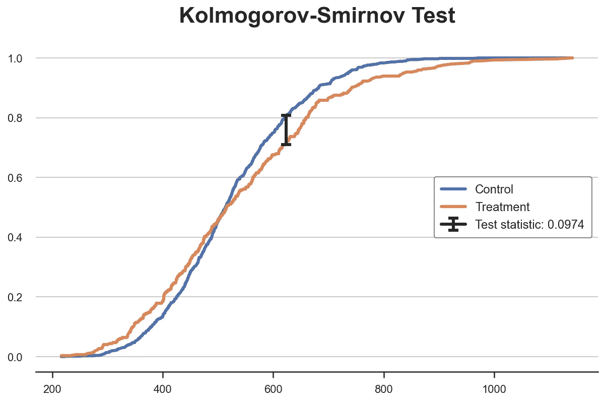**

**Kolmogorov-Smirnov 检验统计，图片由作者提供**

**从图中我们可以看到，在`income` ~650 处，检验统计量的值对应于两个累积分布之间的距离。对于`income`值，我们在两组之间有最大的不平衡。**

**我们现在可以使用`scipy`中的`kstest`功能进行实际测试。**

```
from scipy.stats import kstest

stat, p_value = kstest(income_t, income_c)
print(f" Kolmogorov-Smirnov Test: statistic={stat:.4f}, p-value={p_value:.4f}")Kolmogorov-Smirnov Test: statistic=0.0974, p-value=0.0355
```

**p 值低于 5%:我们**拒绝**两个分布相同的零假设，有 95%的置信度。**

> ****注 1**:KS 检验**过于保守**并且很少拒绝零假设。 [Lilliefors 检验](https://en.wikipedia.org/wiki/Lilliefors_test)使用检验统计的不同分布，即 Lilliefors 分布，来纠正这种偏差。**
> 
> ****注 2**:KS 测试**使用非常少的信息**，因为它只比较一个点的两个累积分布:最大距离点。 [Anderson-Darling 测试](https://en.wikipedia.org/wiki/Anderson%E2%80%93Darling_test)和 [Cramér-von Mises 测试](https://en.wikipedia.org/wiki/Cram%C3%A9r%E2%80%93von_Mises_criterion)则通过积分比较整个区域的两种分布(两者之间的差异在于平方距离的加权)。**

# **多组-图**

**到目前为止，我们只考虑了两组的情况:治疗组和对照组。但是如果我们有**多组**？我们在上面看到的一些方法可以很好地扩展，而另一些则不行。**

**作为一个工作示例，我们现在将检查`income`的分布在处理`arms`中是否相同。**

## **箱线图**

**当我们有许多个一位数的组时，盒图**可以很好地缩放，因为我们可以并排放置不同的盒子。****

```
sns.boxplot(x='Arm', y='Income', data=df.sort_values('Arm'));
plt.title("Boxplot, multiple groups");
```

**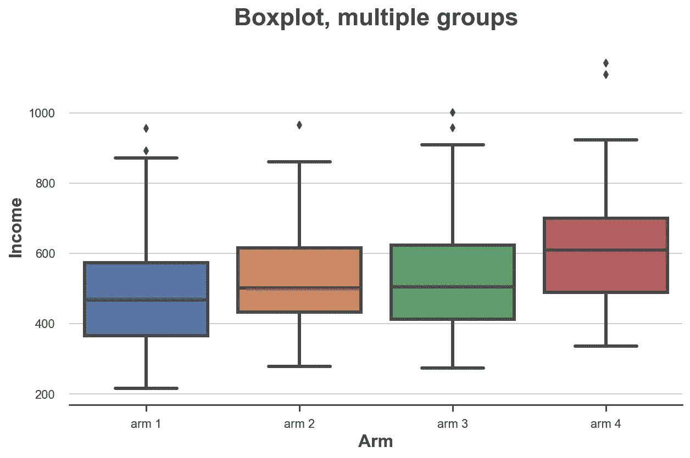**

**按作者分列的各治疗部门的收入分布图**

**从图中可以看出，`income`在不同治疗组中的分布是不同的，编号越高的治疗组平均收入越高。**

## **小提琴情节**

**结合汇总统计和内核密度估计的箱线图的一个非常好的扩展是**小提琴图**。violin 图沿 y 轴显示单独的密度，这样它们就不会重叠。默认情况下，它还在内部添加了一个微型箱线图。**

```
sns.violinplot(x='Arm', y='Income', data=df.sort_values('Arm'));
plt.title("Violin Plot, multiple groups");
```

**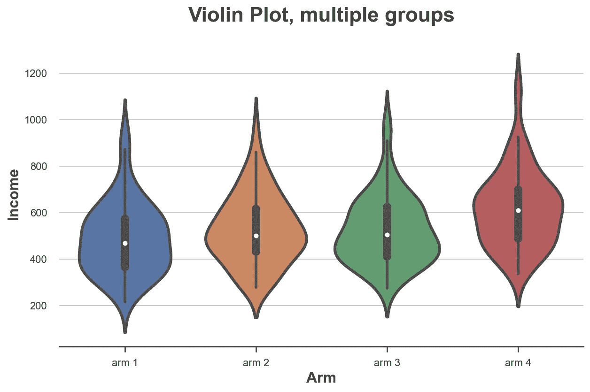**

**按作者分列的各治疗部门的收入分布图**

**至于箱线图，小提琴图表明不同治疗部门的收入是不同的。**

## **脊线图**

**最后，**脊线图**绘制了沿 x 轴的多个核密度分布，比小提琴图更直观，但部分重叠。不幸的是，`matplotlib`和`seaborn`都没有默认的脊线图。我们需要从`[joypy](https://github.com/leotac/joypy)`导入。**

```
from joypy import joyplot

joyplot(df, by='Arm', column='Income', colormap=sns.color_palette("crest", as_cmap=True));
plt.xlabel('Income');
plt.title("Ridgeline Plot, multiple groups");
```

**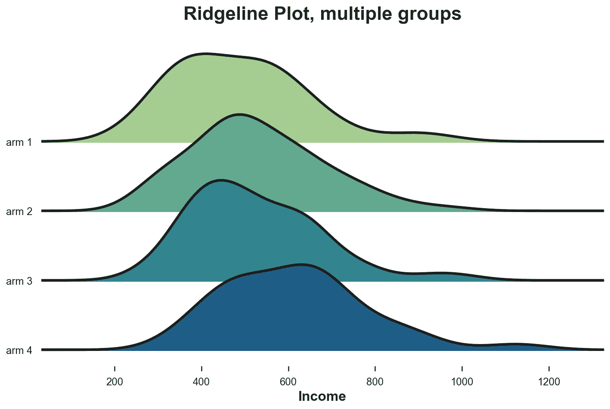**

**按作者分列的各治疗部门的收入分布图**

**脊线图再次表明，编号越高的治疗组收入越高。从该图中，也更容易理解不同形状的分布。**

# **多组—测试**

**最后，让我们考虑比较多组的假设检验。为了简单起见，我们将集中讨论最流行的一种:f 检验。**

## **f 检验**

**在多个小组中，最受欢迎的测试是 [**F-test**](https://en.wikipedia.org/wiki/F-test) 。f 检验比较不同组间变量的方差。这种分析也称为[方差分析，或 **ANOVA**](https://en.wikipedia.org/wiki/Analysis_of_variance) 。**

**实际上，f 检验统计量由下式给出**

**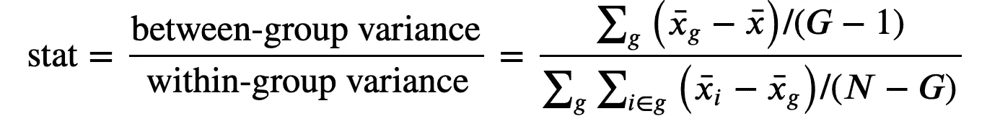**

**f 检验统计，按作者分类的图像**

**其中 *G* 为组数， *N* 为观察次数， *x̅* 为总体平均值， *x̅g* 为组内平均值 *g* 。在组独立性的零假设下，F 统计量为 [F 分布](https://en.wikipedia.org/wiki/F-distribution)。**

```
from scipy.stats import f_oneway

income_groups = [df.loc[df['Arm']==arm, 'Income'].values for arm in df['Arm'].dropna().unique()]
stat, p_value = f_oneway(*income_groups)
print(f"F Test: statistic={stat:.4f}, p-value={p_value:.4f}")F Test: statistic=9.0911, p-value=0.0000
```

**测试 p 值基本为零，意味着**强烈拒绝**跨治疗组`income`分布无差异的零假设。**

# **结论**

**在这篇文章中，我们已经看到了很多不同的方法来比较两个或更多的分布，包括视觉上的和统计上的。这是许多应用中的主要问题，尤其是在因果推断中，我们使用随机化使治疗组和对照组尽可能具有可比性。**

**我们也看到了不同的方法可能更适合不同的情况。视觉方法有助于建立直觉，但统计方法对于决策是必不可少的，因为我们需要能够评估差异的大小和统计意义。**

## **参考**

**[1]学生，[一个平均数的可能误差](https://www.jstor.org/stable/2331554) (1908)，*生物计量学*。**

**[2] F. Wilcoxon，[用等级方法进行个体比较](https://www.jstor.org/stable/3001968) (1945)，*生物统计学通报*。**

**[3] B. L .韦尔奇，[涉及几个不同总体方差时“学生”问题的推广](https://academic.oup.com/biomet/article/34/1-2/28/210174) (1947)， *Biometrika* 。**

**[4] H. B. Mann，D. R. Whitney，[关于两个随机变量中的一个是否随机大于另一个的检验](https://www.jstor.org/stable/2236101) (1947)，*《数理统计年鉴》*。**

**[5] E. Brunner，U. Munzen，[《非参数伯伦斯-费希尔问题:渐近理论和小样本近似法》](https://onlinelibrary.wiley.com/doi/abs/10.1002/(SICI)1521-4036(200001)42:1%3C17::AID-BIMJ17%3E3.0.CO;2-U) (2000 年)，*《生物统计学杂志》*。**

**[6] A. N. Kolmogorov，[Sulla determinizione empirica di una legge di distribuzione](https://link.springer.com/chapter/10.1007/978-94-011-2260-3_15)(1933 年)， *Giorn .Ist。斜体的阿图尔。*。**

**[7] H. Cramér，[论基本错误的构成](https://www.tandfonline.com/doi/abs/10.1080/03461238.1928.10416862) (1928)，*斯堪的纳维亚精算杂志*。**

**[8] R. von Mises，[Wahrscheinlichkeit statistik und wahrheit](https://www.ams.org/journals/bull/1937-43-05/S0002-9904-1937-06520-7/)(1936)，《美国数学学会公报*。***

***[9] T. W. Anderson，D. A. Darling，[基于随机过程的某些“拟合优度”标准的渐近理论](https://projecteuclid.org/journals/annals-of-mathematical-statistics/volume-23/issue-2/Asymptotic-Theory-of-Certain-Goodness-of-Fit-Criteria-Based-on/10.1214/aoms/1177729437.full) (1953)，*《数理统计年鉴》*。***

## ***相关文章***

*   ***[再见散点图，欢迎入库散点图](/b63dc69e3d8c)***

## ***密码***

***你可以在这里找到 Jupyter 的原始笔记本:***

***<https://github.com/matteocourthoud/Blog-Posts/blob/main/notebooks/distr.ipynb> *** 

## ***感谢您的阅读！***

***我真的很感激！🤗*如果你喜欢这个帖子并且想看更多，可以考虑* [***关注我***](https://medium.com/@matteo.courthoud) *。我每周发布一次与因果推断和数据分析相关的主题。我尽量让我的帖子简单而精确，总是提供代码、例子和模拟。****

****还有，一个小小的* ***免责声明*** *:我写作是为了学习所以错误是家常便饭，尽管我尽力了。当你发现他们的时候，请告诉我。也很欣赏新话题的建议！****

****最后但同样重要的是，热烈感谢*[*Adrian Olszewski*](https://www.linkedin.com/in/adrianolszewski/)*的许多有用的评论！****