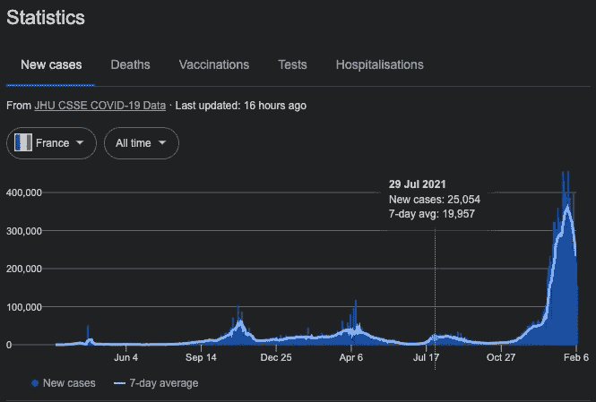
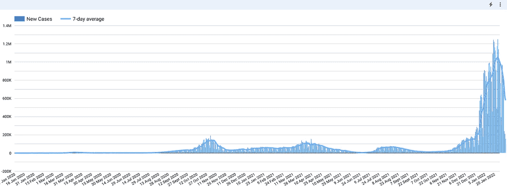
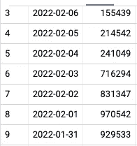
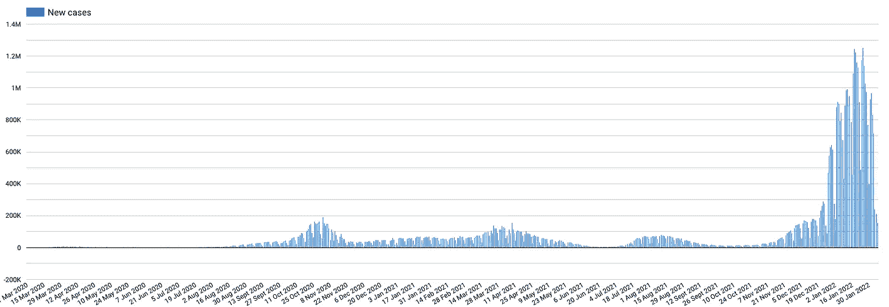
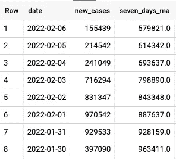
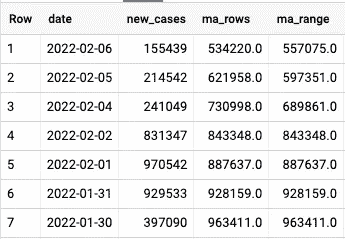
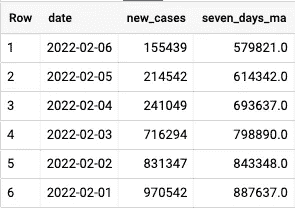

# 如何使用 SQL 在 BigQuery 中计算移动平均值

> 原文：<https://towardsdatascience.com/how-to-compute-a-moving-average-in-bigquery-using-sql-15f3fedd7489>

## 消除变化，发现趋势，并在 Data Studio 中将其可视化


股市站(信用:[https://unsplash.com/@behy_studio](https://unsplash.com/@behy_studio)

# 问题是

当查看**时序数据时，**决策可能会受到随机、短期波动(加密货币的价格、报告的新冠肺炎病例数量)的影响。

这就是为什么使用**移动平均线**(也称为**移动平均线**或**滚动平均线**)最有助于消除短期波动并突出长期趋势。

例如，新冠肺炎测试站和实验室可能整周批量报告病例(或者周末关闭时不报告)，加密货币股票市场价格可能会在几天之间的值之间快速振荡。

举例来说，在查看 Covid 19 新案例时，您可能已经在谷歌搜索上看到了下图:



来自谷歌搜索的 Covid 19 个新案例(图片由作者提供)

你会注意到图例中浅蓝色的线显示了 7 天的平均值。这正是我们将在本文中学习做的事情😎

您可以在下面的 Data Studio 中看到它的显示:



数据工作室中显示的 Covid 19 个新病例(图片由作者提供)

# 解决方案

在本文中，我们将根据谷歌新冠肺炎公开赛数据计算 **7 天移动平均线。**

在这种情况下，选择 7 天是很重要的(因为我们可以计算 14 天、30 天等等的移动平均值)。

在这里，我们选择 7 天，因为这是一个相当短的时期，我们希望保持每周视图(例如，周一至周日)，这将更好地代表电晕测试站或测试中心的速度(报告可能在周末，或在一周的特定间隔)。

但是对于不同的用例，我们可能会选择不同的时间框架。我们的示例是大约 7 *天*的周期，但是也可以按 *12 周*的周期来计算。视情况而定，框架也可以是*天、*周、*季、*年。

此外，您可以将移动平均值应用于任何数值，如*收入、用户数量等……)*

我们的解决方案将使用 ***解析函数*** *。*这些函数允许我们计算或获取一组行的值，并为每一行返回一个**单个**结果。这就像在不执行维度连接或分组的情况下在单个表中旅行或浏览一样。

要了解更多关于 ***聚合解析函数*** ，你可以在这里看看👇🏼

[](https://cloud.google.com/bigquery/docs/reference/standard-sql/aggregate_analytic_functions) [## 聚合分析函数| BigQuery |谷歌云

### 发送反馈以下部分描述了 BigQuery 支持的聚合分析函数。对于一个…

cloud.google.com](https://cloud.google.com/bigquery/docs/reference/standard-sql/aggregate_analytic_functions) 

对于这个实验，我们使用来自公共 BigQuery 数据集的**新冠肺炎公共数据**。

您可以通过以下链接获得更多信息👇🏼

[](https://cloud.google.com/blog/products/data-analytics/free-public-datasets-for-covid19) [## 新冠肺炎免费公共数据集|谷歌云博客

### 数据在调查、研究和应对突发公共卫生事件的能力中始终发挥着至关重要的作用

cloud.google.com](https://cloud.google.com/blog/products/data-analytics/free-public-datasets-for-covid19) 

要找到我们将逐步解释的完整脚本，您可以直接转到**步骤#3、**并在 BigQuery **中运行它。**

# 步骤#1:转换和分组

首先，我们希望得到我们的特定变量(`new_confirmed`)按期望的时间段聚合(在我们的例子中是每天*)。*

*上面的查询返回一个包含每天新确诊病例的表。*

**

*每日新增确诊病例*

*通过使用*查询编辑器*和*结果表*之间的**浏览数据**按钮，我们可以在 Data Studio 上很好地显示每日新增确诊病例如下:*

**

*数据工作室每日新增确诊病例(图片作者提供)*

*这只是第一步，但这是一个好的开始，坚持住😅*

# *第二步:如何计算我们的移动平均线？*

*我们之前计算了每日新增确诊病例的数量，其中输出是一天中每行和新增病例数量的表格。我们将该列命名为`new_cases`。*

*我们将使用一个**聚合分析函数**来获得我们的移动平均值。该函数将如下所示:*

```
*AVG(new_cases) OVER(ORDER BY UNIX_DATE(date) RANGE BETWEEN 6 PRECEDING AND CURRENT ROW)*
```

*我们输入我们想要新案例的平均值 *AVG(new_cases)* ，并且我们希望这个平均值包括当前行值*当前行*和前面的 6 行(以及我们表中的每一行)。*

*然后，您将得到以下输出:*

**

*移动平均每行的输出*

*让我们手动计算，从*2022–02–06*开始，7 天平均值将返回:*

**(155439+214542+241049+716294+831347+970542+929533)/7**

*这给出了 *579820，85* ，我们四舍五入到你在*2022–02–06 的`seven_days_ma`栏中看到的值。**

*但是，我们需要解决一个微妙的问题。你也可以这样写*

```
*AVG(new_cases) OVER(ORDER BY date ROWS BETWEEN 6 PRECEDING AND CURRENT ROW)*
```

*那么使用 RANGE 或者 ROWS 的**区别是什么呢？***

*这些行将查看当前行之前的行数，以便将它们包含在我们的平均值中。因此，在我们的例子中，该函数将查看当前行，然后查看之前的“物理”6 行，并计算平均值。但是如果有遗漏的日期呢？*

*这就是 RANGE 派上用场的地方，如果表由于某种原因缺少日期，那么行将回溯到 6 天以前。范围将产生一个基于日期值本身的窗口。*

*以**失踪日期**为例:*

**

*ma_rows 使用行框架，ma_range 使用范围框架*

*您可以在这里看到，`ma_rows`正在使用行计算 7 天移动平均线，`ma_range`正在使用范围计算我们的移动平均线，由于缺少日期*(2022–02–03)*，它们计算的值并不完全相同。*

*通常，建议使用范围，因为它不是基于物理行，而是基于逻辑值。唯一的区别是日期字段需要使用 UNIX_DATE()函数进行转换。*

# *步骤 3:在我们的查询中应用公式*

*现在，我们可以把所有这些放在一起，这是完整的脚本。*

*第一个 WITH 子句计算每个日期的所有新确诊病例。在 *" — Main Query"* 注释下，我们应用我们的移动平均函数，并且我们还在顶部的另一个查询中对其进行舍入(因为我们不能通过 OVER()子句使用舍入函数)。*

*这为我们提供了以下输出:*

**

*移动平均查询的结果以表格的形式显示*

*这就是我们如何得到我们的 7 天移动平均线！🍻然后就可以在 Data studio 上显示了*

# *现在，是时候闪耀✨了*

*然后，我们可以使用 Datastudio 来显示我们的结果，这为我们提供了新冠肺炎案例和浅蓝色 7 天移动平均线的良好概览。*

**

*数据工作室中显示的 Covid 19 个新病例(图片由作者提供)*

*该方法可用于任何类型的时间序列和变量。有趣的部分是 ***聚合解析函数*** 的使用。他们使这个练习变得容易得多，即使他们一开始并不容易理解。*

*我希望你会喜欢这个方法，这篇文章会帮你节省一些时间。但更重要的是，我希望这将帮助您更轻松地使用 SQL 和 BigQuery！是一个很好的练习技巧的用例！*

*是时候深入研究一些数据了！🤓*