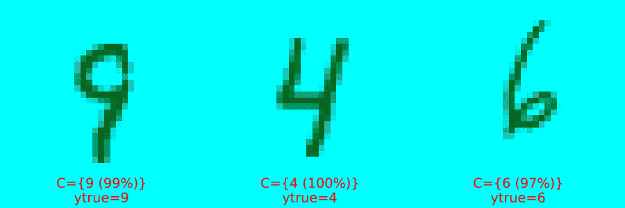
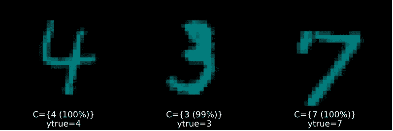
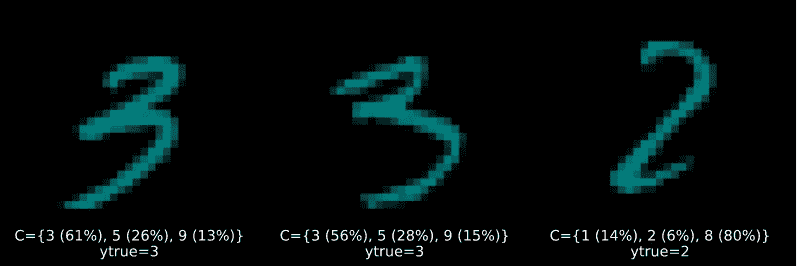
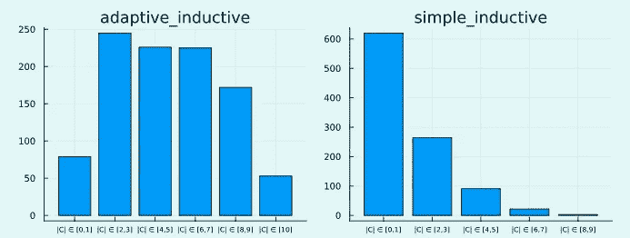

# 如何构造深度图像分类器

> 原文：<https://towardsdatascience.com/how-to-conformalize-a-deep-image-classifier-14ead4e1a5a0>

## Julia 中的共形预测——第二部分



具有不同程度不确定性的共形预测集。图片作者。

深度学习很受欢迎，对于图像分类等一些任务来说，它非常强大。但众所周知，深度神经网络(DNN)可能不稳定(Goodfellow、Shlens 和 Szegedy 2014)且校准不佳。保形预测可以用来减轻这些缺陷。

在共形预测系列文章的第一篇[部分](/conformal-prediction-in-julia-351b81309e30)中，我们看了基本的底层方法以及如何使用`[ConformalPrediction.jl](https://github.com/pat-alt/ConformalPrediction.jl)`在 Julia 中实现 CP。该系列的第二部分是一个更加面向目标的操作指南:它演示了如何通过几行代码整合内置于`Flux.jl`中的深度学习图像分类器。

# 🎯手头的任务

手头的任务是使用著名的 MNIST 数据集(LeCun 1998)预测手写数字图像的标签。通过`MLDatasets.jl`，在 Julia 中导入这个流行的机器学习数据集变得非常容易:

```
using MLDatasets
N = 1000
Xraw, yraw = MNIST(split=:train)[:]
Xraw = Xraw[:,:,1:N]
yraw = yraw[1:N]
```

# 🚧构建网络

从图像输入到标签的映射建模将依赖于一个简单的多层感知器(MLP)。深度学习的一个很棒的 Julia 库是`Flux.jl`。但是等等...`ConformalPrediction.jl`对`MLJ.jl`训练的模特不起作用吗？没错，但幸运的是存在一个`Flux.jl`到`MLJ.jl`的接口，即`MLJFlux.jl`。该界面仍处于早期阶段，但对于习惯于在`Flux.jl`中构建神经网络的任何人(比如我自己)来说，它已经非常强大且易于使用。

在`Flux.jl`中，您可以为这个任务构建一个 MLP，如下所示:

```
using Flux

mlp = Chain(
    Flux.flatten,
    Dense(prod((28,28)), 32, relu),
    Dense(32, 10)
)
```

其中`(28,28)`只是输入尺寸(28x28 像素图像)。由于我们有十位数，所以我们的输出维数是`10`。关于如何仅仅依靠`Flux.jl`构建 MNIST 图像分类器的完整教程，请查看本[教程](https://fluxml.ai/Flux.jl/stable/tutorials/2021-01-26-mlp/)。

我们可以在`MLJFlux.jl`中做完全相同的事情，如下所示:

```
using MLJFlux

builder = MLJFlux.@builder Chain(
    Flux.flatten,
    Dense(prod(n_in), 32, relu),
    Dense(32, n_out)
)
```

这里我们依靠`@builder`宏来尽可能无缝地从`Flux.jl`过渡到`MLJ.jl`。最后，`MLJFlux.jl`已经提供了许多帮助函数来定义普通网络。在这种情况下，我们将使用带有自定义生成器和交叉熵损失的`ImageClassifier`:

```
ImageClassifier = @load ImageClassifier
clf = ImageClassifier(
    builder=builder,
    epochs=10,
    loss=Flux.crossentropy
)
```

生成的实例`clf`是一个模型(在`MLJ.jl`的意义上),所以从这一点上我们可以依赖标准的`MLJ.jl`工作流。例如，我们可以用数据包装我们的模型来创建一个机器，然后在维持集上对其进行评估，如下所示:

```
mach = machine(clf, X, y)

evaluate!(
    mach,
    resampling=Holdout(rng=123, fraction_train=0.8),
    operation=predict_mode,
    measure=[accuracy]
)
```

我们这个非常简单的模型的准确性并不惊人，但是对于本教程的目的来说已经足够好了。对于每幅图像，我们的 MLP 为每个可能的数字返回一个 softmax 输出:0，1，2，3，…，9。由于每个单独的 softmax 输出的值在 0 和 1 之间，yₖ ∈ (0，1)，这通常被解释为概率:yₖ ≔ p(y=k|X)。边缘情况(即接近零或一的值)表明预测确定性较高。但这只是预测不确定性的启发式概念(Angelopoulos 和 Bates 2021)。接下来，我们将使用共形预测把这种试探性的不确定性概念变成一种严格的不确定性概念。

# 🔥整合网络

由于`clf`是车型，所以也兼容我们的包:`ConformalPrediction.jl`。为了整合我们的 MLP，我们只需要调用`conformal_model(clf)`。由于生成的实例`conf_model`也只是一个模型，我们仍然可以依赖标准的`MLJ.jl`工作流。下面我们首先用数据包装它，然后拟合它。

```
using ConformalPrediction
conf_model = conformal_model(clf; method=:simple_inductive, coverage=.95)
mach = machine(conf_model, X, y)
fit!(mach)
```

啊…我们完成了！让我们在下一节看看结果。

# 📊结果

下图 2 显示了结果。图 2 (a)显示了高度确定的预测，现在在保形预测的严格意义上定义:在每种情况下，保形集(就在图像下面)只包括一个标签。

图 2 (b)和图 2 (c)分别显示了集合大小为 2 和 3 的预测越来越不确定。他们证明了 CP 能够很好地处理具有高度随机不确定性的样品:数字四(4)、七(7)和九(9)具有某些相似性。数字五(5)和六(6)以及三(3)和八(8)也是如此。即使看了很多例子(甚至对一个人来说)，这些可能也很难相互区分。因此，看到这些数字经常一起出现在共形集合中就不足为奇了。



图 2 (a): *随机选择大小|C|=1 的预测集。图片作者。*


图 2 (b): *随机选择大小为|C|=2 的预测集。图片作者。*



图 2 (c): *随机选择大小为|C|=3 的预测集。图片作者。*

# 🧐评估

为了评估保形模型的性能，可以使用特定的性能测量来评估模型是否被正确指定和良好校准(Angelopoulos 和 Bates 2021)。我们将在以后的另一篇文章中更详细地讨论这个问题。现在，请注意这些措施已经在`ConformalPrediction.jl`中可用，我们将在这里简要展示它们。

至于其他许多事情，`ConformalPrediction.jl`利用了`MLJ.jl`的现有功能进行模型评估。特别是，我们将在下面看到如何在我们的机器上使用通用的`evaluate!`方法。为了评估我们的保形预测器的正确性，我们可以使用定制的性能度量`emp_coverage`来计算经验覆盖率。关于模型校准，我们将查看模型的条件覆盖。对于自适应的、校准良好的共形模型，条件覆盖率很高。评估条件覆盖率的一个常用方法是规模分层覆盖率。用于此目的的自定义措施称为`size_stratified_coverage`，别名为`ssc`。

下面的代码使用交叉验证实现了模型评估。我们上面使用的简单归纳分类器不是自适应的，因此与接近 0.95 的总经验覆盖率相比，获得的条件覆盖率较低，因此符合上面指定的期望覆盖率。

```
_eval = evaluate!(
    mach,
    resampling=CV(),
    operation=predict,
    measure=[emp_coverage, ssc]
)
println("Empirical coverage: $(round(_eval.measurement[1], digits=3))")
println("SSC: $(round(_eval.measurement[2], digits=3))")
```

```
Empirical coverage: 0.957
SSC: 0.556
```

当使用自适应预测集时，我们可以获得更高的自适应性(SSC ):

```
conf_model = conformal_model(clf; method=:adaptive_inductive, coverage=.95)
mach = machine(conf_model, X, y)
fit!(mach)
_eval = evaluate!(
    mach,
    resampling=CV(),
    operation=predict,
    measure=[emp_coverage, ssc]
)
println("Empirical coverage: $(round(_eval.measurement[1], digits=3))")
println("SSC: $(round(_eval.measurement[2], digits=3))")
```

```
Empirical coverage: 0.99
SSC: 0.942
```

我们还可以使用一个定制的`Plots.jl`方法来查看这两种方法的结果集大小(图 3)。根据上述情况，自适应方法的传播范围更广，这反映出“该程序有效地区分了简单和硬输入”(A. N. Angelopoulos 和 Bates，2021)。

```
plt_list = []
for (_mod, mach) in results
    push!(plt_list, bar(mach.model, mach.fitresult, X; title=String(_mod)))
end
plot(plt_list..., size=(800,300),bg_colour=:transparent)
```



图 3:两种方法的集合大小分布。图片作者。

# 🔁概述

在这个简短的指南中，我们看到了使用`ConformalPrediction.jl`在 Julia 中整合深度学习图像分类器是多么容易。几乎任何在`Flux.jl`中训练的深度神经网络都与`MLJ.jl`兼容，因此只需几行代码就可以整合。这使得将不确定性试探法转化为严格的预测性不确定性估计变得非常容易。我们还看到了保形预测器的性能评估。敬请关注更多内容！

# 🎓参考

安吉洛普洛斯，阿纳斯塔西奥斯 n，斯蒂芬贝茨。2021."保形预测和无分布不确定性量化的简明介绍."[https://arxiv.org/abs/2107.07511](https://arxiv.org/abs/2107.07511)。

古德菲勒、伊恩·J、黄邦贤·史伦斯和克里斯蒂安·塞格迪。2014."解释和利用对立的例子."https://arxiv.org/abs/1412.6572[。](https://arxiv.org/abs/1412.6572)

勒昆，扬恩。1998." MNIST 手写数字数据库."

*原载于 2022 年 12 月 5 日 https://www.paltmeyer.com*[](https://www.paltmeyer.com/blog/posts/conformal-image-classifier/)**。**