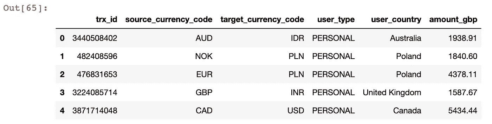

# 如何用 Python 连接到雪花数据库

> 原文：<https://towardsdatascience.com/how-to-connect-to-a-snowflake-database-with-python-a8f710c3afab>

## 了解如何使用雪花连接器或 SQLAlchemy Python 包与雪花进行交互，并利用本文中提供的模板。


## 建议的点播课程:

*你是想通过成为* ***数据工程师*** *还是* ***机器学习工程师*** *来推进自己的职业生涯吗？我强烈建议您查看以下课程:*

*   [**数据工程纳米学位**](https://imp.i115008.net/jWWEGv) **→** *精品课程！*
*   [**用 Apache Kafka 进行数据流&Apache Spark nano degree**](https://imp.i115008.net/7mmA9d)
*   [***Python 高级编码问题(StrataScratch)***](https://platform.stratascratch.com/coding?via=antonello)***→****我找到的准备 Python 的最佳平台& SQL 编码面试到此为止！比 LeetCode 更好更便宜。*

***>>>****还不是中等会员吗？考虑与我的* [***推荐链接***](https://anbento4.medium.com/membership) *签约，以获得 Medium 必须提供的一切，费用低至每月 5 美元***！**

# *介绍*

*我是在 2017 年第一次接触雪花的，当时我所在的公司决定从 Redshift 迁移到一个更具可扩展性的基于*计算的* claud 数据仓库，以满足他们不断增长的分析需求并支持 BI 工具。*

*当时我是一名数据分析师，主要通过 DBMS 查询雪花。几年过去了，现在，作为一名数据工程师，我投入时间构建数据管道，通过 Python 自动地*连接*、*查询*、*插入*和*更新*数据到雪花中。 ***你是不是很好奇想了解它是怎么做到的？****

> *一晃几年过去了，现在，作为一名数据工程师，我投入时间构建数据管道，通过 Python 自动*连接*、*查询*、*插入*和*更新*数据到雪花中。你很想知道这是怎么做到的吗？*

*在本文中，您将学习如何通过 Python 与雪花数据库交互，或者使用`snowflake.connector`或者`sqlalchemy`包。*

*当通过 Python 启用对雪花的安全认证时，这两个包都支持许多技术，但是根据我的经验，两个最流行的选项是`externalBrowser`认证和`default`认证，因此我将在我的例子中使用它们。*

*现在，让我们通过创建一些您可以在自己的项目中使用的有用的代码模板来一起探索这两种方法。*

# *方法 1:使用雪花连接器连接*

*使用`Snowflake Connector`的第一步是按照[官方文档](https://docs.snowflake.com/en/user-guide/python-connector-install.html)的建议下载软件包:*

```
***pip install snowflake-connector-python**or **pip install snowflake-connector-python==<version>***
```

*然后，您需要在代码中导入它:*

```
*import snowflake.connector*
```

# *外部浏览器认证*

*`snowflake.connector`包括一个`connect()`函数，该函数可以用作[一个构造函数，用于创建到数据库](https://docs.snowflake.com/en/user-guide/python-connector-api.html#connect)的连接。*

*函数允许您指定多个参数，其中一些是建立连接所必需的，一些是可选的。*

*其中一个参数是`authenticator`。引用官方文档，如果您设置了`authenticator = 'externalbrowser'`，那么将使用以下方式尝试验证:*

```
*“*your web browser and* ***Okta****,* ***ADFS****, or any other SAML 2.0-compliant* ***identity provider******(IdP)*** *that has been defined for your account*”.*
```

*例如，如果您的团队使用 *Okta* 作为身份提供者，您将只需要指定`USER_EMAIL`而不需要传递用户`password`。这是一个您可以立即使用的模板，只需替换您的凭据即可:*

***优点:**`'externalbrowser'`认证允许您与您的`personal user`建立到 SF 的连接。它的灵活性使它成为您在本地测试新脚本时的首选连接选项**，因为您不需要任何凭证`shared user` ( *这增加了您的自主权*)。***

***CONS:每次你建立一个新的连接，你的浏览器就会自动打开一个新窗口，这有点烦人，但没什么大不了的…***

***当您运行上面的代码时，它返回一个*连接对象* `con_eb`，该对象又有一个名为`cursor()`的方法。在实际与 SF 交互之前，您还需要创建一个*光标对象* `con_eb.cursor()`，为了方便使用，它被保存在`db_cursor_eb`变量下。***

## ***示例#1:创建表格***

***在第一个例子中，我通过将 SQL 命令传递给游标对象`execute()`方法，在我的首选模式中创建了一个`TRANSACTIONS`表:***

***命令一执行，您就可以通过运行`db_cursor_eb.fetchone()[0]`来验证它是否成功，在这种情况下会返回消息`Table TRANSACTIONS successfully created.`***

```
*****INFO:** snowflake.connector.cursor:query: [CREATE OR REPLACE TABLE SCHEMA_NAME.TRANSACTIONS ( TR...]**INFO:** snowflake.connector.cursor:query execution done**INFO:** root:Table TRANSACTIONS successfully created.***
```

***通常`fetchone()` [检索查询结果集](https://docs.snowflake.com/en/user-guide/python-connector-api.html#fetchone)的下一行，但是因为在这种情况下我只是创建一个空表，所以它只是返回执行状态。在生产中显示非常方便的信息！***

# ***默认身份验证***

***如果不指定`authenticator`参数，那么在底层，雪花将使用它的内部(默认)验证器。***

***但是，在这种情况下，你需要通过角色`USER_NAME`和`PASSWORD`。这些应该是你个人的证件或者是某个`shared user`的证件。除了这两处小小的改动，该模板与上一个非常相似:***

*****优点:**这通常是生产中使用的连接方法，因为它不会通过您的浏览器触发嘈杂的身份验证，也不需要任何额外的身份检查。***

***CONS: 在建立连接之前，你需要请求分配一个角色和密码。但这是一点小小的代价，真的…***

***和以前一样，我创建了一个名为`db_cursor_def`的光标对象。***

## ***示例 2:插入到表格中***

***我现在将使用`db_cursor_def.execute()`方法将数据插入到在第一个例子中创建的`TRANSACTIONS`表中。***

***要插入的记录将从现有的`SOURCE_TABLE`中检索，并用`SELECT`命令查询:***

***注意，我将查询`LIMIT`设置为`1500`记录。***

***然后我调用了*游标对象* `rowcount`属性[，该属性返回最后一次执行](https://docs.snowflake.com/en/user-guide/python-connector-api.html#rowcount)所产生的行数，以检查这是否正是插入到`TRANSACTIONS`表中的行数:***

```
*****INFO:** snowflake.connector.cursor:query: [INSERT INTO SCHEMA_NAME.TRANSACTIONS (TRX_ID, SOURCE_...]**INFO:** snowflake.connector.cursor:query execution done**INFO:** root: Total rows inserted: 1500***
```

# ***方法 2:使用 SQLAlchemy 连接***

***另一种连接和交互雪花的方法是使用`SQLAlchemy`。首先，您需要运行以下命令:***

```
***pip install --upgrade snowflake-sqlalchemy***
```

***它将同时安装`snowflake.sqlalchemy`和`sqlalchemy`，以防还没有。***

***然后，您应该从`sqlalchemy`导入`create_engine`方法，从`snowflake.sqlalchemy`导入`URL`方法:***

```
***from snowflake.sqlalchemy import URL
from sqlalchemy import create_engine*** 
```

# ***外部浏览器认证***

***实际上，要建立与`sqlalchemy`的连接，您需要调用`create_engine`方法并传递一个`[connection string](https://docs.snowflake.com/en/user-guide/sqlalchemy.html#connection-string-examples)`给它。***

***不过，[*为了方便，可以使用*](https://docs.snowflake.com/en/user-guide/sqlalchemy.html#connection-string-examples) `[snowflake.sqlalchemy.URL](https://docs.snowflake.com/en/user-guide/sqlalchemy.html#connection-string-examples)` [*的方法构造连接字符串，连接到数据库*](https://docs.snowflake.com/en/user-guide/sqlalchemy.html#connection-string-examples):***

***如您所见，为了连接到`externalbrowser`认证，您应该指定的参数与`snowflake.connector`完全相同。***

***在执行查询之前，最好先创建一个连接对象:`engine_1_con = engine1.connect()`。然而，值得一提的是，甚至直接在`engine_1`上调用`execute()`方法也可以。***

## ***示例# 3:从表中选择+ FetchAll()***

***这个例子的目的是向您展示如何使用一个`SELECT`语句检索插入到`TRANSACTIONS`表中的整个数据集，使用`fetchall()`将数据集中的所有行提取到`data`并将第一列的内容保存到一个名为`trx_ids`的列表中:***

***我想向您展示一个如何使用`fetchall()`的简单例子，因为在构建数据管道时，您可能会在代码中一次又一次地调用这个方法。***

***正如所料，检索到的查询`1500 rows`和我创建的列表中的前五个`trx_ids`显示如下:***

```
*****INFO:** snowflake.connector.cursor:query: [SELECT * FROM SCHEMA_NAME.TRANSACTIONS;]**INFO**: snowflake.connector.cursor:query execution done**INFO:** root:Number of rows retrieved: 1500**Output:**[3440508402, 482408596, 476831653, 3224085714, 3871714048]***
```

# ***默认身份验证***

***通过`default`认证连接到带有`sqlalchemy`的雪花使用与之前完全相同的语法，并且与`snowflake.connector`完全一样，您将需要用`USER_NAME`替换`USER_EMAIL`并指定一个`PASSWORD`:***

## ***示例# 4:从表格中选择+转换为熊猫 DF***

***在最后一个例子中，我将向您展示如何使用`sqlalchemy`引擎创建熊猫数据帧。***

***这可以通过将`engine_2`和`sql`查询传递给 pandas `read_sql()`函数来轻松实现:***

******

***因此，如果你计划和熊猫一起工作，我会推荐你用`sqlalchemy`连接到`Snowflake`来利用这些内置的方法。***

# ***结论***

***在本文中，您已经了解了通过 Python 使用不同类型的认证，有两种主要的方式**来连接和交互雪花数据库。*****

***雪花在数据行业越来越受欢迎，因此我希望我上面分享的代码模板将有助于加快您作为数据分析师查询雪花、作为数据科学家创建训练数据集或作为数据工程师构建自动化 ETL 管道的日常任务。***

## ***来源***

 ***[## Python -雪花文档的雪花连接器

### Python 的雪花连接器为开发 Python 应用程序提供了一个接口，该应用程序可以连接到…

docs.snowflake.com](https://docs.snowflake.com/en/user-guide/python-connector.html)***  ***[## Python 连接器 API -雪花文档

### 字符串常量，表示接口预期的参数标记格式的类型。连接器支持…

docs.snowflake.com](https://docs.snowflake.com/en/user-guide/python-connector-api.html)***  ***[## 使用带有 Python 连接器的雪花 SQLAlchemy 工具包-雪花文档

### 雪花 SQLAlchemy 运行在 Python 的雪花连接器之上，作为一种方言来桥接雪花数据库…

docs.snowflake.com](https://docs.snowflake.com/en/user-guide/sqlalchemy.html)*** 

# ***给我的读者一个提示***

****这篇文章包括附属链接，如果你购买的话，我可以免费给你一点佣金****