# 如何连接到云运行服务中的 GCP 云 SQL 实例

> 原文：<https://towardsdatascience.com/how-to-connect-to-gcp-cloud-sql-instances-in-cloud-run-servies-1e60a908e8f2>

## 使用私有 IP 在几分钟内连接到云 SQL 实例

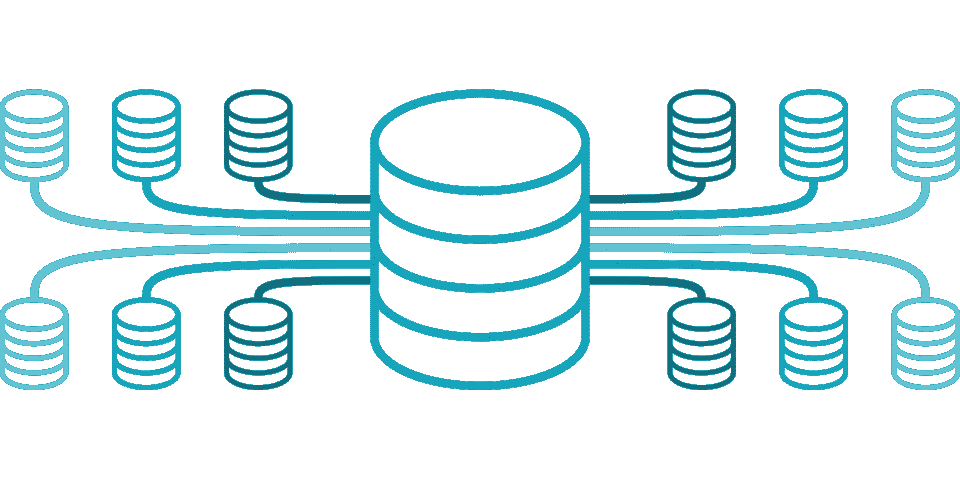

图片由 Pixabay 的崔斯特·多·乌尔登提供

如果你使用谷歌云平台(GCP)，在你的云运行服务中访问云 SQL 是很常见的。这应该是一个简单的任务，因为云 SQL 和云 Run 都在同一个网络中。但是，当你自己做的时候，你可能无法在短时间内成功完成，因为网上的许多文档要么已经过时，要么过于复杂。经过几个小时的反复试验，我终于让它工作了。我认为写下我的解决方案是值得的，这样也可以节省其他人的时间。如果你做对了，其实很简单。

## 设置云 SQL

由于 Cloud SQL 和 Cloud Run 都在 Google 云平台上，所以最好通过私有 IP 连接，以最小化网络延迟。如果“私有 IP”选项尚未启用，请启用它。记下稍后将使用的网络和私有 IP 地址。

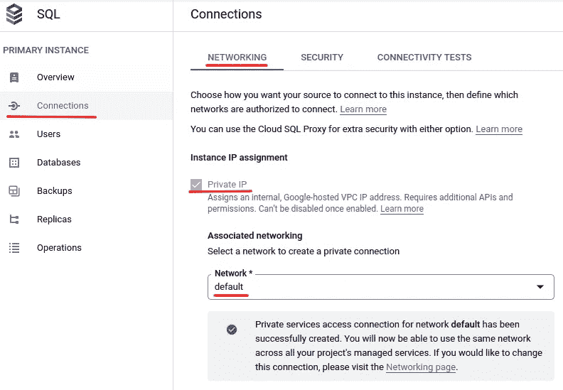

作者图片

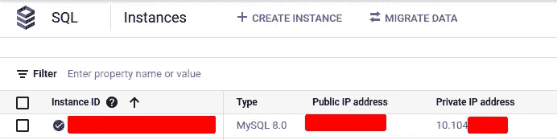

作者图片

## 创建 VPC 连接器

[虚拟专用云(VPC)](https://cloud.google.com/vpc/docs/vpc) 是物理网络的虚拟版本，在谷歌的生产网络内部实施，可用于连接平台上创建的所有类型的资源。这实际上是一个非常复杂和抽象的概念。现在，你只需要明白*无服务器 VPC 访问*允许云功能、云运行服务和应用引擎应用使用它们的私有 IP 访问 VPC 网络中的资源。让我们创建一个 VPC 连接器，我们的云运行服务可以使用它来连接到我们的云 SQL 实例。

在顶部搜索框中搜索“无服务器 VPC 接入”，然后选择“无服务器 VPC 接入(VPC 网络)”。然后单击“创建连接器”创建一个新的 VPC 连接器:

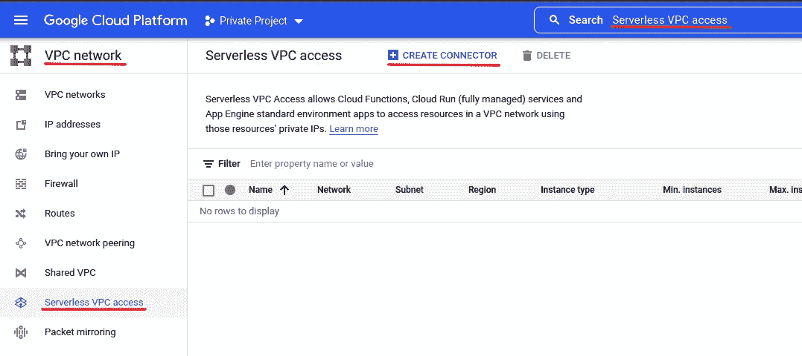

作者图片

按如下方式填写表格:

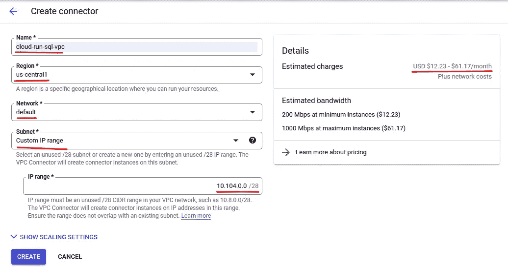

*   给它一个唯一的名称。
*   选择与您的云 SQL 实例和云运行服务相同的区域。这一点非常重要，否则您将无法使用这个连接器连接到云 SQL 实例。
*   选择与您的云 SQL 实例相同的网络。如果你有多个网络，这也很重要。
*   为“子网”选择“自定义 IP 范围”。
*   指定 IP 范围以覆盖您的云 SQL 实例的私有 IP 地址。在本例中，它被设置为“10.104.0.0”。IP 范围不能与现有范围冲突。

现在，您可以单击“创建”来创建 VPC 连接器。应该注意的是，VPC 连接器不是免费的。它们实际上使用起来相当昂贵。因此，当不再需要它们时，一定要记得删除它们。

## 配置云运行服务帐户

云运行服务账号，默认为 ***计算引擎默认服务账号*** ，应该有 ***云 SQL 客户端*** 角色，有权限连接云 SQL。

在 IAM 页面上，搜索“计算引擎默认服务帐户”，然后单击铅笔按钮为其添加云 SQL 客户端角色:

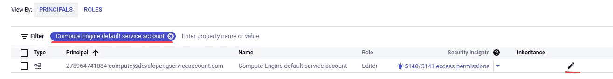

作者图片

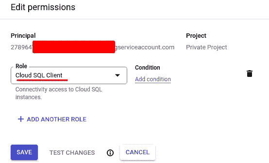

作者图片

## 创建云运行服务

最后，让我们创建一个云运行服务，并使用刚刚创建的 VPC 连接器将它连接到我们的云 SQL 实例。尝试在 GCP 平台找到“云跑”，点击“创建服务”创建一个新的:

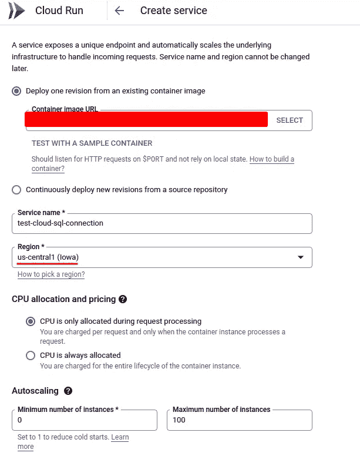

重要的是，选择与云 SQL 实例和 VPC 连接器相同的区域。关于如何自动部署云运行服务的更详细介绍，[这篇文章](https://betterprogramming.pub/how-to-deploy-a-web-application-to-cloud-run-automatically-6967d7c7d42a)可能会有所帮助。

出于演示目的，我们通常会选择“允许所有流量”和“允许未经身份验证的调用”。如果需要，您可以使用 IAM 添加更细粒度的身份验证。

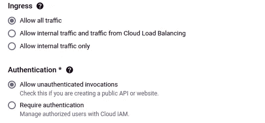

现在展开“容器、变量和秘密、连接、安全性”部分，并指定连接和环境变量。我们先设置连接。单击“连接”选项卡，然后单击“添加连接”来添加新的连接。选择要连接的云 SQL 实例。然后选择在上一步中创建的“VPC 连接器”。请注意，如果连接器的区域不同于正在创建的云运行服务的区域，则不会显示 VPC 连接器。

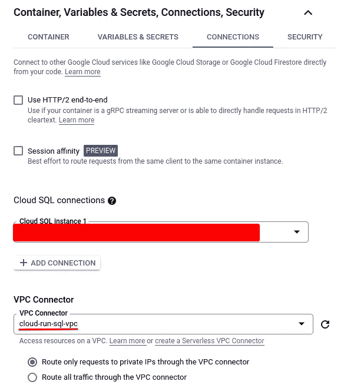

然后我们需要为我们的数据库连接创建一些环境变量，这些变量将在我们的云运行服务中使用:

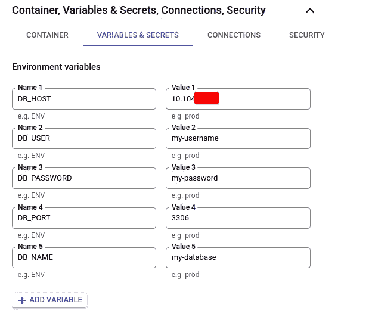

非常重要！我们需要将我们的云 SQL 实例的私有 IP 地址指定为 DB 主机，而不是像某些教程中显示的“127.0.0.1”或“localhost”，否则无法工作。

环境变量将在您的云运行服务的代码中使用，以连接到云 SQL 实例。如果您使用 SQLAlchemy 连接到 MySQL 数据库，代码将如下所示:

如果需要，您可以查看相应的文章，了解如何使用 SQLAlchemy 来[执行普通 SQL 查询](https://betterprogramming.pub/how-to-execute-plain-sql-queries-with-sqlalchemy-627a3741fdb1)和[创建 ORM 模型](https://levelup.gitconnected.com/learn-the-basics-and-get-started-with-sqlalchemy-orm-from-scratch-66c8624b069)。

现在，您应该能够从云运行服务连接到您的云 SQL 实例。试一试！

## 结论

如果我们在 Cloud Run 上托管我们的后端代码，我们需要连接到 Cloud SQL 是很常见的。然而，虽然看起来微不足道，但是有很多陷阱会导致连接失败。在本文中，我们已经介绍了一般的设置过程，还强调了可能会导致几个小时的努力时间的陷阱。这篇文章的主要内容如下:

*   SQL 实例和 VPC 连接器的网络应该相同。
*   SQL 实例、VPC 连接器和云运行服务的区域应该相同。
*   应该在云运行服务中使用 SQL 实例的私有 IP 进行连接。