# 如何连接运行在 AWS EC2 上的 Jupyter 服务器

> 原文：<https://towardsdatascience.com/how-to-connect-with-jupyter-server-running-on-aws-ec2-efa309f47c51>

## 使用本地端口转发连接到 AWS EC2 上的 Jupyter 服务器


PC:[https://pixabay.com/photos/network-server-system-2402637/](https://pixabay.com/photos/network-server-system-2402637/)

如今，数据科学家、ML 工程师、产品经理、客户成功工程师、讲师、学生和许多其他堆栈持有者都喜欢使用 jupyter 笔记本，原因有很多。但是，有时我们试图运行的任务可能会消耗资源，并且我们可能在本地机器上没有足够的资源。

在这种情况下，我们可以依靠 AWS EC2，我们可以使用首选的操作系统、内存和存储创建 EC2 实例。

生成 EC2 实例很容易，在线订购您喜欢的食物，您不需要对云计算有任何深入的先验知识。

我们知道，不是每个数据科学家、ML 工程师、讲师或学生都有云计算或 AWS 服务方面的专业知识。但是每个人在处理 ML 模型的时候肯定都有对计算资源的要求。EC2 可以帮助你。在这篇文章中，我将帮助你开始使用它。

今天我们将会看到，

1.  如何启动 AWS EC2 实例？
2.  如何通过 ssh 连接到 EC2 实例？
3.  如何在 EC2 上安装 Anaconda/Miniconda？
4.  如何使用端口转发连接到 EC2 上的 jupyter 服务器？

## 如何启动 AWS EC2 实例？

在这里，我将向你展示如何启动一个 Ubuntu 实例。你需要确保你有一个 AWS 账户&账户上的点数很少。

步骤 01-登录 AWS 控制台并访问 EC2 控制台。

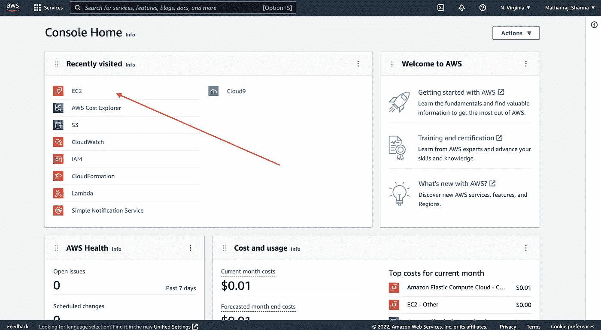

PC:作者

步骤 02-进入 EC2 控制台后，点击`Launch Instance`

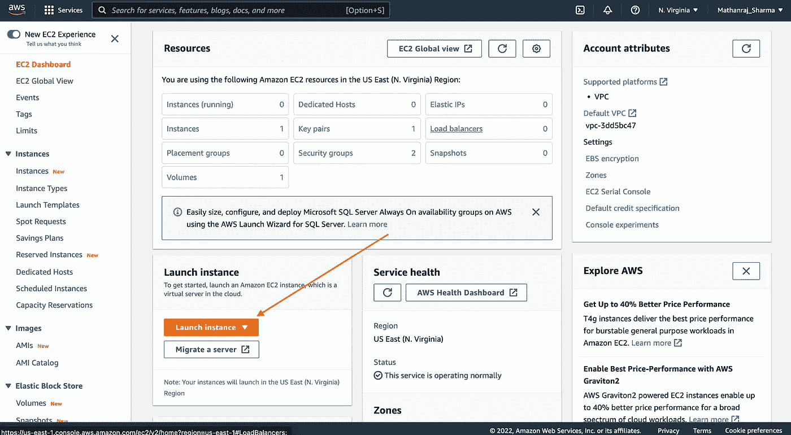

PC:作者

步骤 03:它将带您到可以配置实例的页面。你需要

*   给你的实例一个名字。我正在使用`my-jupyterlab`

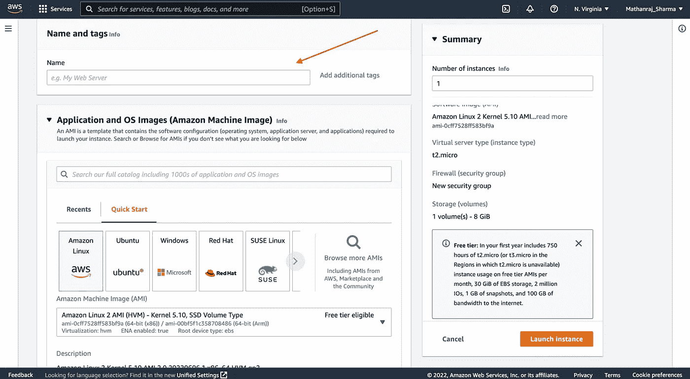

PC:作者

*   选择 AMI(亚马逊维护的图像)，我用的是`Ubuntu`。

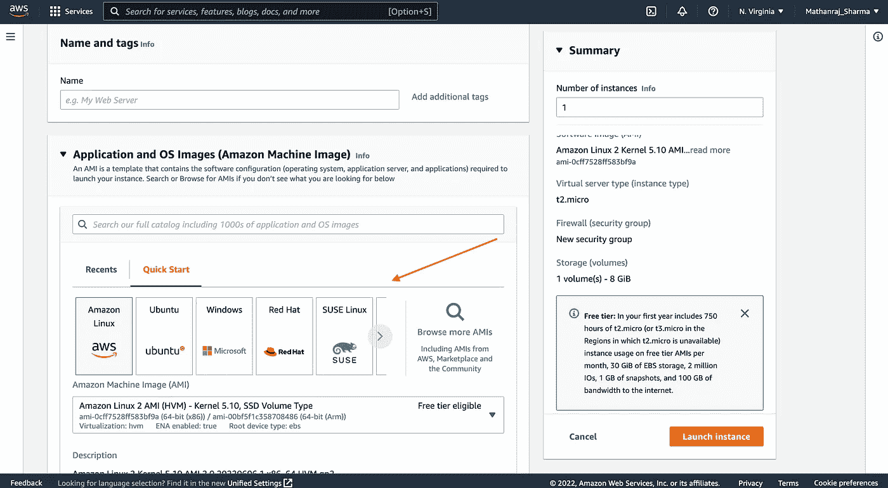

PC:作者

*   选择实例类型，这里我使用`t2.medium`进行演示。您可以选择具有所需足够内存的实例类型

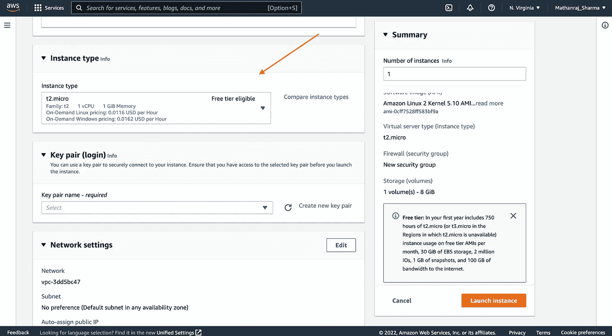

PC:作者

*   创建或选择一个现有的密钥对(这个密钥将用于 shh 到您的 EC2 实例中)。当你创建一个新的密匙时，使用`rsa encryption` 下载`.pem`文件来和 Openssh 一起使用。当您单击创建新的密钥对时，它将自动下载私钥。保管好它！！！

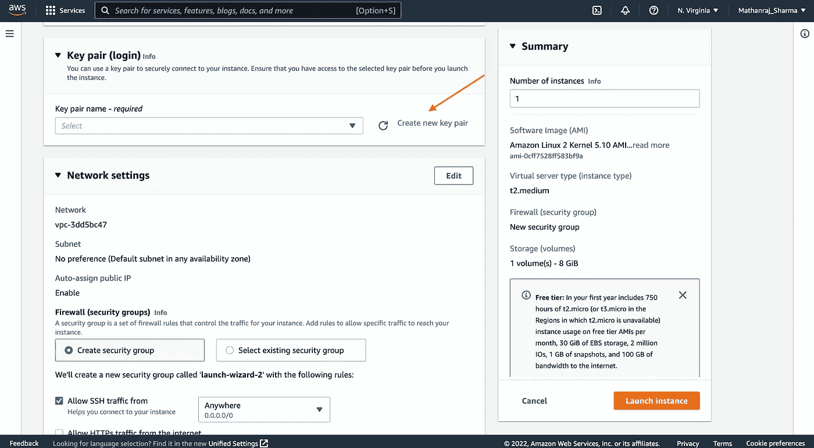

PC:作者

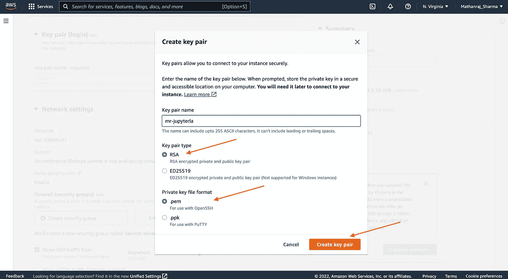

PC:作者

*   选择您需要的存储量。我选择`4Gb`，因为我只为这个演示创建它。

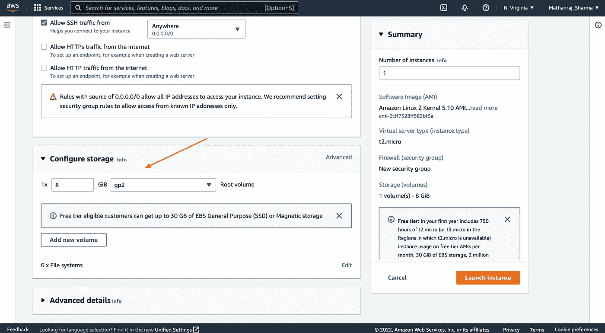

PC:作者

我将其他配置保留为默认值。您可以根据需要随意配置它们。

一旦一切配置完毕，点击`Launch Instance`启动您的实例。在 EC2 仪表板上，检查您的实例状态是否为`RUNNING`。

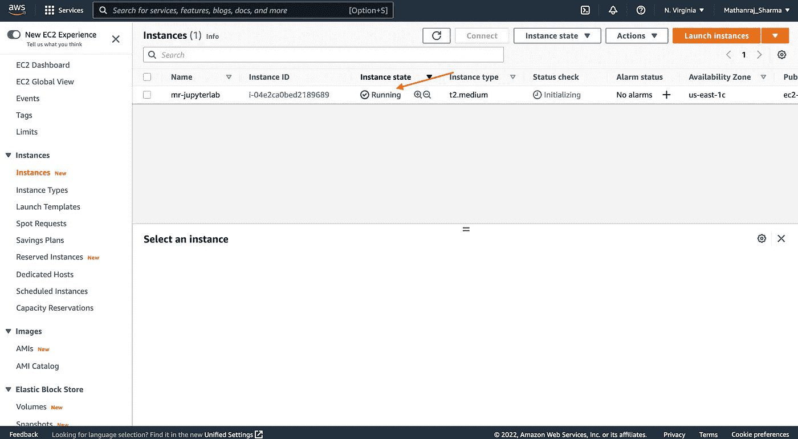

PC:作者

## 如何通过 ssh 连接到 EC2 实例？

*   希望您已经成功启动了一个实例。接下来，您需要做的是将您下载的私钥移动到您的 ssh 目录中。(假设你已经在`~/Downloads`下载了密钥。您的密钥文件名和扩展名可能会不同。但是为了通过 Openssh 连接到您的实例，它需要是`.cer or .pem`，我的密钥文件是`my-jupyterlab.cer`

```
$ mv ~/Downloads/my-jupyterlab.cer ~/.ssh/
```

*   打开一个终端，运行下面的命令，通过 ssh 连接到您的实例。您可以从实例仪表板中找到您的实例的公共 IP 地址。大多数时候 ubuntu EC2 实例的实例名是`ubuntu`，你可以根据需要更改它。您可以通过使用实例仪表板来找到如何做到这一点。让我让你用那个提示找到它。

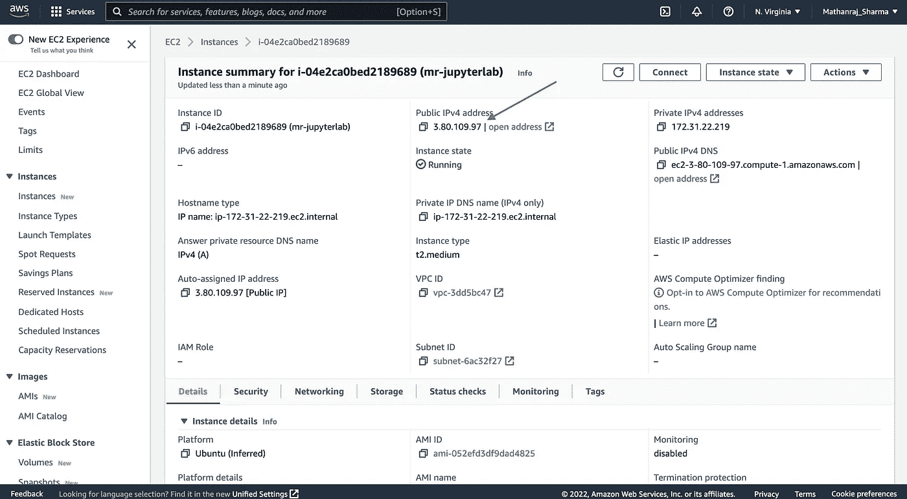

PC:作者

```
##  ssh -i [path-to-private-key] [username@public-IP]$ssh -i ~/.ssh/my-jupyterlab.cer ubuntu@3.80.109.97
```

它将提示是否将指纹添加到您的本地机器。键入`yes`并按下`enter`继续。

**如何在 EC2 上安装 Anaconda/Miniconda？**

您可以通过多种方式在 EC2 实例上安装 Jupyterlab。我更喜欢使用 Anaconda/Miniconda 来管理我的 python 环境。因此，让我向您展示如何安装 Miniconda，创建一个 conda 环境并在其中安装 Jupyterlab(在连接到 EC2 实例的终端上按照下面的步骤操作)

*   下载 Miniconda 安装程序

```
$ wget [https://repo.anaconda.com/miniconda/Miniconda3-latest-Linux-x86_64.sh](https://repo.anaconda.com/miniconda/Miniconda3-latest-Linux-x86_64.sh)
```

*   运行安装程序

```
$ sh ./Miniconda3-latest-Linux-x86_64.sh
```

遵循安装过程并完成它。

*   运行 conda init 配置以确保您已经将 conda 添加到您的路径中

```
$ conda init bash
```

*   一旦成功`exit`从您的 ssh 连接&再次连接到您的 EC2。
*   创建一个 conda 环境并安装 Jupyterlab(逐个运行命令)

```
$ conda create --name jupyter python=3.8
$ conda activate jupyter
$ conda install jupyterlab
```

*   启动 Jupyterlab 服务器

```
$ jupyter lab
```

## 如何使用端口转发连接到 EC2 上的 jupyter 服务器？

好了，现在一切都准备好了。

通常，当我们启动一个 jupyter 服务器时，它将运行在[http://localhost:8888/lab](http://localhost:8888/lab)上。但是如果你打开你的浏览器，尝试访问这个地址，你会得到消息`Your site connot be reached`。这是因为在这种情况下，jupyter 服务器运行在 EC2 实例的 localhost 上，而不是在本地机器上。

那么我们如何通过浏览器进入 jupyter 实验室呢？让我们明白我们有什么，我们没有什么

*   我们可以通过 ssh 访问 EC2 实例
*   我们无法访问运行在 EC2 上的 jupyter 服务器
*   但是我们的 EC2 实例可以访问运行在本地主机上的 jupyter 服务器
*   我们可以在本地机器上访问本地主机

所以我们能做的是，我们可以告诉我们的机器监听我们的 localhost:8888 上的流量，并通过安全隧道将所有内容转发到 EC2 的 localhost:8888。

这个过程就是众所周知的`local port forwarding`。

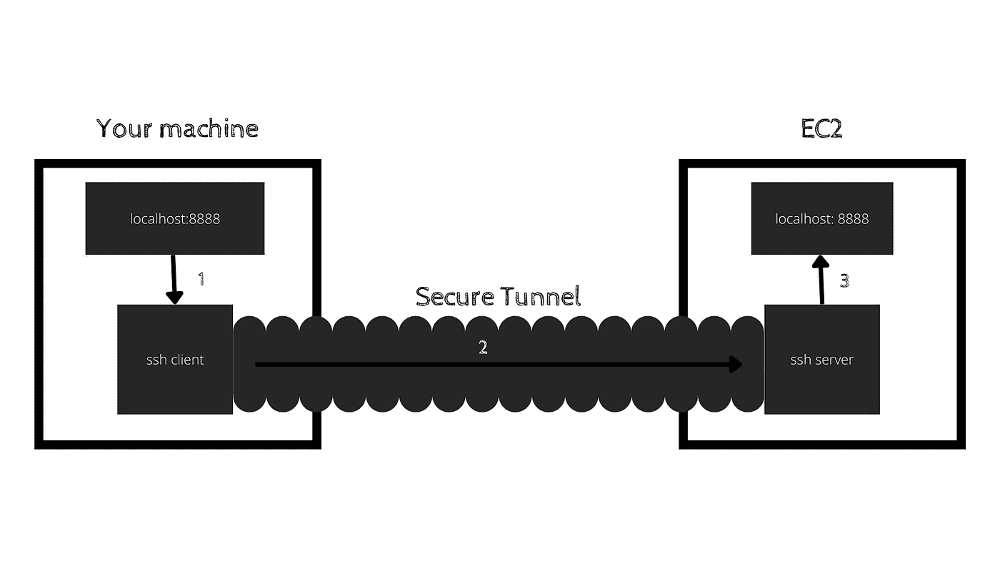

PC:作者

那么怎么做呢？确保您已经完成了上述所有步骤，并且您的 jupyter 服务器已经启动并运行在 EC2 上。

打开另一个终端，运行下面的命令

```
## ssh -L [PORT-on-your-machine]:[IP-jupyter-server-on-ec2]:[PORT-jupyter-server-on-ec2] [username]@[public IP of EC2] -i [path to private key]$  ssh -L 8888:127.0.0.1:8888 ubuntu@3.80.109.97 -i ~/.ssh/mr-jupyterlab.cer
```

一旦你在你的另一个终端上运行这个程序(你在 EC2 上启动了哪个 jupyter 服务器),你将会看到如下的消息

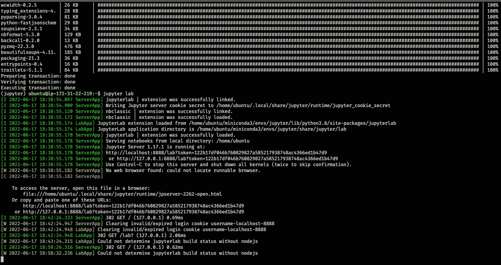

PC:作者

在浏览器上复制并粘贴 URL `http://localhost:8888/lab?token=xxxxxxxxxxxxxxxxxxxxxx`。

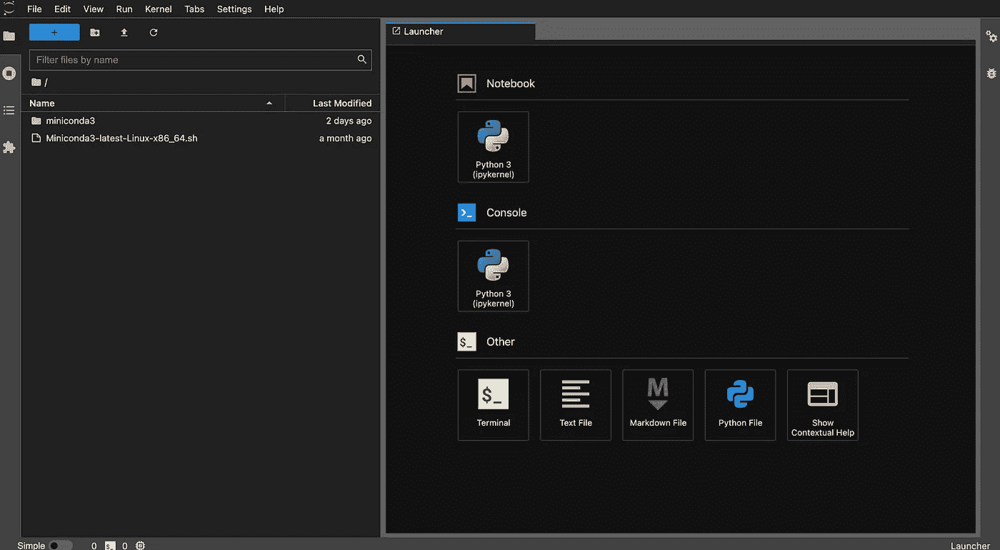

PC:作者

恭喜，现在您已经可以访问运行在 EC2 实例上的 jupyter 服务器了。

我们已经看到了如何启动 EC2 实例，在其上安装 anaconda，启动 jupyter 服务器&从本地机器的任何地方访问它。您可以根据需要用资源配置 EC2 实例，并毫无顾虑地构建 ML 模型。EC2 具有自动缩放功能，这在我们需要更多资源时非常有用。但那是另一天的话题。

了解云计算对现在的每个人都很重要。希望这篇文章能帮助你开始了解云计算的旅程。

编码快乐！！！